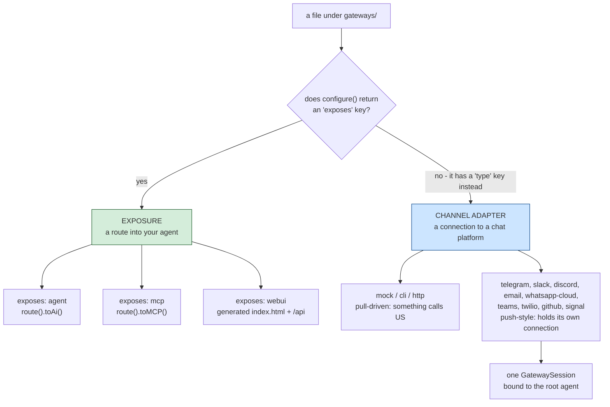
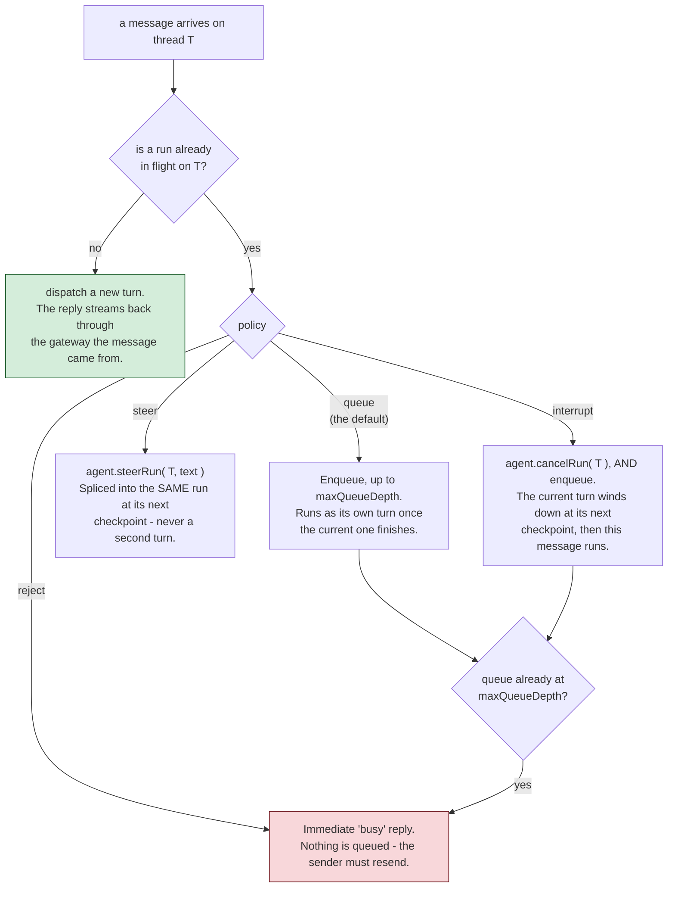

# gateways/

`gateways/*.bx`/`.json` files under this one folder cover **two distinct, unrelated things** - which kind an entry is depends entirely on whether its `configure()` struct has an `exposes` key.

!!! warning
    Don't confuse these with each other - an HTTP-exposed agent (`exposes: "agent"`) is a REST API for your agent; a channel-adapter gateway (`type: "http"`) is a webhook endpoint for a chat platform or human-in-the-loop approval flow. They generate completely different routes.



## 1. HTTP/MCP/web-UI exposure (`exposes: "agent" | "mcp" | "webui"`)

Exposes the agent, or a local MCP server, over HTTP using ColdBox 8.1's native AI Routing DSL - or a pre-built browser chat UI, documented separately in [The web chat UI](../web-ui.md).

**Expose the agent:**

```javascript
// gateways/expose.bx
class {

	function configure() {
		return {
			exposes : "agent",
			path    : "/api/chat"
		};
	}

}
```

Generates, in `config/Router.bx`:

```javascript
route( "/api/chat" ).toAi( "GeneratedAgent" )
```

which auto-registers **four** sub-routes: `POST /api/chat/invoke`, `POST /api/chat/stream` (SSE), `POST /api/chat/batch`, `GET /api/chat/info`. The bare `/api/chat` path itself is not routable.

**Expose a local MCP server** (see [mcp/](../mcp.md)):

```javascript
class {
	function configure() {
		return {
			exposes : "mcp",
			path    : "/mcp/tools",
			target  : "local-server"   // must match an mcp/*.bx entry's declared name
		};
	}
}
```

Generates `route( "/mcp/tools" ).toMCP( "local-server" )`.

**Expose the v1 web chat UI:**

```javascript
// gateways/chat.bx
class {
	function configure() {
		return {
			exposes     : "webui",
			path        : "/chat",
			apiKeyEnvVar: "CHAT_UI_API_KEY"   // optional - see below
		};
	}
}
```

Generates a real static `<path>/index.html` file (served directly - no route needed for it) plus its own dedicated API under a fixed `<path>/api` prefix, so it never collides with the shell's own files. That API is a generated `handlers/ChatUi.bx` rather than `toAi()`, and the entry also brings a generated SQLite store with it.

The web UI is a subsystem rather than a single exposure switch - the route list, the store, conversations and preferences, branding and theming, and why it does not use `toAi()` are all on its own page: **[The web chat UI](../web-ui.md)**.

**Validation:** `exposes` must be `agent`, `mcp`, or `webui`; `path` is required and must be unique across every exposure entry; an `mcp` exposure's `target` is required and must match a real `mcp/*` entry's declared name; `webui`'s `apiKeyEnvVar` is entirely optional, with no required-field check (see below).

## 2. Channel-adapter gateways (`type: "mock" | "cli" | "http"`)

Registers a bx-ai `IGateway` (a channel adapter for external delivery / human-in-the-loop approval) by name - distinct from exposing the agent's own REST API.

```javascript
// gateways/slack.bx
class {
	function configure() {
		return {
			type         : "http",
			secretEnvVar : "SLACK_WEBHOOK_SECRET"
		};
	}
}
```

`secretEnvVar` names an environment variable holding the signing secret - **never the secret value itself**. Generates, in `Application.bx`'s `onApplicationStart()`:

```javascript
aiGatewayRegistry().register( aiGateway( "http", { secret : getSystemSetting( "SLACK_WEBHOOK_SECRET", "" ) } ) )
```

The secret is resolved live at server startup, matching this project's "secrets stay external" rule everywhere else (see [Deployment & Secrets](../../deployment-and-secrets.md)) - it's never embedded as a literal in generated source, so it's never present in a packaged `.bxa` either. If the env var is unset, bx-ai's own `HttpGateway` treats an empty secret as "no signing configured" and rejects requests accordingly, rather than crashing at startup.

**Validation:** `type` must be `mock`, `cli`, or `http`; a `type: "http"` entry requires a `secretEnvVar`; the entry's own file/base name must be unique across every channel-adapter entry. `mock` is test-only; `cli` is bx-ai's own built-in human-in-the-loop **approval** channel (a blocking stdin/stdout A/R/Q prompt) - it's what `HumanInTheLoopMiddleware` attaches by default when no gateway is specified, and is unrelated to BxAgents' own `chat` verb (which never touches the gateway registry at all).

**`http`-type entries additionally get real HTTP wiring**: a generated `handlers/Gateway.bx` action that proxies straight into bx-ai's own `GatewayRequestProcessor::processHttp()`, and three routes in `config/Router.bx`:

```javascript
post( "/gateways/:gatewayName/events" ).toHandler( "Gateway.process" )
get( "/interactions/:requestID" ).toHandler( "Gateway.process" )
post( "/interactions/:requestID/decisions" ).toHandler( "Gateway.process" )
```

!!! info
    ColdBox has no built-in `toAiGateway()` DSL terminator for this surface (only `toAi()` and `toMCP()` exist natively) - this wiring is BxAgents' own generated code, following the same shape a future core terminator would produce. See the [`toAiGateway()` for ColdBox Core](../../proposals/toAiGateway-coldbox-core.md) proposal.

## 3. Push-style gateways (`type: "telegram"` / `"slack"` / `"discord"` / `"email"` / `"whatsapp-cloud"` / `"teams"` / `"twilio"` / `"github"` / `"signal"`, and friends)

A different kind of channel adapter from `mock`/`cli`/`http` above: instead of being driven by an inbound HTTP request, a push-style gateway holds its own connection to the platform and pushes inbound messages to your agent as they arrive - the closer-to-"real chat bot" experience. Four transport shapes exist today:

- **Long-poll** (Telegram, Email): a scheduled task periodically asks the platform "anything new?" (Telegram's `getUpdates`, Email's IMAP poll).
- **Persistent websocket** (Slack via Socket Mode, Discord via its Gateway API): the gateway holds a live, long-running connection the platform pushes events down in real time.
- **Webhook, pull-driven** (WhatsApp Business Cloud API, Microsoft Teams, Twilio SMS, GitHub): the platform calls **us** over a public HTTP endpoint instead of this gateway holding its own outbound connection - no scheduler task or socket to manage. See their own subsections below.
- **Server-Sent Events (SSE)** (Signal, against a locally-run `signal-cli` daemon): a long-lived, one-way streaming HTTP connection the gateway holds open, reading events as they're pushed down the same response body. See its own subsection below.


## The nine push-style platforms

Each platform gets its own page: its `gateways/*.bx` config shape, what's required, and
(where one exists) the protocol-level detail on how BxAgents talks to it.

::: cards
::: card title="Telegram" icon="phosphor-duotone:plugs-connected" href="telegram.md"
Long-poll. `botTokenEnvVar` only.
:::
::: card title="Slack" icon="phosphor-duotone:plugs-connected" href="slack.md"
Persistent websocket, Socket Mode.
:::
::: card title="Discord" icon="phosphor-duotone:plugs-connected" href="discord.md"
Persistent websocket, Gateway API, mandatory heartbeats.
:::
::: card title="Email" icon="phosphor-duotone:plugs-connected" href="email.md"
Long-poll IMAP + cbmailservices/bx-mail outbound.
:::
::: card title="WhatsApp Business Cloud" icon="phosphor-duotone:plugs-connected" href="whatsapp-cloud.md"
Webhook-driven, Meta Graph API.
:::
::: card title="Microsoft Teams" icon="phosphor-duotone:plugs-connected" href="teams.md"
Webhook-driven, Bot Framework Activity protocol.
:::
::: card title="Twilio SMS" icon="phosphor-duotone:plugs-connected" href="twilio.md"
Webhook-driven, form-urlencoded, dual-path TwiML response.
:::
::: card title="GitHub" icon="phosphor-duotone:plugs-connected" href="github.md"
Webhook-driven, `@mention`-gated issue/PR comment threads.
:::
::: card title="Signal" icon="phosphor-duotone:plugs-connected" href="signal.md"
Server-Sent Events, against an external `signal-cli` daemon.
:::
:::

Same "secrets stay external" rule as `http`'s `secretEnvVar`: every `*EnvVar` key names an environment variable, resolved live via `getSystemSetting()` at startup, never embedded as a literal - `email`'s `imapHost`/`fromAddress` aren't cryptographic secrets, but the same env-var-driven convention is used for every one of its config values anyway, since they all vary per deployment. Unlike the core types, a push-style gateway's class lives inside BxAgents itself (`models/gateways/*.bx`, not bx-ai), so its registration renders as a bare class path rather than a short name:

```javascript
aiGatewayRegistry().register( aiGateway( "bxModules.bxagents.models.gateways.TelegramGateway", { "botToken" : getSystemSetting( "TELEGRAM_BOT_TOKEN", "" ) } ) )
aiGatewayRegistry().register( aiGateway( "bxModules.bxagents.models.gateways.SlackGateway", { "appToken" : getSystemSetting( "SLACK_APP_TOKEN", "" ), "botToken" : getSystemSetting( "SLACK_BOT_TOKEN", "" ) } ) )
aiGatewayRegistry().register( aiGateway( "bxModules.bxagents.models.gateways.DiscordGateway", { "botToken" : getSystemSetting( "DISCORD_BOT_TOKEN", "" ) } ) )
aiGatewayRegistry().register( aiGateway( "bxModules.bxagents.models.gateways.EmailGateway", { "imapHost" : getSystemSetting( "IMAP_HOST", "" ), "imapUsername" : getSystemSetting( "IMAP_USERNAME", "" ), "imapPassword" : getSystemSetting( "IMAP_PASSWORD", "" ), "fromAddress" : getSystemSetting( "EMAIL_FROM_ADDRESS", "" ) } ) )
aiGatewayRegistry().register( aiGateway( "bxModules.bxagents.models.gateways.whatsapp.WhatsAppCloudGateway", { "accessToken" : getSystemSetting( "WHATSAPP_ACCESS_TOKEN", "" ), "phoneNumberId" : getSystemSetting( "WHATSAPP_PHONE_NUMBER_ID", "" ), "appSecret" : getSystemSetting( "WHATSAPP_APP_SECRET", "" ), "verifyToken" : getSystemSetting( "WHATSAPP_VERIFY_TOKEN", "" ) } ) )
aiGatewayRegistry().register( aiGateway( "bxModules.bxagents.models.gateways.TeamsGateway", { "appId" : getSystemSetting( "TEAMS_APP_ID", "" ), "appPassword" : getSystemSetting( "TEAMS_APP_PASSWORD", "" ) } ) )
aiGatewayRegistry().register( aiGateway( "bxModules.bxagents.models.gateways.TwilioGateway", { "accountSid" : getSystemSetting( "TWILIO_ACCOUNT_SID", "" ), "authToken" : getSystemSetting( "TWILIO_AUTH_TOKEN", "" ), "from" : getSystemSetting( "TWILIO_FROM_NUMBER", "" ) } ) )
aiGatewayRegistry().register( aiGateway( "bxModules.bxagents.models.gateways.GitHubGateway", { "token" : getSystemSetting( "GITHUB_TOKEN", "" ), "webhookSecret" : getSystemSetting( "GITHUB_WEBHOOK_SECRET", "" ), "botName" : getSystemSetting( "GITHUB_BOT_NAME", "" ) } ) )
aiGatewayRegistry().register( aiGateway( "bxModules.bxagents.models.gateways.SignalGateway", { "account" : getSystemSetting( "MY_SIGNAL_ACCOUNT", "" ) } ) )
```

**Validation:** `type: "telegram"` requires `botTokenEnvVar`; `type: "slack"` requires both `botTokenEnvVar` and `appTokenEnvVar`; `type: "discord"` requires `botTokenEnvVar`; `type: "email"` requires `imapHostEnvVar`, `imapUsernameEnvVar`, `imapPasswordEnvVar`, and `fromAddressEnvVar`; `type: "whatsapp-cloud"` requires `accessTokenEnvVar`, `phoneNumberIdEnvVar`, `appSecretEnvVar`, and `verifyTokenEnvVar`; `type: "teams"` requires `appIdEnvVar` and `appPasswordEnvVar`; `type: "twilio"` requires `accountSidEnvVar`, `authTokenEnvVar`, and `fromEnvVar`; `type: "github"` requires `tokenEnvVar`, `webhookSecretEnvVar`, and `botNameEnvVar`; `type: "signal"` requires `accountEnvVar` - all checked the same way `http`'s `secretEnvVar` is.

!!! info
    Slack v1 is **Socket Mode only** - no public webhook endpoint is needed or generated for it (unlike `http`, which gets real routes - see §2 above). The Events-API/HTTP-webhook alternative Slack also supports isn't built here. Discord v1 is likewise the real **Gateway API** (a persistent websocket) rather than Discord's alternative HTTP Interactions Endpoint URL webhook mode - no Ed25519 signature verification is needed here as a result, since interactions arrive over the same authenticated connection rather than a public HTTP endpoint (confirmed against Discord's own docs).

### GatewaySession - wiring the agent to every push-style gateway

Any project with at least one push-style gateway entry also gets a generated `interceptors/GatewaySessionBootstrap.bx`, which builds a single bx-ai `GatewaySession` bundling every push-style gateway in the project, bound to the project's root agent, and starts it once ColdBox itself has finished loading:

```javascript
// interceptors/GatewaySessionBootstrap.bx (GENERATED)
class {
	function afterConfigurationLoad( event, interceptData ) {
		var wirebox        = getController().getWireBox()
		var agent          = wirebox.getInstance( "GeneratedAgent" )
		var gatewaySession = aiGatewaySession(
			agent        : agent,
			gateways     : [ aiGatewayRegistry().get( "telegram" ) ],
			policy       : "queue",
			maxQueueDepth: 50
		)
		gatewaySession.start()
		application.bxaiGatewaySession = gatewaySession
	}
}
```

!!! info
    The generated variable is deliberately named `gatewaySession`, not `session` - `session` is a reserved BoxLang/ColdBox scope name (like `request`/`server`/`url`/`form`/`cgi`/`thread`), and a local variable reusing one of those names can collide with the live scope instead of behaving as an ordinary local.

!!! warning
    The `aiGatewayRegistry().get(...)` key is always the gateway TYPE string ("telegram", "slack", "discord", "email", ...) - confirmed against bx-ai's real `GatewayRegistry.register()` source, which always keys by the gateway class's own fixed `getName()`, never anything caller-supplied. A real consequence: **two `gateways/*` entries of the same push-style type collide on the same registry slot project-wide** - the second registration silently overwrites the first. There's no per-entry alias today; use a distinct type per additional platform account, or wait for multi-instance support.

An interceptor (not a raw `Application.bx`/`onApplicationStart()` statement, unlike the plain registration calls above) is used specifically because its `afterConfigurationLoad` point is guaranteed by ColdBox's own lifecycle to fire strictly after the framework - including the scheduler these gateways depend on (see below) - has finished loading.

Control `GatewaySession`'s policy via an optional `gatewaySession` block on the root project's `Agent.bx`:

```javascript
// Agent.bx
class extends="bxModules.bxai.models.runnables.AiAgent" {

	function init() {
		super.init( name: "...", model: aiModel( provider: "..." ) )
		return this
	}

	function configure() {
		return {
			gatewaySession: { policy: "queue", maxQueueDepth: 50 }   // both optional - these are the defaults
		};
	}

}
```

`policy` must be one of `reject`/`queue`/`steer`/`interrupt` (bx-ai's own `GatewaySession` policy vocabulary - see [GatewaySession](#gatewaysession---wiring-the-agent-to-every-push-style-gateway) below) - checked at `build` time so a typo fails loudly instead of surfacing as a runtime error the first time the app boots.

!!! warning
    v1 limitation: exactly one `GatewaySession`, always bound to the project's root agent - matches the existing precedent that `exposes: "agent"` HTTP exposure is also always root-agent-only. A project with subagents cannot yet route different gateways to different subagents.

What each policy actually does with a message that arrives while a turn is still running:



!!! warning
    "Steer" here means Hermes Agent's non-destructive splice - the running turn keeps going and the new text is folded into it. It does **not** mean what Eve's `turnPolicy: "steer"` means (cancel the active turn and start a replacement); that behaviour is this vocabulary's `interrupt`.

!!! info
    Neither `cancelRun()` nor `steerRun()` is instant. Both are signalled and take effect at the run's **next checkpoint** (before the next LLM call or tool call), so `interrupt` is "ask the current turn to wind down soon", not "synchronously replace it".

### How a push-style gateway stays connected: the shared ColdBox Scheduler

Rather than a new background-loop primitive, push-style gateways reach the app's own live ColdBox scheduler singleton (`appScheduler@coldbox` - the same one a hand-written `schedules/Scheduler.bx`, if the project has one, runs under) and register their own named task(s) into it dynamically - a recurring long-poll task for Telegram, for example. **One shared scheduler, every push-style gateway registering its own tasks into it** - never one scheduler per gateway, and never in conflict with a project's own cron jobs.

### Logging

Every push-style gateway writes to its own `gateway-<type>` log file (e.g. `gateway-telegram`) via BoxLang's `writeLog()`, rather than one shared/default app log - so an operator can tail exactly the platform they care about without noise from everything else the app logs.
