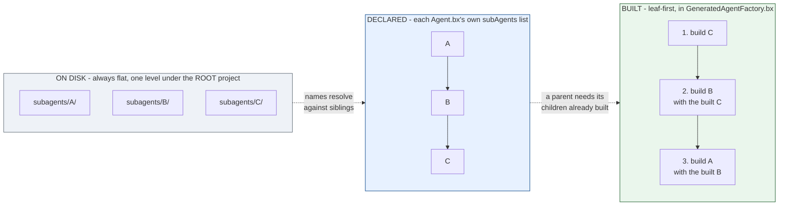

# subagents/

`subagents/` holds nested agents, each an ordinary BxAgents project of its own - an `Agent.bx` + `instructions.md` (and optionally its own `tools/`, `skills/`, etc.):

```
my-agent/
├── Agent.bx              # subAgents: ["researcher"]
├── instructions.md
└── subagents/
    └── researcher/
        ├── Agent.bx
        └── instructions.md
```

A subagent is wired to its parent by name, declared in the parent's `Agent.bx` `configure()` - the `subagents/` FOLDER name to wire at build time, distinct from `super.init()`'s own `subAgents` argument (which takes already-built `AiAgent` instances, not names):

```javascript
// Agent.bx
class extends="bxModules.bxai.models.runnables.AiAgent" {

	function init() {
		super.init(
			name  : "my-agent",
			model : aiModel( provider: "openai", params: { model: "gpt-5" } )
		)
		return this
	}

	function configure() {
		return {
			subAgents : [ "researcher" ]
		};
	}

}
```

At build time, bx-ai's `addSubAgent()` wraps each built subagent instance as a callable tool on the parent automatically - there's no separate tool-wrapping step to write yourself.

## Flat namespace, sibling references

Every subagent - no matter how deeply another subagent's own config references it - lives directly under the **root** project's `subagents/` folder. A subagent's own declared `subAgents` names reference **sibling** entries in that same root-level folder, not a folder nested under itself. This keeps the discovery/validation model simple: one flat directed graph over `subagents/`'s immediate subfolders, rather than a tree that could nest arbitrarily deep on disk.

Flat on disk, a graph in config, built bottom-up - the three views of the same project:



A cycle in the declared graph (`A -> B -> A`) is rejected at validation, before any of this is generated; a diamond (two parents sharing one descendant) is fine.

## Build order

Subagents are built **leaf-first** (bottom-up): if `A` declares `subAgents: ["B"]` and `B` declares `subAgents: ["C"]`, the generated `GeneratedAgentFactory.bx` builds `C`, then `B` (passing in the built `C` instance), then `A` (passing in the built `B` instance) - never the other way around, since a parent's `aiAgent()` call needs its children's already-built instances.

## Validation

- A subagent name in `subAgents` that doesn't correspond to a real `subagents/{name}/Agent.bx` fails validation with a clear "references unknown subagent [...]" error - this applies to **every** node's `subAgents` list, including the root project's own `Agent.bx`, not just nested subagents.
- **Circular references** (`A` → `B` → `A`) are rejected at validation time, with the full cycle path reported (e.g. `A -> B -> A`), before any code generation happens.
- A "diamond" shape - two subagents both depending on the same shared descendant - is **not** a cycle and builds fine; only genuine cycles are rejected.
- A missing `Agent.bx` inside a discovered `subagents/*` folder is reported as its own validation error.
- Every node's own DECLARED `name` (root + every subagent's own `Agent.bx`) must be unique across the whole project - see below.

## Retrieving an agent from `schedules/Scheduler.bx`

Two different names are in play, and they're not interchangeable:

- The **folder name** under `subagents/` (`researcher` above) is what `subAgents: [ "..." ]` references - it's purely a build-time wiring concern.
- The subagent's own **declared `name`** (its `Agent.bx`'s `name` field, e.g. `"ResearchBot"`) is what you retrieve it by at runtime - every agent in the tree (root + every subagent) is registered in `config/WireBox.bx` under this name, so [`schedules/Scheduler.bx`](schedules.md) (or any other WireBox-aware code) reaches it with a plain `getInstance( "ResearchBot" )`.

These two names can differ, and often will - the folder name is an implementation detail, the declared `name` is the one that matters everywhere else (prompts, WireBox retrieval). Because it's now also a WireBox binding key, `build` fails validation if two agents in the tree - however deeply nested - end up with the same declared `name`, including two that both leave it unset and silently share the `"BxAi"` default.