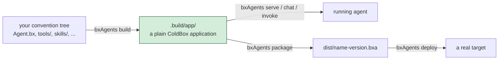

# What Is BxAgents?

Most agent frameworks wire tools, skills, routes and schedules together **at request
time**, on every boot. BxAgents does the opposite: `bxAgents build` runs discovery,
validation and code generation exactly **once**, producing a plain ColdBox application
under `.build/app/`.

Starting it afterwards - via `bxAgents serve`, a real
[`boxlang-miniserver`](https://boxlang.ortusbooks.com/getting-started/running-boxlang/miniserver)
process, or a portable `.bxa` deployed anywhere BoxLang runs - is then just booting an
ordinary app. No convention scanning, no dynamic file walking, no build-time work
deferred into the request path.



## Folders are the API

`Agent.bx` and `instructions.md` are the only files that matter to get started. Every
other convention folder - `tools/`, `skills/`, `subagents/`, `models/`, `gateways/`,
`schedules/`, `mcp/`, `interceptors/`, `modules/` - is optional and **only shapes the
generated output if it exists and has content in it**. You add conventions as you
actually need them, not up front.

## Agent.bx IS the agent

`Agent.bx` extends BX AI's own `AiAgent` directly - the build **instantiates your
class** rather than rebuilding one from a config struct, so what you write is what
runs. An IDE can introspect it like any other BoxLang class. You'll write your first
one in [Lesson 5](05-agent-bx.md).

## What `build` actually produces

Your convention tree on the left, the plain ColdBox application `build` turns it into
on the right:

::: columns
::: column
```
your-agent/
├── Agent.bx
├── instructions.md
├── tools/
├── skills/
├── subagents/
├── models/
├── gateways/
├── schedules/
├── mcp/
├── interceptors/
└── modules/
```
:::
::: column
```
.build/app/
├── Application.bx
├── config/
│   ├── ColdBox.bx
│   ├── WireBox.bx
│   ├── Router.bx
│   └── Scheduler.bx
├── agent/
│   └── GeneratedAgentFactory.bx
├── tools/  skills/  mcp/
├── handlers/  interceptors/
└── index.bxm
```
:::
:::

## Why this matters

Rebuilding an **unchanged** project produces byte-identical output, down to a hash-
stamped manifest recording exactly what went into the build (more on that in
[Lesson 20](20-packaging-deploying-and-wrapping-up.md)). That's the whole point of
paying the assembly cost once, at build time, rather than deferring any of it into
request handling.

See [BxAgents home](../index.md) and [The Build Pipeline](../build-pipeline.md) for
more detail whenever you want it.

Next: [Lesson 3 - Installing BxAgents](03-installing-bxagents.md)
