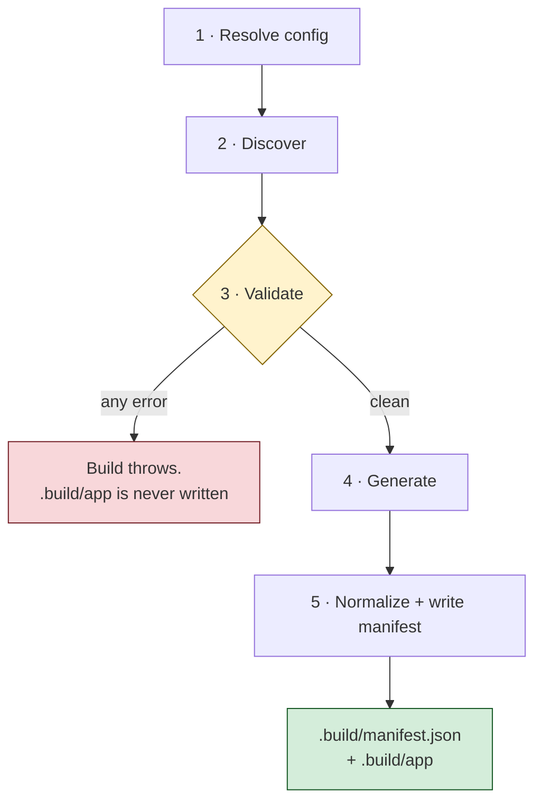

# Building Your Agent

With `Agent.bx` and `instructions.md` in place, build your project:

```bash
bxAgents build
```

This runs the full build pipeline - config resolution, discovery, validation, code
generation, manifest normalization - and writes a real ColdBox application to
`.build/app/`, plus `.build/manifest.json`.

## The five phases, in order



1. **Resolve config** - loads `Agent.bx`, calls `configure()` and the active
   environment override, then deep-merges any `boxlang.json`/`boxlang-{env}.json`.
2. **Discover** - walks the project and enumerates every convention folder into raw
   entries. Pure discovery - no interpretation of file contents yet.
3. **Validate** - collects **every** error (never fails fast) plus warnings: duplicate
   tool/skill/model/subagent names, circular references, bad model/provider config,
   and more. If any errors were collected, the build throws here - `.build/app` is
   never written or touched.
4. **Generate** - only reached once validation is clean. Interceptors, gateways, MCP,
   the router, the web UI (if any), the core app skeleton, a verbatim copy of
   `tools/`/`skills/`, and the scheduler, in that order.
5. **Normalize + write the manifest** - produces the canonical `.build/manifest.json`.

## If your project fails validation

`build` fails with **every** collected error, not just the first one - a duplicate
tool name and a bad cron expression in the same project both get reported in one run.

## Idempotency

Rebuilding an unchanged project produces **byte-identical** output, down to the
manifest's per-file content hashes. This is the entire point of paying the assembly
cost once, at build time, instead of deferring it into every request.

## Useful flag: `--verbose`

```bash
bxAgents build --verbose
```

Prints one line per build phase live as it runs - what got resolved/discovered/
validated, per-phase counts, which agents ended up registered in `config/WireBox.bx`
and under which names, whether a scheduler was found, and a final timing line. Silent
otherwise, so it costs nothing when you don't need it.

## Try it

```bash
cd my-agent
bxAgents build --verbose
```

You should see a `.build/app/` directory appear, and a manifest describing exactly
what went into it. You'll talk to this built agent in the next lesson.

Full reference: [The Build Pipeline](../build-pipeline.md).

Next: [Lesson 8 - Talking to Your Agent](08-talking-to-your-agent.md)
