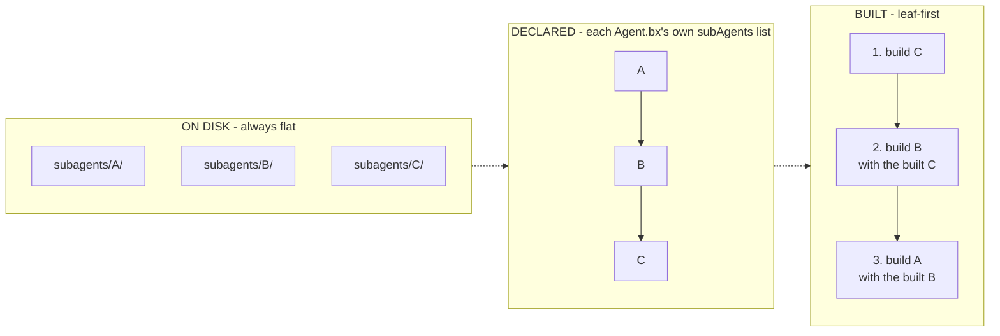

# Composing Subagents

`subagents/` holds nested agents - each an ordinary BxAgents project of its own, with
its own `Agent.bx` + `instructions.md`, and optionally its own `tools/`, `skills/`,
etc.

```
my-agent/
├── Agent.bx              # subAgents: ["researcher"]
├── instructions.md
└── subagents/
    └── researcher/
        ├── Agent.bx
        └── instructions.md
```

A subagent is wired to its parent by name, declared in the parent's `Agent.bx`
`configure()` - this is the `subagents/` **folder name**:

```javascript
function configure() {
	return {
		subAgents : [ "researcher" ]
	};
}
```

At build time, bx-ai's `addSubAgent()` wraps each built subagent instance as a
callable tool on the parent automatically - there's no separate tool-wrapping step to
write yourself.

## Flat on disk, a graph in config

Every subagent - no matter how deeply another subagent's own config references it -
lives directly under the **root** project's `subagents/` folder. A subagent's own
declared `subAgents` names reference **sibling** entries in that same root-level
folder, never a folder nested under itself.



A cycle in the declared graph (`A -> B -> A`) is rejected at validation, before
anything is generated. A diamond (two parents sharing one descendant) is fine.

## Two different names, two different jobs

- The **folder name** under `subagents/` is what `subAgents: [ "..." ]` references -
  purely a build-time wiring concern.
- The subagent's own **declared `name`** (its `Agent.bx`'s `name` field) is what you
  retrieve it by at runtime - every agent in the tree is registered in
  `config/WireBox.bx` under this name, so [`schedules/Scheduler.bx`](../conventions/schedules.md)
  (or anything else WireBox-aware) reaches it with `getInstance( "TheAgentName" )`.

These two names can differ, and often will. Because `name` is now also a WireBox
binding key, it must be unique across the whole project - `build` fails validation if
two agents share one.

## Try it

Scaffold a `subagents/researcher/` folder as its own small BxAgents project (its own
`Agent.bx` + `instructions.md`), then wire it into your root `Agent.bx`'s
`configure()`. Rebuild and ask your root agent something that would naturally delegate
to the researcher subagent - it's callable exactly like any other tool.

Full reference: [subagents/](../conventions/subagents.md).

Next: [Lesson 12 - Named Model Configs](12-named-model-configs.md)
