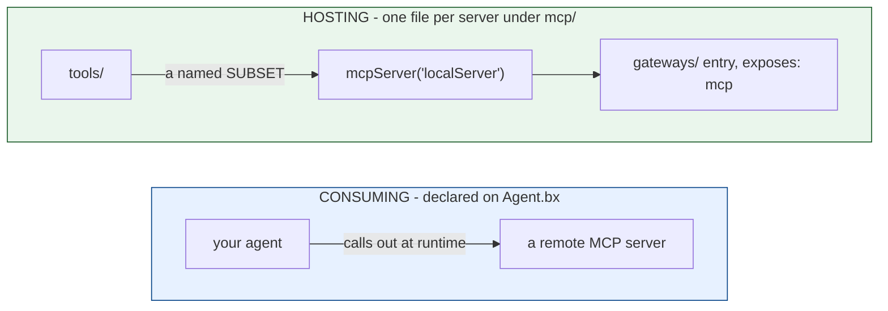

# Hosting and Consuming MCP Servers

Model Context Protocol (MCP) works in two directions in a BxAgents project, and
nothing links them - an agent consuming remote servers need not host one, and a hosted
server is only reachable if a `gateways/` entry exposes it (see
[Lesson 13](13-exposing-http-and-mcp.md)).



## Consuming a remote server

Declared directly on `Agent.bx` via `mcpServers` - not a file under `mcp/`:

```javascript
function configure() {
	return {
		mcpServers : [
			"https://example.com/mcp",
			{ url : "https://other.com/mcp", name : "other" }
		]
	};
}
```

**No network connection is ever attempted at build time** - reachability is a runtime
concern, so an unreachable server at build time is not a build error. Subagents can
declare their own `mcpServers` independently.

## Hosting a local server

Each `mcp/*.bx` file is a local MCP server your project hosts, exposing a named subset
of your `tools/` (from [Lesson 9](09-giving-your-agent-tools.md)) as MCP tools:

```javascript
// mcp/localServer.bx
class {
	function configure() {
		return {
			description : "Internal tools MCP server",
			version     : "1.0.0",
			cors        : "*",             // optional
			tools       : [ "sayHello" ]   // names of tools already under tools/
		};
	}
}
```

The entry's discovered name is its **filename** (`localServer.bx` -> `localServer`),
not any `name` inside `configure()`. At build time the file is copied verbatim, and a
registration statement is emitted at startup.

## Exposing it over HTTP

A local server isn't reachable on its own - pair it with the `gateways/` exposure
entry you saw in [Lesson 13](13-exposing-http-and-mcp.md):

```javascript
// gateways/expose-mcp.bx
class {
	function configure() {
		return {
			exposes : "mcp",
			path    : "/mcp/tools",
			target  : "localServer"
		};
	}
}
```

## Try it

Host the `GetTime` tool you wrote in [Lesson 9](09-giving-your-agent-tools.md) as its
own MCP server, expose it at `/mcp/tools`, build, and `serve` - it's now reachable by
any outside MCP client, independent of your agent's own chat interface.

Full reference: [mcp/](../conventions/mcp.md).

Next: [Lesson 18 - Interceptors and Module Dependencies](18-interceptors-and-modules.md)
