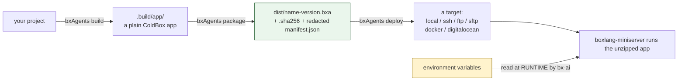

# Packaging, Deploying, and Wrapping Up

You've built an agent with tools, skills, subagents, an HTTP route, a chat-platform
connection, a web UI, a schedule, and a test suite. This last lesson ships it.

## The chain, end to end



Secrets never enter the artifact at any step - `.env`/dotfiles are excluded from the
zip unconditionally, and the manifest is redacted on top of never carrying one. Every
API key, token and password is resolved from a real environment variable, live, at
runtime.

## Package

```bash
bxAgents package --version=1.0.0
```

Zips `.build/app/` into `dist/{agentName}-{version}.bxa`, a `.sha256` checksum, and a
redacted `manifest.json`. Packaging twice over the same build produces byte-identical
zip bytes - useful for verifying a CI-built artifact matches a locally-built one. An
optional `.bxaignore` (one glob per line) excludes extra paths.

## Deploy

```bash
bxAgents deploy --destination=/path/to/somewhere   # local, no deploy/ folder needed
bxAgents deploy --name=production                  # any target, via deploy/production.bx
```

Six pluggable targets: `local` (copy the newest `.bxa`), `ssh` (scp + optional
restart), `docker` (build/push an image), `digitalocean` (App Platform), and
`ftp`/`sftp`. Every target resolves credentials from environment variables only - never
from `deploy/*` config itself.

```javascript
// deploy/production.bx
class {
	function configure() {
		return {
			target       : "digitalocean",
			appName      : "my-agent",
			registry     : { type : "docr", repository : "myorg/my-agent" },
			envs         : [ { key : "OPENAI_API_KEY", scope : "RUN_TIME", type : "SECRET" } ]
		};
	}
}
```

## What every build recorded: the manifest

`bxAgents inspect` pretty-prints `.build/manifest.json` without rebuilding:

```bash
bxAgents inspect
bxAgents inspect --json
```

It's a hash-stamped record of exactly what went into the build - agent name, model,
environment, and one entry per discovered file with a SHA-256 content hash. This is
what makes rebuilding an unchanged project byte-identical, the idea you first met back
in [Lesson 2](02-what-is-bxagents.md).

## Cleaning up

```bash
bxAgents clean
```

Removes only `.build/` and `dist/` - your source conventions are never touched.

## Every verb, in one place

You've now used `new`, `build`, `test`, `chat`, `invoke`, `serve`, `package`, `deploy`,
`inspect` and `hash-password` across this course. See the [CLI Reference](../cli-reference.md)
for every flag on every one of them.

## Where to go from here

::: cards
::: card title="Conventions" icon="phosphor-duotone:cube" href="../conventions/agent-bx.md"
The full reference for every convention folder this course walked through.
:::
::: card title="The Build Pipeline" icon="phosphor-duotone:factory" href="../build-pipeline.md"
Exactly what `build` does, in order, in more depth than Lesson 7 covered.
:::
::: card title="Deployment & Secrets" icon="phosphor-duotone:lock-key" href="../deployment-and-secrets.md"
The full packaging and secrets story from Lesson 20, in depth.
:::
::: card title="Known Limitations" icon="phosphor-duotone:warning" href="../known-limitations.md"
The honest gaps - what's proven against a real running app and what isn't yet.
:::
:::

You went from an empty terminal to a tested, packaged, deployable agent with tools,
skills, subagents, a chat-platform connection, a browser UI, and a schedule - in
twenty lessons. Everything from here is applying these same conventions to whatever
you actually want to build.

Congratulations, and welcome to BxAgents.
