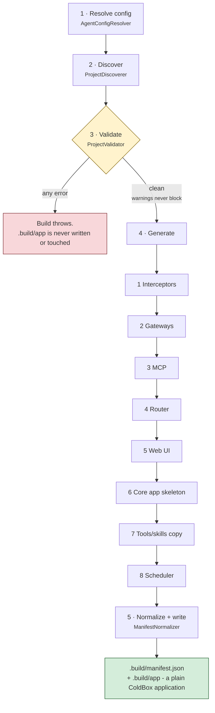

# The Build Pipeline

`bxAgents build` runs a fixed sequence of phases, once, producing a plain ColdBox application. Nothing here runs again at request time - that's the whole point of build-time assembly. This page walks the phases in the exact order `BuildPipeline.bx` runs them.

Validation is the gate: it collects **every** error rather than failing fast, and nothing is generated until it comes back clean.

(Packaging into a `.bxa` is a deliberately separate step - see [Deployment & Secrets](deployment-and-secrets.md) - so a fast `build` → inspect → `build` again loop never pays a packaging cost it doesn't need.)

## 1. Resolve config

[`AgentConfigResolver`](conventions/agent-bx.md) loads `Agent.bx`, invokes `configure()` and the active environment's override method, then deep-merges in `boxlang.json`/`boxlang-{env}.json`/`miniserver.json`/`miniserver-{env}.json` if present. Produces the single resolved config struct every later phase reads from.

## 2. Discover

[`ProjectDiscoverer`](conventions/agent-bx.md) walks the project root and enumerates every convention folder (`models/`, `tools/`, `skills/`, `subagents/`, `gateways/`, `mcp/`, `interceptors/`, `modules/`) into raw `{ name, path, type }` entries. `schedules/` is the one exception - it's not a list of entries, just a single `hasScheduler`/`schedulerPath` pair, since it holds one real ColdBox scheduler file rather than a set of BX Agents-defined config entries. Pure discovery - no interpretation of file contents happens yet.

## 3. Validate

[`ProjectValidator`](conventions/agent-bx.md) runs every validator and collects **every** error (never fail-fast) plus any warnings: duplicate tool/skill/model/subagent names, duplicate agent `name`s across the whole subagent tree (see [subagents/](conventions/subagents.md#retrieving-an-agent-from-schedulesschedulerbx)), circular subagent/module references, the two gateway entry shapes, remote MCP config completeness, and model/provider validity. If any errors were collected, the build throws immediately here - no `.build/app` is written or touched. Warnings (e.g. a `schedules/` folder with no `Scheduler.bx` in it) never block the build.

## 4. Generate

Only reached once validation is clean. In order:

1. **Interceptors** - [`InterceptorSplitter`](conventions/interceptors.md) copies `agent`-scope interceptors into `.build/app/interceptors`, `runtime`-scope ones into a separate `.build/runtime-interceptors` directory.
2. **Gateways** - [`GatewayGenerator`](conventions/gateways.md) emits `aiGatewayRegistry().register(...)` statements for channel-adapter entries, and (if any are `type: "http"`) writes `.build/app/handlers/Gateway.bx`. If any entry is a push-style gateway (e.g. `type: "telegram"`), it also writes `.build/app/interceptors/GatewaySessionBootstrap.bx`, wiring a single bx-ai `GatewaySession` (bundling every push-style gateway) to the project's root agent.
3. **MCP** - [`McpGenerator`](conventions/mcp.md) copies local `mcp/*` servers into `.build/app/mcp` and emits their `mcpServer(...).registerTool(...)` registration statements.
4. **Router** - [`RouterGenerator`](conventions/gateways.md) writes `.build/app/config/Router.bx`: one `route(path).toAi(...)`/`toMCP(...)` per exposure entry, plus the 3 fixed gateway webhook routes if a `http`-type channel gateway exists.
5. **Web UI** - [`WebUiGenerator`](conventions/web-ui.md) runs for any `exposes: "webui"` entry, writing the static `<path>/index.html`, `handlers/ChatUi.bx` (the twenty-action API), `models/ChatDb.bx` (the SQLite store and its forward-only migrations), `interceptors/WebUiSchema.bx` (migrates at boot rather than on whichever request touches the database first), and - only when `apiKeyEnvVar` is set - `interceptors/WebUiAuthGate.bx`. It returns the resolved database config, which the next step needs.
6. **Core app skeleton** - `ColdBoxAppGenerator` writes `Application.bx`, `config/ColdBox.bx`, `config/WireBox.bx`, `agent/GeneratedAgentFactory.bx`, and `index.bxm`, threading in every statement gathered above (gateway registrations, MCP registrations, and - if `tools/` has any files - a bare `aiToolRegistry().scan("tools")` call) into `Application.bx`'s `onApplicationStart()`, and (Phase 1's `GatewaySessionBootstrap.bx`, if generated) into the `interceptors` list `config/ColdBox.bx` references. Every generated agent also now always receives a checkpointer (`withCheckpointer(...)`, defaulting to a `cache`-backed `aiMemory()` if the project declares no `checkpointer` config and the class set none of its own) - without one, human-in-the-loop approval flows through any gateway other than `cli` fail outright. `config/WireBox.bx` maps every agent in the tree (root + every subagent) under its own declared `name`, not just the fixed root `"GeneratedAgent"` alias - see [schedules/](conventions/schedules.md). For a project with a `webui` exposure it also turns session management on, registers the SQLite datasource (naming it as the app default via `this.datasource`), creates the database's parent directory in `onApplicationStart()` - SQLite creates the file but never the folder holding it - and pins qb's grammar in `config/ColdBox.bx`.
7. **Tools/skills copy** - `ToolsSkillsCopier` wipes and rewrites `.build/app/tools` and `.build/app/skills` verbatim from your project's own folders.
8. **Scheduler** - [`SchedulerGenerator`](conventions/schedules.md) copies `schedules/Scheduler.bx` through to `.build/app/config/Scheduler.bx` untouched, if present - no generation, it's real ColdBox code you wrote yourself.

## 5. Normalize + write the manifest

[`ManifestNormalizer`](manifest.md) produces the canonical, hash-stamped internal manifest from the discovery + resolved-config data, and the pipeline writes it to `.build/manifest.json`.

## Idempotency

Rebuilding an unchanged project produces byte-identical output, down to the manifest's per-file content hashes - the entire point of paying the assembly cost once, at build time, rather than deferring any of this work into request handling.