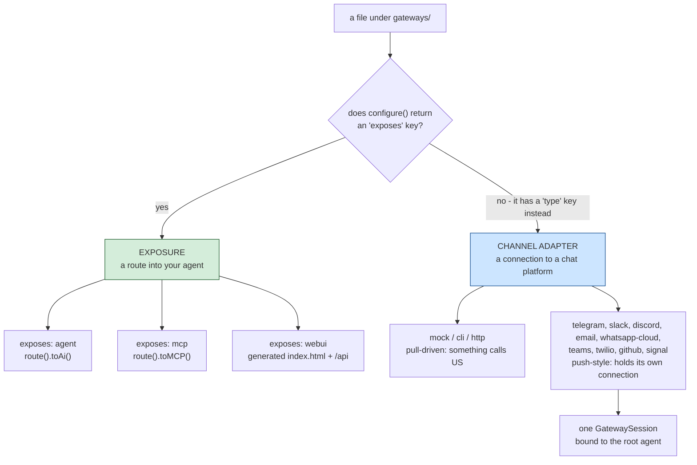
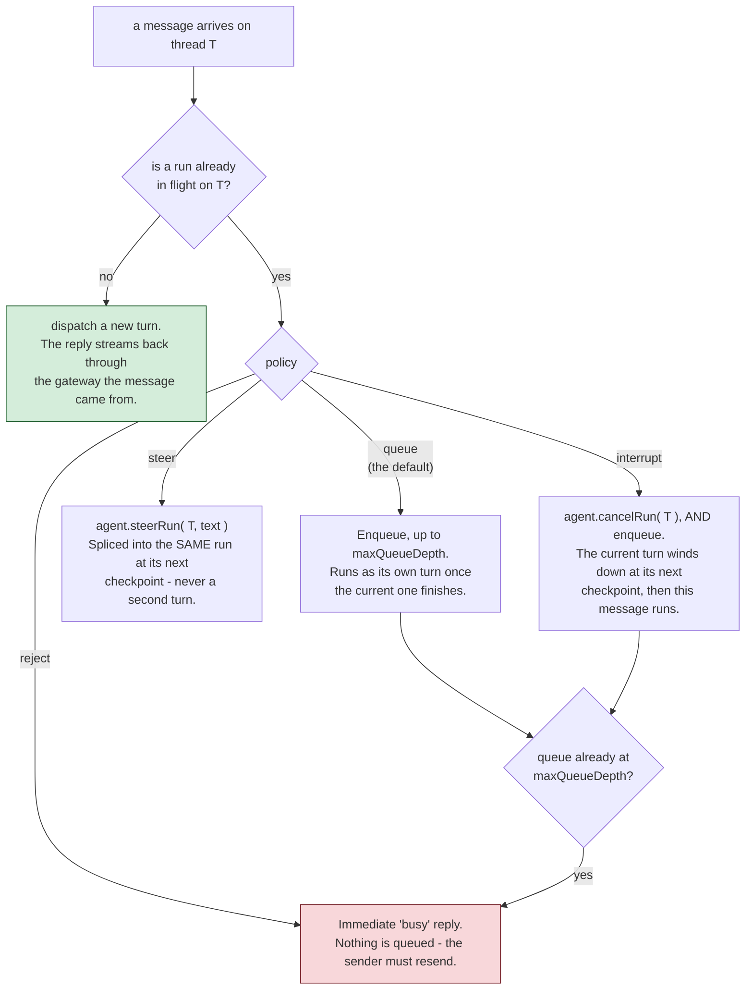

# gateways/

`gateways/*.bx`/`.json` files under this one folder cover **two distinct, unrelated things** - which kind an entry is depends entirely on whether its `configure()` struct has an `exposes` key.

!!! warning
    Don't confuse these with each other - an HTTP-exposed agent (`exposes: "agent"`) is a REST API for your agent; a channel-adapter gateway (`type: "http"`) is a webhook endpoint for a chat platform or human-in-the-loop approval flow. They generate completely different routes.



## 1. HTTP/MCP/web-UI exposure (`exposes: "agent" | "mcp" | "webui"`)

Exposes the agent, or a local MCP server, over HTTP using ColdBox 8.1's native AI Routing DSL - or a pre-built browser chat UI, documented separately in [The web chat UI](web-ui.md).

**Expose the agent:**

```javascript
// gateways/expose.bx
class {

	function configure() {
		return {
			exposes : "agent",
			path    : "/api/chat"
		};
	}

}
```

Generates, in `config/Router.bx`:

```javascript
route( "/api/chat" ).toAi( "GeneratedAgent" )
```

which auto-registers **four** sub-routes: `POST /api/chat/invoke`, `POST /api/chat/stream` (SSE), `POST /api/chat/batch`, `GET /api/chat/info`. The bare `/api/chat` path itself is not routable.

**Expose a local MCP server** (see [mcp/](mcp.md)):

```javascript
class {
	function configure() {
		return {
			exposes : "mcp",
			path    : "/mcp/tools",
			target  : "local-server"   // must match an mcp/*.bx entry's declared name
		};
	}
}
```

Generates `route( "/mcp/tools" ).toMCP( "local-server" )`.

**Expose the v1 web chat UI:**

```javascript
// gateways/chat.bx
class {
	function configure() {
		return {
			exposes     : "webui",
			path        : "/chat",
			apiKeyEnvVar: "CHAT_UI_API_KEY"   // optional - see below
		};
	}
}
```

Generates a real static `<path>/index.html` file (served directly - no route needed for it) plus its own dedicated API under a fixed `<path>/api` prefix, so it never collides with the shell's own files. That API is a generated `handlers/ChatUi.bx` rather than `toAi()`, and the entry also brings a generated SQLite store with it.

The web UI is a subsystem rather than a single exposure switch - the route list, the store, conversations and preferences, branding and theming, and why it does not use `toAi()` are all on its own page: **[The web chat UI](web-ui.md)**.

**Validation:** `exposes` must be `agent`, `mcp`, or `webui`; `path` is required and must be unique across every exposure entry; an `mcp` exposure's `target` is required and must match a real `mcp/*` entry's declared name; `webui`'s `apiKeyEnvVar` is entirely optional, with no required-field check (see below).

## 2. Channel-adapter gateways (`type: "mock" | "cli" | "http"`)

Registers a bx-ai `IGateway` (a channel adapter for external delivery / human-in-the-loop approval) by name - distinct from exposing the agent's own REST API.

```javascript
// gateways/slack.bx
class {
	function configure() {
		return {
			type         : "http",
			secretEnvVar : "SLACK_WEBHOOK_SECRET"
		};
	}
}
```

`secretEnvVar` names an environment variable holding the signing secret - **never the secret value itself**. Generates, in `Application.bx`'s `onApplicationStart()`:

```javascript
aiGatewayRegistry().register( aiGateway( "http", { secret : getSystemSetting( "SLACK_WEBHOOK_SECRET", "" ) } ) )
```

The secret is resolved live at server startup, matching this project's "secrets stay external" rule everywhere else (see [Deployment & Secrets](../deployment-and-secrets.md)) - it's never embedded as a literal in generated source, so it's never present in a packaged `.bxa` either. If the env var is unset, bx-ai's own `HttpGateway` treats an empty secret as "no signing configured" and rejects requests accordingly, rather than crashing at startup.

**Validation:** `type` must be `mock`, `cli`, or `http`; a `type: "http"` entry requires a `secretEnvVar`; the entry's own file/base name must be unique across every channel-adapter entry. `mock` is test-only; `cli` is bx-ai's own built-in human-in-the-loop **approval** channel (a blocking stdin/stdout A/R/Q prompt) - it's what `HumanInTheLoopMiddleware` attaches by default when no gateway is specified, and is unrelated to BX Agents' own `chat` verb (which never touches the gateway registry at all).

**`http`-type entries additionally get real HTTP wiring**: a generated `handlers/Gateway.bx` action that proxies straight into bx-ai's own `GatewayRequestProcessor::processHttp()`, and three routes in `config/Router.bx`:

```javascript
post( "/gateways/:gatewayName/events" ).toHandler( "Gateway.process" )
get( "/interactions/:requestID" ).toHandler( "Gateway.process" )
post( "/interactions/:requestID/decisions" ).toHandler( "Gateway.process" )
```

!!! info
    ColdBox has no built-in `toAiGateway()` DSL terminator for this surface (only `toAi()` and `toMCP()` exist natively) - this wiring is BX Agents' own generated code, following the same shape a future core terminator would produce. See the [`toAiGateway()` for ColdBox Core](../proposals/toAiGateway-coldbox-core.md) proposal.

## 3. Push-style gateways (`type: "telegram"` / `"slack"` / `"discord"` / `"email"` / `"whatsapp-cloud"` / `"teams"` / `"twilio"` / `"github"` / `"signal"`, and friends)

A different kind of channel adapter from `mock`/`cli`/`http` above: instead of being driven by an inbound HTTP request, a push-style gateway holds its own connection to the platform and pushes inbound messages to your agent as they arrive - the closer-to-"real chat bot" experience. Four transport shapes exist today:

- **Long-poll** (Telegram, Email): a scheduled task periodically asks the platform "anything new?" (Telegram's `getUpdates`, Email's IMAP poll).
- **Persistent websocket** (Slack via Socket Mode, Discord via its Gateway API): the gateway holds a live, long-running connection the platform pushes events down in real time.
- **Webhook, pull-driven** (WhatsApp Business Cloud API, Microsoft Teams, Twilio SMS, GitHub): the platform calls **us** over a public HTTP endpoint instead of this gateway holding its own outbound connection - no scheduler task or socket to manage. See their own subsections below.
- **Server-Sent Events (SSE)** (Signal, against a locally-run `signal-cli` daemon): a long-lived, one-way streaming HTTP connection the gateway holds open, reading events as they're pushed down the same response body. See its own subsection below.

```javascript
// gateways/telegramChannel.bx
class {
	function configure() {
		return {
			type          : "telegram",
			botTokenEnvVar: "TELEGRAM_BOT_TOKEN"
		};
	}
}
```

```javascript
// gateways/slackChannel.bx
class {
	function configure() {
		return {
			type          : "slack",
			botTokenEnvVar: "SLACK_BOT_TOKEN",   // xoxb-... - chat.postMessage/chat.update
			appTokenEnvVar: "SLACK_APP_TOKEN"    // xapp-... - apps.connections.open (Socket Mode)
		};
	}
}
```

```javascript
// gateways/discordChannel.bx
class {
	function configure() {
		return {
			type          : "discord",
			botTokenEnvVar: "DISCORD_BOT_TOKEN"   // Authorization: Bot <token> on every REST call and inside Identify
			// intents: 37377   // optional override - defaults to GUILDS+GUILD_MESSAGES+DIRECT_MESSAGES+MESSAGE_CONTENT
		};
	}
}
```

```javascript
// gateways/emailChannel.bx
class {
	function configure() {
		return {
			type              : "email",
			imapHostEnvVar    : "IMAP_HOST",
			imapUsernameEnvVar: "IMAP_USERNAME",
			imapPasswordEnvVar: "IMAP_PASSWORD",
			fromAddressEnvVar : "EMAIL_FROM_ADDRESS"
			// imapPort: 993   // optional override - defaults to 993 (IMAPS)
			// pollIntervalSeconds: 60   // optional override - defaults to 60
		};
	}
}
```

```javascript
// gateways/whatsappCloud.bx
class {
	function configure() {
		return {
			type               : "whatsapp-cloud",
			accessTokenEnvVar  : "WHATSAPP_ACCESS_TOKEN",     // Graph API access token
			phoneNumberIdEnvVar: "WHATSAPP_PHONE_NUMBER_ID",  // the WhatsApp Business phone number ID sends go through
			appSecretEnvVar    : "WHATSAPP_APP_SECRET",       // HMAC key verifying X-Hub-Signature-256 on inbound webhooks
			verifyTokenEnvVar  : "WHATSAPP_VERIFY_TOKEN"      // shared secret Meta's GET verify handshake must echo back
			// apiVersion: "v21.0"   // optional override - defaults to "v21.0"
		};
	}
}
```

```javascript
// gateways/teamsChannel.bx
class {
	function configure() {
		return {
			type                : "teams",
			appIdEnvVar         : "TEAMS_APP_ID",         // the bot's own Microsoft App ID (also the inbound JWT's required aud claim)
			appPasswordEnvVar   : "TEAMS_APP_PASSWORD"    // OAuth2 client-credentials secret
			// tenantId: "..."   // optional override for single-tenant apps - defaults to "botframework.com" (multi-tenant)
		};
	}
}
```

```javascript
// gateways/twilioChannel.bx
class {
	function configure() {
		return {
			type            : "twilio",
			accountSidEnvVar: "TWILIO_ACCOUNT_SID",
			authTokenEnvVar : "TWILIO_AUTH_TOKEN",   // also the X-Twilio-Signature HMAC key
			fromEnvVar      : "TWILIO_FROM_NUMBER"   // the Twilio phone number outbound sends go through, E.164
			// messagingServiceSid: "MG..."   // optional - if set, used instead of `from` on outbound sends
			// publicUrl: "https://your-real-public-host/webhooks/twilio"   // optional override for reverse-proxy/tunnel deployments - see the Twilio subsection below
		};
	}
}
```

```javascript
// gateways/githubChannel.bx
class {
	function configure() {
		return {
			type               : "github",
			tokenEnvVar        : "GITHUB_TOKEN",           // a personal access token (repo/issues+PR read+write scope)
			webhookSecretEnvVar: "GITHUB_WEBHOOK_SECRET",  // HMAC key verifying X-Hub-Signature-256 on inbound webhooks
			botNameEnvVar      : "GITHUB_BOT_NAME"         // the bot's own GitHub login - matched as "@botName" in comments
			// apiBaseUrl: "https://api.github.com"   // optional override - defaults to "https://api.github.com"
		};
	}
}
```

```javascript
// gateways/signalChannel.bx
class {
	function configure() {
		return {
			type         : "signal",
			accountEnvVar: "MY_SIGNAL_ACCOUNT"   // the signal-cli-registered phone number this gateway sends/receives as, E.164
			// httpUrl: "http://127.0.0.1:8080"   // optional override - defaults to "http://127.0.0.1:8080", where signal-cli's own daemon HTTP API is expected to be listening
		};
	}
}
```

Same "secrets stay external" rule as `http`'s `secretEnvVar`: every `*EnvVar` key names an environment variable, resolved live via `getSystemSetting()` at startup, never embedded as a literal - `email`'s `imapHost`/`fromAddress` aren't cryptographic secrets, but the same env-var-driven convention is used for every one of its config values anyway, since they all vary per deployment. Unlike the core types, a push-style gateway's class lives inside BX Agents itself (`models/gateways/*.bx`, not bx-ai), so its registration renders as a bare class path rather than a short name:

```javascript
aiGatewayRegistry().register( aiGateway( "bxModules.bxagents.models.gateways.TelegramGateway", { "botToken" : getSystemSetting( "TELEGRAM_BOT_TOKEN", "" ) } ) )
aiGatewayRegistry().register( aiGateway( "bxModules.bxagents.models.gateways.SlackGateway", { "appToken" : getSystemSetting( "SLACK_APP_TOKEN", "" ), "botToken" : getSystemSetting( "SLACK_BOT_TOKEN", "" ) } ) )
aiGatewayRegistry().register( aiGateway( "bxModules.bxagents.models.gateways.DiscordGateway", { "botToken" : getSystemSetting( "DISCORD_BOT_TOKEN", "" ) } ) )
aiGatewayRegistry().register( aiGateway( "bxModules.bxagents.models.gateways.EmailGateway", { "imapHost" : getSystemSetting( "IMAP_HOST", "" ), "imapUsername" : getSystemSetting( "IMAP_USERNAME", "" ), "imapPassword" : getSystemSetting( "IMAP_PASSWORD", "" ), "fromAddress" : getSystemSetting( "EMAIL_FROM_ADDRESS", "" ) } ) )
aiGatewayRegistry().register( aiGateway( "bxModules.bxagents.models.gateways.whatsapp.WhatsAppCloudGateway", { "accessToken" : getSystemSetting( "WHATSAPP_ACCESS_TOKEN", "" ), "phoneNumberId" : getSystemSetting( "WHATSAPP_PHONE_NUMBER_ID", "" ), "appSecret" : getSystemSetting( "WHATSAPP_APP_SECRET", "" ), "verifyToken" : getSystemSetting( "WHATSAPP_VERIFY_TOKEN", "" ) } ) )
aiGatewayRegistry().register( aiGateway( "bxModules.bxagents.models.gateways.TeamsGateway", { "appId" : getSystemSetting( "TEAMS_APP_ID", "" ), "appPassword" : getSystemSetting( "TEAMS_APP_PASSWORD", "" ) } ) )
aiGatewayRegistry().register( aiGateway( "bxModules.bxagents.models.gateways.TwilioGateway", { "accountSid" : getSystemSetting( "TWILIO_ACCOUNT_SID", "" ), "authToken" : getSystemSetting( "TWILIO_AUTH_TOKEN", "" ), "from" : getSystemSetting( "TWILIO_FROM_NUMBER", "" ) } ) )
aiGatewayRegistry().register( aiGateway( "bxModules.bxagents.models.gateways.GitHubGateway", { "token" : getSystemSetting( "GITHUB_TOKEN", "" ), "webhookSecret" : getSystemSetting( "GITHUB_WEBHOOK_SECRET", "" ), "botName" : getSystemSetting( "GITHUB_BOT_NAME", "" ) } ) )
aiGatewayRegistry().register( aiGateway( "bxModules.bxagents.models.gateways.SignalGateway", { "account" : getSystemSetting( "MY_SIGNAL_ACCOUNT", "" ) } ) )
```

**Validation:** `type: "telegram"` requires `botTokenEnvVar`; `type: "slack"` requires both `botTokenEnvVar` and `appTokenEnvVar`; `type: "discord"` requires `botTokenEnvVar`; `type: "email"` requires `imapHostEnvVar`, `imapUsernameEnvVar`, `imapPasswordEnvVar`, and `fromAddressEnvVar`; `type: "whatsapp-cloud"` requires `accessTokenEnvVar`, `phoneNumberIdEnvVar`, `appSecretEnvVar`, and `verifyTokenEnvVar`; `type: "teams"` requires `appIdEnvVar` and `appPasswordEnvVar`; `type: "twilio"` requires `accountSidEnvVar`, `authTokenEnvVar`, and `fromEnvVar`; `type: "github"` requires `tokenEnvVar`, `webhookSecretEnvVar`, and `botNameEnvVar`; `type: "signal"` requires `accountEnvVar` - all checked the same way `http`'s `secretEnvVar` is.

!!! info
    Slack v1 is **Socket Mode only** - no public webhook endpoint is needed or generated for it (unlike `http`, which gets real routes - see §2 above). The Events-API/HTTP-webhook alternative Slack also supports isn't built here. Discord v1 is likewise the real **Gateway API** (a persistent websocket) rather than Discord's alternative HTTP Interactions Endpoint URL webhook mode - no Ed25519 signature verification is needed here as a result, since interactions arrive over the same authenticated connection rather than a public HTTP endpoint (confirmed against Discord's own docs).

### Slack's persistent connection

`SlackGateway` holds its websocket via `java.net.http.HttpClient`'s async WebSocket client, bridged from a BoxLang listener class that `implements="java:java.net.http.WebSocket$Listener"` directly (`models/gateways/support/SlackSocketListener.bx`) - BoxLang compiles this as a real JVM implementer of the interface, confirmed empirically by handing an instance straight to `HttpClient.newWebSocketBuilder().buildAsync( uri, listener )` with no casting error (only the expected `java.net.ConnectException` once the real network boundary was reached). Only the methods the class actually declares override the JDK interface's `default` methods; anything left unimplemented falls through to the JDK's own default behavior automatically. This is the reference pattern every other persistent-connection gateway (Discord, below) follows too.

Reconnects are driven reactively by Slack's own protocol signals - a `disconnect` frame (`warning`/`refresh_requested`) or an unexpected socket close - opening a **new** connection before closing the old one, per Slack's documented recommendation. A lightweight scheduler watchdog (`slack-watchdog-<name>`, every 30s) is only a safety net for the case neither of those signals fires.

### Discord's persistent connection - mandatory client-driven heartbeats

`DiscordGateway` connects the same way (`models/gateways/support/DiscordSocketListener.bx`, same `implements="java:java.net.http.WebSocket$Listener"` pattern as Slack), but Discord's Gateway protocol has a requirement Slack's Socket Mode doesn't: the server's own `Hello` frame (opcode 10) tells the client a `heartbeat_interval`, and the client must keep sending `Heartbeat` frames (opcode 1) on that cadence itself or Discord treats the connection as "zombied" and drops it. Since the interval is only known once `Hello` arrives (not before connecting), the heartbeat is registered as its own scheduler task (`discord-heartbeat-<name>`) dynamically from inside the frame handler, re-registered on every fresh `Hello` - distinct from every other push-style gateway's fixed-at-`registerScheduledTasks()`-time task(s), and distinct from Discord's own safety-net watchdog (`discord-watchdog-<name>`, every 30s, same role as Slack's).

Each heartbeat tick checks whether the *previous* heartbeat was ever acknowledged (`Heartbeat ACK`, opcode 11) - if not, the connection is zombied and gets reconnected proactively rather than left to time out. Reconnects otherwise follow Discord's own documented session model: a `Reconnect` frame (opcode 7) or most close codes trigger a `Resume` (opcode 6, replaying the last sequence number) on the new connection when a prior session exists; an `Invalid Session` frame (opcode 9) with `d: false`, or a close code Discord documents as session-invalidating (`4007`, `4009`), instead forces a fresh `Identify` (opcode 2). A small, fixed set of close codes (`4004` bad token, `4010` invalid shard, `4011` sharding required, `4012` invalid API version, `4013`/`4014` invalid/disallowed intents) are non-recoverable per Discord's own docs - the gateway stops rather than retrying a connection that would just fail again.

!!! warning
    `MESSAGE_CONTENT` (needed to read message text at all, in both guild channels and DMs) is a Discord **privileged** Gateway Intent - it must be explicitly enabled for your bot in the Discord Developer Portal, and once your app is verified (100+ guilds), approved by Discord. Without it, every inbound message arrives with an empty `content` field.

### Email - server-level dependencies, and degraded threading/HITL

`EmailGateway` is the only push-style gateway that doesn't speak its platform's API directly. Outbound mail goes through ColdBox's own [`cbmailservices`](https://coldbox.ortusbooks.com/the-basics/modules/core-modules) module (`MailService@cbmailservices`, its `BXMail` protocol - which itself just calls BoxLang's own `bx:mail` component, from the `bx-mail` module) rather than a hand-rolled HTTP/SMTP call. **Both are real, server-level module installs** - they're declared as this project's own `box.json` `dependencies` (so installing `bx-agents` pulls them onto the server too), but cbmailservices/bx-mail both still require an explicit install on whatever server actually runs a generated app (confirmed against both modules' own docs/source - neither ships pre-installed with ColdBox or BoxLang) - do a real `box install` (or equivalent) before `bxAgents serve`/deploying a project with an `email` gateway. `EmailGateway` resolves `MailService@cbmailservices` manually off `application.cbController.getWireBox()` (see `ScheduledGatewayBase.resolveScheduler()`'s own docblock for why - this class is constructed directly by `aiGateway()`, entirely outside WireBox, so `inject=""` is never honored on it), the same way the scheduler itself is resolved.

Because neither `bx-mail` nor `cbmailservices` receive mail (only send it), inbound is hand-rolled IMAP via the JDK-standard `jakarta.mail` API - confirmed reachable on this project's own classpath transitively (`bx-mail` depends on `commons-email2-jakarta`, which itself depends on `jakarta.mail-api` + an Angus Mail implementation), verified empirically this session against the real jars, not assumed. A scheduled task (`email-poll-<name>`) polls IMAP for unseen mail, same shape as Telegram's long-poll.

Threading and human-in-the-loop are both **degraded** relative to the chat-platform gateways, and `getDeclaredCapabilities()` deliberately omits `"interactiveActions"` to say so honestly:

- **Threading** uses real `Message-ID`/`In-Reply-To`/`References` headers for an ORDINARY reply (the gateway always knows the inbound `Message-ID` it's replying to, so setting `In-Reply-To` on the outbound reply is reliable) - a v1 simplification threads on `References`' first entry (else `In-Reply-To`, else the message's own `Message-ID`), not a full walk of the chain.
- **Human-in-the-loop has no native button/component surface at all** - `requestHumanInteraction()` sends a plain-text email listing the allowed decision keywords and asks the human to reply with one as the first line. Correlating that reply back to the right pending request can't rely on `In-Reply-To` the way ordinary replies do (cbmailservices' `send()` doesn't expose what `Message-ID` the outbound approval email itself got assigned), so it's done via a `[bxagents:<requestID>]` tag embedded in the Subject line instead - the same technique real email-based support-ticket systems use for the identical reason. A reply's first line is matched against the request's own allowed decisions (exact or prefix, case-insensitive); an unrecognized reply is passed through verbatim rather than re-prompted, left for bx-ai's own HITL coordinator to reject.

### WhatsApp Business Cloud API - webhook-driven, not connection-driven

`WhatsAppCloudGateway` is shaped differently from every other push-style gateway: Meta calls **us**, over a public webhook, rather than this gateway holding its own outbound connection (a poll task or a websocket). It extends bx-ai's `BaseGateway` directly, not `ScheduledGatewayBase` - there's no scheduler task or socket to manage, only a generated `handlers/WhatsAppCloud.bx` (written whenever a `whatsapp-cloud` gateway entry exists) wired to two fixed routes:

```javascript
get( "/webhooks/whatsapp-cloud" ).toHandler( "WhatsAppCloud.verify" )
post( "/webhooks/whatsapp-cloud" ).toHandler( "WhatsAppCloud.process" )
```

Both actions are thin passthroughs into the gateway's own `handleVerify()`/`handleWebhook()` - `verify` answers Meta's subscription handshake (`GET ?hub.mode=subscribe&hub.verify_token=...&hub.challenge=...`, echoing the challenge back as plain text only when the mode and token match, constant-time compared); `process` verifies Meta's own `X-Hub-Signature-256` header (HMAC-SHA256 over the **exact raw POST body** - `event.getHTTPContent()`, never re-parsed/re-serialized JSON, which would change the bytes and break the signature) before parsing or dispatching anything. This is a genuinely different scheme from bx-ai's own `HttpGateway`/`GatewaySecurity` (different header names, different HMAC construction), so it isn't reused here - see the class's own docblock.

Ported directly from [Hermes Agent's](https://github.com/NousResearch/hermes-agent) own real, production WhatsApp Cloud adapter (`gateway/platforms/whatsapp_cloud.py`, MIT licensed) - the verify handshake, signature scheme, webhook payload walk (`entry[].changes[].value.{messages,contacts}`), outbound message/interactive-button shapes (≤3 allowed decisions render as native buttons, 4+ as a tap-to-open list, matching WhatsApp's own documented limits), and length limits (4096-char messages, 20-char button labels, 1024-char interactive body text) were all read directly from that source this session, not reimplemented from scratch. Inbound messages are deduplicated by their own `wamid` (Meta retries webhook delivery on any non-200 response for up to 7 days) via a bounded FIFO cache, mirroring Hermes's own `_dedup_wamid`.

!!! warning
    v1 scope, matching Hermes's own documented limitation: Cloud API DMs have no separate "chat" entity - `chat_id` IS the sender's `wa_id` - and group messages (which carry their own `chat` field identifying the group JID) are out of scope; media (image/video/document/audio) isn't downloaded, only a caption if present. Every other push-style gateway shares the same one-instance-per-type registry ceiling documented above - `whatsapp-cloud` is no exception.

!!! info
    The generated `handlers/WhatsAppCloud.bx`'s own ColdBox request-context calls (`event.getHTTPContent()`/`event.getHTTPHeader()`/`event.renderData()`, `rc`'s URL-scope-merged query params for the GET handshake) are the documented, standard ColdBox REST-handler idioms - but unlike the gateway's own signature/dispatch logic (thoroughly unit-tested and empirically verified against real HMAC/JSON behavior this session), this specific generated-route wiring has NOT been exercised against a real ColdBox boot. See known-limitations.md.

### Microsoft Teams - Bot Framework Activity protocol

`TeamsGateway` is webhook-driven the same way `WhatsAppCloudGateway` is - it extends `BaseGateway` directly, and Microsoft's own Bot Connector service calls **us**, over a single generated route:

```javascript
post( "/webhooks/teams" ).toHandler( "Teams.process" )
```

Unlike WhatsApp Cloud there's no GET verify handshake (Bot Framework has no equivalent of Meta's `hub.challenge`) - every inbound activity arrives as a signed POST, verified via a **bearer JWT** in the `Authorization` header rather than an HMAC signature over the body. The JWT is checked against Bot Connector's own JWKS (`https://login.botframework.com/v1/.well-known/openidconfiguration` → its `jwks_uri`) - RS256 signature, `aud` must equal the bot's own configured `appId`, `iss` must equal Bot Connector's fixed issuer string (`https://api.botframework.com`), both with a 5-minute clock-skew allowance. This is genuine RSA/JWT verification built from BoxLang's own Java interop (`java.security.Signature`, `java.security.KeyFactory`, `java.math.BigInteger`) - no external JWT library. Outbound calls use a separate OAuth2 client-credentials token (fetched from `login.microsoftonline.com/{tenantId}/oauth2/v2.0/token`, cached and refetched 60s before its stated expiry).

Ported from [Vercel Eve's](https://github.com/vercel/eve) real Teams channel (`packages/eve/src/public/channels/teams/`, MIT licensed) - the OAuth2 flow, the JWT verification scheme, the `v3/conversations/{id}/activities[/{activityId}]` REST triad, and the Adaptive Card human-in-the-loop shape (schema 1.5, one `Action.Submit` button per allowed decision) all mirror that implementation. **Hermes Agent's own `msgraph_webhook.py` is unrelated** despite the similar "Microsoft webhook" naming - it implements Microsoft Graph *change-notification* webhooks (mailbox/drive/list resource-change events, a different Microsoft product surface with no working outbound Teams messaging at all) and nothing from it was ported here.

!!! warning
    v1 scope is **personal (1:1 DM) conversations only** - group chat and channel-wide messages need bot-mention gating and a different reply-threading model that Eve itself implements but this port doesn't, matching every other push-style gateway's own DM-first v1 scoping. A message chunk limit of 4000 chars is used (Eve's own Adaptive Card text-truncation constant) rather than the Bot Framework protocol's true 80 KiB ceiling, for UI readability.

!!! info
    The Bot Connector JWKS is fetched once and cached for the gateway instance's lifetime - if Microsoft ever rotates its signing keys without a matching `kid` already cached, verification would start failing until the gateway (and thus the whole app) restarts. No periodic cache invalidation is built for v1. The JWT verification logic itself was empirically verified this session against a real, locally-generated RSA keypair and hand-signed test JWTs (valid signature accepted, tampered signature/wrong audience/expired token all rejected with 401) - not just read against Eve's source.

### Twilio SMS - a genuinely different signature scheme, and a dual-path response model

`TwilioGateway` is webhook-driven the same way `WhatsAppCloudGateway`/`TeamsGateway` are:

```javascript
post( "/webhooks/twilio" ).toHandler( "Twilio.process" )
```

Two things make Twilio's own webhook contract meaningfully different from every other gateway in this project, both ported faithfully from Vercel Eve's real Twilio channel (`packages/eve/src/public/channels/twilio/`, MIT licensed):

- **The inbound body is form-urlencoded** (`Body`, `From`, `To`, `MessageSid`, `AccountSid`), not JSON - `TwilioGateway` parses it itself (`java.net.URLDecoder`), no JSON deserialization involved.
- **Signature verification is `X-Twilio-Signature`: HMAC-SHA1, base64-encoded** (every other webhook gateway in this project uses HMAC-SHA256, hex-encoded) - the signing base is the exact request URL followed by every POST param's own `key & value` concatenated directly (no separators), sorted alphabetically by key. Because the URL itself is part of what's signed, a project running behind a reverse proxy or tunnel (where the URL ColdBox sees via `event.getUrl()` doesn't match what Twilio actually POSTed to) needs the optional `publicUrl` config override - the same class of gotcha Eve's own docs flag for its `webhookUrl` option.
- **The synchronous webhook response is always an empty TwiML `<Response></Response>`** - Twilio's own classic dual-path model. The real agent reply is sent later, out-of-band, via a separate `deliver()` REST call to the Messages API once GatewaySession's async turn completes - matching Eve's own `emptyTwilioResponse()` exactly (Eve never uses a synchronous TwiML `<Message>` to answer inline).

Outbound sends are Basic-Auth REST calls to `POST /2010-04-01/Accounts/{AccountSid}/Messages.json`, form-encoded body (`To`, `Body`, and either `From` or `MessagingServiceSid` if configured). v1 is SMS-text only - Eve's own Twilio channel is a combined SMS+voice channel (`/voice` routes, `<Gather>`/`<Say>` TwiML, call transcription); none of the voice-specific pieces were ported.

!!! warning
    SMS has **no native button/card affordance at all** (confirmed via Eve's own docs), so human-in-the-loop is degraded the same way Email's is - `getDeclaredCapabilities()` omits `"interactiveActions"` (and `"threads"`, since Twilio's classic Messages API has no native reply/quote concept either). `requestHumanInteraction()` sends a plain-text SMS listing the allowed decisions; unlike Email (which embeds a `[bxagents:<requestID>]` tag in the Subject line to correlate the eventual reply), SMS has no subject line to tag - so the pending request is keyed by the sender's own phone number (conversationID) instead, a v1 simplification that assumes at most one open HITL request per phone number at a time.

!!! info
    Unlike Eve (which has no length-limiting logic at all - confirmed absent by grepping its source - and relies entirely on Twilio's own server-side segmentation), `TwilioGateway` still applies `MessageChunker` at 1600 chars (Twilio's own documented single-message concatenation ceiling) for consistency with every other gateway's chunking behavior. The HMAC-SHA1 signature scheme was cross-verified this session against an independently computed Python `hmac`/`hashlib` reference value before trusting the BoxLang implementation, the same discipline used for WhatsApp Cloud's own HMAC-SHA256 scheme.

### GitHub - `@mention`-gated issue/PR comment threads

`GitHubGateway` treats each issue, PR, or inline review-comment thread as a chat conversation - the agent responds when explicitly `@mentioned` in a comment, and replies by posting a new comment back to the same thread. Webhook-driven the same way every other gateway in this section is:

```javascript
post( "/webhooks/github" ).toHandler( "GitHub.process" )
```

Ported from Vercel Eve's real GitHub channel (`packages/eve/src/public/channels/github/`, MIT licensed) - `X-Hub-Signature-256` verification is confirmed the **identical construction** to WhatsApp Cloud's own Meta scheme (HMAC-SHA256 over the raw body, hex, `sha256=` prefix) - the only webhook gateway in this project that reuses another one's exact signature algorithm, rather than needing its own. Only `issue_comment` and `pull_request_review_comment` events with `action: "created"` get dispatched (matching Eve's own only-default-handled event kinds - `issues`/`pull_request`/`check_suite`/`check_run`/`workflow_run` have no default dispatch in Eve either, and aren't wired here); every other event kind is acknowledged (200) but ignored, to avoid GitHub's retry/disable-hook-on-failure behavior for events this gateway doesn't act on.

**The dispatch gate is a genuine `@mention` requirement**, ported from Eve's own `extractGitHubCommentTrigger()`: a comment only reaches the agent if it contains `@<botName>` followed by end-of-string or a non-identifier character (so a bot named `mybot` never fires on a comment mentioning `@mybot2`) - confirmed via a real regex-lookahead smoke test this session before trusting it. The matched `@mention` token is stripped from the text before it reaches the agent. Bot-loop prevention mirrors Eve's own three-part guard: any comment whose author has GitHub's own `type: "Bot"`, whose login matches `{botName}[bot]`, or whose body contains this gateway's own `<!-- bxagents:posted -->` marker (appended to every comment it posts) is ignored outright, even if it happens to contain a mention.

A "conversation" is identified by one of two shapes, matching Eve's own model: `repo:{owner}/{repo}:issue:{issueNumber}` for an ordinary issue/PR comment thread, or `repo:{owner}/{repo}:review-comment:{reviewThreadRootCommentId}` for an inline PR review-comment thread - replies to a review thread always go to the **thread root** comment (`comment.in_reply_to_id ?? comment.id`), not the specific comment being replied to, so a multi-message back-and-forth stays one thread. Outbound replies POST to `repos/{owner}/{repo}/issues/{issueNumber}/comments` (ordinary threads) or `repos/{owner}/{repo}/pulls/{pullRequestNumber}/comments/{reviewCommentId}/replies` (review threads).

!!! info
    v1 auth is a plain personal access token (`tokenEnvVar`), not Eve's own GitHub App JWT + installation-token flow - simpler and more directly portable for a first cut (Eve itself supports a pre-resolved-token bypass for exactly this reason, which is what this maps onto). A future GitHub App mode is a natural extension, not built here. Unlike Eve (which has no delivery-id dedup at all, confirmed absent by reading its source), `GitHubGateway` dedups by `X-GitHub-Delivery` via a bounded FIFO cache, matching WhatsApp Cloud's own `wamid` dedup discipline.

!!! warning
    No repo checkout/code-editing (Eve's own `checkout.ts`, which clones the repo into a sandbox so the agent can read/edit code) was ported - this is a comment-in/comment-out chat surface only. Human-in-the-loop is degraded the same way Twilio's is (no native button/card affordance) - `requestHumanInteraction()` posts a comment asking the human to `@mention` the bot again in a reply with one of the allowed decisions, correlated by conversationID (not a per-request tag), the same v1 simplification Twilio's own HITL fallback uses.

**There is no `"whatsapp-personal"` type.** The unofficial personal-account bridge (WhatsApp's multi-device Web protocol, the kind Hermes Agent reaches via a Node.js/Baileys subprocess) was researched but deliberately not built - the one MIT-licensed native-Java option (Cobalt, `com.github.auties00:cobalt`) turned out to pull in a commercial/proprietary dependency (`com.aspose:aspose-words`) at the version actually published to Maven Central, and a subprocess-bridge port was set aside in favor of a native-JVM approach. Declaring `type: "whatsapp-personal"` in a `gateways/*` entry fails validation with an "unknown type" error, same as any other unsupported type. See `docs/known-limitations.md` for the full investigation.

### Signal - a fourth transport shape, against an external `signal-cli` daemon

`SignalGateway` isn't webhook-driven like WhatsApp Cloud/Teams/Twilio/GitHub above, and it isn't a websocket like Slack/Discord either - it extends `ScheduledGatewayBase` the same way Telegram/Slack/Discord/Email do, but its own connection is **Server-Sent Events**: a single long-lived `GET {httpUrl}/api/v1/events?account=...` request held open via `java.net.http.HttpClient`'s async API (`sendAsync()` + `BodyHandlers.ofLines()`), reading one JSON event per line as signal-cli's own daemon pushes them down the same response body. Outbound sends are plain JSON-RPC 2.0 (`POST {httpUrl}/api/v1/rpc`, `{"jsonrpc":"2.0","method":"send","params":{...},"id":...}`) against the same daemon.

There is no official Signal bot API - `SignalGateway` talks entirely to [`signal-cli`](https://github.com/AsamK/signal-cli) running in its own `daemon --http` mode, an **external prerequisite** this gateway depends on but doesn't manage, the same relationship `EmailGateway` has with an external IMAP/SMTP server. Ported from [Hermes Agent's](https://github.com/NousResearch/hermes-agent) own real Signal channel - the SSE/JSON-RPC wire shapes, the reconnect backoff constants (2s to 60s exponential, +20% jitter), and the 30s/120s idle watchdog are all read directly from that source, not reimplemented from scratch.

!!! warning
    Getting a working `signal-cli` daemon is a real, manual, one-time setup step outside this project entirely: install `signal-cli`, register/link it to a real Signal account (`signal-cli link` or `register`, both require an actual phone number and a device-linking QR/verification step), then run `signal-cli -a <account> daemon --http=127.0.0.1:8080` and keep that process alive (a systemd service or container sidecar, not something `bxAgents serve` starts for you). `SignalGateway`'s own `onConnect()` fails loudly with `MissingConfig` if `account` isn't set, but it can't detect or start the daemon itself - `httpUrl` unreachable at connect time surfaces as an ordinary reconnect-backoff cycle, not a fast failure.

!!! info
    v1 is **DM-only** - Hermes's own Signal channel treats group conversations as opt-in/off by default, and that's the only mode ported here. Human-in-the-loop is degraded the same way Twilio/GitHub's fallback is (`getDeclaredCapabilities()` omits `"interactiveActions"`) - Signal read-receipts/reactions are write-only cosmetic status in signal-cli's own API, not a real answer channel, so `requestHumanInteraction()` falls back to a plain-text message listing the allowed decisions, correlated by conversationID like Twilio's own phone-number-keyed fallback. The JSON-RPC/SSE parsing logic (`handleSseEvent()`, quote-threading, group-message filtering, HITL decision matching) was driven through real public methods with only the outermost `rpcCaller`/`connector` I/O calls stubbed, the same seam-testing discipline as every other gateway - but no real `signal-cli` daemon was available in this environment, so the actual async connection lifecycle (opening the SSE stream, the reconnect-with-backoff loop against a genuinely flaky connection, the JSON-RPC round trip against a live daemon) has never been exercised end-to-end. The `java.net.http.HttpClient` interop chain itself was confirmed sound - a standalone smoke test reached a genuine `java.net.ConnectException` at the real network boundary against an unreachable test address, proving the plumbing works even though it's never touched a live daemon.

### GatewaySession - wiring the agent to every push-style gateway

Any project with at least one push-style gateway entry also gets a generated `interceptors/GatewaySessionBootstrap.bx`, which builds a single bx-ai `GatewaySession` bundling every push-style gateway in the project, bound to the project's root agent, and starts it once ColdBox itself has finished loading:

```javascript
// interceptors/GatewaySessionBootstrap.bx (GENERATED)
class {
	function afterConfigurationLoad( event, interceptData ) {
		var wirebox        = getController().getWireBox()
		var agent          = wirebox.getInstance( "GeneratedAgent" )
		var gatewaySession = aiGatewaySession(
			agent        : agent,
			gateways     : [ aiGatewayRegistry().get( "telegram" ) ],
			policy       : "queue",
			maxQueueDepth: 50
		)
		gatewaySession.start()
		application.bxaiGatewaySession = gatewaySession
	}
}
```

!!! info
    The generated variable is deliberately named `gatewaySession`, not `session` - `session` is a reserved BoxLang/ColdBox scope name (like `request`/`server`/`url`/`form`/`cgi`/`thread`), and a local variable reusing one of those names can collide with the live scope instead of behaving as an ordinary local.

!!! warning
    The `aiGatewayRegistry().get(...)` key is always the gateway TYPE string ("telegram", "slack", "discord", "email", ...) - confirmed against bx-ai's real `GatewayRegistry.register()` source, which always keys by the gateway class's own fixed `getName()`, never anything caller-supplied. A real consequence: **two `gateways/*` entries of the same push-style type collide on the same registry slot project-wide** - the second registration silently overwrites the first. There's no per-entry alias today; use a distinct type per additional platform account, or wait for multi-instance support.

An interceptor (not a raw `Application.bx`/`onApplicationStart()` statement, unlike the plain registration calls above) is used specifically because its `afterConfigurationLoad` point is guaranteed by ColdBox's own lifecycle to fire strictly after the framework - including the scheduler these gateways depend on (see below) - has finished loading.

Control `GatewaySession`'s policy via an optional `gatewaySession` block on the root project's `Agent.bx`:

```javascript
// Agent.bx
function configure() {
	return {
		name  : "...",
		model : "...",
		gatewaySession: { policy: "queue", maxQueueDepth: 50 }   // both optional - these are the defaults
	};
}
```

`policy` must be one of `reject`/`queue`/`steer`/`interrupt` (bx-ai's own `GatewaySession` policy vocabulary - see [GatewaySession](#gatewaysession---wiring-the-agent-to-every-push-style-gateway) below) - checked at `build` time so a typo fails loudly instead of surfacing as a runtime error the first time the app boots.

!!! warning
    v1 limitation: exactly one `GatewaySession`, always bound to the project's root agent - matches the existing precedent that `exposes: "agent"` HTTP exposure is also always root-agent-only. A project with subagents cannot yet route different gateways to different subagents.

What each policy actually does with a message that arrives while a turn is still running:



!!! warning
    "Steer" here means Hermes Agent's non-destructive splice - the running turn keeps going and the new text is folded into it. It does **not** mean what Eve's `turnPolicy: "steer"` means (cancel the active turn and start a replacement); that behaviour is this vocabulary's `interrupt`.

!!! info
    Neither `cancelRun()` nor `steerRun()` is instant. Both are signalled and take effect at the run's **next checkpoint** (before the next LLM call or tool call), so `interrupt` is "ask the current turn to wind down soon", not "synchronously replace it".

### How a push-style gateway stays connected: the shared ColdBox Scheduler

Rather than a new background-loop primitive, push-style gateways reach the app's own live ColdBox scheduler singleton (`appScheduler@coldbox` - the same one a hand-written `schedules/Scheduler.bx`, if the project has one, runs under) and register their own named task(s) into it dynamically - a recurring long-poll task for Telegram, for example. **One shared scheduler, every push-style gateway registering its own tasks into it** - never one scheduler per gateway, and never in conflict with a project's own cron jobs.

### Logging

Every push-style gateway writes to its own `gateway-<type>` log file (e.g. `gateway-telegram`) via BoxLang's `writeLog()`, rather than one shared/default app log - so an operator can tail exactly the platform they care about without noise from everything else the app logs.