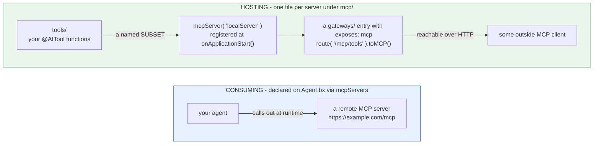

# mcp/

MCP (Model Context Protocol) works two directions - consuming remote servers, and hosting your own.



Nothing links the two: an agent consuming remote servers need not host one, and a hosted server is reachable only if a `gateways/` entry exposes it.

## Consuming remote servers

Declared directly on `Agent.bx` (not a file under `mcp/`), via `mcpServers`:

```javascript
// Agent.bx
function configure() {
	return {
		name       : "my-agent",
		model      : "openai/gpt-5",
		mcpServers : [
			"https://example.com/mcp",
			{ url : "https://other.com/mcp", name : "other" }
		]
	};
}
```

Each entry is either a bare URL string or a `{ url, name }` struct. These are reduced to a bare array of URLs and passed straight into the generated `aiAgent(mcpServers: [...])` call. **No network connection is ever attempted at build time** - reachability is a runtime concern; an unreachable server at build time is not a build error.

Subagents can declare their own `mcpServers` independently - each node in the agent tree gets its own resolved list.

## Hosting a local server

Each `mcp/*.bx` file is a local MCP server your project hosts, exposing a subset of your `tools/` as MCP tools:

```javascript
// mcp/localServer.bx
class {

	function configure() {
		return {
			description : "Internal tools MCP server",
			version     : "1.0.0",
			cors        : "*",             // optional - CORS origin(s) allowed to call this server; omit for none
			tools       : [ "sayHello" ]   // names of tools already declared under tools/
		};
	}

}
```

The entry's discovered name is its **filename** (`localServer.bx` → `localServer`), not any `name` field inside its own `configure()` struct - a project may still set one for documentation, but it's ignored for naming/registration purposes.

`cors` is optional and defaults to an empty string (no CORS header) when omitted - passed straight through as `mcpServer()`'s 4th positional argument.

At build time, the file is copied verbatim into the generated app's `mcp/` folder, and a registration statement is emitted into `Application.bx`'s `onApplicationStart()`:

```javascript
mcpServer( "localServer", "Internal tools MCP server", "1.0.0", "*" )
	.registerTool( aiToolRegistry().get( "sayHello" ) )
```

`mcpServer(name, ...)` is a global, name-keyed singleton getter in bx-ai - registering it once at startup is all that's needed; there's no WireBox mapping involved (unlike the agent-exposure singleton used by `toAi()`).

## Exposing a local server over HTTP

A local `mcp/*` server isn't reachable over HTTP on its own - pair it with a [`gateways/`](gateways.md) exposure entry naming it as the `target`:

```javascript
// gateways/expose-mcp.bx
class {
	function configure() {
		return {
			exposes : "mcp",
			path    : "/mcp/tools",
			target  : "localServer"
		};
	}
}
```

## Validation

- A remote `mcpServers` entry (struct form) missing `url` fails validation.
- A remote `mcpServers` entry that's neither a non-empty string nor a `{url, ...}` struct fails validation.
- A `gateways/` entry with `exposes: "mcp"` and a `target` that doesn't match any discovered `mcp/*` entry fails validation.