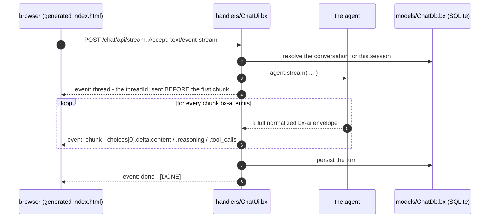

# The web chat UI

A `gateways/*.bx` entry with `exposes: "webui"` ships a complete browser chat client for the agent - a conversation sidebar, streaming with reasoning and tool calls, human-in-the-loop approvals, per-visitor theming, and a real SQLite store behind it.

It lives under [gateways/](gateways.md) because that is where exposures are declared, but it is a subsystem in its own right, which is why it has its own page.

```javascript
// gateways/chat.bx
class {
	function configure() {
		return {
			exposes     : "webui",
			path        : "/chat",
			apiKeyEnvVar: "CHAT_UI_API_KEY"   // optional - see Securing the API
		};
	}
}
```

That generates a static `<path>/index.html` (served directly - no route needed) plus a dedicated API under `<path>/api`, backed by a generated `handlers/ChatUi.bx` and `models/ChatDb.bx`.

The UI is dependency-free vanilla HTML/CSS/JS - no Bootstrap, AlpineJS or Vite build step - and is **pre-built and vendored inside BX Agents itself**: `bxAgents build` never runs `npm install`/`npm run build`, and a generated project never needs Node or npm installed at all. Everything the page needs is inlined into the single generated `index.html`.

That constraint is about the build, not about scope. The page is a full client: conversation sidebar, streaming with reasoning and tool calls, approvals, compaction, server-side theming. What is genuinely still missing is listed under [What is not here yet](#what-is-not-here-yet).

The page talks to its own generated `<path>/api` route via `POST <path>/api/stream` (`Accept: text/event-stream`), using `fetch()` + a manual `ReadableStream` reader - not the browser's `EventSource`, which can't `POST` or set custom headers, both needed here.

!!! warning
    **`toAi()` forwards each bx-ai chunk verbatim - it does not wrap it.** ColdBox's [AI Routing docs](https://coldbox.ortusbooks.com/the-basics/routing/routing-dsl/ai-routing) show the stream as `data: {"token":"..."}` lines, but its own source (`Router.cfc`, `toAi()`'s stream sub-route) does `emitter.send( chunk, "chunk" )` - so every frame carries the **full normalized bx-ai envelope**:

    ```
    event: chunk
    data: {"object":"chat.completion.chunk","choices":[{"delta":{"role":"assistant","content":"Ray","reasoning":"...","tool_calls":[...]}}]}

    event: done
    data: [DONE]
    ```

    There is no `token` key anywhere. A client written against that docs page - including this UI's own first version - reads `undefined` and renders nothing at all. Read `choices[0].delta.content` instead.

Because the whole envelope arrives, **reasoning and tool calls are already on the wire** with no extra endpoint needed: `delta.reasoning` (normalized across every provider by bx-ai) renders as a collapsed "Thinking" strip, and `delta.tool_calls` as collapsed per-call chips. Tool-call arguments stream as partial JSON fragments keyed by `index`, so the page accumulates per index rather than assuming any single chunk holds a complete call.

## What a streaming turn actually looks like



The `thread` event goes first because a response header cannot be read before the body starts arriving, and the page needs that `threadId` to be able to `POST /cancel` mid-turn.

## The generated API

A `webui` entry mounts twenty actions under `<path>/api`, served by a generated `handlers/ChatUi.bx`:

| Route | Purpose |
| --- | --- |
| `POST /invoke` | One synchronous turn |
| `POST /stream` | SSE turn (what the page uses) |
| `POST /batch` | Run an `inputs[]` array |
| `POST /cancel` | Stop an in-flight run - `{ threadId, reason? }` |
| `POST /steer` | Splice a message into a running turn - `{ threadId, input }` |
| `POST /clear` | Clear this visitor's conversation |
| `POST /compact` | Summarize this visitor's older messages, keep the recent ones - optional `{ keepRecent }` |
| `GET /history` | This visitor's stored messages, for rehydrating the transcript |
| `POST /resume` | Answer a pending approval and stream the continuation - `{ threadId, decision, editedData?, reason? }` |
| `GET /pending` | What a suspended run is waiting on - `?threadId=` |
| `GET /tools` | The agent's registered tools |
| `GET /health` | Liveness |
| `GET /info` | Agent name, model, memory/tool counts, capability flags |
| `GET /conversations` | This visitor's conversations, newest activity first |
| `POST /conversations/create` | Start one - optional `{ title }`, returns the minted `conversationId` |
| `POST /conversations/rename` | `{ conversationId, title }` |
| `POST /conversations/delete` | `{ conversationId }` - drops the row **and** the agent's messages for it |
| `GET /preferences` | This visitor's stored preferences, as `{ key: value }` |
| `POST /preferences/set` | `{ key, value }` |
| `POST /preferences/delete` | `{ key }` |

Every one is scoped by ColdBox's `getUserSessionIdentifier()` as the `userId`. The first three keep `toAi()`'s exact shape and wire format.

`threadId` is server-authoritative: taken from the request when supplied, minted otherwise, and always echoed back - as an `X-Thread-Id` response header on `/invoke` and `/batch`, and as a `thread` SSE event sent *before the first chunk* on `/stream` (a header can't be read before the body starts arriving). That's the same contract ColdBox 8.1's own `toAi()` adopted, so a client written against one works against the other.

!!! warning
    **Stop must go through `/cancel`, not just an aborted fetch.** Aborting the HTTP request only stops the browser listening - the server keeps running the turn, calling tools and spending tokens. The page therefore sends a `threadId` with every turn and posts it to `/cancel` before aborting, so `agent.cancelRun()` can signal the run at its next checkpoint.

`/clear` and `/compact` are both careful about scope. `/clear` goes through each memory's own `clear( userId, conversationId )` rather than `AiAgent.clearMemory()`, which takes no arguments and would wipe every visitor's history; `/compact` goes through `summarize( config, userId, conversationId )` for the same reason. Compaction replaces this conversation's older messages with an AI-written summary and keeps the most recent few, touching nothing outside the caller's `(userId, conversationId)` pair.

!!! info
    **`/compact` needs a summary model, and reports whether it has one.** `summarize()` is a silent no-op unless the memory has *both* `summaryProvider` and `summaryModel` configured, and also when the conversation is already at or under `keepRecent`. Neither is an error, so `/compact` returns `{ compacted, before, after }` and lets the caller see for itself, and `/info`'s `capabilities.compact` reports whether a summary model is configured at all - so a page can hide a button that would do nothing rather than look broken.

    Only `keepRecent` is taken from the request. `summarize()` also honours `model`/`provider` overrides, but accepting those here would let any visitor aim a summarization call at a provider and model of their choosing on your credentials - the memory's own config decides that instead.

```javascript
// Agent.bx - what makes /compact functional
memory: {
	type            : "cache",
	summaryProvider : "openai",
	summaryModel    : "gpt-4o-mini",
	summaryThreshold: 10
}
```

## Users and sign-in

By default the web UI has **no accounts and no gate** — it is open, and every visitor is anonymous. That is the zero-ceremony `bxAgents serve` experience, and it is **not** a deployment posture. Declaring `users` on a `webui` entry turns on a real sign-in gate backed by [cbauth](https://forgebox.io/view/cbauth) and the same SQLite store everything else uses.

### Without accounts, the UI is one shared workspace

There is no per-visitor identity, on purpose. Every visitor to an accountless web UI reads and writes the **same** conversations, preferences and agent memory — whoever can reach the page sees everything in it.

That is the point of running without accounts rather than an oversight: an open UI is a single shared tool (a laptop, a trusted internal box), not a multi-tenant service. Handing each browser its own slice would only fragment one workspace into per-browser copies nobody asked for, and any client-side id doing the fragmenting would be forgeable anyway.

!!! warning
    **An open UI has no privacy between visitors.** Anyone who can reach the URL sees every conversation in it, and can continue or delete any of them. If that is not what you want — anywhere the page is reachable by more than the people who should see the transcripts — declare `users`.

```javascript
// gateways/chatUi.bx
users : [
    { username: "ada",   passwordEnvVar: "ACME_ADA_PASSWORD", displayName: "Ada Lovelace" },
    { username: "grace", passwordHash: "pbkdf2$210000$...",   displayName: "Grace Hopper" }
]
```

### Passwords are never written in config

An account names the **environment variable** holding its password (`passwordEnvVar`), or carries an **already-hashed** value (`passwordHash`). A literal `password` key is a build error, not a warning — silently ignoring it would leave you believing you had set a password when you had only committed one.

A `passwordHash` is safe to commit precisely because it cannot be reversed. Generate one with the same hasher the app uses:

```
bxAgents hash-password --password="correct horse battery staple"
```

!!! danger
    **Hashed, not encrypted.** Encryption is reversible, and a stolen database file almost always travels with whatever could decrypt it — so a reversible scheme turns one file leak into every user's password, including any they reused elsewhere. Passwords here go through PBKDF2-HMAC-SHA256 with a per-user random salt and are never recoverable from the database. (BoxLang ships no bcrypt or argon2 BIF; PBKDF2 is the strongest primitive available without adding a dependency.)

    The iteration count is stored *inside* each hash (`pbkdf2$<iterations>$<salt>$<digest>`), so it can be raised later without invalidating anything already stored.

### What sign-in changes

Everything user-scoped re-keys to the real account. The generated `handlers/ChatUi.bx` resolves identity from cbauth directly, in one method (`resolveUserId()`), and agent memory, the conversation index, preferences and pending-run ownership all key off its return value.

It reads cbauth rather than ColdBox's `identifierProvider` setting deliberately: a closure declared in the `coldbox` config struct never reaches `configSettings` — verified in a real boot, in both the documented literal shape and as a later assignment — so anything leaning on that setting was silently getting a session id instead.

The practical difference: conversations and preferences follow the person across browsers and devices, and clearing cookies no longer creates a brand-new "user".

| | No `users` | With `users` |
|---|---|---|
| Identity | One shared workspace | The signed-in account |
| Conversations visible to | Everyone who can reach the UI | Only their owner |
| Follows the person across browsers/devices | n/a — nothing is per-person | Yes |
| Reachable without signing in | Everything | Only the login form |

### Lifecycle

Accounts are reconciled from config on every boot, in this order: the schema interceptor migrates, the seeder writes accounts, then the login gate starts enforcing.

- **Adding** a user to config creates them.
- **Changing** their password updates it. The seeder re-hashes only when the configured password no longer matches what is stored, so an unchanged password costs one verification rather than a fresh hash.
- **Removing** them from config **deactivates** the account rather than deleting it. Their conversations reference their id, so deleting the row would orphan that history instead of revoking access. They can no longer sign in; their data stays intact and returns if the account is restored.
- A `passwordEnvVar` whose variable is **unset** skips that account entirely and logs a warning to `webui-auth`. This fails closed on purpose — creating the account with an empty password would be far worse than it not existing.

### What this is not

This is a fixed roster of operator-provisioned accounts, not a user-management system. There is no self-registration, no password reset, no roles or permissions, and no per-user rate limiting or spend cap. If you need federated identity instead, edit `resolveUserId()` in the generated handler to return your own authenticated principal — the rest of the web UI neither knows nor cares where the id came from.

## Human-in-the-loop

When the agent pauses for approval, the stream emits a `middleware_stop` chunk that carries no detail. The page therefore asks `GET /pending?threadId=` what is being requested, renders it with **Approve** / **Reject**, and answers via `POST /resume` - which streams the *continuation of the same turn*, so the outcome lands in the conversation rather than starting a new one.

`decidedBy` is filled from the session server-side, never from the request body: who approved something is exactly the kind of claim a caller should not get to make about itself.

!!! warning
    **A suspended run belongs to the session that started it, and both routes enforce that.** Deriving `decidedBy` server-side only stops a caller lying about *who* decided - on its own it does nothing about *whose run* they are deciding on. Unlike every other action, `/pending` and `/resume` are addressed by `threadId` rather than by conversation, so without an ownership check a visitor holding someone else's `threadId` could read their pending tool calls and their arguments, and approve or reject on their behalf.

    The owner needs no extra bookkeeping: the handler stamps the session-derived `userId` into the run options, and the agent checkpoints those options alongside the suspension - so the saved state already knows who it belongs to. `/pending` answers as though nothing is pending when the caller is not the owner, so it cannot be used to probe whether a `threadId` exists at all; `/resume` refuses with a `403`.

## History and reload

The transcript lives in the DOM; the conversation lives in the agent's memory. Without rehydration a reload shows an empty screen while the agent still remembers everything - so the page would look blank and then answer follow-ups about messages the user cannot see. On load the page therefore calls `GET <path>/api/history` and replays the stored messages (markdown and all), falling back to the welcome message when the conversation is empty or the fetch fails.

**New** starts a fresh `conversationId`. It does not delete anything - the previous conversation stays on the server under its own id and appears in the sidebar, which is what the conversations table exists for.

## What the page does

The shipped page is a real chat client, not a demo shell. It reads `GET /info` **first** and shapes itself to what the server actually reports, so a control only appears where the capability exists.

| Area | Behaviour |
| --- | --- |
| **Conversation sidebar** | Lists this visitor's conversations newest-first, with message counts. Switch, rename (✎), delete (×), or start a new one. Titles render through `textContent` — a title is whatever the user typed first, so it is never parsed as markup |
| **Steer while streaming** | The composer stays live during a turn. **Send** becomes **Steer**, and the message splices into the run already in flight rather than starting a new one |
| **Stop** | Posts `/cancel` *before* aborting the fetch, so the server actually stops spending tokens, then keeps whatever already streamed |
| **Clear / Compact** | Clear empties this conversation; Compact appears only when a summary model is configured, and reports what it actually did (`Compacted 12 messages down to 3`, or `Nothing to compact yet`) |
| **Reasoning + tool calls** | Collapsed disclosures fed from `delta.reasoning` and `delta.tool_calls` on the same envelope |
| **Approvals** | A human-in-the-loop pause renders an Approve/Reject card from `GET /pending`, answered via `/resume`, which streams the continuation of the same turn |
| **Theme** | Stored server-side in `preferences`, so it follows the identity rather than the browser. `localStorage` keeps a local copy so the choice survives a failed request |
| **Model** | `/info`'s model name sits in the header, so it is always clear what answered |

**Recovery matters more than it sounds.** The last-opened conversation is remembered in `localStorage`, but the conversations themselves live on the server. If that id no longer exists — deleted in another tab, or a fresh store — the page falls back to the newest remaining conversation instead of rehydrating into an empty screen with no active row.

Narrow screens get a real layout rather than a squeezed one: under `40rem` the sidebar overlays the transcript instead of stealing its width, and `prefers-reduced-motion` is honoured.

## The SQLite store

Every `webui` project gets a SQLite database. It isn't optional and there's no flag to turn it off.

The reason is a real gap, not a preference: **bx-ai's `IAiMemory` has no enumeration API.** It's a per-`(userId, conversationId)` bucket — you can read, write and clear one, but nothing in it answers *"which conversations does this user have."* A conversation list, per-user preferences, and anything else relational needs real storage alongside the memory, not inside it.

| Piece | What it is |
| --- | --- |
| `bx-sqlite` | The JDBC driver. Without it a webui app still boots, but every query fails on an unknown driver |
| [`qb`](https://github.com/coldbox-modules/qb) | QueryBuilder for reads and writes, SchemaBuilder for the tables. No hand-written SQL anywhere |
| `models/ChatDb.bx` | Generated. Owns the schema and hands out query builders |
| `interceptors/WebUiSchema.bx` | Generated. Builds `ChatDb` at boot so migration runs then, not on whichever request touches the database first |

The datasource is registered in `Application.bx` and the grammar is pinned in `config/ColdBox.bx`:

```javascript
// Application.bx (generated)
this.datasources[ "bxagents" ] = {
	"driver"  : "sqlite",
	"database": expandPath( "./data/chat.db" )
}
this.datasource = "bxagents"   // NOT this.defaultDatasource - see below

// config/ColdBox.bx (generated)
qb : {
	defaultGrammar : "SQLiteGrammar@qb",
	defaultOptions : { datasource : "bxagents" }
}
```

Both are optional to override, per entry:

| Key | What it does | Default |
| --- | --- | --- |
| `database.datasource` | The ColdBox datasource name | `bxagents` |
| `database.path` | The database file, relative to the app root | `./data/chat.db` |

An absolute `database.path` **fails the build**: it's resolved with `expandPath()` inside the generated app, so an absolute path silently escapes the app directory and breaks a packaged `.bxa` deploy.

**Schema is versioned and forward-only.** `ChatDb.migrate()` records what it has applied in a `bxagents_schema_version` table and applies only what's newer, so booting against an existing store is a no-op. v1 creates `conversations` and `preferences`. Evolve it by adding a new `applyV<n>()` and bumping `SCHEMA_VERSION` — never by editing a migration that has shipped, because **SQLite cannot modify or drop a column** and qb's `SQLiteGrammar` throws `UnsupportedOperation` rather than pretending otherwise.

!!! warning
    **Two things here are counter-intuitive, and both were established the hard way against a real ColdBox boot rather than read off a docs page.**

    **The default-datasource setting is `this.datasource`, not `this.defaultDatasource`.** The registration key is plural (`this.datasources[ "name" ]`), so the singular default reads like it should match - and BoxLang accepts `this.defaultDatasource` silently and does nothing with it. The failure it produces names the very datasource you are trying to select (`No default datasource defined in the application or globally or in the query options. Registered datasources are: [bxagents]`), which reads as a broken selection mechanism rather than a misspelled setting.

    **Name the datasource on every qb builder; do not rely on `moduleSettings.qb.defaultOptions`.** qb's `ModuleConfig.cfc` maps `QueryBuilder@qb` with `.initArg( name = "defaultOptions", value = settings.defaultOptions )` in `onLoad()`, so the setting *looks* like it covers you. It did not arrive in a real boot - the datasource was registered and the builder still had empty options. `ChatDb.query()` therefore calls `.mergeDefaultOptions( { datasource : static.DATASOURCE } )` on every builder it hands out. `SchemaBuilder@qb` never receives `defaultOptions` at all (qb maps it with `grammar` only), so every schema call passes `options: { datasource: ... }` itself.

    The `moduleSettings.qb` block is still generated - it is right for any other qb use in the app - but the generated store does not depend on it.

    If you extend `ChatDb`, name the datasource on whatever you add.

    One more, unchanged: the datasource must be a **named** datasource, never an inline struct - qb's own `appendSqlComments()` types that argument as `string`, so a struct throws before any SQL runs.

The grammar is the only SQLite-specific piece. Everything else goes through qb, so pointing this at Postgres or MySQL later is a grammar and datasource change rather than a rewrite.

## Conversations and preferences

These are what the SQLite store exists for, and both are scoped by the same server-derived `userId` as everything else.

**Conversations.** Every turn through `/invoke`, `/stream` or `/batch` records itself against the index: the row is created on first use, `updatedAt` moves, and the first user message becomes the title (collapsed to one line, truncated to 60 characters) unless one is already set — so a rename is never silently undone by the next turn. `messageCount` is a **display counter**, bumped by two per turn; a turn that dies midway can leave it one high, and `/clear` resets it. The agent's own memory remains the authority on what was actually said.

`/conversations/delete` removes the index row *and* clears the agent's messages for that conversation. Dropping only the row would leave the conversation invisible while still sitting in the model's context the moment anyone reused the id.

!!! warning
    **Why `touchConversation()` is not a qb upsert.** An upsert targets the primary key alone, so a caller who guessed another visitor's `conversationId` would have their own `userId` written onto that row and take the conversation over. The store reads first and refuses when the row belongs to someone else. `setPreference()` *does* upsert, and safely — its target is the `(userId, prefKey)` composite key, so the caller's own identity is part of what it matches on.

**Preferences.** Server-side rather than `localStorage`, so they follow the identity instead of the browser. Point `identifierProvider` at a real authenticated principal and a visitor's preferences follow them across devices with no change to the generated code.

## Branding and theming

Every key below is optional - the entry works with just `exposes` and `path`.

| Key | What it does |
| --- | --- |
| `title` | Browser title and header heading |
| `subtitle` | Small line under the heading |
| `icon` | An emoji (rendered into an inline-SVG favicon **and** the header) or an image URL/path (`/logo.svg`, `https://…`, `data:image/…`) |
| `welcome` | Empty-state message shown before the first turn |
| `placeholder` | Composer input placeholder |
| `footer` | Small note under the composer - disclaimers, links |
| `showReasoning` | Show the "Thinking" strip. Default `true` |
| `showToolCalls` | Show tool-call chips. Default `true` |
| `theme` | Design tokens - see below |
| `themeFile` | Path to a CSS override, relative to the project root. Default `resources/webui/theme.css` |

`theme` maps directly onto the page's CSS custom properties: `accent`, `accentFg`, `bg`, `fg`, `muted`, `border`, `surface`, `inputBg`, `bubbleUser`, `bubbleUserFg`, `bubbleAssistant`, `bubbleAssistantFg`, `bubbleError`, `reasoningFg`, `reasoningBg`, `toolFg`, `toolBg`, `radius`, `radiusSm`, `font`, `fontMono`, `fontSize`, `maxWidth`. A nested `theme.dark` block overrides any of the same tokens for dark mode. An unknown token **fails the build** rather than being silently ignored, so a typo surfaces immediately instead of leaving you wondering why your brand color never showed up.

```javascript
// gateways/chat.bx
theme: {
	accent : "0f766e",
	radius : "10px",
	font   : "Inter, system-ui, sans-serif",
	dark   : { accent : "rgb(45, 212, 191)" }
}
```

!!! info
    **Write hex colors bare, with no leading hash.** BoxLang begins string interpolation at `#` in **both** single- and double-quoted strings, so a literal hex color in a `.bx` config is a parse error unless the hash is doubled - a footgun nobody remembers. The generator adds it back for you, so `"0f766e"` just works. `rgb()`, `hsl()` and named colors need nothing special either way.

For anything the tokens don't cover - custom fonts, layout, per-element rules - drop a `resources/webui/theme.css` into the project. It's inlined **last** into the page's `<style>`, so it beats both the shipped defaults and the `theme` tokens; and being a real `.css` file, ordinary `#rrggbb` hex works there normally. (A literal `</style` in that file fails the build, since it would terminate the page's style block early.)

!!! warning
    **`apiKeyEnvVar` is a simple, toggleable gate - not a full login system.** Left unset, `<path>/api/*` is wide open (fine for local dev, not for a public deployment). Set it, and a generated `preProcess` interceptor (`interceptors/WebUiAuthGate.bx`) requires every request under `<path>/api/*` to carry a matching `X-API-Key` header, compared via `java.security.MessageDigest.isEqual()` - the same constant-time-compare discipline every webhook gateway's own signature check already uses. **The static shell itself (`<path>/index.html`) is deliberately NOT gated** - only `<path>/api/*` is - because a browser's plain page navigation can't send a custom header, so gating the shell would make the very page that prompts you for the key unreachable without it already. The page's own JS asks for the key (a "Key" button, stored in `localStorage`) and sends it on every API call it makes from then on.


## Conversation identity: the session IS the user identifier

**Every memory an agent holds is keyed by `(userId, conversationId)`** - and an agent can hold several at once (`AiAgent`'s `memories` is an array; `loadMemoryMessages()` iterates all of them with the same pair). `AiAgent.run()`/`.stream()` fall back to `""` for both when nothing supplies them, so with no server-side identity **every visitor lands in one shared bucket**, regardless of which memory types are configured.

The fix is identity, not memory type. A project with a `webui` exposure therefore gets:

1. **Session management on** in the generated `Application.bx` - `this.sessionManagement = true`, `this.setClientCookies = true`, a 60-minute `sessionTimeout`. Cookies are load-bearing: no cookie, no session id.
2. **Its own `handlers/ChatUi.bx`**, which passes ColdBox's `getUserSessionIdentifier()` as the agent's `userId` on **all three runner shapes** - `invoke`, `stream` and `batch`.

```javascript
// handlers/ChatUi.bx (generated)
private string function resolveUserId() {
	return controller.getUserSessionIdentifier()
}
```

Delegating to ColdBox rather than reading `session.sessionId` directly buys three things: the id is prefixed per application, it falls back through URLToken/CFID if a session is somehow unavailable, and - the one that matters most - it honours the **`identifierProvider`** config setting. Point that at your authenticated principal and every memory re-keys to the real user with no change to the generated handler.

Because the identity is server-issued, scoping holds no matter which memories the project configures - one or many, `window`, `cache`, `jdbc`, vector, any mix.

!!! info
    **Why not `toAi()` for the webui?** ColdBox 8.1's `toAi()` now derives conversational context itself, and its fallback is exactly the same call this handler makes: `len( body.userId ) ? body.userId : controller.getUserSessionIdentifier()`. The difference is precedence - `toAi()` lets a **caller-supplied `userId` win**, which is right for a trusted server-to-server caller but wrong for a browser sitting behind one shared API key, where anyone could name themselves anyone and read another visitor's memory. The generated handler derives the identity server-side *only*, and never looks at `body.userId`. It keeps `toAi()`'s exact route shape (`/invoke`, `/stream`, `/batch`, `/info`), its SSE wire format, and its `X-Thread-Id`/`thread`-event echo, so it stays a drop-in. The other exposure kinds (`exposes: "agent"`) still use `toAi()` unchanged - server-to-server is the case its precedence is built for.

`conversationId` still comes from the client, and that's deliberate: it distinguishes several conversations belonging to the *same* visitor - it's what the **New** button rotates. It is not the isolation boundary; the session-derived `userId` is.

No memory type is forced. Choose one (or several) per agent with a `memory` key on `Agent.bx`, same shape as `checkpointer`:

```javascript
// Agent.bx
memory: { type: "cache", maxMessages: 50 }
```

A project with no `webui` keeps sessions off and bx-ai's own memory default - an API/gateway-only app has no browser to track, and a session there is overhead plus a cookie nobody asked for.

## Reply rendering

Assistant replies render through a deliberately small markdown subset - fenced and inline code, bold/italic, links, bullet and numbered lists, headings. It is applied **escape-first**: the model's text is HTML-escaped before a single tag is introduced, so no model output can become live markup, and link hrefs are allowlisted to `http(s)`/`mailto` so a `javascript:` URL is never turned into an anchor at all.

!!! info
    The composer is a `textarea` - **Enter** sends, **Shift+Enter** adds a newline, and it grows to about six lines before scrolling. A turn in flight can be halted with **Stop** (an `AbortController`), which keeps whatever already streamed rather than discarding it. The transcript only auto-scrolls when you're already at the bottom, so scrolling up to re-read something mid-stream doesn't yank you back down.

## What is not here yet

The page is complete against its own API - every route it needs exists and is exercised. These are the gaps:

| Missing | Note |
| --- | --- |
| Attachments / image input | The composer is text-only. bx-ai itself handles images, so this is a UI gap, not a capability one |
| Retry / regenerate | A failed turn has to be re-sent by hand |
| Edit and resend | No editing a message already sent |
| Token / cost display | Nothing surfaces usage, though the provider returns it |

See [Known Limitations](../known-limitations.md) for what was and was not verified against a real ColdBox boot, including the parts of this page that are covered only by generator-level assertions rather than by driving a browser.