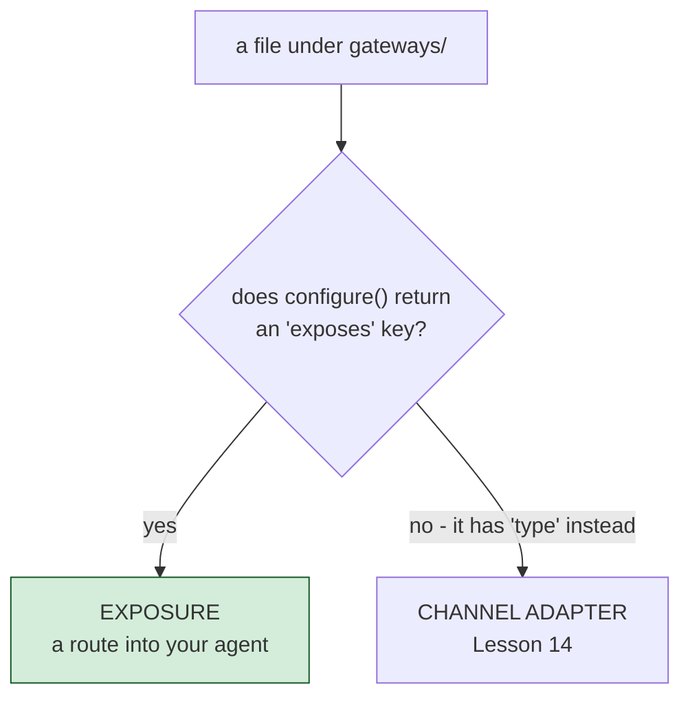

# Exposing Your Agent over HTTP and MCP

`gateways/*.bx` files cover two distinct, unrelated things - which kind an entry is
depends entirely on whether its `configure()` struct has an `exposes` key. This lesson
covers **exposure** (`exposes: "agent" | "mcp" | "webui"`); the next lesson covers the
other kind, channel adapters that connect to chat platforms.



## Exposing the agent itself

```javascript
// gateways/expose.bx
class {
	function configure() {
		return {
			exposes : "agent",
			path    : "/api/chat"
		};
	}
}
```

Generates, in `config/Router.bx`: `route( "/api/chat" ).toAi( "GeneratedAgent" )` -
which auto-registers **four** sub-routes: `POST /api/chat/invoke`,
`POST /api/chat/stream` (SSE), `POST /api/chat/batch`, `GET /api/chat/info`. The bare
`/api/chat` path itself is not routable.

## Exposing a local MCP server

```javascript
class {
	function configure() {
		return {
			exposes : "mcp",
			path    : "/mcp/tools",
			target  : "local-server"   // must match an mcp/*.bx entry's declared name
		};
	}
}
```

You'll write that `mcp/*.bx` entry in [Lesson 17](17-hosting-mcp-servers.md).

## Exposing the web chat UI

```javascript
// gateways/chat.bx
class {
	function configure() {
		return {
			exposes : "webui",
			path    : "/chat"
		};
	}
}
```

This one is big enough to earn its own lesson - see [Lesson 15](15-the-generated-web-chat-ui.md).

## Validation

`exposes` must be `agent`, `mcp`, or `webui`; `path` is required and must be unique
across every exposure entry; an `mcp` exposure's `target` must match a real `mcp/*`
entry's declared name.

## Try it

```bash
bxAgents build
bxAgents serve --port=8080
curl -X POST http://localhost:8080/api/chat/invoke \
  -H "Content-Type: application/json" \
  -d '{"message":"Hi there"}'
```

(Or skip `serve` entirely and reach for `bxAgents invoke --message="Hi there" --server`
from [Lesson 8](08-talking-to-your-agent.md), which exercises this exact route without
you having to manage the server process yourself.)

Full reference: [gateways/](../conventions/gateways.md).

Next: [Lesson 14 - Connecting Chat Platforms](14-connecting-chat-platforms.md)
