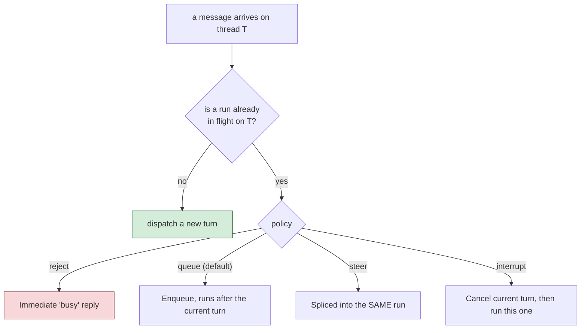

# Connecting Chat Platforms

The other kind of `gateways/*` entry - one with a `type` key instead of `exposes` -
registers a bx-ai `IGateway`, a channel adapter for external delivery or
human-in-the-loop approval. This is a real "chat bot" connection, distinct from the
REST exposure you built in [Lesson 13](13-exposing-http-and-mcp.md).

## Two request-driven types: `mock` and `cli`

```javascript
// gateways/slack.bx  (http type, shown for shape - see below)
```

`mock` is test-only. `cli` is bx-ai's own built-in human-in-the-loop **approval**
channel - a blocking stdin/stdout prompt, and what `HumanInTheLoopMiddleware` attaches
by default when no gateway is specified.

## `http` - your own webhook endpoint

```javascript
// gateways/slack.bx
class {
	function configure() {
		return {
			type         : "http",
			secretEnvVar : "SLACK_WEBHOOK_SECRET"
		};
	}
}
```

`secretEnvVar` names an environment variable holding the signing secret - **never the
secret value itself**. It's resolved live at server startup, so it's never present in
generated source or a packaged `.bxa` either. This gets real routes:
`POST /gateways/:gatewayName/events`, `GET /interactions/:requestID`,
`POST /interactions/:requestID/decisions`.

## Nine push-style platforms

Telegram, Slack, Discord, Email, WhatsApp Business Cloud, Microsoft Teams, Twilio SMS,
GitHub, and Signal each hold their own connection (long-poll, websocket, webhook, or
SSE) and push inbound messages to your agent as they arrive:

```javascript
// gateways/telegramChannel.bx
class {
	function configure() {
		return {
			type          : "telegram",
			botTokenEnvVar: "TELEGRAM_BOT_TOKEN"
		};
	}
}
```

Every platform follows the same `secrets stay external` rule - every `*EnvVar` key
names an environment variable, resolved live, never a literal in generated code.

## One GatewaySession ties them together

Any project with at least one push-style gateway gets a generated
`interceptors/GatewaySessionBootstrap.bx`, building a single bx-ai `GatewaySession`
bundling every push-style gateway, bound to your project's root agent:



Control the policy from `Agent.bx`:

```javascript
function configure() {
	return {
		gatewaySession: { policy: "queue", maxQueueDepth: 50 }   // both optional, these are the defaults
	};
}
```

!!! warning
    v1 limitation: exactly one `GatewaySession`, always bound to the project's root
    agent - a project with subagents can't yet route different gateways to different
    subagents.

## Try it

If you have a disposable Telegram bot token, add a `gateways/telegramChannel.bx` entry,
export `TELEGRAM_BOT_TOKEN`, and `bxAgents serve` - message your bot and watch it
reply. No token handy? Read through a couple of the platform sections in the full
reference below; the shape is consistent across all nine.

Full reference: [gateways/](../conventions/gateways.md).

Next: [Lesson 15 - The Generated Web Chat UI](15-the-generated-web-chat-ui.md)
