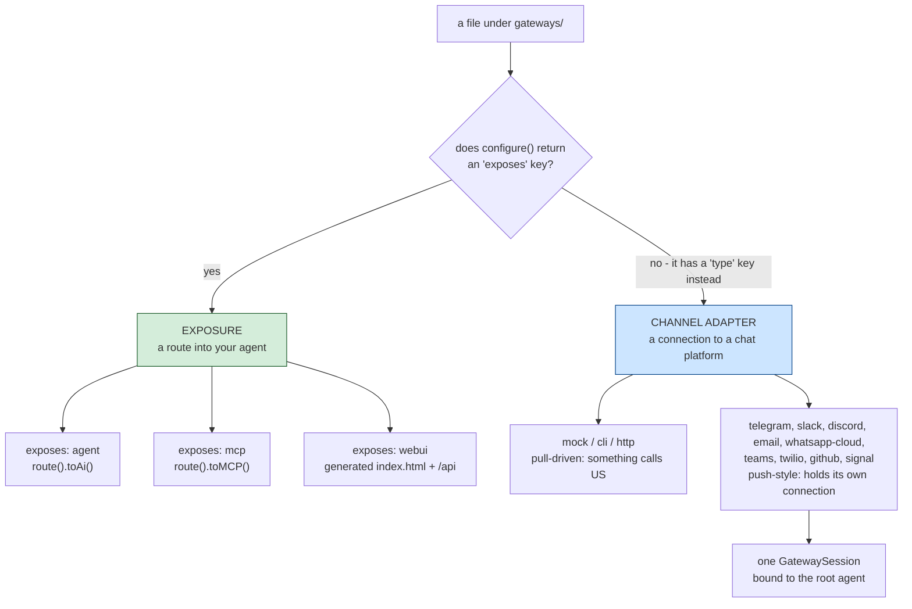
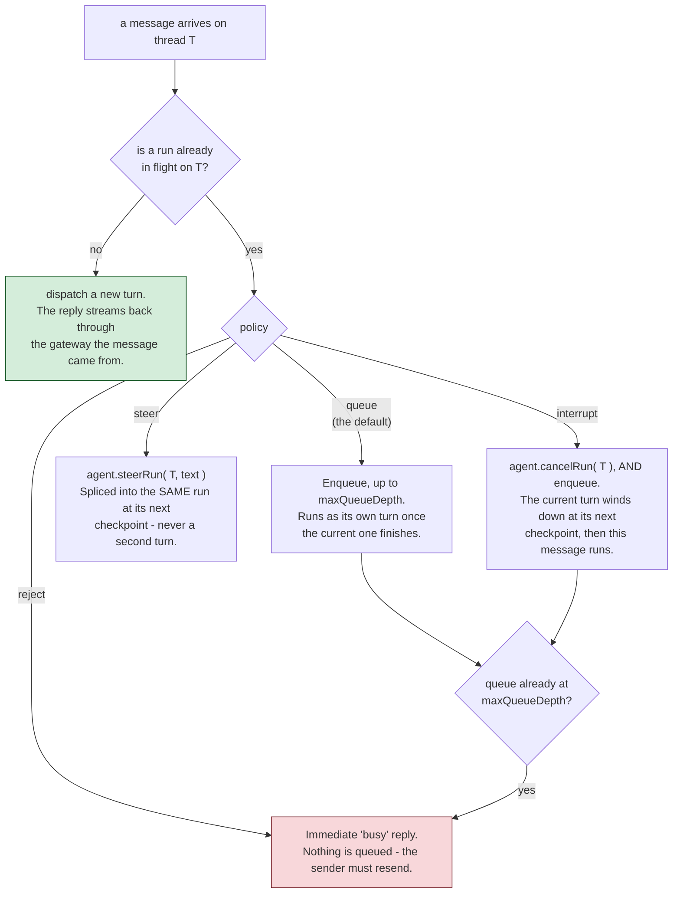

# gateways/

`gateways/*.bx`/`.json`-Dateien unter diesem einen Ordner decken **zwei unterschiedliche, unabhängige Dinge** ab - welcher Art ein Eintrag ist, hängt allein davon ab, ob seine `configure()`-Struktur einen `exposes`-Schlüssel hat.

!!! warning
    Diese nicht miteinander verwechseln - ein per HTTP exponierter Agent (`exposes: "agent"`) ist eine REST-API für den Agenten; ein Channel-Adapter-Gateway (`type: "http"`) ist ein Webhook-Endpunkt für eine Chat-Plattform oder einen Human-in-the-Loop-Genehmigungsablauf. Sie erzeugen völlig unterschiedliche Routen.



## 1. HTTP-/MCP-/Web-UI-Exposure (`exposes: "agent" | "mcp" | "webui"`)

Exponiert den Agenten, oder einen lokalen MCP-Server, über HTTP mit ColdBox 8.1s nativer AI-Routing-DSL - oder eine fertige Browser-Chat-UI, separat dokumentiert in [Die Web-Chat-UI](web-ui.md).

**Den Agenten exponieren:**

```javascript
// gateways/expose.bx
class {

	function configure() {
		return {
			exposes : "agent",
			path    : "/api/chat"
		};
	}

}
```

Erzeugt, in `config/Router.bx`:

```javascript
route( "/api/chat" ).toAi( "GeneratedAgent" )
```

was automatisch **vier** Unterrouten registriert: `POST /api/chat/invoke`, `POST /api/chat/stream` (SSE), `POST /api/chat/batch`, `GET /api/chat/info`. Der bloße Pfad `/api/chat` selbst ist nicht routbar.

**Einen lokalen MCP-Server exponieren** (siehe [mcp/](mcp.md)):

```javascript
class {
	function configure() {
		return {
			exposes : "mcp",
			path    : "/mcp/tools",
			target  : "local-server"   // must match an mcp/*.bx entry's declared name
		};
	}
}
```

Erzeugt `route( "/mcp/tools" ).toMCP( "local-server" )`.

**Die v1-Web-Chat-UI exponieren:**

```javascript
// gateways/chat.bx
class {
	function configure() {
		return {
			exposes     : "webui",
			path        : "/chat",
			apiKeyEnvVar: "CHAT_UI_API_KEY"   // optional - see below
		};
	}
}
```

Erzeugt eine echte statische `<path>/index.html`-Datei (direkt bedient - keine Route dafür nötig) plus eine eigene, dedizierte API unter einem festen `<path>/api`-Präfix, sodass sie nie mit den Dateien der Hülle selbst kollidiert. Diese API ist ein generiertes `handlers/ChatUi.bx` statt `toAi()`, und der Eintrag bringt außerdem einen generierten SQLite-Store mit.

Die Web-UI ist eher ein Subsystem als ein einzelner Exposure-Schalter - die Routenliste, der Store, Konversationen und Präferenzen, Branding und Theming, und warum sie `toAi()` nicht nutzt, stehen alle auf ihrer eigenen Seite: **[Die Web-Chat-UI](web-ui.md)**.

**Validierung:** `exposes` muss `agent`, `mcp` oder `webui` sein; `path` ist erforderlich und muss über jeden Exposure-Eintrag hinweg eindeutig sein; das `target` einer `mcp`-Exposure ist erforderlich und muss zum deklarierten Namen eines echten `mcp/*`-Eintrags passen; `apiKeyEnvVar` bei `webui` ist vollständig optional, ohne Pflichtfeld-Prüfung (siehe unten).

## 2. Channel-Adapter-Gateways (`type: "mock" | "cli" | "http"`)

Registriert namentlich ein bx-ai-`IGateway` (einen Channel-Adapter für externe Auslieferung / Human-in-the-Loop-Genehmigung) - zu unterscheiden vom Exponieren der eigenen REST-API des Agenten.

```javascript
// gateways/slack.bx
class {
	function configure() {
		return {
			type         : "http",
			secretEnvVar : "SLACK_WEBHOOK_SECRET"
		};
	}
}
```

`secretEnvVar` benennt eine Umgebungsvariable, die das Signing-Secret enthält - **nie den Secret-Wert selbst**. Erzeugt, in `Application.bx`s `onApplicationStart()`:

```javascript
aiGatewayRegistry().register( aiGateway( "http", { secret : getSystemSetting( "SLACK_WEBHOOK_SECRET", "" ) } ) )
```

Das Secret wird live beim Serverstart aufgelöst, passend zur "Secrets bleiben extern"-Regel dieses Projekts überall sonst (siehe [Deployment & Secrets](../deployment-and-secrets.md)) - es wird nie als Literal in generierten Quellcode eingebettet, ist also auch nie in einer paketierten `.bxa` vorhanden. Ist die Umgebungsvariable ungesetzt, behandelt bx-ais eigenes `HttpGateway` ein leeres Secret als "keine Signierung konfiguriert" und lehnt Requests entsprechend ab, statt beim Start abzustürzen.

**Validierung:** `type` muss `mock`, `cli` oder `http` sein; ein Eintrag mit `type: "http"` erfordert ein `secretEnvVar`; der eigene Datei-/Basisname des Eintrags muss über jeden Channel-Adapter-Eintrag hinweg eindeutig sein. `mock` ist nur für Tests; `cli` ist bx-ais eigener eingebauter Human-in-the-Loop-**Genehmigungs**-Kanal (ein blockierender A/R/Q-Prompt über stdin/stdout) - er ist es, was `HumanInTheLoopMiddleware` standardmäßig anhängt, wenn kein Gateway angegeben ist, und hat nichts mit BxAgents' eigenem `chat`-Verb zu tun (das die Gateway-Registry überhaupt nie berührt).

**Einträge vom Typ `http` erhalten zusätzlich echte HTTP-Verdrahtung**: eine generierte `handlers/Gateway.bx`-Action, die direkt in bx-ais eigenes `GatewayRequestProcessor::processHttp()` durchreicht, sowie drei Routen in `config/Router.bx`:

```javascript
post( "/gateways/:gatewayName/events" ).toHandler( "Gateway.process" )
get( "/interactions/:requestID" ).toHandler( "Gateway.process" )
post( "/interactions/:requestID/decisions" ).toHandler( "Gateway.process" )
```

!!! info
    ColdBox hat keinen eingebauten `toAiGateway()`-DSL-Terminator für diese Oberfläche (nur `toAi()` und `toMCP()` existieren nativ) - diese Verdrahtung ist BxAgents' eigener generierter Code, in derselben Form, die ein zukünftiger Core-Terminator erzeugen würde. Siehe den Vorschlag [`toAiGateway()` für ColdBox Core](../proposals/toAiGateway-coldbox-core.md).

## 3. Push-style gateways (`type: "telegram"` / `"slack"` / `"discord"` / `"email"` / `"whatsapp-cloud"` / `"teams"` / `"twilio"` / `"github"` / `"signal"`, and friends)

Eine andere Art von Channel-Adapter als `mock`/`cli`/`http` oben: Statt von einem eingehenden HTTP-Request getrieben zu werden, hält ein Push-Style-Gateway seine eigene Verbindung zur Plattform und pusht eingehende Nachrichten an den Agenten, sobald sie eintreffen - das eher "echter Chat-Bot"-artige Erlebnis. Vier Transportformen existieren heute:

- **Long-Poll** (Telegram, E-Mail): ein geplanter Task fragt die Plattform periodisch "irgendwas Neues?" (Telegrams `getUpdates`, E-Mails IMAP-Poll).
- **Persistenter Websocket** (Slack über Socket Mode, Discord über seine Gateway-API): das Gateway hält eine lebende, langlaufende Verbindung, über die die Plattform Events in Echtzeit herunterpusht.
- **Webhook, pull-getrieben** (WhatsApp Business Cloud API, Microsoft Teams, Twilio SMS, GitHub): die Plattform ruft **uns** über einen öffentlichen HTTP-Endpunkt an, statt dass dieses Gateway eine eigene ausgehende Verbindung hält - kein Scheduler-Task oder Socket zu verwalten. Siehe deren eigene Unterabschnitte unten.
- **Server-Sent Events (SSE)** (Signal, gegen einen lokal laufenden `signal-cli`-Daemon): eine langlebige, unidirektionale Streaming-HTTP-Verbindung, die das Gateway offen hält und dabei Events liest, während sie über denselben Response-Body gepusht werden. Siehe den eigenen Unterabschnitt unten.

```javascript
// gateways/telegramChannel.bx
class {
	function configure() {
		return {
			type          : "telegram",
			botTokenEnvVar: "TELEGRAM_BOT_TOKEN"
		};
	}
}
```

```javascript
// gateways/slackChannel.bx
class {
	function configure() {
		return {
			type          : "slack",
			botTokenEnvVar: "SLACK_BOT_TOKEN",   // xoxb-... - chat.postMessage/chat.update
			appTokenEnvVar: "SLACK_APP_TOKEN"    // xapp-... - apps.connections.open (Socket Mode)
		};
	}
}
```

```javascript
// gateways/discordChannel.bx
class {
	function configure() {
		return {
			type          : "discord",
			botTokenEnvVar: "DISCORD_BOT_TOKEN"   // Authorization: Bot <token> on every REST call and inside Identify
			// intents: 37377   // optional override - defaults to GUILDS+GUILD_MESSAGES+DIRECT_MESSAGES+MESSAGE_CONTENT
		};
	}
}
```

```javascript
// gateways/emailChannel.bx
class {
	function configure() {
		return {
			type              : "email",
			imapHostEnvVar    : "IMAP_HOST",
			imapUsernameEnvVar: "IMAP_USERNAME",
			imapPasswordEnvVar: "IMAP_PASSWORD",
			fromAddressEnvVar : "EMAIL_FROM_ADDRESS"
			// imapPort: 993   // optional override - defaults to 993 (IMAPS)
			// pollIntervalSeconds: 60   // optional override - defaults to 60
		};
	}
}
```

```javascript
// gateways/whatsappCloud.bx
class {
	function configure() {
		return {
			type               : "whatsapp-cloud",
			accessTokenEnvVar  : "WHATSAPP_ACCESS_TOKEN",     // Graph API access token
			phoneNumberIdEnvVar: "WHATSAPP_PHONE_NUMBER_ID",  // the WhatsApp Business phone number ID sends go through
			appSecretEnvVar    : "WHATSAPP_APP_SECRET",       // HMAC key verifying X-Hub-Signature-256 on inbound webhooks
			verifyTokenEnvVar  : "WHATSAPP_VERIFY_TOKEN"      // shared secret Meta's GET verify handshake must echo back
			// apiVersion: "v21.0"   // optional override - defaults to "v21.0"
		};
	}
}
```

```javascript
// gateways/teamsChannel.bx
class {
	function configure() {
		return {
			type                : "teams",
			appIdEnvVar         : "TEAMS_APP_ID",         // the bot's own Microsoft App ID (also the inbound JWT's required aud claim)
			appPasswordEnvVar   : "TEAMS_APP_PASSWORD"    // OAuth2 client-credentials secret
			// tenantId: "..."   // optional override for single-tenant apps - defaults to "botframework.com" (multi-tenant)
		};
	}
}
```

```javascript
// gateways/twilioChannel.bx
class {
	function configure() {
		return {
			type            : "twilio",
			accountSidEnvVar: "TWILIO_ACCOUNT_SID",
			authTokenEnvVar : "TWILIO_AUTH_TOKEN",   // also the X-Twilio-Signature HMAC key
			fromEnvVar      : "TWILIO_FROM_NUMBER"   // the Twilio phone number outbound sends go through, E.164
			// messagingServiceSid: "MG..."   // optional - if set, used instead of `from` on outbound sends
			// publicUrl: "https://your-real-public-host/webhooks/twilio"   // optional override for reverse-proxy/tunnel deployments - see the Twilio subsection below
		};
	}
}
```

```javascript
// gateways/githubChannel.bx
class {
	function configure() {
		return {
			type               : "github",
			tokenEnvVar        : "GITHUB_TOKEN",           // a personal access token (repo/issues+PR read+write scope)
			webhookSecretEnvVar: "GITHUB_WEBHOOK_SECRET",  // HMAC key verifying X-Hub-Signature-256 on inbound webhooks
			botNameEnvVar      : "GITHUB_BOT_NAME"         // the bot's own GitHub login - matched as "@botName" in comments
			// apiBaseUrl: "https://api.github.com"   // optional override - defaults to "https://api.github.com"
		};
	}
}
```

```javascript
// gateways/signalChannel.bx
class {
	function configure() {
		return {
			type         : "signal",
			accountEnvVar: "MY_SIGNAL_ACCOUNT"   // the signal-cli-registered phone number this gateway sends/receives as, E.164
			// httpUrl: "http://127.0.0.1:8080"   // optional override - defaults to "http://127.0.0.1:8080", where signal-cli's own daemon HTTP API is expected to be listening
		};
	}
}
```

Dieselbe "Secrets bleiben extern"-Regel wie bei `http`s `secretEnvVar`: Jeder `*EnvVar`-Schlüssel benennt eine Umgebungsvariable, live über `getSystemSetting()` beim Start aufgelöst, nie als Literal eingebettet - `email`s `imapHost`/`fromAddress` sind keine kryptografischen Secrets, aber dieselbe umgebungsvariablen-getriebene Konvention wird trotzdem für jeden einzelnen ihrer Konfigurationswerte verwendet, da sie alle pro Deployment variieren. Anders als bei den Core-Typen lebt die Klasse eines Push-Style-Gateways innerhalb von BxAgents selbst (`models/gateways/*.bx`, nicht bx-ai), sodass ihre Registrierung als bloßer Klassenpfad statt als Kurzname gerendert wird:

```javascript
aiGatewayRegistry().register( aiGateway( "bxModules.bxagents.models.gateways.TelegramGateway", { "botToken" : getSystemSetting( "TELEGRAM_BOT_TOKEN", "" ) } ) )
aiGatewayRegistry().register( aiGateway( "bxModules.bxagents.models.gateways.SlackGateway", { "appToken" : getSystemSetting( "SLACK_APP_TOKEN", "" ), "botToken" : getSystemSetting( "SLACK_BOT_TOKEN", "" ) } ) )
aiGatewayRegistry().register( aiGateway( "bxModules.bxagents.models.gateways.DiscordGateway", { "botToken" : getSystemSetting( "DISCORD_BOT_TOKEN", "" ) } ) )
aiGatewayRegistry().register( aiGateway( "bxModules.bxagents.models.gateways.EmailGateway", { "imapHost" : getSystemSetting( "IMAP_HOST", "" ), "imapUsername" : getSystemSetting( "IMAP_USERNAME", "" ), "imapPassword" : getSystemSetting( "IMAP_PASSWORD", "" ), "fromAddress" : getSystemSetting( "EMAIL_FROM_ADDRESS", "" ) } ) )
aiGatewayRegistry().register( aiGateway( "bxModules.bxagents.models.gateways.whatsapp.WhatsAppCloudGateway", { "accessToken" : getSystemSetting( "WHATSAPP_ACCESS_TOKEN", "" ), "phoneNumberId" : getSystemSetting( "WHATSAPP_PHONE_NUMBER_ID", "" ), "appSecret" : getSystemSetting( "WHATSAPP_APP_SECRET", "" ), "verifyToken" : getSystemSetting( "WHATSAPP_VERIFY_TOKEN", "" ) } ) )
aiGatewayRegistry().register( aiGateway( "bxModules.bxagents.models.gateways.TeamsGateway", { "appId" : getSystemSetting( "TEAMS_APP_ID", "" ), "appPassword" : getSystemSetting( "TEAMS_APP_PASSWORD", "" ) } ) )
aiGatewayRegistry().register( aiGateway( "bxModules.bxagents.models.gateways.TwilioGateway", { "accountSid" : getSystemSetting( "TWILIO_ACCOUNT_SID", "" ), "authToken" : getSystemSetting( "TWILIO_AUTH_TOKEN", "" ), "from" : getSystemSetting( "TWILIO_FROM_NUMBER", "" ) } ) )
aiGatewayRegistry().register( aiGateway( "bxModules.bxagents.models.gateways.GitHubGateway", { "token" : getSystemSetting( "GITHUB_TOKEN", "" ), "webhookSecret" : getSystemSetting( "GITHUB_WEBHOOK_SECRET", "" ), "botName" : getSystemSetting( "GITHUB_BOT_NAME", "" ) } ) )
aiGatewayRegistry().register( aiGateway( "bxModules.bxagents.models.gateways.SignalGateway", { "account" : getSystemSetting( "MY_SIGNAL_ACCOUNT", "" ) } ) )
```

**Validierung:** `type: "telegram"` erfordert `botTokenEnvVar`; `type: "slack"` erfordert sowohl `botTokenEnvVar` als auch `appTokenEnvVar`; `type: "discord"` erfordert `botTokenEnvVar`; `type: "email"` erfordert `imapHostEnvVar`, `imapUsernameEnvVar`, `imapPasswordEnvVar` und `fromAddressEnvVar`; `type: "whatsapp-cloud"` erfordert `accessTokenEnvVar`, `phoneNumberIdEnvVar`, `appSecretEnvVar` und `verifyTokenEnvVar`; `type: "teams"` erfordert `appIdEnvVar` und `appPasswordEnvVar`; `type: "twilio"` erfordert `accountSidEnvVar`, `authTokenEnvVar` und `fromEnvVar`; `type: "github"` erfordert `tokenEnvVar`, `webhookSecretEnvVar` und `botNameEnvVar`; `type: "signal"` erfordert `accountEnvVar` - alle auf dieselbe Weise geprüft wie `http`s `secretEnvVar`.

!!! info
    Slack v1 ist **nur Socket Mode** - für Slack wird kein öffentlicher Webhook-Endpunkt benötigt oder generiert (anders als `http`, das echte Routen erhält - siehe §2 oben). Die von Slack ebenfalls unterstützte Events-API-/HTTP-Webhook-Alternative ist hier nicht gebaut. Discord v1 ist ebenso die echte **Gateway-API** (ein persistenter Websocket), statt Discords alternativem HTTP-Interactions-Endpoint-URL-Webhook-Modus - eine Ed25519-Signaturprüfung wird hier folglich nicht benötigt, da Interaktionen über dieselbe authentifizierte Verbindung eintreffen statt über einen öffentlichen HTTP-Endpunkt (gegen Discords eigene Dokumentation bestätigt).

### Slacks persistente Verbindung

`SlackGateway` hält seinen Websocket über den asynchronen WebSocket-Client von `java.net.http.HttpClient`, überbrückt von einer BoxLang-Listener-Klasse, die direkt `implements="java:java.net.http.WebSocket$Listener"` (`models/gateways/support/SlackSocketListener.bx`) - BoxLang kompiliert das als echten JVM-Implementierer der Schnittstelle, empirisch bestätigt, indem eine Instanz direkt an `HttpClient.newWebSocketBuilder().buildAsync( uri, listener )` übergeben wurde, ohne Casting-Fehler (nur der erwartete `java.net.ConnectException`, sobald die echte Netzwerkgrenze erreicht war). Nur die Methoden, die die Klasse tatsächlich deklariert, überschreiben die `default`-Methoden der JDK-Schnittstelle; alles nicht Implementierte fällt automatisch auf das eigene Standardverhalten des JDK zurück. Das ist das Referenzmuster, dem jedes andere Gateway mit persistenter Verbindung (Discord, unten) ebenfalls folgt.

Reconnects werden reaktiv von Slacks eigenen Protokollsignalen getrieben - ein `disconnect`-Frame (`warning`/`refresh_requested`) oder ein unerwarteter Socket-Close - wobei eine **neue** Verbindung geöffnet wird, bevor die alte geschlossen wird, gemäß Slacks eigener dokumentierter Empfehlung. Ein leichtgewichtiger Scheduler-Watchdog (`slack-watchdog-<name>`, alle 30s) ist nur ein Sicherheitsnetz für den Fall, dass keines dieser beiden Signale feuert.

### Discords persistente Verbindung - obligatorische, clientseitig getriebene Heartbeats

`DiscordGateway` verbindet sich auf dieselbe Weise (`models/gateways/support/DiscordSocketListener.bx`, dasselbe Muster `implements="java:java.net.http.WebSocket$Listener"` wie Slack), aber Discords Gateway-Protokoll hat eine Anforderung, die Slacks Socket Mode nicht hat: Der eigene `Hello`-Frame des Servers (Opcode 10) teilt dem Client ein `heartbeat_interval` mit, und der Client muss selbst in diesem Takt `Heartbeat`-Frames (Opcode 1) senden, sonst behandelt Discord die Verbindung als "zombiert" und trennt sie. Da das Intervall erst bekannt ist, sobald `Hello` eintrifft (nicht vor dem Verbinden), wird der Heartbeat als eigener Scheduler-Task (`discord-heartbeat-<name>`) dynamisch aus dem Frame-Handler heraus registriert, bei jedem neuen `Hello` neu registriert - anders als bei jedem anderen Push-Style-Gateway mit seinem/seinen zur `registerScheduledTasks()`-Zeit fixierten Task(s), und anders als Discords eigenem Sicherheitsnetz-Watchdog (`discord-watchdog-<name>`, alle 30s, dieselbe Rolle wie bei Slack).

Jeder Heartbeat-Tick prüft, ob der *vorherige* Heartbeat je bestätigt wurde (`Heartbeat ACK`, Opcode 11) - falls nicht, ist die Verbindung zombiert und wird proaktiv neu verbunden, statt sie in ein Timeout laufen zu lassen. Reconnects folgen ansonsten Discords eigenem dokumentiertem Sitzungsmodell: Ein `Reconnect`-Frame (Opcode 7) oder die meisten Close-Codes lösen ein `Resume` aus (Opcode 6, das die letzte Sequenznummer wiedergibt) auf der neuen Verbindung, falls eine vorherige Sitzung existiert; ein `Invalid Session`-Frame (Opcode 9) mit `d: false`, oder ein von Discord als sitzungsinvalidierend dokumentierter Close-Code (`4007`, `4009`), erzwingt stattdessen ein frisches `Identify` (Opcode 2). Eine kleine, feste Menge von Close-Codes (`4004` falsches Token, `4010` ungültiger Shard, `4011` Sharding erforderlich, `4012` ungültige API-Version, `4013`/`4014` ungültige/nicht erlaubte Intents) sind laut Discords eigener Dokumentation nicht wiederherstellbar - das Gateway stoppt, statt eine Verbindung erneut zu versuchen, die ohnehin wieder fehlschlagen würde.

!!! warning
    `MESSAGE_CONTENT` (nötig, um Nachrichtentext überhaupt zu lesen, sowohl in Guild-Kanälen als auch in DMs) ist ein **privilegierter** Discord-Gateway-Intent - er muss für den eigenen Bot im Discord Developer Portal explizit aktiviert werden, und sobald die eigene App verifiziert ist (100+ Guilds), von Discord genehmigt werden. Ohne ihn kommt jede eingehende Nachricht mit einem leeren `content`-Feld an.

### E-Mail - serverseitige Abhängigkeiten, und verschlechtertes Threading/HITL

`EmailGateway` ist das einzige Push-Style-Gateway, das nicht direkt mit der API seiner Plattform spricht. Ausgehende Mails laufen durch ColdBoxs eigenes Modul [`cbmailservices`](https://coldbox.ortusbooks.com/the-basics/modules/core-modules) (`MailService@cbmailservices`, dessen `BXMail`-Protokoll - das wiederum nur BoxLangs eigene `bx:mail`-Komponente aus dem `bx-mail`-Modul aufruft), statt eines handgerollten HTTP-/SMTP-Aufrufs. **Beide sind echte, serverseitige Modul-Installationen** - sie sind als eigene `box.json`-`dependencies` dieses Projekts deklariert (die Installation von `bx-agents` zieht sie also auch auf den Server), aber cbmailservices/bx-mail benötigen trotzdem beide eine explizite Installation auf welchem Server auch immer eine generierte App tatsächlich betreibt (gegen die eigene Dokumentation/den Quellcode beider Module bestätigt - keines wird vorinstalliert mit ColdBox oder BoxLang ausgeliefert) - vor `bxAgents serve`/dem Deployment eines Projekts mit einem `email`-Gateway ein echtes `box install` (oder Äquivalent) durchführen. `EmailGateway` löst `MailService@cbmailservices` manuell über `application.cbController.getWireBox()` auf (siehe den eigenen Docblock von `ScheduledGatewayBase.resolveScheduler()` dafür, warum - diese Klasse wird direkt von `aiGateway()` konstruiert, vollständig außerhalb von WireBox, `inject=""` wird auf ihr also nie honoriert), auf dieselbe Weise, wie auch der Scheduler selbst aufgelöst wird.

Da weder `bx-mail` noch `cbmailservices` Mail empfangen (nur senden), ist Inbound handgerolltes IMAP über die JDK-Standard-API `jakarta.mail` - bestätigt, transitiv im eigenen Klassenpfad dieses Projekts erreichbar (`bx-mail` hängt von `commons-email2-jakarta` ab, das wiederum von `jakarta.mail-api` + einer Angus-Mail-Implementierung abhängt), in dieser Session empirisch gegen die echten Jars verifiziert, nicht angenommen. Ein geplanter Task (`email-poll-<name>`) pollt IMAP nach ungelesener Mail, dieselbe Form wie Telegrams Long-Poll.

Threading und Human-in-the-Loop sind beide im Vergleich zu den Chat-Plattform-Gateways **verschlechtert**, und `getDeclaredCapabilities()` lässt bewusst `"interactiveActions"` weg, um das ehrlich anzuzeigen:

- **Threading** nutzt echte `Message-ID`-/`In-Reply-To`-/`References`-Header für eine GEWÖHNLICHE Antwort (das Gateway kennt immer die `Message-ID` der eingehenden Nachricht, auf die es antwortet, das Setzen von `In-Reply-To` auf der ausgehenden Antwort ist also zuverlässig) - eine v1-Vereinfachung threadet auf dem ersten Eintrag von `References` (sonst `In-Reply-To`, sonst die eigene `Message-ID` der Nachricht), keinen vollständigen Walk der Kette.
- **Human-in-the-Loop hat überhaupt keine native Button-/Komponentenoberfläche** - `requestHumanInteraction()` sendet eine reine Text-E-Mail, die die erlaubten Entscheidungs-Schlüsselwörter auflistet, und bittet den Menschen, mit einem davon als erster Zeile zu antworten. Diese Antwort mit dem richtigen ausstehenden Request zu korrelieren kann sich nicht auf `In-Reply-To` verlassen, wie es gewöhnliche Antworten tun (cbmailservices' `send()` exponiert nicht, welche `Message-ID` die ausgehende Genehmigungs-E-Mail selbst erhielt), es geschieht also stattdessen über ein in der Betreffzeile eingebettetes `[bxagents:<requestID>]`-Tag - dieselbe Technik, die echte E-Mail-basierte Support-Ticket-Systeme aus demselben Grund nutzen. Die erste Zeile einer Antwort wird gegen die eigenen erlaubten Entscheidungen des Requests abgeglichen (exakt oder als Präfix, ohne Berücksichtigung von Groß-/Kleinschreibung); eine nicht erkannte Antwort wird unverändert durchgereicht statt erneut angefragt, überlassen an bx-ais eigenen HITL-Koordinator zur Ablehnung.

### WhatsApp Business Cloud API - Webhook-getrieben, nicht verbindungsgetrieben

`WhatsAppCloudGateway` ist anders geformt als jedes andere Push-Style-Gateway: Meta ruft **uns** an, über einen öffentlichen Webhook, statt dass dieses Gateway seine eigene ausgehende Verbindung hält (ein Poll-Task oder ein Websocket). Es erweitert bx-ais `BaseGateway` direkt, nicht `ScheduledGatewayBase` - es gibt keinen Scheduler-Task oder Socket zu verwalten, nur ein generiertes `handlers/WhatsAppCloud.bx` (geschrieben, wann immer ein `whatsapp-cloud`-Gateway-Eintrag existiert), verdrahtet mit zwei festen Routen:

```javascript
get( "/webhooks/whatsapp-cloud" ).toHandler( "WhatsAppCloud.verify" )
post( "/webhooks/whatsapp-cloud" ).toHandler( "WhatsAppCloud.process" )
```

Beide Actions sind dünne Passthroughs in die eigenen `handleVerify()`/`handleWebhook()` des Gateways - `verify` beantwortet Metas Abo-Handshake (`GET ?hub.mode=subscribe&hub.verify_token=...&hub.challenge=...`, echot die Challenge nur als reinen Text zurück, wenn Modus und Token übereinstimmen, zeitkonstant verglichen); `process` verifiziert Metas eigenen `X-Hub-Signature-256`-Header (HMAC-SHA256 über den **exakten rohen POST-Body** - `event.getHTTPContent()`, nie erneut geparstes/serialisiertes JSON, was die Bytes ändern und die Signatur brechen würde), bevor irgendetwas geparst oder dispatcht wird. Das ist ein genuin anderes Schema als bx-ais eigenes `HttpGateway`/`GatewaySecurity` (andere Header-Namen, andere HMAC-Konstruktion), es wird hier also nicht wiederverwendet - siehe den eigenen Docblock der Klasse.

Direkt portiert aus [Hermes Agents](https://github.com/NousResearch/hermes-agent) eigenem echtem, produktivem WhatsApp-Cloud-Adapter (`gateway/platforms/whatsapp_cloud.py`, MIT-lizenziert) - der Verify-Handshake, das Signaturschema, der Webhook-Payload-Walk (`entry[].changes[].value.{messages,contacts}`), die ausgehenden Nachrichten-/Interactive-Button-Formen (≤3 erlaubte Entscheidungen werden als native Buttons gerendert, 4+ als tippe-zum-Öffnen-Liste, passend zu WhatsApps eigenen dokumentierten Grenzen) und die Längenbegrenzungen (4096-Zeichen-Nachrichten, 20-Zeichen-Button-Labels, 1024-Zeichen-Interactive-Body-Text) wurden alle in dieser Session direkt aus jener Quelle gelesen, nicht von Grund auf neu implementiert. Eingehende Nachrichten werden anhand ihrer eigenen `wamid` dedupliziert (Meta wiederholt die Webhook-Zustellung bei jeder Nicht-200-Antwort bis zu 7 Tage lang) über einen begrenzten FIFO-Cache, gespiegelt an Hermes' eigenem `_dedup_wamid`.

!!! warning
    v1-Umfang, passend zu Hermes' eigener dokumentierter Einschränkung: Cloud-API-DMs haben keine separate "Chat"-Entität - `chat_id` IST die `wa_id` des Absenders - und Gruppennachrichten (die ein eigenes `chat`-Feld tragen, das die Gruppen-JID identifiziert) sind außerhalb des Umfangs; Medien (Bild/Video/Dokument/Audio) werden nicht heruntergeladen, nur eine Beschriftung, falls vorhanden. Jedes andere Push-Style-Gateway teilt dieselbe oben dokumentierte Eine-Instanz-pro-Typ-Registry-Obergrenze - `whatsapp-cloud` bildet keine Ausnahme.

!!! info
    Die eigenen ColdBox-Request-Context-Aufrufe des generierten `handlers/WhatsAppCloud.bx` (`event.getHTTPContent()`/`event.getHTTPHeader()`/`event.renderData()`, `rc`s über das URL-Scope gemergte Query-Parameter für den GET-Handshake) sind die dokumentierten, standardmäßigen ColdBox-REST-Handler-Idiome - aber anders als die eigene Signatur-/Dispatch-Logik des Gateways (in dieser Session gründlich unit-getestet und empirisch gegen echtes HMAC-/JSON-Verhalten verifiziert), wurde diese spezifische generierte Routen-Verdrahtung NICHT gegen einen echten ColdBox-Boot geprüft. Siehe known-limitations.md.

### Microsoft Teams - Bot-Framework-Activity-Protokoll

`TeamsGateway` ist Webhook-getrieben, auf dieselbe Weise wie `WhatsAppCloudGateway` - es erweitert `BaseGateway` direkt, und Microsofts eigener Bot-Connector-Dienst ruft **uns** an, über eine einzelne generierte Route:

```javascript
post( "/webhooks/teams" ).toHandler( "Teams.process" )
```

Anders als bei WhatsApp Cloud gibt es keinen GET-Verify-Handshake (das Bot Framework hat kein Äquivalent zu Metas `hub.challenge`) - jede eingehende Activity kommt als signiertes POST an, verifiziert über ein **Bearer-JWT** im `Authorization`-Header statt über eine HMAC-Signatur über den Body. Das JWT wird gegen die eigene JWKS des Bot Connectors geprüft (`https://login.botframework.com/v1/.well-known/openidconfiguration` → dessen `jwks_uri`) - RS256-Signatur, `aud` muss der eigenen konfigurierten `appId` des Bots entsprechen, `iss` muss dem festen Aussteller-String des Bot Connectors entsprechen (`https://api.botframework.com`), beides mit einer 5-Minuten-Uhrabweichungstoleranz. Das ist echte RSA-/JWT-Verifikation, aufgebaut aus BoxLangs eigener Java-Interop (`java.security.Signature`, `java.security.KeyFactory`, `java.math.BigInteger`) - keine externe JWT-Bibliothek. Ausgehende Aufrufe nutzen ein separates OAuth2-Client-Credentials-Token (abgerufen von `login.microsoftonline.com/{tenantId}/oauth2/v2.0/token`, gecacht und 60s vor dem angegebenen Ablauf neu abgerufen).

Portiert aus [Vercel Eves](https://github.com/vercel/eve) echtem Teams-Kanal (`packages/eve/src/public/channels/teams/`, MIT-lizenziert) - der OAuth2-Ablauf, das JWT-Verifikationsschema, das REST-Tripel `v3/conversations/{id}/activities[/{activityId}]` und die Adaptive-Card-Human-in-the-Loop-Form (Schema 1.5, ein `Action.Submit`-Button pro erlaubter Entscheidung) spiegeln alle diese Implementierung. **Hermes Agents eigenes `msgraph_webhook.py` ist trotz des ähnlichen "Microsoft-Webhook"-Namens unabhängig davon** - es implementiert Microsoft-Graph-*Change-Notification*-Webhooks (Postfach-/Laufwerk-/Listen-Ressourcenänderungs-Events, eine andere Microsoft-Produktoberfläche ganz ohne funktionierendes ausgehendes Teams-Messaging) und nichts daraus wurde hierher portiert.

!!! warning
    v1-Umfang ist **nur persönliche (1:1-DM-)Konversationen** - Gruppenchats und kanalweite Nachrichten brauchen Bot-Mention-Gating und ein anderes Reply-Threading-Modell, das Eve selbst implementiert, dieser Port aber nicht, passend zum eigenen DM-first-v1-Umfang jedes anderen Push-Style-Gateways. Es wird eine Nachrichten-Chunk-Grenze von 4000 Zeichen genutzt (Eves eigene Adaptive-Card-Text-Truncation-Konstante) statt der echten 80-KiB-Grenze des Bot-Framework-Protokolls, aus Gründen der UI-Lesbarkeit.

!!! info
    Die Bot-Connector-JWKS wird einmal abgerufen und für die Lebensdauer der Gateway-Instanz gecacht - falls Microsoft je seine Signierschlüssel rotiert, ohne dass eine passende `kid` bereits gecacht ist, würde die Verifikation zu scheitern beginnen, bis das Gateway (und damit die ganze App) neu startet. Für v1 ist keine periodische Cache-Invalidierung gebaut. Die JWT-Verifikationslogik selbst wurde in dieser Session empirisch gegen ein echtes, lokal generiertes RSA-Schlüsselpaar und handsignierte Test-JWTs verifiziert (gültige Signatur akzeptiert, manipulierte Signatur/falsche Audience/abgelaufenes Token alle mit 401 abgelehnt) - nicht nur gegen Eves Quellcode gelesen.

### Twilio SMS - ein genuin anderes Signaturschema, und ein zweigleisiges Response-Modell

`TwilioGateway` ist Webhook-getrieben, auf dieselbe Weise wie `WhatsAppCloudGateway`/`TeamsGateway`:

```javascript
post( "/webhooks/twilio" ).toHandler( "Twilio.process" )
```

Zwei Dinge machen Twilios eigenen Webhook-Vertrag sinnvoll anders als jedes andere Gateway in diesem Projekt, beide treu portiert aus Vercel Eves echtem Twilio-Kanal (`packages/eve/src/public/channels/twilio/`, MIT-lizenziert):

- **Der eingehende Body ist form-urlencoded** (`Body`, `From`, `To`, `MessageSid`, `AccountSid`), nicht JSON - `TwilioGateway` parst ihn selbst (`java.net.URLDecoder`), keine JSON-Deserialisierung beteiligt.
- **Die Signaturprüfung ist `X-Twilio-Signature`: HMAC-SHA1, base64-kodiert** (jedes andere Webhook-Gateway in diesem Projekt nutzt HMAC-SHA256, hex-kodiert) - die Signing-Basis ist die exakte Request-URL, gefolgt von jedem POST-Parameter, dessen eigenes `key & value` direkt verkettet (keine Trennzeichen), alphabetisch nach Schlüssel sortiert. Da die URL selbst Teil dessen ist, was signiert wird, braucht ein hinter einem Reverse-Proxy oder Tunnel laufendes Projekt (wo die von ColdBox über `event.getUrl()` gesehene URL nicht dem entspricht, wohin Twilio tatsächlich gepostet hat) den optionalen `publicUrl`-Konfigurations-Override - dieselbe Art von Falle, die Eves eigene Dokumentation für dessen `webhookUrl`-Option markiert.
- **Die synchrone Webhook-Antwort ist immer ein leeres TwiML `<Response></Response>`** - Twilios eigenes klassisches zweigleisiges Modell. Die echte Agentenantwort wird später, außerhalb des Kanals, über einen separaten `deliver()`-REST-Aufruf an die Messages-API gesendet, sobald der asynchrone Turn von GatewaySession abgeschlossen ist - passend zu Eves eigenem `emptyTwilioResponse()` exakt (Eve nutzt nie eine synchrone TwiML-`<Message>`, um inline zu antworten).

Ausgehende Sends sind Basic-Auth-REST-Aufrufe an `POST /2010-04-01/Accounts/{AccountSid}/Messages.json`, form-kodierter Body (`To`, `Body`, und entweder `From` oder `MessagingServiceSid`, falls konfiguriert). v1 ist nur SMS-Text - Eves eigener Twilio-Kanal ist ein kombinierter SMS+Sprach-Kanal (`/voice`-Routen, `<Gather>`/`<Say>`-TwiML, Anruftranskription); nichts der sprachspezifischen Teile wurde portiert.

!!! warning
    SMS hat **überhaupt keine native Button-/Karten-Affordanz** (über Eves eigene Dokumentation bestätigt), Human-in-the-Loop ist also auf dieselbe Weise verschlechtert wie bei E-Mail - `getDeclaredCapabilities()` lässt `"interactiveActions"` weg (und `"threads"`, da Twilios klassische Messages-API auch kein natives Antwort-/Zitat-Konzept hat). `requestHumanInteraction()` sendet eine reine Text-SMS, die die erlaubten Entscheidungen auflistet; anders als E-Mail (das ein `[bxagents:<requestID>]`-Tag in der Betreffzeile einbettet, um die eventuelle Antwort zu korrelieren) hat SMS keine Betreffzeile zum Taggen - der ausstehende Request wird stattdessen nach der eigenen Telefonnummer des Absenders (conversationID) geschlüsselt, eine v1-Vereinfachung, die höchstens einen offenen HITL-Request pro Telefonnummer gleichzeitig annimmt.

!!! info
    Anders als Eve (das überhaupt keine Längenbegrenzungslogik hat - durch Grep über dessen Quellcode als fehlend bestätigt - und sich vollständig auf Twilios eigene serverseitige Segmentierung verlässt), wendet `TwilioGateway` trotzdem `MessageChunker` bei 1600 Zeichen an (Twilios eigene dokumentierte Einzelnachrichten-Konkatenationsgrenze), für Konsistenz mit dem Chunking-Verhalten jedes anderen Gateways. Das HMAC-SHA1-Signaturschema wurde in dieser Session gegen einen unabhängig berechneten Python-`hmac`-/`hashlib`-Referenzwert querverifiziert, bevor der BoxLang-Implementierung vertraut wurde, dieselbe Disziplin wie bei WhatsApp Clouds eigenem HMAC-SHA256-Schema.

### GitHub - über `@mention` geschützte Issue-/PR-Kommentar-Threads

`GitHubGateway` behandelt jedes Issue, jede PR oder jeden Inline-Review-Kommentar-Thread als Chat-Konversation - der Agent antwortet, wenn er in einem Kommentar explizit per `@mention` erwähnt wird, und antwortet, indem er einen neuen Kommentar in denselben Thread postet. Webhook-getrieben, auf dieselbe Weise wie jedes andere Gateway in diesem Abschnitt:

```javascript
post( "/webhooks/github" ).toHandler( "GitHub.process" )
```

Portiert aus Vercel Eves echtem GitHub-Kanal (`packages/eve/src/public/channels/github/`, MIT-lizenziert) - die `X-Hub-Signature-256`-Verifikation ist bestätigt die **identische Konstruktion** wie Metas eigenes WhatsApp-Cloud-Schema (HMAC-SHA256 über den rohen Body, hex, `sha256=`-Präfix) - das einzige Webhook-Gateway in diesem Projekt, das den exakten Signaturalgorithmus eines anderen wiederverwendet, statt einen eigenen zu brauchen. Nur `issue_comment`- und `pull_request_review_comment`-Events mit `action: "created"` werden dispatcht (passend zu Eves eigenen ausschließlich standardmäßig behandelten Event-Arten - `issues`/`pull_request`/`check_suite`/`check_run`/`workflow_run` haben auch bei Eve keinen Standard-Dispatch und sind hier nicht verdrahtet); jede andere Event-Art wird bestätigt (200), aber ignoriert, um GitHubs Retry-/Hook-bei-Fehler-deaktivieren-Verhalten für Events zu vermeiden, auf die dieses Gateway nicht reagiert.

**Das Dispatch-Gate ist eine echte `@mention`-Anforderung**, portiert aus Eves eigenem `extractGitHubCommentTrigger()`: Ein Kommentar erreicht den Agenten nur, wenn er `@<botName>` gefolgt von Stringende oder einem Nicht-Identifier-Zeichen enthält (ein Bot namens `mybot` feuert also nie bei einem Kommentar, der `@mybot2` erwähnt) - in dieser Session über einen echten Regex-Lookahead-Smoke-Test bestätigt, bevor dem vertraut wurde. Das gematchte `@mention`-Token wird aus dem Text entfernt, bevor er den Agenten erreicht. Bot-Loop-Verhinderung spiegelt Eves eigenen dreiteiligen Schutz: Jeder Kommentar, dessen Autor GitHubs eigenen `type: "Bot"` hat, dessen Login zu `{botName}[bot]` passt, oder dessen Body den eigenen Marker `<!-- bxagents:posted -->` dieses Gateways enthält (an jeden von ihm geposteten Kommentar angehängt), wird von vornherein ignoriert, selbst wenn er zufällig eine Mention enthält.

Eine "Konversation" wird durch eine von zwei Formen identifiziert, passend zu Eves eigenem Modell: `repo:{owner}/{repo}:issue:{issueNumber}` für einen gewöhnlichen Issue-/PR-Kommentar-Thread, oder `repo:{owner}/{repo}:review-comment:{reviewThreadRootCommentId}` für einen Inline-PR-Review-Kommentar-Thread - Antworten auf einen Review-Thread gehen immer an den **Thread-Root**-Kommentar (`comment.in_reply_to_id ?? comment.id`), nicht an den konkreten Kommentar, auf den geantwortet wird, sodass ein Mehrfach-Nachrichten-Hin-und-her ein Thread bleibt. Ausgehende Antworten posten an `repos/{owner}/{repo}/issues/{issueNumber}/comments` (gewöhnliche Threads) oder `repos/{owner}/{repo}/pulls/{pullRequestNumber}/comments/{reviewCommentId}/replies` (Review-Threads).

!!! info
    v1-Auth ist ein einfaches Personal-Access-Token (`tokenEnvVar`), nicht Eves eigener GitHub-App-JWT-+-Installations-Token-Ablauf - einfacher und direkter portierbar für einen ersten Wurf (Eve selbst unterstützt einen Bypass mit vorab aufgelöstem Token, genau dafür - genau das ist es, worauf das hier abbildet). Ein zukünftiger GitHub-App-Modus ist eine natürliche Erweiterung, hier nicht gebaut. Anders als Eve (das gar kein Delivery-ID-Dedup hat, durch Lesen seines Quellcodes als fehlend bestätigt), dedupliziert `GitHubGateway` per `X-GitHub-Delivery` über einen begrenzten FIFO-Cache, passend zu WhatsApp Clouds eigener `wamid`-Dedup-Disziplin.

!!! warning
    Kein Repo-Checkout/Code-Editing (Eves eigenes `checkout.ts`, das das Repo in eine Sandbox klont, damit der Agent Code lesen/bearbeiten kann) wurde portiert - dies ist nur eine Kommentar-rein-Kommentar-raus-Chat-Oberfläche. Human-in-the-Loop ist auf dieselbe Weise verschlechtert wie bei Twilio (keine native Button-/Karten-Affordanz) - `requestHumanInteraction()` postet einen Kommentar, der den Menschen bittet, den Bot in einer Antwort mit einer der erlaubten Entscheidungen erneut per `@mention` zu erwähnen, korreliert nach conversationID (kein Tag pro Request), dieselbe v1-Vereinfachung, die auch Twilios eigener HITL-Fallback nutzt.

**Es gibt keinen Typ `"whatsapp-personal"`.** Die inoffizielle persönliche Konto-Bridge (WhatsApps Multi-Device-Web-Protokoll, die Art, wie Hermes Agent sie über einen Node.js-/Baileys-Subprozess erreicht) wurde recherchiert, aber bewusst nicht gebaut - die eine MIT-lizenzierte native Java-Option (Cobalt, `com.github.auties00:cobalt`) zog sich in der tatsächlich auf Maven Central veröffentlichten Version eine kommerzielle/proprietäre Abhängigkeit (`com.aspose:aspose-words`) hinein, und ein Subprozess-Bridge-Port wurde zugunsten eines nativen JVM-Ansatzes zurückgestellt. Wird `type: "whatsapp-personal"` in einem `gateways/*`-Eintrag deklariert, schlägt die Validierung mit einem "unbekannter Typ"-Fehler fehl, wie bei jedem anderen nicht unterstützten Typ. Siehe `docs/known-limitations.md` für die vollständige Untersuchung.

### Signal - eine vierte Transportform, gegen einen externen `signal-cli`-Daemon

`SignalGateway` ist nicht Webhook-getrieben wie WhatsApp Cloud/Teams/Twilio/GitHub oben, und es ist auch kein Websocket wie Slack/Discord - es erweitert `ScheduledGatewayBase` auf dieselbe Weise wie Telegram/Slack/Discord/E-Mail, aber seine eigene Verbindung sind **Server-Sent Events**: ein einzelner, langlebiger `GET {httpUrl}/api/v1/events?account=...`-Request, offen gehalten über die asynchrone API von `java.net.http.HttpClient` (`sendAsync()` + `BodyHandlers.ofLines()`), wobei ein JSON-Event pro Zeile gelesen wird, während signal-clis eigener Daemon sie über denselben Response-Body pusht. Ausgehende Sends sind einfaches JSON-RPC 2.0 (`POST {httpUrl}/api/v1/rpc`, `{"jsonrpc":"2.0","method":"send","params":{...},"id":...}`) gegen denselben Daemon.

Es gibt keine offizielle Signal-Bot-API - `SignalGateway` spricht ausschließlich mit [`signal-cli`](https://github.com/AsamK/signal-cli), das im eigenen `daemon --http`-Modus läuft, eine **externe Voraussetzung**, von der dieses Gateway abhängt, die es aber nicht selbst verwaltet, dieselbe Beziehung, die `EmailGateway` zu einem externen IMAP-/SMTP-Server hat. Portiert aus [Hermes Agents](https://github.com/NousResearch/hermes-agent) eigenem echtem Signal-Kanal - die SSE-/JSON-RPC-Drahtformen, die Reconnect-Backoff-Konstanten (2s bis 60s exponentiell, +20% Jitter) und der 30s/120s-Idle-Watchdog werden alle direkt aus jener Quelle gelesen, nicht von Grund auf neu implementiert.

!!! warning
    Einen funktionierenden `signal-cli`-Daemon zu bekommen ist ein echter, manueller, einmaliger Einrichtungsschritt vollständig außerhalb dieses Projekts: `signal-cli` installieren, mit einem echten Signal-Konto registrieren/verknüpfen (`signal-cli link` oder `register`, beide brauchen eine echte Telefonnummer und einen Geräteverknüpfungs-QR-/Verifikationsschritt), dann `signal-cli -a <account> daemon --http=127.0.0.1:8080` ausführen und diesen Prozess am Laufen halten (ein systemd-Dienst oder Container-Sidecar, nicht etwas, das `bxAgents serve` selbst startet). `SignalGateway`s eigenes `onConnect()` scheitert laut mit `MissingConfig`, falls `account` nicht gesetzt ist, kann aber den Daemon selbst weder erkennen noch starten - ein zur Verbindungszeit unerreichbares `httpUrl` äußert sich als gewöhnlicher Reconnect-Backoff-Zyklus, nicht als schneller Fehlschlag.

!!! info
    v1 ist **nur DM** - Hermes' eigener Signal-Kanal behandelt Gruppenkonversationen standardmäßig als opt-in/aus, und das ist der einzige hier portierte Modus. Human-in-the-Loop ist auf dieselbe Weise verschlechtert wie Twilio/GitHubs Fallback (`getDeclaredCapabilities()` lässt `"interactiveActions"` weg) - Signal-Lesebestätigungen/Reaktionen sind in signal-clis eigener API nur schreibbarer kosmetischer Status, kein echter Antwortkanal, `requestHumanInteraction()` fällt also auf eine reine Textnachricht zurück, die die erlaubten Entscheidungen auflistet, korreliert nach conversationID wie Twilios eigener telefonnummer-geschlüsselter Fallback. Die JSON-RPC-/SSE-Parsing-Logik (`handleSseEvent()`, Zitat-Threading, Gruppen-Nachrichten-Filterung, HITL-Entscheidungsabgleich) wurde durch echte öffentliche Methoden gesteuert, wobei nur die äußersten `rpcCaller`-/`connector`-I/O-Aufrufe gestubbt sind, dieselbe Naht-Test-Disziplin wie bei jedem anderen Gateway - aber in dieser Umgebung war kein echter `signal-cli`-Daemon verfügbar, sodass der tatsächliche asynchrone Verbindungslebenszyklus (Öffnen des SSE-Streams, die Reconnect-mit-Backoff-Schleife gegen eine tatsächlich flackernde Verbindung, der JSON-RPC-Roundtrip gegen einen Live-Daemon) nie Ende-zu-Ende geprüft wurde. Die Interop-Kette von `java.net.http.HttpClient` selbst wurde als solide bestätigt - ein eigenständiger Smoke-Test erreichte einen echten `java.net.ConnectException` an der echten Netzwerkgrenze gegen eine unerreichbare Testadresse, was beweist, dass die Verkabelung funktioniert, obwohl sie nie einen Live-Daemon berührt hat.

### GatewaySession - wiring the agent to every push-style gateway

Jedes Projekt mit mindestens einem Push-Style-Gateway-Eintrag erhält außerdem ein generiertes `interceptors/GatewaySessionBootstrap.bx`, das eine einzige bx-ai-`GatewaySession` baut, die jedes Push-Style-Gateway im Projekt bündelt, an den Root-Agenten des Projekts gebunden ist, und startet, sobald ColdBox selbst mit dem Laden fertig ist:

```javascript
// interceptors/GatewaySessionBootstrap.bx (GENERATED)
class {
	function afterConfigurationLoad( event, interceptData ) {
		var wirebox        = getController().getWireBox()
		var agent          = wirebox.getInstance( "GeneratedAgent" )
		var gatewaySession = aiGatewaySession(
			agent        : agent,
			gateways     : [ aiGatewayRegistry().get( "telegram" ) ],
			policy       : "queue",
			maxQueueDepth: 50
		)
		gatewaySession.start()
		application.bxaiGatewaySession = gatewaySession
	}
}
```

!!! info
    Die generierte Variable heißt bewusst `gatewaySession`, nicht `session` - `session` ist ein reservierter BoxLang-/ColdBox-Scope-Name (wie `request`/`server`/`url`/`form`/`cgi`/`thread`), und eine lokale Variable, die einen dieser Namen wiederverwendet, kann mit dem lebenden Scope kollidieren, statt sich wie eine gewöhnliche lokale Variable zu verhalten.

!!! warning
    Der `aiGatewayRegistry().get(...)`-Schlüssel ist immer der Gateway-TYPE-String ("telegram", "slack", "discord", "email", ...) - gegen bx-ais echten `GatewayRegistry.register()`-Quellcode bestätigt, der immer nach dem eigenen festen `getName()` der Gateway-Klasse schlüsselt, nie nach etwas vom Aufrufer Übergebenem. Eine echte Konsequenz: **Zwei `gateways/*`-Einträge desselben Push-Style-Typs kollidieren auf demselben Registry-Slot, projektweit** - die zweite Registrierung überschreibt still die erste. Es gibt heute keinen Pro-Eintrag-Alias - für jede zusätzliche Plattform-Account einen eigenen Typ verwenden, oder auf Multi-Instanz-Unterstützung warten.

Die Richtlinie der `GatewaySession` wird über einen optionalen `gatewaySession`-Block am `Agent.bx` des Root-Projekts gesteuert:

```javascript
// Agent.bx
class extends="bxModules.bxai.models.runnables.AiAgent" {

	function init() {
		super.init( name: "...", model: aiModel( provider: "..." ) )
		return this
	}

	function configure() {
		return {
			gatewaySession: { policy: "queue", maxQueueDepth: 50 }   // both optional - these are the defaults
		};
	}

}
```

`policy` muss `reject`/`queue`/`steer`/`interrupt` sein (bx-ais eigenes `GatewaySession`-Richtlinienvokabular - siehe [GatewaySession](#gatewaysession---wiring-the-agent-to-every-push-style-gateway) unten) - zur `build`-Zeit geprüft, sodass ein Tippfehler laut fehlschlägt, statt als Laufzeitfehler zu erscheinen, sobald die App zum ersten Mal bootet.

!!! warning
    v1-Einschränkung: genau eine `GatewaySession`, immer an den Root-Agenten des Projekts gebunden - passend zum bestehenden Präzedenzfall, dass die HTTP-Exposure `exposes: "agent"` ebenfalls immer nur den Root-Agenten betrifft. Ein Projekt mit Subagenten kann noch nicht unterschiedliche Gateways zu unterschiedlichen Subagenten routen.

Was jede Richtlinie tatsächlich mit einer Nachricht tut, die eintrifft, während noch ein Turn läuft:



!!! warning
    "Steer" bedeutet hier Hermes Agents zerstörungsfreies Splicing - der laufende Turn läuft weiter, und der neue Text wird in ihn eingefügt. Es bedeutet **nicht**, was Eves `turnPolicy: "steer"` bedeutet (den aktiven Turn abbrechen und einen Ersatz starten); dieses Verhalten heißt in diesem Vokabular `interrupt`.

!!! info
    Weder `cancelRun()` noch `steerRun()` ist sofort. Beide werden signalisiert und wirken erst am **nächsten Checkpoint** des Laufs (vor dem nächsten LLM- oder Tool-Aufruf), `interrupt` bedeutet also "den aktuellen Turn bitten, bald abzuklingen", nicht "synchron ersetzen".

### Wie ein Push-Style-Gateway verbunden bleibt: der geteilte ColdBox-Scheduler

Statt einer neuen Hintergrundschleifen-Primitive erreichen Push-Style-Gateways das eigene, lebende ColdBox-Scheduler-Singleton der App (`appScheduler@coldbox` - dasselbe, unter dem auch ein handgeschriebenes `schedules/Scheduler.bx`, falls das Projekt eines hat, läuft) und registrieren ihre eigenen benannten Task(s) dynamisch darin - z. B. ein wiederkehrender Long-Poll-Task für Telegram. **Ein geteilter Scheduler, jedes Push-Style-Gateway registriert seine eigenen Tasks darin** - nie ein Scheduler pro Gateway, und nie im Konflikt mit den eigenen Cron-Jobs eines Projekts.

### Logging

Jedes Push-Style-Gateway schreibt in seine eigene `gateway-<type>`-Logdatei (z. B. `gateway-telegram`) über BoxLangs `writeLog()`, statt in ein geteiltes/Standard-App-Log - sodass eine Bedienerin genau die Plattform verfolgen kann, die sie interessiert, ohne Rauschen von allem anderen, was die App sonst loggt.
