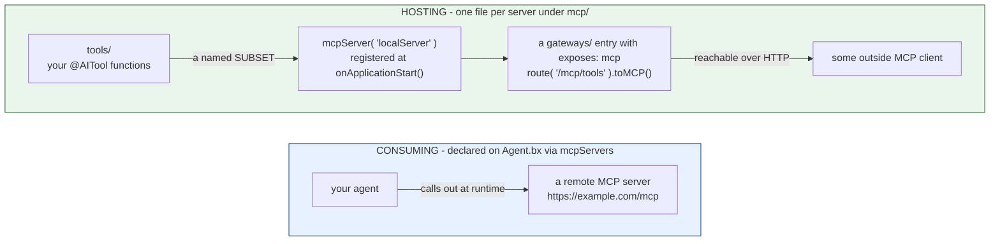

# mcp/

MCP (Model Context Protocol) funktioniert in zwei Richtungen - Remote-Server konsumieren, und eigene hosten.



Nichts verbindet die beiden: Ein Agent, der Remote-Server konsumiert, muss keinen eigenen hosten, und ein gehosteter Server ist nur erreichbar, wenn ihn ein `gateways/`-Eintrag exponiert.

## Remote-Server konsumieren

Direkt an `Agent.bx` deklariert (keine Datei unter `mcp/`), über `mcpServers`:

```javascript
// Agent.bx
class extends="bxModules.bxai.models.runnables.AiAgent" {

	function init() {
		super.init( name: "my-agent", model: aiModel( provider: "openai", params: { model: "gpt-5" } ) )
		return this
	}

	function configure() {
		return {
			mcpServers : [
				"https://example.com/mcp",
				{ url : "https://other.com/mcp", name : "other" }
			]
		};
	}

}
```

Jeder Eintrag ist entweder ein bloßer URL-String oder eine `{ url, name }`-Struktur. Diese werden auf ein bloßes Array von URLs reduziert und direkt in den generierten `aiAgent(mcpServers: [...])`-Aufruf übergeben. **Zur Build-Zeit wird nie eine Netzwerkverbindung versucht** - Erreichbarkeit ist ein Laufzeit-Anliegen; ein zur Build-Zeit unerreichbarer Server ist kein Build-Fehler.

Subagenten können ihre eigenen `mcpServers` unabhängig deklarieren - jeder Knoten im Agentenbaum erhält seine eigene aufgelöste Liste.

## Einen lokalen Server hosten

Jede `mcp/*.bx`-Datei ist ein lokaler MCP-Server, den das eigene Projekt hostet und dabei eine Teilmenge der eigenen `tools/` als MCP-Tools exponiert:

```javascript
// mcp/localServer.bx
class {

	function configure() {
		return {
			description : "Internal tools MCP server",
			version     : "1.0.0",
			cors        : "*",             // optional - CORS origin(s) allowed to call this server; omit for none
			tools       : [ "sayHello" ]   // names of tools already declared under tools/
		};
	}

}
```

Der entdeckte Name des Eintrags ist sein **Dateiname** (`localServer.bx` → `localServer`), nicht irgendein `name`-Feld innerhalb der eigenen `configure()`-Struktur - ein Projekt kann trotzdem eines zu Dokumentationszwecken setzen, es wird aber für Namensgebung/Registrierung ignoriert.

`cors` ist optional und fällt bei Weglassen auf einen leeren String zurück (kein CORS-Header) - direkt als 4. Positionsargument von `mcpServer()` durchgereicht.

Zur Build-Zeit wird die Datei unverändert in den `mcp/`-Ordner der generierten App kopiert, und eine Registrierungsanweisung wird in `Application.bx`s `onApplicationStart()` eingefügt:

```javascript
mcpServer( "localServer", "Internal tools MCP server", "1.0.0", "*" )
	.registerTool( aiToolRegistry().get( "sayHello" ) )
```

`mcpServer(name, ...)` ist in bx-ai ein globaler, namensgeschlüsselter Singleton-Getter - ihn einmal beim Start zu registrieren ist alles, was nötig ist; es ist keine WireBox-Zuordnung beteiligt (anders als beim Agent-Exposure-Singleton, den `toAi()` nutzt).

## Einen lokalen Server über HTTP exponieren

Ein lokaler `mcp/*`-Server ist nicht von allein über HTTP erreichbar - ihn mit einem [`gateways/`](gateways.md)-Exposure-Eintrag paaren, der ihn als `target` benennt:

```javascript
// gateways/expose-mcp.bx
class {
	function configure() {
		return {
			exposes : "mcp",
			path    : "/mcp/tools",
			target  : "localServer"
		};
	}
}
```

## Validierung

- Ein remoter `mcpServers`-Eintrag (Struktur-Form) ohne `url` schlägt bei der Validierung fehl.
- Ein remoter `mcpServers`-Eintrag, der weder ein nicht-leerer String noch eine `{url, ...}`-Struktur ist, schlägt bei der Validierung fehl.
- Ein `gateways/`-Eintrag mit `exposes: "mcp"` und einem `target`, das zu keinem entdeckten `mcp/*`-Eintrag passt, schlägt bei der Validierung fehl.
