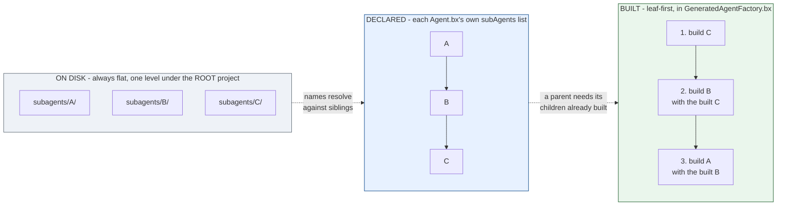

# subagents/

`subagents/` enthält verschachtelte Agenten, jeder ein eigenes, gewöhnliches BX-Agents-Projekt - ein `Agent.bx` + `instructions.md` (und optional eigene `tools/`, `skills/` usw.):

```
my-agent/
├── Agent.bx              # subAgents: ["researcher"]
├── instructions.md
└── subagents/
    └── researcher/
        ├── Agent.bx
        └── instructions.md
```

Ein Subagent wird namentlich mit seinem Elternteil verdrahtet, deklariert in der `configure()` des Elternteils in `Agent.bx` - der ORDNERNAME unter `subagents/`, zur Build-Zeit verdrahtet, zu unterscheiden vom eigenen `subAgents`-Argument von `super.init()` (das bereits gebaute `AiAgent`-Instanzen nimmt, keine Namen):

```javascript
// Agent.bx
class extends="bxModules.bxai.models.runnables.AiAgent" {

	function init() {
		super.init(
			name  : "my-agent",
			model : aiModel( provider: "openai", params: { model: "gpt-5" } )
		)
		return this
	}

	function configure() {
		return {
			subAgents : [ "researcher" ]
		};
	}

}
```

Zur Build-Zeit umwickelt bx-ais `addSubAgent()` jede gebaute Subagenten-Instanz automatisch als aufrufbares Tool am Elternteil - es gibt keinen separaten, selbst zu schreibenden Tool-Wrapping-Schritt.

## Flacher Namensraum, Geschwisterreferenzen

Jeder Subagent - egal wie tief die eigene Konfiguration eines anderen Subagenten ihn referenziert - liegt direkt unter dem `subagents/`-Ordner des **Root**-Projekts. Die eigenen deklarierten `subAgents` eines Subagenten referenzieren **Geschwister**-Einträge in genau diesem Root-Level-Ordner, nicht einen unter sich selbst verschachtelten Ordner. Das hält das Discovery-/Validierungsmodell einfach: ein flacher gerichteter Graph über die unmittelbaren Unterordner von `subagents/`, statt eines Baums, der auf der Platte beliebig tief verschachtelt sein könnte.

Flach auf der Platte, ein Graph in der Konfiguration, von unten nach oben gebaut - die drei Sichten auf dasselbe Projekt:



Ein Zyklus im deklarierten Graphen (`A -> B -> A`) wird bei der Validierung abgelehnt, bevor irgendetwas davon generiert wird; ein Diamant (zwei Elternteile, die sich einen Nachfahren teilen) ist unproblematisch.

## Build-Reihenfolge

Subagenten werden **blattzuerst** (von unten nach oben) gebaut: Deklariert `A` `subAgents: ["B"]` und `B` deklariert `subAgents: ["C"]`, baut die generierte `GeneratedAgentFactory.bx` zuerst `C`, dann `B` (unter Übergabe der gebauten `C`-Instanz), dann `A` (unter Übergabe der gebauten `B`-Instanz) - nie umgekehrt, da der `aiAgent()`-Aufruf eines Elternteils die bereits gebauten Instanzen seiner Kinder braucht.

## Validierung

- Ein Subagentenname in `subAgents`, der zu keinem echten `subagents/{name}/Agent.bx` passt, schlägt bei der Validierung mit einem klaren Fehler "references unknown subagent [...]" fehl - das gilt für die `subAgents`-Liste **jedes** Knotens, einschließlich des eigenen `Agent.bx` des Root-Projekts, nicht nur verschachtelter Subagenten.
- **Zirkuläre Referenzen** (`A` → `B` → `A`) werden zur Validierungszeit abgelehnt, mit dem vollständigen gemeldeten Zyklenpfad (z. B. `A -> B -> A`), bevor irgendeine Codegenerierung stattfindet.
- Eine "Diamant"-Form - zwei Subagenten, die beide vom selben gemeinsamen Nachfahren abhängen - ist **kein** Zyklus und baut problemlos; nur echte Zyklen werden abgelehnt.
- Ein fehlendes `Agent.bx` innerhalb eines entdeckten `subagents/*`-Ordners wird als eigener Validierungsfehler gemeldet.
- Der eigene DEKLARIERTE `name` jedes Knotens (Root + jedes Subagenten eigenes `Agent.bx`) muss über das gesamte Projekt hinweg eindeutig sein - siehe unten.

## Retrieving an agent from `schedules/Scheduler.bx`

Zwei unterschiedliche Namen sind im Spiel, und sie sind nicht austauschbar:

- Der **Ordnername** unter `subagents/` (`researcher` oben) ist das, worauf `subAgents: [ "..." ]` referenziert - ein reines Build-Zeit-Verdrahtungsanliegen.
- Der eigene **deklarierte `name`** des Subagenten (das `name`-Feld seines `Agent.bx`, z. B. `"ResearchBot"`) ist es, mit dem er zur Laufzeit abgerufen wird - jeder Agent im Baum (Root + jeder Subagent) wird in `config/WireBox.bx` unter diesem Namen registriert, sodass [`schedules/Scheduler.bx`](schedules.md) (oder jeder andere WireBox-fähige Code) ihn mit einem einfachen `getInstance( "ResearchBot" )` erreicht.

Diese beiden Namen können abweichen, und werden es oft - der Ordnername ist ein Implementierungsdetail, der deklarierte `name` ist derjenige, der überall sonst zählt (Prompts, WireBox-Retrieval). Weil er jetzt auch ein WireBox-Bindungsschlüssel ist, schlägt `build` bei der Validierung fehl, falls zwei Agenten im Baum - wie tief auch immer verschachtelt - denselben deklarierten `name` haben, einschließlich zweier, die beide unset lassen und sich still den Standardwert `"BxAi"` teilen.
