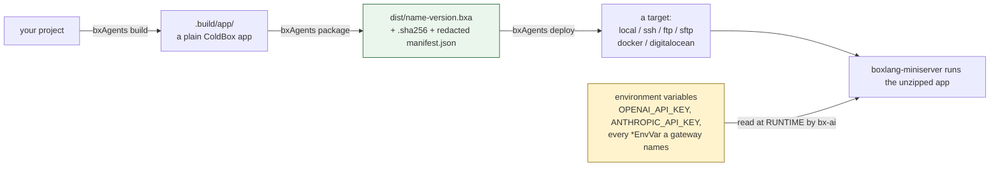

# Deployment & Secrets

Secrets gelangen nie in das Artefakt - sie werden dem **Prozess** bereitgestellt, ganz rechts in dieser Kette:



Nichts links von `ENV` trägt jemals einen Secret-Wert: `.env`/Dotfiles sind bedingungslos vom Zip ausgeschlossen, und das Manifest ist zusätzlich geschwärzt, obwohl es ohnehin nie einen enthält.

## Paketierung

`bxAgents package` zippt `.build/app/` in ein portables `.bxa`-Artefakt:

```bash
bxAgents package --version=1.0.0
```

erzeugt, in `dist/`:

- `{agentName}-{version}.bxa` - die gezippte App
- `{agentName}-{version}.bxa.sha256` - ihre Prüfsumme
- `manifest.json` - eine **geschwärzte** Kopie des Build-Manifests (siehe unten)

Zweimal hintereinander über denselben Build zu paketieren erzeugt bytegleiche Zip-Daten (deterministische Eintragsreihenfolge/Zeitstempel) - nützlich, um zu prüfen, dass ein in CI gebautes Artefakt einem lokal gebauten entspricht.

`package` erfordert einen vorherigen `build` (es liest `.build/manifest.json`) und verweigert die Ausführung - ohne eine `.bxa` zu erzeugen -, falls `manifestVersion` nicht gesetzt oder fehlerhaft ist.

## Dateien ausschließen: `.bxaignore`

Ein optionales `.bxaignore` im Projekt-Root, ein Glob-Muster pro Zeile (mit `#` beginnende Zeilen sind Kommentare), schließt passende Pfade aus der paketierten `.bxa` aus:

```
# .bxaignore
*.log
scratch/
```

Das kommt zusätzlich zu einem fest eingebauten, immer aktiven Ausschluss von `.env`/`.env.*`/Dotfiles auf der Paketierungsebene - selbst wenn `.bxaignore` sie nicht erwähnt, und selbst wenn sie irgendwie in `.build/app` gelandet sind, schaffen sie es nie ins Zip.

## Secret-Schwärzung

Secrets werden von vornherein nie in `manifest.json` geschrieben - der `agent`-Block des Manifests enthält ausschließlich sichere, strukturelle Felder (`name`, `description`, `model`, `environment`). Als zusätzliche Verteidigungsebene durchläuft `package` das Manifest zudem rekursiv und ersetzt jeden Struct-Schlüssel, der wie ein Secret **aussieht**, durch `[REDACTED]`:

```
(apikey | api_key | token | secret | password)$   (case-insensitive, any prefix)
```

Das schützt vor einem zukünftigen Feld - oder einem Aufrufer, der auf anderem Weg eine reichhaltigere Struktur an `package` übergibt -, das versehentlich einen Wert preisgibt, auch wenn das heutige Manifest von vornherein nie einen dort ablegt.

## Wo echte Secrets leben

BX Agents löst Provider-API-Schlüssel, Tokens oder Passwörter nie auf, speichert sie nicht und bettet sie nirgendwo in einem Build oder Paket ein. Das ist ausschließlich bx-ais eigene Aufgabe, zur **Laufzeit**: Es liest sie aus der Prozessumgebung gemäß seiner eigenen `<PROVIDER>_API_KEY`-artigen Konvention (z. B. `OPENAI_API_KEY`, `ANTHROPIC_API_KEY`). Sie werden so gesetzt, wie Secrets für einen deployten Prozess sonst auch verwaltet werden - eine OS-Umgebungsvariable, eine vom Prozessmanager geladene `.env`-Datei (nie committet, nie paketiert), oder der Secret-Manager der eigenen Plattform.

```bash
export OPENAI_API_KEY=sk-...
bxAgents serve
```

## Ausliefern

```bash
bxAgents deploy --destination=/path/to/somewhere   # lokal, Flag-Kurzform
bxAgents deploy --name=production                  # jedes Ziel, über deploy/production.bx
```

Sechs pluggable Ziele sind sofort einsatzbereit - `local` (die neueste `.bxa` irgendwohin kopieren), `ssh` (an einen nackten Server ausliefern), `ftp`/`sftp` (über das echte Modul [`bx-ftp`](https://github.com/ortus-boxlang/bx-ftp) ausliefern, eine echte Laufzeitabhängigkeit dieses Projekts), `docker` (ein Container-Image bauen/pushen) und `digitalocean` (an eine DigitalOcean-App-Platform-App deployen) - siehe [deploy/](conventions/deploy.md) für die vollständige Konfigurationsform jedes einzelnen und [CLI-Referenz](cli-reference.md#deploy) für die CLI-Flags.

Kein Ziel liest je ein Secret aus der `deploy/*`-Konfiguration - Zugangsdaten (Registry-Passwörter, SSH-Schlüssel, das DigitalOcean-API-Token) werden zur Deploy-Zeit immer aus Umgebungsvariablen aufgelöst, dieselbe Regel "Secrets bleiben extern" wie überall sonst in diesem Dokument. Siehe [deploy/](conventions/deploy.md#secrets-stay-external) für die genaue Umgebungsvariable, die jedes Ziel erwartet.

Um eine paketierte `.bxa` manuell woanders auszuführen: entpacken (es ist eine gewöhnliche ColdBox-App) und `boxlang-miniserver` auf das entpackte Verzeichnis richten, dabei alle für dieses Deployment nötigen geheimen Umgebungsvariablen setzen.
