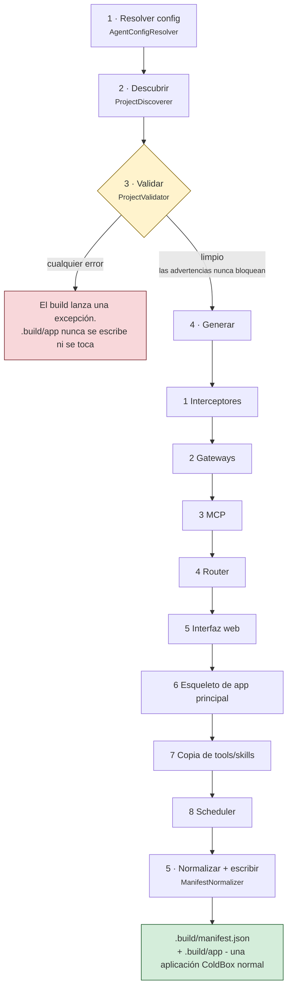

# El pipeline de build

`bxAgents build` ejecuta una secuencia fija de fases, una vez, produciendo una aplicación ColdBox normal. Nada de esto se vuelve a ejecutar en tiempo de request - ese es todo el sentido del ensamblaje en tiempo de build. Esta página recorre las fases en el orden exacto en que `BuildPipeline.bx` las ejecuta.

La validación es la puerta: recopila **todos** los errores en lugar de fallar rápido, y nada se genera hasta que vuelve limpia.

(El empaquetado en un `.bxa` es un paso deliberadamente separado - ver [Despliegue y secretos](deployment-and-secrets.md) - para que un ciclo rápido de `build` → inspeccionar → `build` de nuevo nunca pague un costo de empaquetado que no necesita.)

## 1. Resolver config

[`AgentConfigResolver`](conventions/agent-bx.md) carga `Agent.bx`, invoca `configure()` y el método de override del entorno activo, luego fusiona en profundidad `boxlang.json`/`boxlang-{env}.json`/`miniserver.json`/`miniserver-{env}.json` si están presentes. Produce el único struct de configuración resuelto del que lee cada fase posterior.

## 2. Descubrir

[`ProjectDiscoverer`](conventions/agent-bx.md) recorre la raíz del proyecto y enumera cada carpeta de convención (`models/`, `tools/`, `skills/`, `subagents/`, `gateways/`, `mcp/`, `interceptors/`, `modules/`) en entradas crudas `{ name, path, type }`. `schedules/` es la única excepción - no es una lista de entradas, solo un único par `hasScheduler`/`schedulerPath`, ya que contiene un archivo real de scheduler de ColdBox en lugar de un conjunto de entradas de configuración definidas por BX Agents. Descubrimiento puro - todavía no ocurre ninguna interpretación del contenido de los archivos.

## 3. Validar

[`ProjectValidator`](conventions/agent-bx.md) ejecuta cada validador y recopila **todos** los errores (nunca falla rápido) más cualquier advertencia: nombres duplicados de tool/skill/model/subagent, `name`s de agente duplicados a través de todo el árbol de subagentes (ver [subagents/](conventions/subagents.md#retrieving-an-agent-from-schedulesschedulerbx)), referencias circulares de subagente/módulo, las dos formas de entrada de gateway, la completitud de configuración de MCP remoto, y la validez de modelo/proveedor. Si se recopiló algún error, el build lanza una excepción inmediatamente aquí - no se escribe ni se toca `.build/app`. Las advertencias (por ejemplo, una carpeta `schedules/` sin `Scheduler.bx` dentro) nunca bloquean el build.

## 4. Generar

Solo se alcanza una vez que la validación está limpia. En orden:

1. **Interceptores** - [`InterceptorSplitter`](conventions/interceptors.md) copia los interceptores de scope `agent` a `.build/app/interceptors`, los de scope `runtime` a un directorio separado `.build/runtime-interceptors`.
2. **Gateways** - [`GatewayGenerator`](conventions/gateways.md) emite sentencias `aiGatewayRegistry().register(...)` para las entradas de tipo channel-adapter, y (si alguna es `type: "http"`) escribe `.build/app/handlers/Gateway.bx`. Si alguna entrada es un gateway de estilo push (por ejemplo, `type: "telegram"`), también escribe `.build/app/interceptors/GatewaySessionBootstrap.bx`, conectando un único `GatewaySession` de bx-ai (agrupando cada gateway de estilo push) al agente raíz del proyecto.
3. **MCP** - [`McpGenerator`](conventions/mcp.md) copia los servidores locales `mcp/*` a `.build/app/mcp` y emite sus sentencias de registro `mcpServer(...).registerTool(...)`.
4. **Router** - [`RouterGenerator`](conventions/gateways.md) escribe `.build/app/config/Router.bx`: un `route(path).toAi(...)`/`toMCP(...)` por entrada de exposición, más las 3 rutas fijas de webhook de gateway si existe un channel gateway de tipo `http`.
5. **Interfaz web** - [`WebUiGenerator`](conventions/web-ui.md) se ejecuta para cualquier entrada `exposes: "webui"`, escribiendo el `<path>/index.html` estático, `handlers/ChatUi.bx` (la API de veinte acciones), `models/ChatDb.bx` (el almacén SQLite y sus migraciones exclusivamente hacia adelante), `interceptors/WebUiSchema.bx` (migra en el arranque en lugar de en cualquier request que toque primero la base de datos), y - solo cuando `apiKeyEnvVar` está configurado - `interceptors/WebUiAuthGate.bx`. Devuelve la configuración de base de datos resuelta, que el siguiente paso necesita.
6. **Esqueleto de app principal** - `ColdBoxAppGenerator` escribe `Application.bx`, `config/ColdBox.bx`, `config/WireBox.bx`, `agent/GeneratedAgentFactory.bx`, e `index.bxm`, incorporando cada sentencia recopilada arriba (registros de gateway, registros MCP, y - si `tools/` tiene algún archivo - una llamada simple `aiToolRegistry().scan("tools")`) en el `onApplicationStart()` de `Application.bx`, y (el `GatewaySessionBootstrap.bx` de la Fase 1, si se generó) en la lista `interceptors` que referencia `config/ColdBox.bx`. Cada agente generado también recibe ahora siempre un checkpointer (`withCheckpointer(...)`, por defecto un `aiMemory()` respaldado por `cache` si el proyecto no declara configuración `checkpointer` y la clase no configuró ninguna propia) - sin uno, los flujos de aprobación human-in-the-loop a través de cualquier gateway que no sea `cli` fallan por completo. `config/WireBox.bx` mapea cada agente en el árbol (raíz + cada subagente) bajo su propio `name` declarado, no solo el alias fijo `"GeneratedAgent"` de la raíz - ver [schedules/](conventions/schedules.md). Para un proyecto con una exposición `webui` también activa la gestión de sesiones, registra el datasource SQLite (nombrándolo como el datasource por defecto de la app vía `this.datasource`), crea el directorio padre de la base de datos en `onApplicationStart()` - SQLite crea el archivo pero nunca la carpeta que lo contiene - y fija la gramática de qb en `config/ColdBox.bx`.
7. **Copia de tools/skills** - `ToolsSkillsCopier` borra y reescribe `.build/app/tools` y `.build/app/skills` textualmente a partir de las propias carpetas de tu proyecto.
8. **Scheduler** - [`SchedulerGenerator`](conventions/schedules.md) copia `schedules/Scheduler.bx` hacia `.build/app/config/Scheduler.bx` sin tocarlo, si está presente - sin generación, es código ColdBox real que tú mismo escribiste.

## 5. Normalizar + escribir el manifest

[`ManifestNormalizer`](manifest.md) produce el manifest interno canónico, con hash estampado, a partir de los datos de descubrimiento + configuración resuelta, y el pipeline lo escribe en `.build/manifest.json`.

## Idempotencia

Reconstruir un proyecto sin cambios produce una salida idéntica byte a byte, hasta los hashes de contenido por archivo del manifest - todo el sentido de pagar el costo de ensamblaje una sola vez, en tiempo de build, en lugar de diferir cualquiera de este trabajo al manejo de requests.
