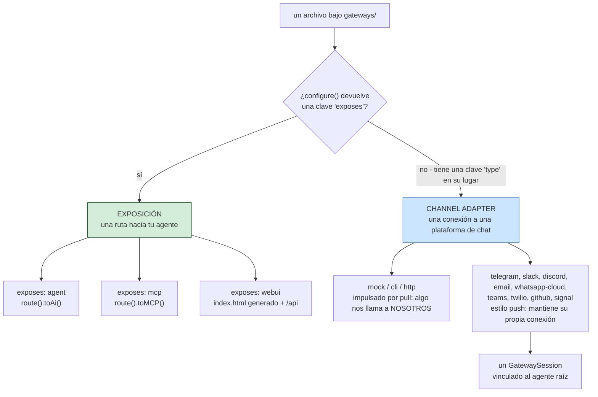
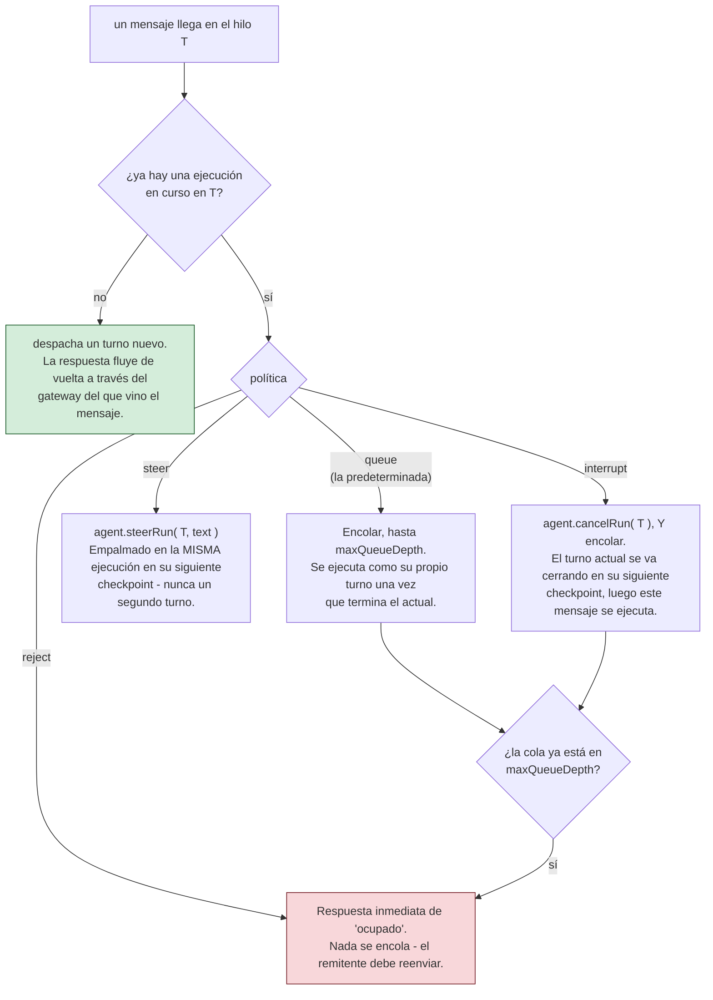

# gateways/

Los archivos `gateways/*.bx`/`.json` bajo esta única carpeta cubren **dos cosas distintas y no relacionadas** - qué tipo de entrada es depende enteramente de si el struct `configure()` tiene una clave `exposes`.

!!! warning
    No confundas estas cosas entre sí - un agente expuesto por HTTP (`exposes: "agent"`) es una API REST para tu agente; un gateway de channel-adapter (`type: "http"`) es un endpoint de webhook para una plataforma de chat o un flujo de aprobación human-in-the-loop. Generan rutas completamente diferentes.



## 1. Exposición HTTP/MCP/interfaz web (`exposes: "agent" | "mcp" | "webui"`)

Expone el agente, o un servidor MCP local, sobre HTTP usando el DSL nativo de AI Routing de ColdBox 8.1 - o una interfaz de chat de navegador pre-construida, documentada por separado en [La interfaz web de chat](web-ui.md).

**Expón el agente:**

```javascript
// gateways/expose.bx
class {

	function configure() {
		return {
			exposes : "agent",
			path    : "/api/chat"
		};
	}

}
```

Genera, en `config/Router.bx`:

```javascript
route( "/api/chat" ).toAi( "GeneratedAgent" )
```

que auto-registra **cuatro** subrutas: `POST /api/chat/invoke`, `POST /api/chat/stream` (SSE), `POST /api/chat/batch`, `GET /api/chat/info`. La ruta desnuda `/api/chat` en sí no es enrutable.

**Expón un servidor MCP local** (ver [mcp/](mcp.md)):

```javascript
class {
	function configure() {
		return {
			exposes : "mcp",
			path    : "/mcp/tools",
			target  : "local-server"   // debe coincidir con el nombre declarado de una entrada mcp/*.bx
		};
	}
}
```

Genera `route( "/mcp/tools" ).toMCP( "local-server" )`.

**Expón la interfaz web de chat v1:**

```javascript
// gateways/chat.bx
class {
	function configure() {
		return {
			exposes     : "webui",
			path        : "/chat",
			apiKeyEnvVar: "CHAT_UI_API_KEY"   // opcional - ver abajo
		};
	}
}
```

Genera un archivo estático real `<path>/index.html` (servido directamente - no se necesita ruta para él) más su propia API dedicada bajo un prefijo fijo `<path>/api`, así que nunca colisiona con los propios archivos del shell. Esa API es un `handlers/ChatUi.bx` generado en lugar de `toAi()`, y la entrada también trae consigo un almacén SQLite generado.

La interfaz web es un subsistema en lugar de un simple interruptor de exposición - la lista de rutas, el almacén, las conversaciones y preferencias, el branding y la temática, y por qué no usa `toAi()` están todos en su propia página: **[La interfaz web de chat](web-ui.md)**.

**Validación:** `exposes` debe ser `agent`, `mcp`, o `webui`; `path` es requerido y debe ser único a través de cada entrada de exposición; el `target` de una exposición `mcp` es requerido y debe coincidir con el nombre declarado de una entrada real `mcp/*`; el `apiKeyEnvVar` de `webui` es completamente opcional, sin ninguna comprobación de campo requerido (ver abajo).

## 2. Gateways de channel-adapter (`type: "mock" | "cli" | "http"`)

Registra un `IGateway` de bx-ai (un channel adapter para entrega externa / aprobación human-in-the-loop) por nombre - distinto de exponer la propia API REST del agente.

```javascript
// gateways/slack.bx
class {
	function configure() {
		return {
			type         : "http",
			secretEnvVar : "SLACK_WEBHOOK_SECRET"
		};
	}
}
```

`secretEnvVar` nombra una variable de entorno que contiene el secreto de firma - **nunca el valor del secreto mismo**. Genera, en el `onApplicationStart()` de `Application.bx`:

```javascript
aiGatewayRegistry().register( aiGateway( "http", { secret : getSystemSetting( "SLACK_WEBHOOK_SECRET", "" ) } ) )
```

El secreto se resuelve en vivo en el arranque del servidor, coincidiendo con la regla de "los secretos permanecen externos" de este proyecto en cualquier otro lugar (ver [Despliegue y secretos](../deployment-and-secrets.md)) - nunca se incrusta como un literal en el código fuente generado, así que tampoco está presente jamás en un `.bxa` empaquetado. Si la variable de entorno no está configurada, el propio `HttpGateway` de bx-ai trata un secreto vacío como "sin firma configurada" y rechaza requests en consecuencia, en lugar de fallar en el arranque.

**Validación:** `type` debe ser `mock`, `cli`, o `http`; una entrada `type: "http"` requiere un `secretEnvVar`; el propio nombre de archivo/nombre base de la entrada debe ser único a través de cada entrada de channel-adapter. `mock` es solo para pruebas; `cli` es el propio canal incorporado de **aprobación** human-in-the-loop de bx-ai (un prompt bloqueante de stdin/stdout A/R/Q) - es lo que `HumanInTheLoopMiddleware` conecta por defecto cuando no se especifica ningún gateway, y no está relacionado con el propio verbo `chat` de BxAgents (que nunca toca el registro de gateways en absoluto).

**Las entradas de tipo `http` adicionalmente obtienen cableado HTTP real**: una acción generada `handlers/Gateway.bx` que hace de proxy directamente hacia el propio `GatewayRequestProcessor::processHttp()` de bx-ai, y tres rutas en `config/Router.bx`:

```javascript
post( "/gateways/:gatewayName/events" ).toHandler( "Gateway.process" )
get( "/interactions/:requestID" ).toHandler( "Gateway.process" )
post( "/interactions/:requestID/decisions" ).toHandler( "Gateway.process" )
```

!!! info
    ColdBox no tiene un terminador de DSL `toAiGateway()` incorporado para esta superficie (solo `toAi()` y `toMCP()` existen nativamente) - este cableado es código propio generado por BxAgents, siguiendo la misma forma que produciría un futuro terminador del núcleo. Ver la propuesta [`toAiGateway()` para ColdBox Core](../proposals/toAiGateway-coldbox-core.md).

## 3. Push-style gateways (`type: "telegram"` / `"slack"` / `"discord"` / `"email"` / `"whatsapp-cloud"` / `"teams"` / `"twilio"` / `"github"` / `"signal"`, and friends)

Un tipo diferente de channel adapter respecto a `mock`/`cli`/`http` de arriba: en lugar de ser impulsado por un request HTTP entrante, un gateway de estilo push mantiene su propia conexión a la plataforma y empuja mensajes entrantes a tu agente a medida que llegan - la experiencia más cercana a "bot de chat real". Hoy existen cuatro formas de transporte:

- **Long-poll** (Telegram, Email): una tarea programada pregunta periódicamente a la plataforma "¿algo nuevo?" (el `getUpdates` de Telegram, el poll IMAP de Email).
- **Websocket persistente** (Slack vía Socket Mode, Discord vía su Gateway API): el gateway mantiene una conexión viva y de larga duración por la que la plataforma empuja eventos en tiempo real.
- **Webhook, impulsado por pull** (WhatsApp Business Cloud API, Microsoft Teams, Twilio SMS, GitHub): la plataforma nos llama **a nosotros** a través de un endpoint HTTP público en lugar de que este gateway mantenga su propia conexión saliente - no hay tarea de scheduler ni socket que gestionar. Ver sus propias subsecciones abajo.
- **Server-Sent Events (SSE)** (Signal, contra un daemon `signal-cli` ejecutado localmente): una conexión HTTP de streaming unidireccional y de larga duración que el gateway mantiene abierta, leyendo eventos a medida que se empujan por el mismo cuerpo de respuesta. Ver su propia subsección abajo.

```javascript
// gateways/telegramChannel.bx
class {
	function configure() {
		return {
			type          : "telegram",
			botTokenEnvVar: "TELEGRAM_BOT_TOKEN"
		};
	}
}
```

```javascript
// gateways/slackChannel.bx
class {
	function configure() {
		return {
			type          : "slack",
			botTokenEnvVar: "SLACK_BOT_TOKEN",   // xoxb-... - chat.postMessage/chat.update
			appTokenEnvVar: "SLACK_APP_TOKEN"    // xapp-... - apps.connections.open (Socket Mode)
		};
	}
}
```

```javascript
// gateways/discordChannel.bx
class {
	function configure() {
		return {
			type          : "discord",
			botTokenEnvVar: "DISCORD_BOT_TOKEN"   // Authorization: Bot <token> en cada llamada REST y dentro de Identify
			// intents: 37377   // override opcional - por defecto GUILDS+GUILD_MESSAGES+DIRECT_MESSAGES+MESSAGE_CONTENT
		};
	}
}
```

```javascript
// gateways/emailChannel.bx
class {
	function configure() {
		return {
			type              : "email",
			imapHostEnvVar    : "IMAP_HOST",
			imapUsernameEnvVar: "IMAP_USERNAME",
			imapPasswordEnvVar: "IMAP_PASSWORD",
			fromAddressEnvVar : "EMAIL_FROM_ADDRESS"
			// imapPort: 993   // override opcional - por defecto 993 (IMAPS)
			// pollIntervalSeconds: 60   // override opcional - por defecto 60
		};
	}
}
```

```javascript
// gateways/whatsappCloud.bx
class {
	function configure() {
		return {
			type               : "whatsapp-cloud",
			accessTokenEnvVar  : "WHATSAPP_ACCESS_TOKEN",     // token de acceso de la API de Graph
			phoneNumberIdEnvVar: "WHATSAPP_PHONE_NUMBER_ID",  // el ID del número de teléfono de WhatsApp Business por el que pasan los envíos
			appSecretEnvVar    : "WHATSAPP_APP_SECRET",       // clave HMAC que verifica X-Hub-Signature-256 en webhooks entrantes
			verifyTokenEnvVar  : "WHATSAPP_VERIFY_TOKEN"      // secreto compartido que el handshake GET de verificación de Meta debe devolver
			// apiVersion: "v21.0"   // override opcional - por defecto "v21.0"
		};
	}
}
```

```javascript
// gateways/teamsChannel.bx
class {
	function configure() {
		return {
			type                : "teams",
			appIdEnvVar         : "TEAMS_APP_ID",         // el propio Microsoft App ID del bot (también el claim aud requerido del JWT entrante)
			appPasswordEnvVar   : "TEAMS_APP_PASSWORD"    // secreto de cliente OAuth2 client-credentials
			// tenantId: "..."   // override opcional para apps de un solo tenant - por defecto "botframework.com" (multi-tenant)
		};
	}
}
```

```javascript
// gateways/twilioChannel.bx
class {
	function configure() {
		return {
			type            : "twilio",
			accountSidEnvVar: "TWILIO_ACCOUNT_SID",
			authTokenEnvVar : "TWILIO_AUTH_TOKEN",   // también la clave HMAC de X-Twilio-Signature
			fromEnvVar      : "TWILIO_FROM_NUMBER"   // el número de teléfono de Twilio por el que pasan los envíos salientes, E.164
			// messagingServiceSid: "MG..."   // opcional - si se configura, se usa en lugar de `from` en envíos salientes
			// publicUrl: "https://your-real-public-host/webhooks/twilio"   // override opcional para despliegues de proxy inverso/túnel - ver la subsección de Twilio abajo
		};
	}
}
```

```javascript
// gateways/githubChannel.bx
class {
	function configure() {
		return {
			type               : "github",
			tokenEnvVar        : "GITHUB_TOKEN",           // un token de acceso personal (scope de lectura+escritura de repo/issues+PR)
			webhookSecretEnvVar: "GITHUB_WEBHOOK_SECRET",  // clave HMAC que verifica X-Hub-Signature-256 en webhooks entrantes
			botNameEnvVar      : "GITHUB_BOT_NAME"         // el propio login de GitHub del bot - coincidido como "@botName" en comentarios
			// apiBaseUrl: "https://api.github.com"   // override opcional - por defecto "https://api.github.com"
		};
	}
}
```

```javascript
// gateways/signalChannel.bx
class {
	function configure() {
		return {
			type         : "signal",
			accountEnvVar: "MY_SIGNAL_ACCOUNT"   // el número de teléfono registrado en signal-cli con el que este gateway envía/recibe, E.164
			// httpUrl: "http://127.0.0.1:8080"   // override opcional - por defecto "http://127.0.0.1:8080", donde se espera que escuche el propio daemon HTTP API de signal-cli
		};
	}
}
```

La misma regla de "los secretos permanecen externos" que el `secretEnvVar` de `http`: cada clave `*EnvVar` nombra una variable de entorno, resuelta en vivo vía `getSystemSetting()` en el arranque, nunca incrustada como un literal - el `imapHost`/`fromAddress` de `email` no son secretos criptográficos, pero se usa de todos modos la misma convención impulsada por variable de entorno para cada uno de sus valores de configuración, ya que todos varían por despliegue. A diferencia de los tipos centrales, la clase de un gateway de estilo push vive dentro de BxAgents mismo (`models/gateways/*.bx`, no bx-ai), así que su registro se renderiza como una ruta de clase desnuda en lugar de un nombre corto:

```javascript
aiGatewayRegistry().register( aiGateway( "bxModules.bxagents.models.gateways.TelegramGateway", { "botToken" : getSystemSetting( "TELEGRAM_BOT_TOKEN", "" ) } ) )
aiGatewayRegistry().register( aiGateway( "bxModules.bxagents.models.gateways.SlackGateway", { "appToken" : getSystemSetting( "SLACK_APP_TOKEN", "" ), "botToken" : getSystemSetting( "SLACK_BOT_TOKEN", "" ) } ) )
aiGatewayRegistry().register( aiGateway( "bxModules.bxagents.models.gateways.DiscordGateway", { "botToken" : getSystemSetting( "DISCORD_BOT_TOKEN", "" ) } ) )
aiGatewayRegistry().register( aiGateway( "bxModules.bxagents.models.gateways.EmailGateway", { "imapHost" : getSystemSetting( "IMAP_HOST", "" ), "imapUsername" : getSystemSetting( "IMAP_USERNAME", "" ), "imapPassword" : getSystemSetting( "IMAP_PASSWORD", "" ), "fromAddress" : getSystemSetting( "EMAIL_FROM_ADDRESS", "" ) } ) )
aiGatewayRegistry().register( aiGateway( "bxModules.bxagents.models.gateways.whatsapp.WhatsAppCloudGateway", { "accessToken" : getSystemSetting( "WHATSAPP_ACCESS_TOKEN", "" ), "phoneNumberId" : getSystemSetting( "WHATSAPP_PHONE_NUMBER_ID", "" ), "appSecret" : getSystemSetting( "WHATSAPP_APP_SECRET", "" ), "verifyToken" : getSystemSetting( "WHATSAPP_VERIFY_TOKEN", "" ) } ) )
aiGatewayRegistry().register( aiGateway( "bxModules.bxagents.models.gateways.TeamsGateway", { "appId" : getSystemSetting( "TEAMS_APP_ID", "" ), "appPassword" : getSystemSetting( "TEAMS_APP_PASSWORD", "" ) } ) )
aiGatewayRegistry().register( aiGateway( "bxModules.bxagents.models.gateways.TwilioGateway", { "accountSid" : getSystemSetting( "TWILIO_ACCOUNT_SID", "" ), "authToken" : getSystemSetting( "TWILIO_AUTH_TOKEN", "" ), "from" : getSystemSetting( "TWILIO_FROM_NUMBER", "" ) } ) )
aiGatewayRegistry().register( aiGateway( "bxModules.bxagents.models.gateways.GitHubGateway", { "token" : getSystemSetting( "GITHUB_TOKEN", "" ), "webhookSecret" : getSystemSetting( "GITHUB_WEBHOOK_SECRET", "" ), "botName" : getSystemSetting( "GITHUB_BOT_NAME", "" ) } ) )
aiGatewayRegistry().register( aiGateway( "bxModules.bxagents.models.gateways.SignalGateway", { "account" : getSystemSetting( "MY_SIGNAL_ACCOUNT", "" ) } ) )
```

**Validación:** `type: "telegram"` requiere `botTokenEnvVar`; `type: "slack"` requiere tanto `botTokenEnvVar` como `appTokenEnvVar`; `type: "discord"` requiere `botTokenEnvVar`; `type: "email"` requiere `imapHostEnvVar`, `imapUsernameEnvVar`, `imapPasswordEnvVar`, y `fromAddressEnvVar`; `type: "whatsapp-cloud"` requiere `accessTokenEnvVar`, `phoneNumberIdEnvVar`, `appSecretEnvVar`, y `verifyTokenEnvVar`; `type: "teams"` requiere `appIdEnvVar` y `appPasswordEnvVar`; `type: "twilio"` requiere `accountSidEnvVar`, `authTokenEnvVar`, y `fromEnvVar`; `type: "github"` requiere `tokenEnvVar`, `webhookSecretEnvVar`, y `botNameEnvVar`; `type: "signal"` requiere `accountEnvVar` - todo comprobado de la misma manera que se comprueba el `secretEnvVar` de `http`.

!!! info
    Slack v1 es **solo Socket Mode** - no se necesita ni se genera ningún endpoint de webhook público para él (a diferencia de `http`, que obtiene rutas reales - ver §2 arriba). La alternativa de Events-API/webhook-HTTP que Slack también soporta no está construida aquí. Discord v1 es de igual manera la **Gateway API** real (un websocket persistente) en lugar del modo alternativo de webhook de HTTP Interactions Endpoint URL de Discord - no se necesita verificación de firma Ed25519 aquí como resultado, ya que las interacciones llegan por la misma conexión autenticada en lugar de un endpoint HTTP público (confirmado contra la propia documentación de Discord).

### La conexión persistente de Slack

`SlackGateway` mantiene su websocket vía el cliente WebSocket asíncrono de `java.net.http.HttpClient`, mediado por una clase listener de BoxLang que `implements="java:java.net.http.WebSocket$Listener"` directamente (`models/gateways/support/SlackSocketListener.bx`) - BoxLang lo compila como un implementador de JVM real, confirmado empíricamente entregando una instancia directamente a `HttpClient.newWebSocketBuilder().buildAsync( uri, listener )` sin ningún error de casting (solo el esperado `java.net.ConnectException` una vez que se alcanzó la frontera de red real). Solo los métodos que la clase realmente declara sobreescriben los métodos `default` de la interfaz del JDK; cualquier cosa no implementada cae automáticamente al comportamiento por defecto propio del JDK. Este es el patrón de referencia que sigue también cada otro gateway de conexión persistente (Discord, abajo).

Las reconexiones son impulsadas de forma reactiva por las propias señales del protocolo de Slack - un frame `disconnect` (`warning`/`refresh_requested`) o un cierre de socket inesperado - abriendo una conexión **nueva** antes de cerrar la vieja, según la recomendación documentada de Slack. Un watchdog ligero de scheduler (`slack-watchdog-<name>`, cada 30s) es solo una red de seguridad para el caso en que ninguna de esas señales se dispare.

### La conexión persistente de Discord - latidos obligatorios impulsados por el cliente

`DiscordGateway` se conecta de la misma manera (`models/gateways/support/DiscordSocketListener.bx`, el mismo patrón `implements="java:java.net.http.WebSocket$Listener"` que Slack), pero el protocolo Gateway de Discord tiene un requisito que el Socket Mode de Slack no tiene: el propio frame `Hello` del servidor (opcode 10) le dice al cliente un `heartbeat_interval`, y el cliente debe seguir enviando frames `Heartbeat` (opcode 1) en esa cadencia por sí mismo o Discord trata la conexión como "zombificada" y la cierra. Ya que el intervalo solo se conoce una vez que llega `Hello` (no antes de conectar), el latido se registra como su propia tarea de scheduler (`discord-heartbeat-<name>`) dinámicamente desde dentro del manejador de frame, re-registrada en cada `Hello` fresco - distinto de la(s) tarea(s) fija(s)-en-el-momento-de-`registerScheduledTasks()` de cada otro gateway de estilo push, y distinto del propio watchdog de red de seguridad de Discord (`discord-watchdog-<name>`, cada 30s, el mismo rol que el de Slack).

Cada tick de latido comprueba si el latido *anterior* fue alguna vez confirmado (`Heartbeat ACK`, opcode 11) - si no, la conexión está zombificada y se reconecta proactivamente en lugar de dejarla expirar por tiempo. Las reconexiones de lo contrario siguen el propio modelo de sesión documentado de Discord: un frame `Reconnect` (opcode 7) o la mayoría de los códigos de cierre disparan un `Resume` (opcode 6, reproduciendo el último número de secuencia) en la nueva conexión cuando existe una sesión previa; un frame `Invalid Session` (opcode 9) con `d: false`, o un código de cierre que Discord documenta como invalidador de sesión (`4007`, `4009`), en cambio fuerza un `Identify` fresco (opcode 2). Un conjunto pequeño y fijo de códigos de cierre (`4004` token malo, `4010` shard inválido, `4011` sharding requerido, `4012` versión de API inválida, `4013`/`4014` intents inválidos/no permitidos) no son recuperables según la propia documentación de Discord - el gateway se detiene en lugar de reintentar una conexión que simplemente fallaría de nuevo.

!!! warning
    `MESSAGE_CONTENT` (necesario para leer el texto del mensaje en absoluto, tanto en canales de guild como en DMs) es un Gateway Intent **privilegiado** de Discord - debe habilitarse explícitamente para tu bot en el Discord Developer Portal, y una vez que tu app está verificada (100+ guilds), aprobado por Discord. Sin él, cada mensaje entrante llega con un campo `content` vacío.

### Email - dependencias a nivel de servidor, y enhebrado/HITL degradados

`EmailGateway` es el único gateway de estilo push que no habla la API de su plataforma directamente. El correo saliente pasa por el propio módulo [`cbmailservices`](https://coldbox.ortusbooks.com/the-basics/modules/core-modules) de ColdBox (`MailService@cbmailservices`, su protocolo `BXMail` - que él mismo simplemente llama al propio componente `bx:mail` de BoxLang, del módulo `bx-mail`) en lugar de una llamada HTTP/SMTP hecha a mano. **Ambas son instalaciones de módulo reales, a nivel de servidor** - se declaran como `dependencies` en el propio `box.json` de este proyecto (así que instalar `bx-agents` también las trae al servidor), pero cbmailservices/bx-mail ambos todavía requieren una instalación explícita en cualquier servidor que realmente ejecute una app generada (confirmado contra la propia documentación/código fuente de ambos módulos - ninguno viene preinstalado con ColdBox o BoxLang) - haz un `box install` real (o equivalente) antes de `bxAgents serve`/desplegar un proyecto con un gateway `email`. `EmailGateway` resuelve `MailService@cbmailservices` manualmente fuera de `application.cbController.getWireBox()` (ver el propio docblock de `ScheduledGatewayBase.resolveScheduler()` para saber por qué - esta clase se construye directamente por `aiGateway()`, enteramente fuera de WireBox, así que `inject=""` nunca se honra en ella), de la misma manera que se resuelve el propio scheduler.

Ya que ni `bx-mail` ni `cbmailservices` reciben correo (solo lo envían), el entrante es IMAP hecho a mano vía la API estándar del JDK `jakarta.mail` - confirmado alcanzable transitivamente en el propio classpath de este proyecto (`bx-mail` depende de `commons-email2-jakarta`, que a su vez depende de `jakarta.mail-api` + una implementación de Angus Mail), verificado empíricamente esta sesión contra los jars reales, no asumido. Una tarea programada (`email-poll-<name>`) hace poll de IMAP en busca de correo no leído, la misma forma que el long-poll de Telegram.

El enhebrado y el human-in-the-loop están ambos **degradados** en relación a los gateways de plataforma de chat, y `getDeclaredCapabilities()` deliberadamente omite `"interactiveActions"` para decirlo honestamente:

- **El enhebrado** usa cabeceras reales `Message-ID`/`In-Reply-To`/`References` para una respuesta ORDINARIA (el gateway siempre conoce el `Message-ID` entrante al que está respondiendo, así que configurar `In-Reply-To` en la respuesta saliente es confiable) - una simplificación v1 enhebra sobre la primera entrada de `References` (si no, `In-Reply-To`, si no, el propio `Message-ID` del mensaje), no un recorrido completo de la cadena.
- **El human-in-the-loop no tiene ninguna superficie de botón/componente nativa en absoluto** - `requestHumanInteraction()` envía un correo de texto plano listando las palabras clave de decisión permitidas y le pide al humano que responda con una como la primera línea. Correlacionar esa respuesta de vuelta con la solicitud pendiente correcta no puede depender de `In-Reply-To` de la forma en que lo hacen las respuestas ordinarias (el `send()` de cbmailservices no expone qué `Message-ID` recibió el propio correo de aprobación saliente), así que se hace vía una etiqueta `[bxagents:<requestID>]` incrustada en la línea de Asunto en su lugar - la misma técnica que usan los sistemas reales de tickets de soporte basados en email por la razón idéntica. La primera línea de una respuesta se compara contra las propias decisiones permitidas de la solicitud (exacta o por prefijo, sin distinguir mayúsculas/minúsculas); una respuesta no reconocida se pasa textualmente en lugar de volver a pedirla, dejada para que el propio coordinador HITL de bx-ai la rechace.

### WhatsApp Business Cloud API - impulsado por webhook, no por conexión

`WhatsAppCloudGateway` está moldeado de forma diferente a cada otro gateway de estilo push: Meta nos llama **a nosotros**, a través de un webhook público, en lugar de que este gateway mantenga su propia conexión saliente (una tarea de poll o un websocket). Extiende `BaseGateway` de bx-ai directamente, no `ScheduledGatewayBase` - no hay tarea de scheduler ni socket que gestionar, solo un `handlers/WhatsAppCloud.bx` generado (escrito siempre que existe una entrada de gateway `whatsapp-cloud`) conectado a dos rutas fijas:

```javascript
get( "/webhooks/whatsapp-cloud" ).toHandler( "WhatsAppCloud.verify" )
post( "/webhooks/whatsapp-cloud" ).toHandler( "WhatsAppCloud.process" )
```

Ambas acciones son passthroughs delgados hacia los propios `handleVerify()`/`handleWebhook()` del gateway - `verify` responde al handshake de suscripción de Meta (`GET ?hub.mode=subscribe&hub.verify_token=...&hub.challenge=...`, devolviendo el challenge como texto plano solo cuando el modo y el token coinciden, comparados en tiempo constante); `process` verifica la propia cabecera `X-Hub-Signature-256` de Meta (HMAC-SHA256 sobre el **cuerpo POST crudo exacto** - `event.getHTTPContent()`, nunca JSON re-analizado/re-serializado, lo que cambiaría los bytes y rompería la firma) antes de analizar o despachar nada. Este es un esquema genuinamente diferente al propio `HttpGateway`/`GatewaySecurity` de bx-ai (nombres de cabecera diferentes, construcción HMAC diferente), así que no se reutiliza aquí - ver el propio docblock de la clase.

Portado directamente desde el propio adaptador real y de producción de WhatsApp Cloud de [Hermes Agent](https://github.com/NousResearch/hermes-agent) (`gateway/platforms/whatsapp_cloud.py`, licenciado MIT) - el handshake de verificación, el esquema de firma, el recorrido del payload de webhook (`entry[].changes[].value.{messages,contacts}`), las formas de mensaje saliente/botón interactivo (≤3 decisiones permitidas se renderizan como botones nativos, 4+ como una lista de tap-to-open, coincidiendo con los propios límites documentados de WhatsApp), y los límites de longitud (mensajes de 4096 caracteres, etiquetas de botón de 20 caracteres, texto de cuerpo interactivo de 1024 caracteres) se leyeron todos directamente de ese código fuente esta sesión, no reimplementados desde cero. Los mensajes entrantes se deduplican por su propio `wamid` (Meta reintenta la entrega de webhook en cualquier respuesta que no sea 200 hasta por 7 días) vía una caché FIFO acotada, reflejando el propio `_dedup_wamid` de Hermes.

!!! warning
    Alcance de v1, coincidiendo con la propia limitación documentada de Hermes: los DMs de Cloud API no tienen una entidad "chat" separada - `chat_id` ES el `wa_id` del remitente - y los mensajes de grupo (que llevan su propio campo `chat` identificando el JID del grupo) están fuera de alcance; los medios (imagen/video/documento/audio) no se descargan, solo una leyenda si está presente. Cada otro gateway de estilo push comparte el mismo techo de registro de una-instancia-por-tipo documentado arriba - `whatsapp-cloud` no es la excepción.

!!! info
    Las propias llamadas de contexto de request de ColdBox del `handlers/WhatsAppCloud.bx` generado (`event.getHTTPContent()`/`event.getHTTPHeader()`/`event.renderData()`, los parámetros de query fusionados en el scope URL de `rc` para el handshake GET) son los idiomas documentados y estándar de handler REST de ColdBox - pero a diferencia de la propia lógica de firma/despacho del gateway (probada unitariamente de forma exhaustiva y verificada empíricamente contra comportamiento HMAC/JSON real esta sesión), este cableado de ruta generada específico NO se ha ejercitado contra un arranque real de ColdBox. Ver limitaciones conocidas.

### Microsoft Teams - protocolo Activity de Bot Framework

`TeamsGateway` es impulsado por webhook de la misma manera que `WhatsAppCloudGateway` - extiende `BaseGateway` directamente, y el propio servicio Bot Connector de Microsoft nos llama **a nosotros**, sobre una sola ruta generada:

```javascript
post( "/webhooks/teams" ).toHandler( "Teams.process" )
```

A diferencia de WhatsApp Cloud no hay handshake GET de verificación (Bot Framework no tiene equivalente del `hub.challenge` de Meta) - cada actividad entrante llega como un POST firmado, verificado vía un **JWT bearer** en la cabecera `Authorization` en lugar de una firma HMAC sobre el cuerpo. El JWT se comprueba contra el propio JWKS de Bot Connector (`https://login.botframework.com/v1/.well-known/openidconfiguration` → su `jwks_uri`) - firma RS256, `aud` debe ser igual al propio `appId` configurado del bot, `iss` debe ser igual a la cadena de emisor fija de Bot Connector (`https://api.botframework.com`), ambos con una tolerancia de desfase de reloj de 5 minutos. Esta es verificación RSA/JWT genuina construida a partir de la propia interoperabilidad Java de BoxLang (`java.security.Signature`, `java.security.KeyFactory`, `java.math.BigInteger`) - sin biblioteca externa de JWT. Las llamadas salientes usan un token OAuth2 client-credentials separado (obtenido de `login.microsoftonline.com/{tenantId}/oauth2/v2.0/token`, cacheado y reobtenido 60s antes de su expiración declarada).

Portado desde el propio canal real de Teams de [Vercel Eve](https://github.com/vercel/eve) (`packages/eve/src/public/channels/teams/`, licenciado MIT) - el flujo OAuth2, el esquema de verificación de JWT, la tríada REST `v3/conversations/{id}/activities[/{activityId}]`, y la forma human-in-the-loop de Adaptive Card (esquema 1.5, un botón `Action.Submit` por decisión permitida) todos reflejan esa implementación. **El propio `msgraph_webhook.py` de Hermes Agent no está relacionado** a pesar del nombramiento similar de "webhook de Microsoft" - implementa webhooks de *notificación de cambio* de Microsoft Graph (eventos de cambio de recurso de buzón/unidad/lista, una superficie de producto de Microsoft diferente sin ninguna mensajería saliente de Teams funcional en absoluto) y nada de él se portó aquí.

!!! warning
    El alcance de v1 es **solo conversaciones personales (DM 1:1)** - el chat grupal y los mensajes de todo el canal necesitan una compuerta de mención de bot y un modelo de enhebrado de respuesta diferente que Eve mismo implementa pero este port no - coincidiendo con el propio alcance v1 de solo-DM de cada otro gateway de estilo push. Se usa un límite de fragmento de mensaje de 4000 caracteres (la propia constante de truncamiento de texto de Adaptive Card de Eve) en lugar del verdadero techo de 80 KiB del protocolo de Bot Framework, por legibilidad de UI.

!!! info
    El JWKS de Bot Connector se obtiene una vez y se cachea por la vida de la instancia del gateway - si Microsoft alguna vez rota sus claves de firma sin un `kid` coincidente ya cacheado, la verificación empezaría a fallar hasta que el gateway (y por lo tanto toda la app) se reinicie. No hay invalidación periódica de caché construida para v1. La propia lógica de verificación de JWT se verificó empíricamente esta sesión contra un par de claves RSA real y generado localmente y JWTs de prueba firmados a mano (firma válida aceptada, firma manipulada/audiencia incorrecta/token expirado todos rechazados con 401) - no solo leída contra el código fuente de Eve.

### Twilio SMS - un esquema de firma genuinamente diferente, y un modelo de respuesta de dos caminos

`TwilioGateway` es impulsado por webhook de la misma manera que `WhatsAppCloudGateway`/`TeamsGateway`:

```javascript
post( "/webhooks/twilio" ).toHandler( "Twilio.process" )
```

Dos cosas hacen que el propio contrato de webhook de Twilio sea significativamente diferente de cada otro gateway en este proyecto, ambas portadas fielmente desde el propio canal real de Twilio de Vercel Eve (`packages/eve/src/public/channels/twilio/`, licenciado MIT):

- **El cuerpo entrante está codificado como formulario** (`Body`, `From`, `To`, `MessageSid`, `AccountSid`), no JSON - `TwilioGateway` lo analiza él mismo (`java.net.URLDecoder`), sin deserialización JSON involucrada.
- **La verificación de firma es `X-Twilio-Signature`: HMAC-SHA1, codificado en base64** (cada otro gateway de webhook en este proyecto usa HMAC-SHA256, codificado en hex) - la base de firma es la URL exacta del request seguida de cada `key & value` propio de los parámetros POST concatenados directamente (sin separadores), ordenados alfabéticamente por clave. Porque la URL misma es parte de lo que se firma, un proyecto ejecutándose detrás de un proxy inverso o túnel (donde la URL que ColdBox ve vía `event.getUrl()` no coincide con lo que Twilio realmente hizo POST) necesita el override opcional de configuración `publicUrl` - la misma clase de trampa que la propia documentación de Eve señala para su opción `webhookUrl`.
- **La respuesta síncrona del webhook siempre es un TwiML vacío `<Response></Response>`** - el propio modelo clásico de dos caminos de Twilio. La respuesta real del agente se envía después, fuera de banda, vía una llamada REST separada a `deliver()` a la API de Messages una vez que el turno asíncrono de GatewaySession se completa - coincidiendo exactamente con el propio `emptyTwilioResponse()` de Eve (Eve nunca usa un `<Message>` TwiML síncrono para responder en línea).

Los envíos salientes son llamadas REST con Basic-Auth a `POST /2010-04-01/Accounts/{AccountSid}/Messages.json`, cuerpo codificado como formulario (`To`, `Body`, y ya sea `From` o `MessagingServiceSid` si está configurado). v1 es solo SMS-de-texto - el propio canal de Twilio de Eve es un canal combinado de SMS+voz (rutas `/voice`, TwiML `<Gather>`/`<Say>`, transcripción de llamada); ninguna de las piezas específicas de voz se portaron.

!!! warning
    SMS no tiene **ninguna capacidad nativa de botón/tarjeta en absoluto** (confirmado vía la propia documentación de Eve), así que el human-in-the-loop está degradado de la misma manera que el de Email - `getDeclaredCapabilities()` omite `"interactiveActions"` (y `"threads"`, ya que la clásica API de Messages de Twilio tampoco tiene un concepto nativo de respuesta/cita). `requestHumanInteraction()` envía un SMS de texto plano listando las decisiones permitidas; a diferencia de Email (que incrusta una etiqueta `[bxagents:<requestID>]` en la línea de Asunto para correlacionar la respuesta eventual), SMS no tiene línea de asunto que etiquetar - así que la solicitud pendiente se indexa por el propio número de teléfono del remitente (conversationID) en su lugar, una simplificación v1 que asume como máximo una solicitud HITL abierta por número de teléfono a la vez.

!!! info
    A diferencia de Eve (que no tiene ninguna lógica de limitación de longitud en absoluto - confirmado ausente haciendo grep en su código fuente - y depende enteramente de la propia segmentación del lado del servidor de Twilio), `TwilioGateway` aún aplica `MessageChunker` en 1600 caracteres (el propio techo documentado de concatenación de un solo mensaje de Twilio) por consistencia con el comportamiento de fragmentación de cada otro gateway. El esquema de firma HMAC-SHA1 se verificó de forma cruzada esta sesión contra un valor de referencia computado independientemente en Python `hmac`/`hashlib` antes de confiar en la implementación de BoxLang, la misma disciplina usada para el propio esquema HMAC-SHA256 de WhatsApp Cloud.

### GitHub - hilos de comentario de issue/PR con compuerta de `@mention`

`GitHubGateway` trata cada issue, PR, o hilo de comentario de review en línea como una conversación de chat - el agente responde cuando explícitamente se le hace `@mention` en un comentario, y responde publicando un nuevo comentario de vuelta al mismo hilo. Impulsado por webhook de la misma manera que cada otro gateway en esta sección:

```javascript
post( "/webhooks/github" ).toHandler( "GitHub.process" )
```

Portado desde el propio canal real de GitHub de Vercel Eve (`packages/eve/src/public/channels/github/`, licenciado MIT) - la verificación de `X-Hub-Signature-256` se confirma como la construcción **idéntica** al propio esquema de Meta de WhatsApp Cloud (HMAC-SHA256 sobre el cuerpo crudo, hex, prefijo `sha256=`) - el único gateway de webhook en este proyecto que reutiliza el algoritmo de firma exacto de otro, en lugar de necesitar el suyo propio. Solo se despachan los eventos `issue_comment` y `pull_request_review_comment` con `action: "created"` (coincidiendo con los propios tipos de evento manejados-por-defecto de Eve - `issues`/`pull_request`/`check_suite`/`check_run`/`workflow_run` tampoco tienen despacho por defecto en Eve, y no se conectan aquí); cada otro tipo de evento se reconoce (200) pero se ignora, para evitar el comportamiento de reintento/deshabilitar-hook-en-fallo de GitHub para eventos sobre los que este gateway no actúa.

**La compuerta de despacho es un requisito genuino de `@mention`**, portado desde el propio `extractGitHubCommentTrigger()` de Eve: un comentario solo alcanza al agente si contiene `@<botName>` seguido de fin-de-cadena o un carácter no identificador (así que un bot llamado `mybot` nunca se dispara en un comentario que menciona `@mybot2`) - confirmado vía una prueba de humo de regex-lookahead real esta sesión antes de confiar en ello. El token `@mention` coincidente se elimina del texto antes de que llegue al agente. La prevención de bucle de bot refleja la propia protección de tres partes de Eve: cualquier comentario cuyo autor tenga el propio `type: "Bot"` de GitHub, cuyo login coincida con `{botName}[bot]`, o cuyo cuerpo contenga el propio marcador `<!-- bxagents:posted -->` de este gateway (añadido a cada comentario que publica) se ignora por completo, incluso si resulta contener una mención.

Una "conversación" se identifica por una de dos formas, coincidiendo con el propio modelo de Eve: `repo:{owner}/{repo}:issue:{issueNumber}` para un hilo de comentario de issue/PR ordinario, o `repo:{owner}/{repo}:review-comment:{reviewThreadRootCommentId}` para un hilo de comentario de review de PR en línea - las respuestas a un hilo de review siempre van al comentario **raíz del hilo** (`comment.in_reply_to_id ?? comment.id`), no al comentario específico al que se responde, así que un ida y vuelta multi-mensaje permanece un solo hilo. Las respuestas salientes hacen POST a `repos/{owner}/{repo}/issues/{issueNumber}/comments` (hilos ordinarios) o `repos/{owner}/{repo}/pulls/{pullRequestNumber}/comments/{reviewCommentId}/replies` (hilos de review).

!!! info
    v1 auth es un token de acceso personal simple (`tokenEnvVar`), no el propio flujo de GitHub App JWT + token de instalación de Eve - más simple y más directamente portable para un primer corte (Eve mismo soporta un bypass de token pre-resuelto exactamente por esta razón, que es en lo que esto se mapea). Un futuro modo de GitHub App es una extensión natural, no construida aquí. A diferencia de Eve (que no tiene deduplicación de id de entrega en absoluto, confirmado ausente leyendo su código fuente), `GitHubGateway` deduplica por `X-GitHub-Delivery` vía una caché FIFO acotada, coincidiendo con la propia disciplina de deduplicación de `wamid` de WhatsApp Cloud.

!!! warning
    No se portó ningún checkout de repo/edición de código (el propio `checkout.ts` de Eve, que clona el repo en un sandbox para que el agente pueda leer/editar código) - esta es solo una superficie de chat de comentario-entrada/comentario-salida. El human-in-the-loop está degradado de la misma manera que el de Twilio (sin capacidad nativa de botón/tarjeta) - `requestHumanInteraction()` publica un comentario pidiéndole al humano que haga `@mention` al bot de nuevo en una respuesta con una de las decisiones permitidas, correlacionado por conversationID (no por una etiqueta por solicitud), la misma simplificación v1 que usa el propio respaldo HITL de Twilio.

**No hay ningún tipo `"whatsapp-personal"`.** El puente no oficial de cuenta personal (el protocolo Web multi-dispositivo de WhatsApp, el tipo que Hermes Agent alcanza vía un subproceso de Node.js/Baileys) se investigó pero deliberadamente no se construyó - la única opción nativa de Java licenciada MIT (Cobalt, `com.github.auties00:cobalt`) resultó traer una dependencia comercial/propietaria (`com.aspose:aspose-words`) en la versión realmente publicada en Maven Central, y un port de puente de subproceso se dejó de lado a favor de un enfoque nativo de JVM. Declarar `type: "whatsapp-personal"` en una entrada `gateways/*` falla la validación con un error de "tipo desconocido", igual que cualquier otro tipo no soportado. Ver `docs/known-limitations.md` para la investigación completa.

### Signal - una cuarta forma de transporte, contra un daemon externo `signal-cli`

`SignalGateway` no está impulsado por webhook como WhatsApp Cloud/Teams/Twilio/GitHub arriba, y tampoco es un websocket como Slack/Discord - extiende `ScheduledGatewayBase` de la misma manera que lo hacen Telegram/Slack/Discord/Email, pero su propia conexión es **Server-Sent Events**: un único request de larga duración `GET {httpUrl}/api/v1/events?account=...` mantenido abierto vía la API asíncrona de `java.net.http.HttpClient` (`sendAsync()` + `BodyHandlers.ofLines()`), leyendo un evento JSON por línea a medida que el propio daemon de signal-cli los empuja por el mismo cuerpo de respuesta. Los envíos salientes son JSON-RPC 2.0 simple (`POST {httpUrl}/api/v1/rpc`, `{"jsonrpc":"2.0","method":"send","params":{...},"id":...}`) contra el mismo daemon.

No hay ninguna API oficial de bot de Signal - `SignalGateway` habla enteramente con [`signal-cli`](https://github.com/AsamK/signal-cli) ejecutándose en su propio modo `daemon --http`, un **prerequisito externo** del que depende este gateway pero que no gestiona, la misma relación que `EmailGateway` tiene con un servidor externo IMAP/SMTP. Portado desde el propio canal real de Signal de [Hermes Agent](https://github.com/NousResearch/hermes-agent) - las formas de cable SSE/JSON-RPC, las constantes de retroceso de reconexión (2s a 60s exponencial, +20% de jitter), y el watchdog de inactividad de 30s/120s se leen todos directamente de ese código fuente, no reimplementados desde cero.

!!! warning
    Conseguir un daemon `signal-cli` funcional es un paso de configuración manual, real y de una sola vez, completamente fuera de este proyecto: instala `signal-cli`, regístralo/vincúlalo a una cuenta real de Signal (`signal-cli link` o `register`, ambos requieren un número de teléfono real y un paso de verificación/QR de vinculación de dispositivo), luego ejecuta `signal-cli -a <account> daemon --http=127.0.0.1:8080` y mantén ese proceso vivo (un servicio systemd o sidecar de contenedor, no algo que `bxAgents serve` inicie por ti). El propio `onConnect()` de `SignalGateway` falla ruidosamente con `MissingConfig` si `account` no está configurado, pero no puede detectar ni iniciar el daemon él mismo - `httpUrl` inalcanzable en el momento de la conexión sale a la superficie como un ciclo ordinario de retroceso de reconexión, no un fallo rápido.

!!! info
    v1 es **solo DM** - el propio canal de Signal de Hermes trata las conversaciones grupales como opt-in/desactivadas por defecto, y ese es el único modo portado aquí. El human-in-the-loop está degradado de la misma manera que el respaldo de Twilio/GitHub (`getDeclaredCapabilities()` omite `"interactiveActions"`) - los recibos de lectura/reacciones de Signal son solo estado cosmético de solo-escritura en la propia API de signal-cli, no un canal de respuesta real, así que `requestHumanInteraction()` recae en un mensaje de texto plano listando las decisiones permitidas, correlacionado por conversationID como el propio respaldo indexado-por-número-de-teléfono de Twilio. La lógica de análisis JSON-RPC/SSE (`handleSseEvent()`, enhebrado de cita, filtrado de mensaje de grupo, coincidencia de decisión HITL) se condujo a través de métodos públicos reales con solo las llamadas de E/S `rpcCaller`/`connector` más externas siendo stubbeadas, la misma disciplina de prueba de seam que cada otro gateway - pero no había ningún daemon real de `signal-cli` disponible en este entorno, así que el ciclo de vida real de conexión asíncrona (abrir el stream SSE, el bucle de retroceso-con-reconexión contra una conexión genuinamente inestable, el round-trip JSON-RPC contra un daemon en vivo) nunca se ha ejercitado de extremo a extremo. La propia cadena de interoperabilidad de `java.net.http.HttpClient` se confirmó sólida - una prueba de humo independiente alcanzó un `java.net.ConnectException` genuino en la frontera de red real contra una dirección de prueba inalcanzable, probando que la plomería funciona aunque nunca haya tocado un daemon en vivo.

### GatewaySession - wiring the agent to every push-style gateway

Cualquier proyecto con al menos una entrada de gateway de estilo push también obtiene un `interceptors/GatewaySessionBootstrap.bx` generado, que construye un único `GatewaySession` de bx-ai que agrupa cada gateway de estilo push en el proyecto, vinculado al agente raíz del proyecto, y lo inicia una vez que ColdBox mismo ha terminado de cargar:

```javascript
// interceptors/GatewaySessionBootstrap.bx (GENERADO)
class {
	function afterConfigurationLoad( event, interceptData ) {
		var wirebox        = getController().getWireBox()
		var agent          = wirebox.getInstance( "GeneratedAgent" )
		var gatewaySession = aiGatewaySession(
			agent        : agent,
			gateways     : [ aiGatewayRegistry().get( "telegram" ) ],
			policy       : "queue",
			maxQueueDepth: 50
		)
		gatewaySession.start()
		application.bxaiGatewaySession = gatewaySession
	}
}
```

!!! info
    La variable generada se nombra deliberadamente `gatewaySession`, no `session` - `session` es un nombre de scope reservado de BoxLang/ColdBox (como `request`/`server`/`url`/`form`/`cgi`/`thread`), y una variable local que reutiliza uno de esos nombres puede colisionar con el scope en vivo en lugar de comportarse como una local ordinaria.

!!! warning
    La clave de `aiGatewayRegistry().get(...)` es siempre la cadena de TIPO del gateway ("telegram", "slack", "discord", "email", ...) - confirmado contra el propio código fuente real de `GatewayRegistry.register()` de bx-ai, que siempre indexa por el propio `getName()` fijo de la clase del gateway, nunca nada suministrado por el llamador. Una consecuencia real: **dos entradas `gateways/*` del mismo tipo de estilo push colisionan en el mismo slot de registro a nivel de todo el proyecto** - el segundo registro silenciosamente sobrescribe al primero. No hay alias por entrada hoy; usa un tipo distinto por cada cuenta de plataforma adicional, o espera al soporte multi-instancia.

Un interceptor (no una sentencia cruda de `Application.bx`/`onApplicationStart()`, a diferencia de las llamadas de registro simples de arriba) se usa específicamente porque su punto `afterConfigurationLoad` está garantizado por el propio ciclo de vida de ColdBox de dispararse estrictamente después de que el framework - incluyendo el scheduler del que estos gateways dependen (ver abajo) - haya terminado de cargar.

Controla la política de `GatewaySession` vía un bloque opcional `gatewaySession` en el propio `Agent.bx` del proyecto raíz:

```javascript
// Agent.bx
class extends="bxModules.bxai.models.runnables.AiAgent" {

	function init() {
		super.init( name: "...", model: aiModel( provider: "..." ) )
		return this
	}

	function configure() {
		return {
			gatewaySession: { policy: "queue", maxQueueDepth: 50 }   // ambos opcionales - estos son los valores por defecto
		};
	}

}
```

`policy` debe ser uno de `reject`/`queue`/`steer`/`interrupt` (el propio vocabulario de política de `GatewaySession` de bx-ai - ver [GatewaySession](#gatewaysession---wiring-the-agent-to-every-push-style-gateway) abajo) - comprobado en tiempo de `build` para que un typo falle ruidosamente en lugar de salir a la superficie como un error de runtime la primera vez que la app arranca.

!!! warning
    Limitación de v1: exactamente un `GatewaySession`, siempre vinculado al agente raíz del proyecto - coincide con el precedente existente de que la exposición HTTP `exposes: "agent"` también es siempre solo-de-agente-raíz. Un proyecto con subagentes todavía no puede enrutar diferentes gateways a diferentes subagentes.

Qué hace en realidad cada política con un mensaje que llega mientras un turno todavía está en ejecución:



!!! warning
    "Steer" aquí significa el empalme no destructivo propio de Hermes Agent - el turno en ejecución sigue adelante y el texto nuevo se pliega dentro de él. NO significa lo que significa el `turnPolicy: "steer"` de Eve (cancelar el turno activo y comenzar un reemplazo); ese comportamiento es el `interrupt` de este vocabulario.

!!! info
    Ni `cancelRun()` ni `steerRun()` son instantáneos. Ambos se señalan y toman efecto en el **siguiente checkpoint** de la ejecución (antes de la siguiente llamada al LLM o llamada de tool), así que `interrupt` es "pídele al turno actual que se vaya cerrando pronto", no "reemplázalo sincrónicamente".

### Cómo un gateway de estilo push permanece conectado: el Scheduler compartido de ColdBox

En lugar de una nueva primitiva de bucle en segundo plano, los gateways de estilo push alcanzan el propio singleton en vivo del scheduler de ColdBox de la app (`appScheduler@coldbox` - el mismo bajo el que se ejecuta un `schedules/Scheduler.bx` escrito a mano, si el proyecto tiene uno) y registran su(s) propia(s) tarea(s) nombrada(s) en él dinámicamente - una tarea recurrente de long-poll para Telegram, por ejemplo. **Un scheduler compartido, cada gateway de estilo push registrando sus propias tareas en él** - nunca un scheduler por gateway, y nunca en conflicto con los propios cron jobs de un proyecto.

### Logging

Cada gateway de estilo push escribe a su propio archivo de log `gateway-<type>` (por ejemplo, `gateway-telegram`) vía el `writeLog()` de BoxLang, en lugar de un log de app único/por defecto compartido - así que un operador puede seguir exactamente la plataforma que le importa sin ruido de todo lo demás que la app registra.
