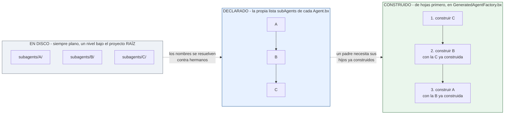

# subagents/

`subagents/` contiene agentes anidados, cada uno un proyecto BX Agents ordinario propio - un `Agent.bx` + `instructions.md` (y opcionalmente sus propios `tools/`, `skills/`, etc.):

```
my-agent/
├── Agent.bx              # subAgents: ["researcher"]
├── instructions.md
└── subagents/
    └── researcher/
        ├── Agent.bx
        └── instructions.md
```

Un subagente se conecta a su padre por nombre, declarado en el `configure()` del `Agent.bx` del padre - el nombre de la CARPETA `subagents/` a conectar en tiempo de build, distinto del propio argumento `subAgents` de `super.init()` (que toma instancias de `AiAgent` ya construidas, no nombres):

```javascript
// Agent.bx
class extends="bxModules.bxai.models.runnables.AiAgent" {

	function init() {
		super.init(
			name  : "my-agent",
			model : aiModel( provider: "openai", params: { model: "gpt-5" } )
		)
		return this
	}

	function configure() {
		return {
			subAgents : [ "researcher" ]
		};
	}

}
```

En tiempo de build, el `addSubAgent()` propio de bx-ai envuelve cada instancia de subagente construida como una tool invocable en el padre automáticamente - no hay ningún paso separado de envoltura de tool que escribir tú mismo.

## Namespace plano, referencias entre hermanos

Cada subagente - sin importar cuán profundamente lo referencie la propia configuración de otro subagente - vive directamente bajo la carpeta `subagents/` del proyecto **raíz**. El propio `subAgents` declarado de un subagente referencia entradas **hermanas** en esa misma carpeta de nivel raíz, no una carpeta anidada bajo sí mismo. Esto mantiene simple el modelo de descubrimiento/validación: un único grafo dirigido plano sobre las subcarpetas inmediatas de `subagents/`, en lugar de un árbol que podría anidarse arbitrariamente profundo en disco.

Plano en disco, un grafo en configuración, construido de abajo hacia arriba - las tres vistas del mismo proyecto:



Un ciclo en el grafo declarado (`A -> B -> A`) se rechaza en la validación, antes de que nada de esto se genere; un diamante (dos padres compartiendo un descendiente) está bien.

## Orden de construcción

Los subagentes se construyen **de hojas primero** (de abajo hacia arriba): si `A` declara `subAgents: ["B"]` y `B` declara `subAgents: ["C"]`, el `GeneratedAgentFactory.bx` generado construye `C`, luego `B` (pasando en la instancia de `C` ya construida), luego `A` (pasando en la instancia de `B` ya construida) - nunca al revés, ya que la llamada `aiAgent()` de un padre necesita las instancias ya construidas de sus hijos.

## Validación

- Un nombre de subagente en `subAgents` que no corresponda a un `subagents/{name}/Agent.bx` real falla la validación con un error claro de "references unknown subagent [...]" - esto aplica a la lista `subAgents` de **cada** nodo, incluyendo el propio `Agent.bx` del proyecto raíz, no solo los subagentes anidados.
- **Las referencias circulares** (`A` → `B` → `A`) se rechazan en tiempo de validación, con la ruta completa del ciclo reportada (por ejemplo, `A -> B -> A`), antes de que ocurra cualquier generación de código.
- Una forma de "diamante" - dos subagentes ambos dependiendo del mismo descendiente compartido - no es un ciclo y se construye bien; solo se rechazan los ciclos genuinos.
- Un `Agent.bx` faltante dentro de una carpeta `subagents/*` descubierta se reporta como su propio error de validación.
- El propio `name` DECLARADO de cada nodo (raíz + cada `Agent.bx` propio de subagente) debe ser único en todo el proyecto - ver abajo.

## Retrieving an agent from `schedules/Scheduler.bx`

Dos nombres diferentes están en juego, y no son intercambiables:

- El **nombre de carpeta** bajo `subagents/` (`researcher` arriba) es lo que referencia `subAgents: [ "..." ]` - es puramente una preocupación de cableado de tiempo de build.
- El propio **`name` declarado** del subagente (el campo `name` de su `Agent.bx`, por ejemplo `"ResearchBot"`) es por lo que lo recuperas en tiempo de ejecución - cada agente en el árbol (raíz + cada subagente) se registra en `config/WireBox.bx` bajo este nombre, así que [`schedules/Scheduler.bx`](schedules.md) (o cualquier otro código consciente de WireBox) lo alcanza con un simple `getInstance( "ResearchBot" )`.

Estos dos nombres pueden diferir, y a menudo lo harán - el nombre de carpeta es un detalle de implementación, el `name` declarado es el que importa en cualquier otro lugar (prompts, recuperación de WireBox). Porque ahora también es una clave de binding de WireBox, `build` falla la validación si dos agentes en el árbol - sin importar cuán profundamente anidados - terminan con el mismo `name` declarado, incluyendo dos que ambos lo dejan sin configurar y silenciosamente comparten el valor por defecto `"BxAi"`.
