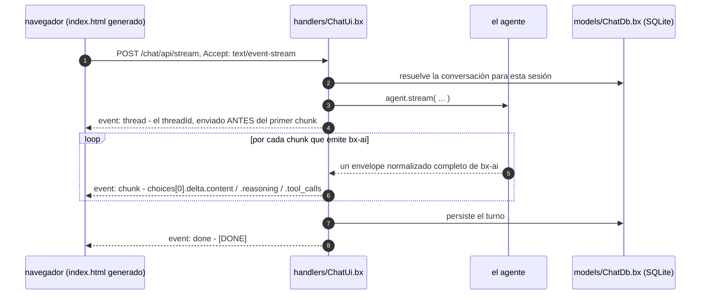

# La interfaz web de chat

Una entrada `gateways/*.bx` con `exposes: "webui"` envía un cliente de chat de navegador completo para el agente - una barra lateral de conversación, streaming con razonamiento y llamadas de tool, aprobaciones human-in-the-loop, temática por visitante, y un almacén SQLite real detrás.

Vive bajo [gateways/](gateways.md) porque ahí es donde se declaran las exposiciones, pero es un subsistema por derecho propio, que es por lo que tiene su propia página.

```javascript
// gateways/chat.bx
class {
	function configure() {
		return {
			exposes     : "webui",
			path        : "/chat",
			apiKeyEnvVar: "CHAT_UI_API_KEY"   // opcional - ver Asegurando la API
		};
	}
}
```

Eso genera un `<path>/index.html` estático (servido directamente - no se necesita ruta) más una API dedicada bajo `<path>/api`, respaldada por un `handlers/ChatUi.bx` y `models/ChatDb.bx` generados.

La interfaz es HTML/CSS/JS vainilla sin dependencias - sin Bootstrap, AlpineJS ni un paso de build de Vite - y está **preconstruida y empaquetada dentro de BX Agents mismo**: `bxAgents build` nunca ejecuta `npm install`/`npm run build`, y un proyecto generado nunca necesita Node ni npm instalados en absoluto. Todo lo que la página necesita está incrustado en el único `index.html` generado.

Esa restricción es sobre el build, no sobre el alcance. La página es un cliente completo: barra lateral de conversación, streaming con razonamiento y llamadas de tool, aprobaciones, compactación, temática del lado del servidor. Lo que realmente todavía falta se lista bajo [What is not here yet](#what-is-not-here-yet).

La página habla con su propia ruta `<path>/api` generada vía `POST <path>/api/stream` (`Accept: text/event-stream`), usando `fetch()` + un lector manual de `ReadableStream` - no el `EventSource` del navegador, que no puede hacer `POST` ni configurar cabeceras personalizadas, ambas necesarias aquí.

!!! warning
    **`toAi()` reenvía cada chunk de bx-ai textualmente - no lo envuelve.** La [documentación de AI Routing](https://coldbox.ortusbooks.com/the-basics/routing/routing-dsl/ai-routing) de ColdBox muestra el stream como líneas `data: {"token":"..."}`, pero su propio código fuente (`Router.cfc`, la subruta de stream de `toAi()`) hace `emitter.send( chunk, "chunk" )` - así que cada frame lleva el **envelope normalizado completo de bx-ai**:

    ```
    event: chunk
    data: {"object":"chat.completion.chunk","choices":[{"delta":{"role":"assistant","content":"Ray","reasoning":"...","tool_calls":[...]}}]}

    event: done
    data: [DONE]
    ```

    No hay ninguna clave `token` en ninguna parte. Un cliente escrito contra esa página de documentación - incluyendo la propia primera versión de esta interfaz - lee `undefined` y no renderiza nada en absoluto. Lee `choices[0].delta.content` en su lugar.

Porque llega el envelope completo, **el razonamiento y las llamadas de tool ya están en el cable** sin necesidad de un endpoint extra: `delta.reasoning` (normalizado a través de cada proveedor por bx-ai) se renderiza como una franja colapsada de "Pensando", y `delta.tool_calls` como chips colapsados por llamada. Los argumentos de llamada de tool se transmiten como fragmentos JSON parciales indexados por `index`, así que la página acumula por índice en lugar de asumir que cualquier chunk único contiene una llamada completa.

## Cómo se ve realmente un turno de streaming



El evento `thread` va primero porque una cabecera de respuesta no puede leerse antes de que el cuerpo empiece a llegar, y la página necesita ese `threadId` para poder hacer `POST /cancel` a mitad de turno.

## La API generada

Una entrada `webui` monta veinte acciones bajo `<path>/api`, servidas por un `handlers/ChatUi.bx` generado:

| Ruta | Propósito |
| --- | --- |
| `POST /invoke` | Un turno síncrono |
| `POST /stream` | Turno SSE (lo que usa la página) |
| `POST /batch` | Ejecuta un array `inputs[]` |
| `POST /cancel` | Detiene una ejecución en curso - `{ threadId, reason? }` |
| `POST /steer` | Empalma un mensaje en un turno en ejecución - `{ threadId, input }` |
| `POST /clear` | Limpia la conversación de este visitante |
| `POST /compact` | Resume los mensajes más antiguos de este visitante, mantiene los recientes - `{ keepRecent }` opcional |
| `GET /history` | Los mensajes almacenados de este visitante, para rehidratar el transcript |
| `POST /resume` | Responde una aprobación pendiente y transmite la continuación - `{ threadId, decision, editedData?, reason? }` |
| `GET /pending` | Qué está esperando una ejecución suspendida - `?threadId=` |
| `GET /tools` | Las tools registradas del agente |
| `GET /health` | Vitalidad |
| `GET /info` | Nombre del agente, modelo, conteos de memoria/tool, flags de capacidad |
| `GET /conversations` | Las conversaciones de este visitante, actividad más reciente primero |
| `POST /conversations/create` | Inicia una - `{ title }` opcional, devuelve el `conversationId` acuñado |
| `POST /conversations/rename` | `{ conversationId, title }` |
| `POST /conversations/delete` | `{ conversationId }` - elimina la fila **y** los mensajes del agente para ella |
| `GET /preferences` | Las preferencias almacenadas de este visitante, como `{ key: value }` |
| `POST /preferences/set` | `{ key, value }` |
| `POST /preferences/delete` | `{ key }` |

Cada una está delimitada por el `getUserSessionIdentifier()` de ColdBox como el `userId`. Las primeras tres mantienen la forma y el formato de cable exactos de `toAi()`.

`threadId` es autoritativo del servidor: tomado del request cuando se suministra, acuñado de lo contrario, y siempre reflejado de vuelta - como una cabecera de respuesta `X-Thread-Id` en `/invoke` y `/batch`, y como un evento SSE `thread` enviado *antes del primer chunk* en `/stream` (una cabecera no puede leerse antes de que el cuerpo empiece a llegar). Ese es el mismo contrato que adoptó el propio `toAi()` de ColdBox 8.1, así que un cliente escrito contra uno funciona contra el otro.

!!! warning
    **Detener debe pasar por `/cancel`, no solo un fetch abortado.** Abortar el request HTTP solo detiene la escucha del navegador - el servidor sigue ejecutando el turno, llamando tools y gastando tokens. La página por lo tanto envía un `threadId` con cada turno y lo publica a `/cancel` antes de abortar, así `agent.cancelRun()` puede señalar la ejecución en su siguiente checkpoint.

`/clear` y `/compact` ambos tienen cuidado con el scope. `/clear` pasa por el propio `clear( userId, conversationId )` de cada memoria en lugar de `AiAgent.clearMemory()`, que no toma argumentos y borraría el historial de cada visitante; `/compact` pasa por `summarize( config, userId, conversationId )` por la misma razón. La compactación reemplaza los mensajes más antiguos de esta conversación con un resumen escrito por IA y mantiene los pocos más recientes, sin tocar nada fuera del par `(userId, conversationId)` del llamador.

!!! info
    **`/compact` necesita un modelo de resumen, y reporta si tiene uno.** `summarize()` es un no-op silencioso a menos que la memoria tenga *tanto* `summaryProvider` como `summaryModel` configurados, y también cuando la conversación ya está en o por debajo de `keepRecent`. Ninguno de los dos es un error, así que `/compact` devuelve `{ compacted, before, after }` y deja que el llamador vea por sí mismo, y `capabilities.compact` de `/info` reporta si hay configurado un modelo de resumen en absoluto - así que una página puede ocultar un botón que no haría nada en lugar de parecer rota.

    Solo `keepRecent` se toma del request. `summarize()` también honra los overrides `model`/`provider`, pero aceptarlos aquí permitiría a cualquier visitante apuntar una llamada de resumen a un proveedor y modelo de su elección con tus credenciales - la propia configuración de la memoria decide eso en su lugar.

```javascript
// Agent.bx - lo que hace funcional a /compact
memory: {
	type            : "cache",
	summaryProvider : "openai",
	summaryModel    : "gpt-4o-mini",
	summaryThreshold: 10
}
```

## Usuarios e inicio de sesión

Por defecto la interfaz web **no tiene cuentas ni compuerta** — está abierta, y cada visitante es anónimo. Esa es la experiencia de cero ceremonia de `bxAgents serve`, y **no** es una postura de despliegue. Declarar `users` en una entrada `webui` activa una compuerta real de inicio de sesión respaldada por [cbauth](https://forgebox.io/view/cbauth) y el mismo almacén SQLite que usa todo lo demás.

### Sin cuentas, la interfaz es un espacio de trabajo compartido

No hay identidad por visitante, a propósito. Cada visitante a una interfaz web sin cuentas lee y escribe las **mismas** conversaciones, preferencias y memoria de agente — quien pueda alcanzar la página ve todo en ella.

Ese es el punto de ejecutar sin cuentas en lugar de un descuido: una interfaz abierta es una única herramienta compartida (un laptop, una máquina interna de confianza), no un servicio multi-tenant. Darle a cada navegador su propia porción solo fragmentaría un espacio de trabajo en copias por navegador que nadie pidió, y cualquier id del lado del cliente que hiciera la fragmentación sería falsificable de todos modos.

!!! warning
    **Una interfaz abierta no tiene privacidad entre visitantes.** Cualquiera que pueda alcanzar la URL ve cada conversación en ella, y puede continuar o eliminar cualquiera de ellas. Si eso no es lo que quieres — en cualquier lugar donde la página sea alcanzable por más que las personas que deberían ver los transcripts — declara `users`.

```javascript
// gateways/chatUi.bx
users : [
    { username: "ada",   passwordEnvVar: "ACME_ADA_PASSWORD", displayName: "Ada Lovelace" },
    { username: "grace", passwordHash: "pbkdf2$210000$...",   displayName: "Grace Hopper" }
]
```

### Las contraseñas nunca se escriben en configuración

Una cuenta nombra la **variable de entorno** que contiene su contraseña (`passwordEnvVar`), o lleva un valor **ya hasheado** (`passwordHash`). Una clave `password` literal es un error de build, no una advertencia — ignorarla silenciosamente te dejaría creyendo que habías configurado una contraseña cuando solo habías commiteado una.

Un `passwordHash` es seguro de commitear precisamente porque no puede revertirse. Genera uno con el mismo hasher que usa la app:

```
bxAgents hash-password --password="correct horse battery staple"
```

!!! danger
    **Hasheado, no encriptado.** La encriptación es reversible, y un archivo de base de datos robado casi siempre viaja con lo que sea que pudiera desencriptarlo — así que un esquema reversible convierte una fuga de archivo en las contraseñas de todos los usuarios, incluyendo cualquiera que hayan reutilizado en otro lugar. Las contraseñas aquí pasan por PBKDF2-HMAC-SHA256 con una sal aleatoria por usuario y nunca son recuperables de la base de datos. (BoxLang no envía ningún BIF de bcrypt o argon2; PBKDF2 es la primitiva más fuerte disponible sin añadir una dependencia.)

    El conteo de iteraciones se almacena *dentro* de cada hash (`pbkdf2$<iterations>$<salt>$<digest>`), así que puede elevarse después sin invalidar nada ya almacenado.

### Qué cambia el inicio de sesión

Todo lo delimitado por usuario se re-indexa a la cuenta real. El `handlers/ChatUi.bx` generado resuelve la identidad desde cbauth directamente, en un método (`resolveUserId()`), y la memoria del agente, el índice de conversaciones, las preferencias y la propiedad de ejecuciones pendientes todas se indexan por su valor de retorno.

Lee cbauth en lugar del ajuste `identifierProvider` de ColdBox deliberadamente: un closure declarado en el struct de configuración `coldbox` nunca llega a `configSettings` — verificado en un arranque real, tanto en la forma literal documentada como como asignación posterior — así que cualquier cosa que dependiera de ese ajuste estaba silenciosamente obteniendo un id de sesión en su lugar.

La diferencia práctica: las conversaciones y preferencias siguen a la persona a través de navegadores y dispositivos, y limpiar cookies ya no crea un "usuario" completamente nuevo.

| | Sin `users` | Con `users` |
|---|---|---|
| Identidad | Un espacio de trabajo compartido | La cuenta con sesión iniciada |
| Conversaciones visibles para | Cualquiera que pueda alcanzar la interfaz | Solo su propietario |
| Sigue a la persona a través de navegadores/dispositivos | n/a — nada es por persona | Sí |
| Alcanzable sin iniciar sesión | Todo | Solo el formulario de inicio de sesión |

### Ciclo de vida

Las cuentas se reconcilian desde la configuración en cada arranque, en este orden: el interceptor de esquema migra, el seeder escribe cuentas, luego la compuerta de inicio de sesión empieza a aplicarse.

- **Añadir** un usuario a la configuración lo crea.
- **Cambiar** su contraseña la actualiza. El seeder rehashea solo cuando la contraseña configurada ya no coincide con lo almacenado, así que una contraseña sin cambios cuesta una verificación en lugar de un hash nuevo.
- **Eliminarlo** de la configuración **desactiva** la cuenta en lugar de eliminarla. Sus conversaciones referencian su id, así que eliminar la fila huerfanaría ese historial en lugar de revocar el acceso. Ya no pueden iniciar sesión; sus datos permanecen intactos y regresan si la cuenta se restaura.
- Un `passwordEnvVar` cuya variable está **sin configurar** omite esa cuenta por completo y registra una advertencia en `webui-auth`. Esto falla cerrado a propósito — crear la cuenta con una contraseña vacía sería mucho peor que que no existiera.

### Qué no es esto

Esto es un roster fijo de cuentas provisionadas por el operador, no un sistema de gestión de usuarios. No hay auto-registro, ni restablecimiento de contraseña, ni roles o permisos, ni límite de tasa o de gasto por usuario. Si necesitas identidad federada en su lugar, edita `resolveUserId()` en el handler generado para devolver tu propio principal autenticado — el resto de la interfaz web ni sabe ni le importa de dónde vino el id.

## Human-in-the-loop

Cuando el agente se pausa para aprobación, el stream emite un chunk `middleware_stop` que no lleva detalle. La página por lo tanto pregunta a `GET /pending?threadId=` qué se está solicitando, lo renderiza con **Aprobar** / **Rechazar**, y responde vía `POST /resume` - que transmite la *continuación del mismo turno*, así que el resultado aterriza en la conversación en lugar de comenzar una nueva.

`decidedBy` se rellena desde la sesión del lado del servidor, nunca desde el cuerpo del request: quién aprobó algo es exactamente el tipo de afirmación que un llamador no debería poder hacer sobre sí mismo.

!!! warning
    **Una ejecución suspendida pertenece a la sesión que la inició, y ambas rutas lo aplican.** Derivar `decidedBy` del lado del servidor solo evita que un llamador mienta sobre *quién* decidió - por sí solo no hace nada sobre *de quién es la ejecución* que están decidiendo. A diferencia de cualquier otra acción, `/pending` y `/resume` se direccionan por `threadId` en lugar de por conversación, así que sin una comprobación de propiedad, un visitante que tenga el `threadId` de otra persona podría leer sus llamadas de tool pendientes y sus argumentos, y aprobar o rechazar en su nombre.

    El propietario no necesita contabilidad extra: el handler estampa el `userId` derivado de la sesión en las opciones de la ejecución, y el agente checkpointea esas opciones junto con la suspensión - así que el estado guardado ya sabe a quién pertenece. `/pending` responde como si nada estuviera pendiente cuando el llamador no es el propietario, así que no puede usarse para sondear si un `threadId` existe en absoluto; `/resume` se niega con un `403`.

## Historial y recarga

El transcript vive en el DOM; la conversación vive en la memoria del agente. Sin rehidratación una recarga muestra una pantalla vacía mientras el agente sigue recordando todo - así que la página se vería en blanco y luego respondería preguntas de seguimiento sobre mensajes que el usuario no puede ver. Al cargar, la página por lo tanto llama a `GET <path>/api/history` y reproduce los mensajes almacenados (markdown y todo), recayendo en el mensaje de bienvenida cuando la conversación está vacía o el fetch falla.

**New** inicia un `conversationId` nuevo. No elimina nada - la conversación previa permanece en el servidor bajo su propio id y aparece en la barra lateral, que es para lo que existe la tabla de conversaciones.

## Lo que hace la página

La página enviada es un cliente de chat real, no una carcasa de demostración. Lee `GET /info` **primero** y se moldea a lo que el servidor realmente reporta, así que un control solo aparece donde existe la capacidad.

| Área | Comportamiento |
| --- | --- |
| **Barra lateral de conversación** | Lista las conversaciones de este visitante más recientes primero, con conteos de mensajes. Cambia, renombra (✎), elimina (×), o inicia una nueva. Los títulos se renderizan a través de `textContent` — un título es lo que el usuario escribió primero, así que nunca se analiza como markup |
| **Dirigir mientras se transmite** | El compositor permanece activo durante un turno. **Send** se convierte en **Steer**, y el mensaje se empalma en la ejecución ya en curso en lugar de iniciar una nueva |
| **Stop** | Publica `/cancel` *antes* de abortar el fetch, así que el servidor realmente deja de gastar tokens, luego mantiene lo que ya se transmitió |
| **Clear / Compact** | Clear vacía esta conversación; Compact aparece solo cuando hay un modelo de resumen configurado, y reporta lo que realmente hizo (`Compacted 12 messages down to 3`, o `Nothing to compact yet`) |
| **Razonamiento + llamadas de tool** | Divulgaciones colapsadas alimentadas desde `delta.reasoning` y `delta.tool_calls` en el mismo envelope |
| **Aprobaciones** | Una pausa human-in-the-loop renderiza una tarjeta de Aprobar/Rechazar desde `GET /pending`, respondida vía `/resume`, que transmite la continuación del mismo turno |
| **Tema** | Almacenado del lado del servidor en `preferences`, así que sigue a la identidad en lugar del navegador. `localStorage` mantiene una copia local para que la elección sobreviva a un request fallido |
| **Modelo** | El nombre del modelo de `/info` se sitúa en el encabezado, así que siempre está claro qué respondió |

**La recuperación importa más de lo que suena.** La última conversación abierta se recuerda en `localStorage`, pero las conversaciones mismas viven en el servidor. Si ese id ya no existe — eliminado en otra pestaña, o un almacén nuevo — la página recae en la conversación restante más reciente en lugar de rehidratar hacia una pantalla vacía sin fila activa.

Las pantallas estrechas obtienen un layout real en lugar de uno exprimido: bajo `40rem` la barra lateral se superpone al transcript en lugar de robarle su ancho, y se honra `prefers-reduced-motion`.

## El almacén SQLite

Cada proyecto `webui` obtiene una base de datos SQLite. No es opcional y no hay ningún flag para desactivarlo.

La razón es un vacío real, no una preferencia: **el `IAiMemory` de bx-ai no tiene ninguna API de enumeración.** Es un bucket por `(userId, conversationId)` — puedes leer, escribir y limpiar uno, pero nada en él responde *"qué conversaciones tiene este usuario."* Una lista de conversaciones, preferencias por usuario, y cualquier otra cosa relacional necesita almacenamiento real junto a la memoria, no dentro de ella.

| Pieza | Qué es |
| --- | --- |
| `bx-sqlite` | El driver JDBC. Sin él, una app webui aún arranca, pero cada query falla en un driver desconocido |
| [`qb`](https://github.com/coldbox-modules/qb) | QueryBuilder para lecturas y escrituras, SchemaBuilder para las tablas. Ningún SQL escrito a mano en ninguna parte |
| `models/ChatDb.bx` | Generado. Posee el esquema y entrega query builders |
| `interceptors/WebUiSchema.bx` | Generado. Construye `ChatDb` en el arranque para que la migración se ejecute entonces, no en cualquier request que toque primero la base de datos |

El datasource se registra en `Application.bx` y la gramática se fija en `config/ColdBox.bx`:

```javascript
// Application.bx (generado)
this.datasources[ "bxagents" ] = {
	"driver"  : "sqlite",
	"database": expandPath( "./data/chat.db" )
}
this.datasource = "bxagents"   // NO this.defaultDatasource - ver abajo

// config/ColdBox.bx (generado)
qb : {
	defaultGrammar : "SQLiteGrammar@qb",
	defaultOptions : { datasource : "bxagents" }
}
```

Ambos son opcionales de sobreescribir, por entrada:

| Clave | Qué hace | Por defecto |
| --- | --- | --- |
| `database.datasource` | El nombre del datasource de ColdBox | `bxagents` |
| `database.path` | El archivo de base de datos, relativo a la raíz de la app | `./data/chat.db` |

Un `database.path` absoluto **falla el build**: se resuelve con `expandPath()` dentro de la app generada, así que una ruta absoluta escapa silenciosamente del directorio de la app y rompe un despliegue de `.bxa` empaquetado.

**El esquema está versionado y es solo-hacia-adelante.** `ChatDb.migrate()` registra lo que ha aplicado en una tabla `bxagents_schema_version` y solo aplica lo que es más nuevo, así que arrancar contra un almacén existente es un no-op. v1 crea `conversations` y `preferences`. Evolúcionalo añadiendo un nuevo `applyV<n>()` y aumentando `SCHEMA_VERSION` — nunca editando una migración que ya se envió, porque **SQLite no puede modificar ni eliminar una columna** y el propio `SQLiteGrammar` de qb lanza `UnsupportedOperation` en lugar de fingir lo contrario.

!!! warning
    **Dos cosas aquí son contraintuitivas, y ambas se establecieron por las malas contra un arranque real de ColdBox en lugar de leerse en una página de documentación.**

    **El ajuste de datasource por defecto es `this.datasource`, no `this.defaultDatasource`.** La clave de registro es plural (`this.datasources[ "name" ]`), así que el valor por defecto singular se lee como si debiera coincidir - y BoxLang acepta `this.defaultDatasource` silenciosamente y no hace nada con él. El fallo que produce nombra el mismísimo datasource que estás intentando seleccionar (`No default datasource defined in the application or globally or in the query options. Registered datasources are: [bxagents]`), lo cual se lee como un mecanismo de selección roto en lugar de un ajuste mal escrito.

    **Nombra el datasource en cada builder de qb; no dependas de `moduleSettings.qb.defaultOptions`.** El `ModuleConfig.cfc` propio de qb mapea `QueryBuilder@qb` con `.initArg( name = "defaultOptions", value = settings.defaultOptions )` en `onLoad()`, así que el ajuste *parece* cubrirte. No llegó en un arranque real - el datasource estaba registrado y el builder todavía tenía opciones vacías. `ChatDb.query()` por lo tanto llama a `.mergeDefaultOptions( { datasource : static.DATASOURCE } )` en cada builder que entrega. `SchemaBuilder@qb` nunca recibe `defaultOptions` en absoluto (qb lo mapea solo con `grammar`), así que cada llamada de esquema pasa `options: { datasource: ... }` ella misma.

    El bloque `moduleSettings.qb` todavía se genera - es correcto para cualquier otro uso de qb en la app - pero el almacén generado no depende de él.

    Si extiendes `ChatDb`, nombra el datasource en lo que añadas.

    Una más, sin cambios: el datasource debe ser un datasource **nombrado**, nunca un struct inline - el propio `appendSqlComments()` de qb tipa ese argumento como `string`, así que un struct lanza antes de que corra cualquier SQL.

La gramática es la única pieza específica de SQLite. Todo lo demás pasa por qb, así que apuntar esto a Postgres o MySQL después es un cambio de gramática y datasource en lugar de una reescritura.

## Conversaciones y preferencias

Estas son para lo que existe el almacén SQLite, y ambas están delimitadas por el mismo `userId` derivado del servidor que todo lo demás.

**Conversaciones.** Cada turno a través de `/invoke`, `/stream` o `/batch` se registra a sí mismo contra el índice: la fila se crea en el primer uso, `updatedAt` se mueve, y el primer mensaje de usuario se convierte en el título (colapsado a una línea, truncado a 60 caracteres) a menos que ya haya uno configurado — así que un renombrado nunca se deshace silenciosamente por el siguiente turno. `messageCount` es un **contador de visualización**, incrementado en dos por turno; un turno que muere a mitad de camino puede dejarlo uno más alto, y `/clear` lo reinicia. La propia memoria del agente sigue siendo la autoridad sobre lo que realmente se dijo.

`/conversations/delete` elimina la fila de índice *y* limpia los mensajes del agente para esa conversación. Eliminar solo la fila dejaría la conversación invisible mientras aún se sienta en el contexto del modelo en el momento en que alguien reutilizara el id.

!!! warning
    **Por qué `touchConversation()` no es un upsert de qb.** Un upsert apunta solo a la clave primaria, así que un llamador que adivinara el `conversationId` de otro visitante haría que su propio `userId` se escribiera en esa fila y tomara la conversación. El almacén lee primero y se niega cuando la fila pertenece a alguien más. `setPreference()` *sí* hace upsert, y de forma segura — su objetivo es la clave compuesta `(userId, prefKey)`, así que la propia identidad del llamador es parte de lo que coincide.

**Preferencias.** Del lado del servidor en lugar de `localStorage`, así que siguen a la identidad en lugar del navegador. Apunta `identifierProvider` a un principal autenticado real y las preferencias de un visitante lo siguen a través de dispositivos sin cambio al código generado.

## Branding y temática

Cada clave de abajo es opcional - la entrada funciona con solo `exposes` y `path`.

| Clave | Qué hace |
| --- | --- |
| `title` | Título del navegador y encabezado del header |
| `subtitle` | Línea pequeña bajo el encabezado |
| `icon` | Un emoji (renderizado en un favicon inline-SVG **y** el header) o una URL/ruta de imagen (`/logo.svg`, `https://…`, `data:image/…`) |
| `welcome` | Mensaje de estado vacío mostrado antes del primer turno |
| `placeholder` | Placeholder del input del compositor |
| `footer` | Nota pequeña bajo el compositor - descargos de responsabilidad, enlaces |
| `showReasoning` | Muestra la franja de "Thinking". Por defecto `true` |
| `showToolCalls` | Muestra chips de llamada de tool. Por defecto `true` |
| `theme` | Tokens de diseño - ver abajo |
| `themeFile` | Ruta a un override de CSS, relativo a la raíz del proyecto. Por defecto `resources/webui/theme.css` |

`theme` se mapea directamente sobre las propiedades personalizadas de CSS de la página: `accent`, `accentFg`, `bg`, `fg`, `muted`, `border`, `surface`, `inputBg`, `bubbleUser`, `bubbleUserFg`, `bubbleAssistant`, `bubbleAssistantFg`, `bubbleError`, `reasoningFg`, `reasoningBg`, `toolFg`, `toolBg`, `radius`, `radiusSm`, `font`, `fontMono`, `fontSize`, `maxWidth`. Un bloque anidado `theme.dark` sobreescribe cualquiera de los mismos tokens para el modo oscuro. Un token desconocido **falla el build** en lugar de ser silenciosamente ignorado, así que un typo sale a la superficie de inmediato en lugar de dejarte preguntándote por qué tu color de marca nunca apareció.

```javascript
// gateways/chat.bx
theme: {
	accent : "0f766e",
	radius : "10px",
	font   : "Inter, system-ui, sans-serif",
	dark   : { accent : "rgb(45, 212, 191)" }
}
```

!!! info
    **Escribe colores hex desnudos, sin almohadilla inicial.** BoxLang comienza la interpolación de cadenas en `#` tanto en cadenas de comillas simples **como** dobles, así que un color hex literal en una configuración `.bx` es un error de análisis a menos que la almohadilla se duplique - una trampa que nadie recuerda. El generador la vuelve a añadir por ti, así que `"0f766e"` simplemente funciona. `rgb()`, `hsl()` y los colores nombrados no necesitan nada especial de cualquier manera.

Para cualquier cosa que los tokens no cubran - fuentes personalizadas, layout, reglas por elemento - coloca un `resources/webui/theme.css` en el proyecto. Se incrusta **al final** en el `<style>` de la página, así que le gana tanto a los valores por defecto enviados como a los tokens de `theme`; y siendo un archivo `.css` real, el hex `#rrggbb` ordinario funciona ahí normalmente. (Un `</style` literal en ese archivo falla el build, ya que terminaría prematuramente el bloque de estilo de la página.)

!!! warning
    **`apiKeyEnvVar` es una compuerta simple y activable - no un sistema de inicio de sesión completo.** Sin configurar, `<path>/api/*` está completamente abierto (bien para desarrollo local, no para un despliegue público). Configúralo, y un interceptor `preProcess` generado (`interceptors/WebUiAuthGate.bx`) requiere que cada request bajo `<path>/api/*` lleve una cabecera `X-API-Key` que coincida, comparada vía `java.security.MessageDigest.isEqual()` - la misma disciplina de comparación en tiempo constante que ya usa la propia comprobación de firma de cada gateway de webhook. **El shell estático mismo (`<path>/index.html`) deliberadamente NO está protegido** - solo `<path>/api/*` lo está - porque la navegación de página simple de un navegador no puede enviar una cabecera personalizada, así que proteger el shell haría inalcanzable, sin la clave ya en mano, la misma página que te pide la clave. El propio JS de la página pide la clave (un botón "Key", almacenado en `localStorage`) y la envía en cada llamada de API que hace de ahí en adelante.


## Identidad de conversación: la sesión ES el identificador de usuario

**Cada memoria que un agente mantiene está indexada por `(userId, conversationId)`** - y un agente puede mantener varias a la vez (`memories` de `AiAgent` es un array; `loadMemoryMessages()` itera sobre todas ellas con el mismo par). `AiAgent.run()`/`.stream()` recaen en `""` para ambos cuando nada los suministra, así que sin identidad del lado del servidor **cada visitante aterriza en un único bucket compartido**, sin importar qué tipos de memoria estén configurados.

La solución es identidad, no tipo de memoria. Un proyecto con una exposición `webui` por lo tanto obtiene:

1. **Gestión de sesión activada** en el `Application.bx` generado - `this.sessionManagement = true`, `this.setClientCookies = true`, un `sessionTimeout` de 60 minutos. Las cookies son fundamentales: sin cookie, sin id de sesión.
2. **Su propio `handlers/ChatUi.bx`**, que pasa el `getUserSessionIdentifier()` de ColdBox como el `userId` del agente en **las tres formas de ejecutor** - `invoke`, `stream` y `batch`.

```javascript
// handlers/ChatUi.bx (generado)
private string function resolveUserId() {
	return controller.getUserSessionIdentifier()
}
```

Delegar a ColdBox en lugar de leer `session.sessionId` directamente compra tres cosas: el id está prefijado por aplicación, cae de vuelta a través de URLToken/CFID si una sesión de alguna manera no está disponible, y - lo que más importa - honra el ajuste de configuración **`identifierProvider`**. Apunta eso a tu principal autenticado y cada memoria se re-indexa al usuario real sin cambio al handler generado.

Porque la identidad es emitida por el servidor, el scoping se mantiene sin importar qué memorias configure el proyecto - una o muchas, `window`, `cache`, `jdbc`, vectorial, cualquier mezcla.

!!! info
    **¿Por qué no `toAi()` para la webui?** El `toAi()` de ColdBox 8.1 ahora deriva el contexto conversacional él mismo, y su respaldo es exactamente la misma llamada que hace este handler: `len( body.userId ) ? body.userId : controller.getUserSessionIdentifier()`. La diferencia es la precedencia - `toAi()` deja que **un `userId` suministrado por el llamador gane**, lo cual es correcto para un llamador de confianza servidor-a-servidor pero incorrecto para un navegador sentado detrás de una única clave de API compartida, donde cualquiera podría nombrarse a sí mismo como cualquier otro y leer la memoria de otro visitante. El handler generado deriva la identidad únicamente del lado del servidor, y nunca mira `body.userId`. Mantiene la forma de ruta exacta de `toAi()` (`/invoke`, `/stream`, `/batch`, `/info`), su formato de cable SSE, y su reflejo de evento `X-Thread-Id`/`thread`, así que sigue siendo un reemplazo directo. Los otros tipos de exposición (`exposes: "agent"`) todavía usan `toAi()` sin cambios - servidor-a-servidor es el caso para el que está construida su precedencia.

`conversationId` todavía viene del cliente, y eso es deliberado: distingue varias conversaciones pertenecientes al *mismo* visitante - es lo que rota el botón **New**. No es el límite de aislamiento; el `userId` derivado de la sesión lo es.

Ningún tipo de memoria se fuerza. Elige uno (o varios) por agente con una clave `memory` en `Agent.bx`, la misma forma que `checkpointer`:

```javascript
// Agent.bx
memory: { type: "cache", maxMessages: 50 }
```

Un proyecto sin `webui` mantiene las sesiones desactivadas y el propio valor por defecto de memoria de bx-ai - una app solo de API/gateway no tiene navegador que rastrear, y una sesión ahí es overhead más una cookie que nadie pidió.

## Renderizado de respuesta

Las respuestas del asistente se renderizan a través de un subconjunto de markdown deliberadamente pequeño: código con fence e inline, negrita/cursiva, enlaces, listas de viñetas y numeradas, encabezados. Se aplica **escape-primero**: el texto del modelo se escapa a HTML antes de que se introduzca una sola etiqueta, así que ninguna salida del modelo puede convertirse en markup en vivo, y los hrefs de enlace están en lista blanca a `http(s)`/`mailto` así que una URL `javascript:` nunca se convierte en un anchor en absoluto.

!!! info
    El compositor es un `textarea` - **Enter** envía, **Shift+Enter** añade una línea nueva, y crece hasta unas seis líneas antes de hacer scroll. Un turno en curso puede detenerse con **Stop** (un `AbortController`), que mantiene lo que ya se transmitió en lugar de descartarlo. El transcript solo hace auto-scroll cuando ya estás en la parte inferior, así que desplazarte hacia arriba para releer algo a mitad de stream no te jala de vuelta hacia abajo.

## What is not here yet

La página está completa contra su propia API - cada ruta que necesita existe y se ejercita. Estos son los vacíos:

| Falta | Nota |
| --- | --- |
| Adjuntos / entrada de imagen | El compositor es solo texto. El propio bx-ai maneja imágenes, así que este es un vacío de UI, no de capacidad |
| Reintentar / regenerar | Un turno fallido tiene que reenviarse a mano |
| Editar y reenviar | No se puede editar un mensaje ya enviado |
| Visualización de tokens / costo | Nada muestra el uso, aunque el proveedor lo devuelve |

Ver [Limitaciones conocidas](../known-limitations.md) para qué se verificó y qué no contra un arranque real de ColdBox, incluyendo las partes de esta página que solo están cubiertas por aserciones a nivel de generador en lugar de conducir un navegador.
