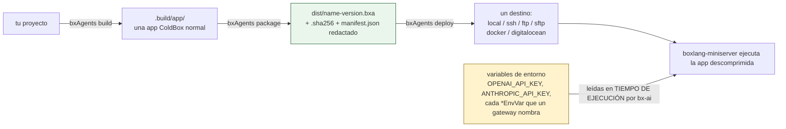

# Despliegue y secretos

Los secretos nunca entran en el artefacto - se suministran al **proceso**, en el extremo derecho de esta cadena:



Nada a la izquierda de `ENV` guarda jamás un valor secreto: los `.env`/dotfiles se excluyen del zip incondicionalmente, y el manifest se redacta además de nunca llevar uno.

## Empaquetado

`bxAgents package` comprime `.build/app/` en un artefacto `.bxa` portable:

```bash
bxAgents package --version=1.0.0
```

produce, en `dist/`:

- `{agentName}-{version}.bxa` - la app comprimida
- `{agentName}-{version}.bxa.sha256` - su checksum
- `manifest.json` - una copia **redactada** del manifest del build (ver abajo)

Empaquetar dos veces seguidas sobre el mismo build produce bytes de zip idénticos byte a byte (orden de entradas/timestamps determinista) - útil para verificar que un artefacto construido en CI coincide con uno construido localmente.

`package` requiere un `build` previo (lee `.build/manifest.json`) y se niega a ejecutarse - sin producir ningún `.bxa` - si `manifestVersion` no está definido o está malformado.

## Excluir archivos: `.bxaignore`

Un `.bxaignore` opcional en la raíz del proyecto, un patrón glob por línea (las líneas con prefijo `#` son comentarios), excluye las rutas coincidentes del `.bxa` empaquetado:

```
# .bxaignore
*.log
scratch/
```

Esto se suma a una exclusión codificada y siempre activa de `.env`/`.env.*`/dotfiles en la capa de empaquetado - incluso si `.bxaignore` no los menciona, y aunque de alguna manera hayan terminado dentro de `.build/app`, nunca llegan al zip.

## Redacción de secretos

Los secretos nunca se escriben en `manifest.json` desde el principio - el bloque `agent` del manifest solo contiene campos seguros y estructurales (`name`, `description`, `model`, `environment`). Como defensa en profundidad, `package` además recorre el manifest recursivamente y reemplaza cualquier clave de struct que **parezca** un secreto con `[REDACTED]`:

```
(apikey | api_key | token | secret | password)$   (sin distinguir mayúsculas/minúsculas, cualquier prefijo)
```

Esto protege contra un futuro campo - o un llamador que pase un struct más rico a `package` de alguna otra manera - filtrando accidentalmente un valor, aunque el manifest de hoy nunca coloca uno allí en primer lugar.

## Dónde viven los secretos reales

BxAgents nunca resuelve, almacena, ni incrusta claves de API, tokens o contraseñas de proveedor en ningún build o package. Eso es enteramente trabajo de bx-ai, en **tiempo de ejecución**: los lee del entorno del proceso siguiendo su propia convención de estilo `<PROVIDER>_API_KEY` (por ejemplo, `OPENAI_API_KEY`, `ANTHROPIC_API_KEY`). Configúralos como normalmente gestionas secretos para un proceso desplegado - una variable de entorno del SO, un archivo `.env` cargado por tu gestor de procesos (nunca commiteado, nunca empaquetado), o el gestor de secretos de tu plataforma.

```bash
export OPENAI_API_KEY=sk-...
bxAgents serve
```

## Desplegando

```bash
bxAgents deploy --destination=/path/to/somewhere   # local, forma abreviada solo con flags
bxAgents deploy --name=production                  # cualquier destino, vía deploy/production.bx
```

Seis destinos pluggable vienen incluidos - `local` (copiar el `.bxa` más nuevo a algún lugar), `ssh` (enviarlo a un servidor desnudo), `ftp`/`sftp` (enviarlo vía el módulo real [`bx-ftp`](https://github.com/ortus-boxlang/bx-ftp), una dependencia de runtime genuina de este proyecto), `docker` (construir/subir una imagen de contenedor), y `digitalocean` (desplegar a una app de DigitalOcean App Platform) - ver [deploy/](conventions/deploy.md) para la forma completa de configuración de cada uno y [Referencia de CLI](cli-reference.md#deploy) para los flags de CLI.

Ningún destino lee jamás un secreto desde la configuración de `deploy/*` - las credenciales (contraseñas de registro, claves SSH, el token de API de DigitalOcean) siempre se resuelven desde variables de entorno en tiempo de despliegue, la misma regla de "los secretos permanecen externos" que en cualquier otro lugar de este documento. Ver [deploy/](conventions/deploy.md#secrets-stay-external) para la variable de entorno exacta que espera cada destino.

Para ejecutar un `.bxa` empaquetado en otro lugar manualmente: descomprímelo (es una aplicación ColdBox normal) y apunta `boxlang-miniserver` al directorio extraído, configurando las variables de entorno secretas que ese despliegue necesite.
