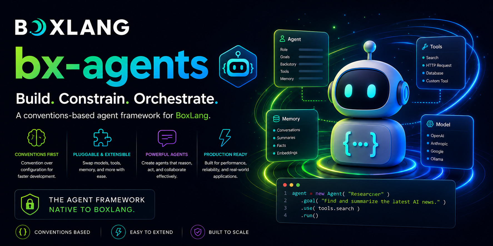

<div class="bxdocs-hero">
	
	<div class="bxdocs-hero__actions">
		<a class="bxdocs-hero__btn bxdocs-hero__btn--primary" href="getting-started/installation.md">Comenzar</a>
		<a class="bxdocs-hero__btn bxdocs-hero__btn--secondary" href="https://github.com/ortus-boxlang/bx-agents">Ver en GitHub</a>
	</div>
</div>

**BX Agents** es un framework de agentes de IA basado en convenciones para [BoxLang](https://boxlang.io),
construido sobre [ColdBox](https://coldbox.ortusbooks.com) y
[BX AI](https://boxlang.ortusbooks.com/boxlang-+-++/modules/bx-ai). Describes un agente
con archivos y carpetas - no con la superficie de una API de framework - y `bxAgents build` ensambla
una aplicación ColdBox real y ejecutable a partir de eso.

::: cards
::: card title="Ensamblado en tiempo de build" icon="phosphor-duotone:gear-six" href="build-pipeline.md"
El descubrimiento, la validación y la generación de código se ejecutan **una vez**, no en cada arranque. Lo que ejecutas
después es una aplicación ColdBox normal.
:::
::: card title="Las carpetas son la API" icon="phosphor-duotone:tree-structure" href="conventions/agent-bx.md"
`Agent.bx` e `instructions.md` son los únicos archivos requeridos. Cada otra carpeta de convención
es opcional y solo moldea la salida si existe.
:::
::: card title="Herramientas y skills" icon="phosphor-duotone:wrench" href="conventions/tools.md"
Coloca una función anotada con `@AITool` en `tools/`, o una carpeta `SKILL.md` en `skills/` -
ambas se descubren y conectan automáticamente por ti.
:::
::: card title="Agentes hasta el fondo" icon="phosphor-duotone:users-three" href="conventions/subagents.md"
`subagents/` anida exactamente el mismo árbol de convenciones, así que un equipo de especialistas es solo más
carpetas - construido de hojas hacia la raíz.
:::
::: card title="Doce tipos de gateway" icon="phosphor-duotone:chats-circle" href="conventions/gateways.md"
Telegram, Slack, Discord, Email, WhatsApp, Teams, Twilio, GitHub y Signal, además de `http`,
`cli` y `mock`.
:::
::: card title="Una interfaz web de chat, generada" icon="phosphor-duotone:globe-hemisphere-west" href="conventions/web-ui.md"
Pídela en `Agent.bx` y el build produce un front end de chat con streaming, personalizable, con
historial de sesiones.
:::
:::

## Construye uno en cuatro pasos

::: stepper
::: step "Instalar"
=== "BoxLang"
    ```bash
    install-bx-module bx-ai bx-agents
    ```

=== "CommandBox"
    ```bash
    box install bx-ai,bx-agents
    ```
:::
::: step "Generar el andamiaje"
```bash
bxAgents new my-agent --model=openai/gpt-5
```
Luego edita `instructions.md` y añade las carpetas de convención que necesites.
:::
::: step "Construir"
```bash
bxAgents build
```
Descubrimiento, validación, manifest, generación de código - en `.build/app/`.
:::
::: step "Háblale"
```bash
bxAgents chat
# o sírvelo por HTTP:
bxAgents serve --port=8080
```
:::
:::

## Lo que `build` realmente produce

Tu árbol de convenciones, y la aplicación ColdBox normal en la que `build` lo convierte.

::: columns
::: column
```
your-agent/
├── Agent.bx           # nombre, modelo, descripción
├── instructions.md    # el system prompt
├── tools/             # funciones @AITool
├── skills/            # capacidades SKILL.md
├── subagents/         # árboles de agentes anidados
├── models/            # configuraciones de modelo con nombre
├── gateways/          # exposición HTTP/MCP/chat
├── schedules/         # un scheduler ColdBox real
├── mcp/               # servidores MCP que hospedas
├── interceptors/      # hooks de ciclo de vida
└── modules/           # dependencias de módulos
```
:::
::: column
```
.build/app/
├── Application.bx
├── config/
│   ├── ColdBox.bx
│   ├── WireBox.bx
│   ├── Router.bx
│   └── Scheduler.bx
├── agent/
│   └── GeneratedAgentFactory.bx
├── tools/  skills/  mcp/
├── handlers/  interceptors/
└── index.bxm
```
:::
:::

::: expandable "¿Por qué ensamblar en tiempo de build en lugar de en tiempo de request?"
La mayoría de los frameworks de agentes conectan herramientas, skills, rutas y programaciones **en tiempo de request**,
en cada arranque. BX Agents hace lo contrario: `bxAgents build` ejecuta descubrimiento, validación y
generación de código exactamente una vez, produciendo una aplicación ColdBox normal bajo `.build/app/`.

Iniciarla - vía `bxAgents serve`, un proceso real de
[`boxlang-miniserver`](https://boxlang.ortusbooks.com/getting-started/running-boxlang/miniserver),
o un `.bxa` portable desplegado en cualquier lugar donde corra BoxLang - es entonces solo arrancar
una aplicación ordinaria. Sin escaneo de convenciones, sin recorrido dinámico de archivos, sin trabajo de
tiempo de build diferido al camino del request.
:::

::: columns
::: column
!!! tip "Empieza con un solo archivo"
    Solo `Agent.bx` es requerido. `instructions.md` es opcional - configura las instrucciones directamente
    en la clase, o coloca el archivo y deja que el build lo conecte por ti. Cada otra carpeta solo
    afecta la salida generada si existe **y** tiene contenido en ella - así que agregas
    convenciones a medida que realmente las necesitas.
:::
::: column
!!! faq "Agent.bx ES el agente"
    `Agent.bx` extiende directamente el propio `AiAgent` de BX AI - el build instancia tu clase
    en lugar de reconstruir una a partir de un struct de configuración, así que lo que escribes es lo que se ejecuta, y un
    IDE puede introspeccionarla como cualquier otra clase. Ver [Agent.bx](conventions/agent-bx.md).
:::
:::

## Llega a él desde cualquier lugar

::: cards
::: card title="Plataformas de chat" icon="phosphor-duotone:plugs-connected" href="conventions/gateways.md"
Nueve gateways de estilo push - Telegram, Slack, Discord, Email, WhatsApp Cloud, Teams, Twilio,
GitHub y Signal - coordinados por una sesión con políticas `queue` / `steer` / `interrupt`.
:::
::: card title="HTTP y MCP" icon="phosphor-duotone:stack" href="conventions/mcp.md"
Expón el agente sobre rutas HTTP, u hospeda servidores MCP locales desde `mcp/` para que otros clientes
puedan llamar a tus herramientas.
:::
::: card title="Envíalo" icon="phosphor-duotone:package" href="deployment-and-secrets.md"
Empaqueta un `.bxa` portable y despliégalo con `local`, `ssh`, `docker`, `digitalocean`,
`ftp` o `sftp` - los secretos permanecen como variables de entorno, nunca como artefactos de build.
:::
:::

## A dónde ir después

::: cards
::: card title="Instalación" icon="phosphor-duotone:rocket-launch" href="getting-started/installation.md"
Instala BoxLang, BX AI y BX Agents.
:::
::: card title="Inicio rápido" icon="phosphor-duotone:lightning" href="getting-started/quick-start.md"
Genera el andamiaje, construye y habla con tu primer agente.
:::
::: card title="Convenciones" icon="phosphor-duotone:cube" href="conventions/agent-bx.md"
Una página por carpeta de convención, de principio a fin.
:::
::: card title="El pipeline de build" icon="phosphor-duotone:graph" href="build-pipeline.md"
Exactamente qué hace `build`, en orden.
:::
::: card title="Referencia de CLI" icon="phosphor-duotone:terminal-window" href="cli-reference.md"
Cada verbo y sus flags.
:::
::: card title="Despliegue y secretos" icon="phosphor-duotone:cloud-arrow-up" href="deployment-and-secrets.md"
Empaqueta un `.bxa` y envíalo, de forma segura.
:::
:::

Cada carpeta de convención también tiene una muestra funcional y construible en
[`examples/`](https://github.com/ortus-boxlang/bx-agents/tree/development/examples).

!!! warning
    BX Agents está en desarrollo activo. [Limitaciones conocidas](known-limitations.md) rastrea
    los vacíos honestos - qué se ha probado contra una aplicación real en ejecución, qué todavía solo corre contra
    el proveedor `"mock"` de BX AI, y una peculiaridad real y ascendente de ColdBox con la que este proyecto se topó y
    solucionó.
