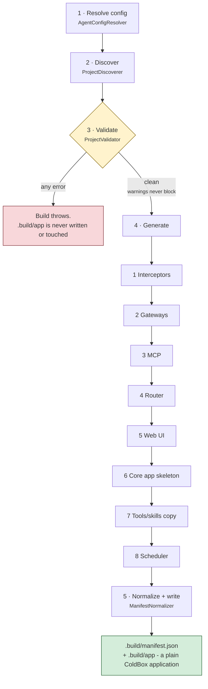

# ビルドパイプライン

`bxAgents build` は固定されたフェーズの並びを一度だけ実行し、ただの ColdBox アプリケーションを生成します。ここで行われることはリクエスト時には二度と実行されません - それがビルド時組み立ての意義そのものです。このページでは `BuildPipeline.bx` が各フェーズを実行する順序どおりに解説します。

検証はゲートです。フェイルファストせず**すべての**エラーを収集し、クリーンな結果が返るまでは何も生成されません。

(`.bxa` へのパッケージングは意図的に分離されたステップです - [デプロイとシークレット](deployment-and-secrets.md) 参照 - そのため、高速な `build` → 確認 → 再度 `build` というループが、不要なパッケージングのコストを一切払わずに済みます。)

## 1. config の解決

[`AgentConfigResolver`](conventions/agent-bx.md) が `Agent.bx` を読み込み、`configure()` とアクティブな環境のオーバーライドメソッドを呼び出したうえで、存在すれば `boxlang.json`/`boxlang-{env}.json`/`miniserver.json`/`miniserver-{env}.json` を深いマージで取り込みます。これにより、以降のすべてのフェーズが参照する、単一の解決済み config 構造体が生成されます。

## 2. 発見 (Discover)

[`ProjectDiscoverer`](conventions/agent-bx.md) がプロジェクトルートを走査し、すべてのコンベンションフォルダ (`models/`、`tools/`、`skills/`、`subagents/`、`gateways/`、`mcp/`、`interceptors/`、`modules/`) を生の `{ name, path, type }` エントリとして列挙します。`schedules/` だけは例外で、エントリの一覧ではなく単一の `hasScheduler`/`schedulerPath` のペアです。これは、BxAgents が定義する config エントリの集合ではなく、実際の ColdBox スケジューラファイルを 1 つ保持するだけだからです。この段階では純粋な発見のみで、ファイル内容の解釈はまだ行われません。

## 3. 検証 (Validate)

[`ProjectValidator`](conventions/agent-bx.md) はすべてのバリデータを実行し、(フェイルファストせずに) **すべての**エラーと警告を収集します。重複したツール/スキル/モデル/サブエージェント名、サブエージェントツリー全体にわたるエージェント `name` の重複 (see [subagents/](conventions/subagents.md#retrieving-an-agent-from-schedulesschedulerbx))、循環したサブエージェント/モジュール参照、2 種類のゲートウェイエントリ形状、リモート MCP config の完全性、モデル/プロバイダーの妥当性などです。エラーが 1 つでも収集された場合、ビルドはここで即座に例外を投げます - `.build/app` は一切書き込まれず、触れられもしません。警告 (例えば `Scheduler.bx` を持たない `schedules/` フォルダ) はビルドをブロックしません。

## 4. 生成 (Generate)

検証がクリーンな場合にのみ到達します。順序は以下の通りです。

1. **インターセプター** - [`InterceptorSplitter`](conventions/interceptors.md) が `agent` スコープのインターセプターを `.build/app/interceptors` にコピーし、`runtime` スコープのものは別の `.build/runtime-interceptors` ディレクトリにコピーします。
2. **ゲートウェイ** - [`GatewayGenerator`](conventions/gateways.md) がチャネルアダプタエントリ向けに `aiGatewayRegistry().register(...)` 文を出力し、(いずれかが `type: "http"` であれば) `.build/app/handlers/Gateway.bx` を書き込みます。エントリのいずれかが push 型ゲートウェイ (例えば `type: "telegram"`) であれば、`.build/app/interceptors/GatewaySessionBootstrap.bx` も書き込み、(すべての push 型ゲートウェイをまとめた) 単一の bx-ai `GatewaySession` をプロジェクトのルートエージェントに配線します。
3. **MCP** - [`McpGenerator`](conventions/mcp.md) がローカルの `mcp/*` サーバーを `.build/app/mcp` にコピーし、その `mcpServer(...).registerTool(...)` の登録文を出力します。
4. **ルーター** - [`RouterGenerator`](conventions/gateways.md) が `.build/app/config/Router.bx` を書き込みます。公開エントリごとに 1 つの `route(path).toAi(...)`/`toMCP(...)`、加えて `http` タイプのチャネルゲートウェイが存在する場合は 3 つの固定 Webhook ルート、さらに `whatsapp-cloud`(GET+POST)、`teams`、`twilio`、`github` の各プッシュ型ゲートウェイが存在する場合はそれぞれ 1 つずつ追加の Webhook ルートも書き込みます。
5. **Web UI** - [`WebUiGenerator`](conventions/web-ui.md) が `exposes: "webui"` エントリごとに実行され、静的な `<path>/index.html`、`handlers/ChatUi.bx` (20 個のアクションを持つ API)、`models/ChatDb.bx` (SQLite ストアとその前方向専用マイグレーション)、`interceptors/WebUiSchema.bx` (どのリクエストが最初にデータベースへ触れるかに関わらず、起動時にマイグレーションを行う)、そして `apiKeyEnvVar` が設定されている場合に限り `interceptors/WebUiAuthGate.bx` を書き込みます。これは解決済みのデータベース config を返し、次のステップがそれを必要とします。
6. **コアアプリスケルトン** - `ColdBoxAppGenerator` が `Application.bx`、`config/ColdBox.bx`、`config/WireBox.bx`、`agent/GeneratedAgentFactory.bx`、`index.bxm` を書き込み、これまでに集められたすべての文 (ゲートウェイ登録、MCP 登録、そして `tools/` にファイルが 1 つでもあればシンプルな `aiToolRegistry().scan("tools")` 呼び出し) を `Application.bx` の `onApplicationStart()` に、そして (生成されていれば) フェーズ 1 の `GatewaySessionBootstrap.bx` を `config/ColdBox.bx` が参照する `interceptors` リストに、それぞれ差し込みます。生成されるすべてのエージェントは今や常にチェックポインターを受け取ります (`withCheckpointer(...)` - プロジェクトが `checkpointer` config を宣言しておらず、クラス自身も設定していない場合は `cache` バックエンドの `aiMemory()` がデフォルトになります)。これがないと、`cli` 以外のどのゲートウェイを通した human-in-the-loop 承認フローも完全に壊れてしまいます。`config/WireBox.bx` は、固定されたルートの `"GeneratedAgent"` エイリアスだけでなく、ツリー内のすべてのエージェント (ルート + すべてのサブエージェント) をそれぞれの宣言された `name` でマッピングします - see [schedules/](conventions/schedules.md)。`webui` 公開を持つプロジェクトでは、セッション管理も有効化し、SQLite データソースを登録し (`this.datasource` によりアプリのデフォルトとして命名)、`onApplicationStart()` でデータベースの親ディレクトリを作成し (SQLite はファイルは作成しますがそれを収めるフォルダは作成しません)、`config/ColdBox.bx` で qb のグラマーを固定します。
7. **ツール/スキルのコピー** - `ToolsSkillsCopier` が `.build/app/tools` と `.build/app/skills` を消去し、あなたのプロジェクト自身のフォルダからそのまま書き直します。
8. **スケジューラ** - [`SchedulerGenerator`](conventions/schedules.md) が、存在すれば `schedules/Scheduler.bx` をそのまま `.build/app/config/Scheduler.bx` にコピーします - 生成は行われません。あなた自身が書いた実際の ColdBox コードだからです。

## 5. マニフェストの正規化と書き込み

[`ManifestNormalizer`](manifest.md) が、発見データと解決済み config データから、正規で内容ハッシュ付きの内部マニフェストを生成し、パイプラインがそれを `.build/manifest.json` に書き込みます。

## 冪等性

変更のないプロジェクトを再ビルドすると、マニフェストのファイルごとの内容ハッシュに至るまで、バイト単位で同一の出力が生成されます - この組み立てコストをビルド時に一度だけ払い、その作業をリクエスト処理へ一切先送りしないという、この仕組み全体の意義そのものです。
