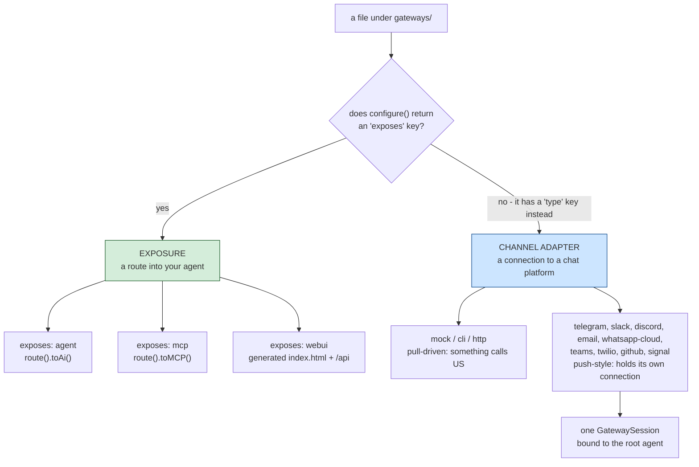
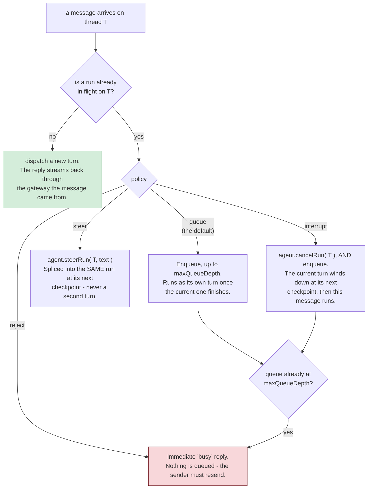

# gateways/

この 1 つのフォルダの下にある `gateways/*.bx`/`.json` ファイルは、**2 つの別個の、無関係な**ことをカバーしています - あるエントリがどちらの種類かは、その `configure()` 構造体が `exposes` キーを持つかどうかだけで決まります。

!!! warning
    これらを混同しないでください - HTTP 公開されたエージェント (`exposes: "agent"`) はあなたのエージェント用の REST API であり、チャネルアダプタゲートウェイ (`type: "http"`) はチャットプラットフォームや human-in-the-loop 承認フロー用の Webhook エンドポイントです。生成されるルートはまったく異なります。



## 1. HTTP/MCP/Web UI 公開 (`exposes: "agent" | "mcp" | "webui"`)

ColdBox 8.1 のネイティブな AI Routing DSL を使って、エージェント、またはローカル MCP サーバーを HTTP 経由で公開します - あるいは、[Web チャット UI](web-ui.md) で別途解説している、あらかじめビルドされたブラウザチャット UI として公開します。

**エージェントを公開する:**

```javascript
// gateways/expose.bx
class {

	function configure() {
		return {
			exposes : "agent",
			path    : "/api/chat"
		};
	}

}
```

`config/Router.bx` に、以下を生成します。

```javascript
route( "/api/chat" ).toAi( "GeneratedAgent" )
```

これは**4 つの**サブルート: `POST /api/chat/invoke`、`POST /api/chat/stream` (SSE)、`POST /api/chat/batch`、`GET /api/chat/info` を自動登録します。素の `/api/chat` パス自体はルーティング対象ではありません。

**ローカル MCP サーバーを公開する** ([mcp/](mcp.md) 参照):

```javascript
class {
	function configure() {
		return {
			exposes : "mcp",
			path    : "/mcp/tools",
			target  : "local-server"   // must match an mcp/*.bx entry's declared name
		};
	}
}
```

`route( "/mcp/tools" ).toMCP( "local-server" )` を生成します。

**v1 の Web チャット UI を公開する:**

```javascript
// gateways/chat.bx
class {
	function configure() {
		return {
			exposes     : "webui",
			path        : "/chat",
			apiKeyEnvVar: "CHAT_UI_API_KEY"   // optional - see below
		};
	}
}
```

実際の静的な `<path>/index.html` ファイル (直接配信され、ルートは不要です) に加えて、固定された `<path>/api` プレフィックス配下の専用 API を生成します。これにより、シェル自身のファイルと衝突することは決してありません。その API は `toAi()` ではなく生成された `handlers/ChatUi.bx` であり、このエントリは生成された SQLite ストアも一緒に持ってきます。

Web UI は単一の公開スイッチというより 1 つのサブシステムです - ルート一覧、ストア、会話と設定、ブランディングとテーマ、そしてなぜ `toAi()` を使わないのかは、すべて独自のページにあります: **[Web チャット UI](web-ui.md)**。

**検証:** `exposes` は `agent`、`mcp`、`webui` のいずれかである必要があります。`path` は必須で、すべての公開エントリの間で一意である必要があります。`mcp` 公開の `target` は必須で、実在する `mcp/*` エントリの宣言された名前と一致する必要があります。`webui` の `apiKeyEnvVar` は完全に任意で、必須フィールドチェックはありません (下記参照)。

## 2. チャネルアダプタゲートウェイ (`type: "mock" | "cli" | "http"`)

bx-ai の `IGateway` (外部配信 / human-in-the-loop 承認用のチャネルアダプタ) を名前で登録します - エージェント自身の REST API を公開するのとは別物です。

```javascript
// gateways/slack.bx
class {
	function configure() {
		return {
			type         : "http",
			secretEnvVar : "SLACK_WEBHOOK_SECRET"
		};
	}
}
```

`secretEnvVar` は署名シークレットを保持する環境変数の名前を指定します - **シークレットの値そのものではありません**。`Application.bx` の `onApplicationStart()` に、以下を生成します。

```javascript
aiGatewayRegistry().register( aiGateway( "http", { secret : getSystemSetting( "SLACK_WEBHOOK_SECRET", "" ) } ) )
```

シークレットはサーバー起動時にライブに解決され、このプロジェクトの他の箇所すべてと同じ「シークレットは常に外部に置く」というルールに従います ([デプロイとシークレット](../deployment-and-secrets.md) 参照) - 生成されたソース内にリテラルとして埋め込まれることは決してないため、パッケージ化された `.bxa` にも含まれることは決してありません。環境変数が未設定の場合、bx-ai 自身の `HttpGateway` は空のシークレットを「署名が設定されていない」として扱い、起動時にクラッシュするのではなく、それに応じてリクエストを拒否します。

**検証:** `type` は `mock`、`cli`、`http` のいずれかである必要があります。`type: "http"` エントリには `secretEnvVar` が必須です。エントリ自身のファイル/ベース名は、すべてのチャネルアダプタエントリの間で一意である必要があります。`mock` はテスト専用です。`cli` は bx-ai 自身に組み込まれた human-in-the-loop **承認**チャネルです (ブロッキングな stdin/stdout の A/R/Q プロンプト) - これは、ゲートウェイが指定されていない場合に `HumanInTheLoopMiddleware` がデフォルトでアタッチするもので、ゲートウェイレジストリに一切触れない BxAgents 自身の `chat` 動詞とは無関係です。

**`http` タイプのエントリはさらに、実際の HTTP 配線を得ます**: bx-ai 自身の `GatewayRequestProcessor::processHttp()` に直接プロキシする、生成された `handlers/Gateway.bx` アクションと、`config/Router.bx` の 3 つのルートです。

```javascript
post( "/gateways/:gatewayName/events" ).toHandler( "Gateway.process" )
get( "/interactions/:requestID" ).toHandler( "Gateway.process" )
post( "/interactions/:requestID/decisions" ).toHandler( "Gateway.process" )
```

!!! info
    ColdBox には、この用途のための組み込みの `toAiGateway()` DSL 終端子はありません (ネイティブに存在するのは `toAi()` と `toMCP()` のみです) - この配線は BxAgents 自身が生成するコードで、将来のコア終端子が生成するであろうものと同じ形状に従っています。詳しくは [ColdBox コア向け `toAiGateway()`](../proposals/toAiGateway-coldbox-core.md) 提案を参照してください。

## 3. Push-style gateways (`type: "telegram"` / `"slack"` / `"discord"` / `"email"` / `"whatsapp-cloud"` / `"teams"` / `"twilio"` / `"github"` / `"signal"`, and friends)

上記の `mock`/`cli`/`http` とは異なる種類のチャネルアダプタです - 受信 HTTP リクエストによって駆動されるのではなく、push 型ゲートウェイはプラットフォームへの独自の接続を保持し、受信メッセージが到着するたびにあなたのエージェントに push します。より「本物のチャットボット」に近い体験です。今日時点で 4 つの転送形式が存在します。

- **ロングポーリング** (Telegram、Email): スケジュールされたタスクが定期的にプラットフォームに「何か新着はある?」と尋ねます (Telegram の `getUpdates`、Email の IMAP ポーリング)。
- **永続的な WebSocket** (Slack の Socket Mode 経由、Discord の Gateway API 経由): ゲートウェイが、プラットフォームがリアルタイムでイベントを push してくる、ライブで長時間持続する接続を保持します。
- **Webhook、プル駆動** (WhatsApp Business Cloud API、Microsoft Teams、Twilio SMS、GitHub): このゲートウェイが独自の送信接続を保持するのではなく、プラットフォームが公開の HTTP エンドポイント経由で**私たち**を呼び出します - 管理すべきスケジューラタスクやソケットはありません。下記の各サブセクション参照。
- **サーバー送信イベント (SSE)** (Signal、ローカルで動く `signal-cli` デーモンに対して): ゲートウェイが開いたままにする、長時間持続する一方向のストリーミング HTTP 接続で、同じレスポンスボディを通して push されるイベントを読み取ります。下記の独自サブセクション参照。

```javascript
// gateways/telegramChannel.bx
class {
	function configure() {
		return {
			type          : "telegram",
			botTokenEnvVar: "TELEGRAM_BOT_TOKEN"
		};
	}
}
```

```javascript
// gateways/slackChannel.bx
class {
	function configure() {
		return {
			type          : "slack",
			botTokenEnvVar: "SLACK_BOT_TOKEN",   // xoxb-... - chat.postMessage/chat.update
			appTokenEnvVar: "SLACK_APP_TOKEN"    // xapp-... - apps.connections.open (Socket Mode)
		};
	}
}
```

```javascript
// gateways/discordChannel.bx
class {
	function configure() {
		return {
			type          : "discord",
			botTokenEnvVar: "DISCORD_BOT_TOKEN"   // Authorization: Bot <token> on every REST call and inside Identify
			// intents: 37377   // optional override - defaults to GUILDS+GUILD_MESSAGES+DIRECT_MESSAGES+MESSAGE_CONTENT
		};
	}
}
```

```javascript
// gateways/emailChannel.bx
class {
	function configure() {
		return {
			type              : "email",
			imapHostEnvVar    : "IMAP_HOST",
			imapUsernameEnvVar: "IMAP_USERNAME",
			imapPasswordEnvVar: "IMAP_PASSWORD",
			fromAddressEnvVar : "EMAIL_FROM_ADDRESS"
			// imapPort: 993   // optional override - defaults to 993 (IMAPS)
			// pollIntervalSeconds: 60   // optional override - defaults to 60
		};
	}
}
```

```javascript
// gateways/whatsappCloud.bx
class {
	function configure() {
		return {
			type               : "whatsapp-cloud",
			accessTokenEnvVar  : "WHATSAPP_ACCESS_TOKEN",     // Graph API access token
			phoneNumberIdEnvVar: "WHATSAPP_PHONE_NUMBER_ID",  // the WhatsApp Business phone number ID sends go through
			appSecretEnvVar    : "WHATSAPP_APP_SECRET",       // HMAC key verifying X-Hub-Signature-256 on inbound webhooks
			verifyTokenEnvVar  : "WHATSAPP_VERIFY_TOKEN"      // shared secret Meta's GET verify handshake must echo back
			// apiVersion: "v21.0"   // optional override - defaults to "v21.0"
		};
	}
}
```

```javascript
// gateways/teamsChannel.bx
class {
	function configure() {
		return {
			type                : "teams",
			appIdEnvVar         : "TEAMS_APP_ID",         // the bot's own Microsoft App ID (also the inbound JWT's required aud claim)
			appPasswordEnvVar   : "TEAMS_APP_PASSWORD"    // OAuth2 client-credentials secret
			// tenantId: "..."   // optional override for single-tenant apps - defaults to "botframework.com" (multi-tenant)
		};
	}
}
```

```javascript
// gateways/twilioChannel.bx
class {
	function configure() {
		return {
			type            : "twilio",
			accountSidEnvVar: "TWILIO_ACCOUNT_SID",
			authTokenEnvVar : "TWILIO_AUTH_TOKEN",   // also the X-Twilio-Signature HMAC key
			fromEnvVar      : "TWILIO_FROM_NUMBER"   // the Twilio phone number outbound sends go through, E.164
			// messagingServiceSid: "MG..."   // optional - if set, used instead of `from` on outbound sends
			// publicUrl: "https://your-real-public-host/webhooks/twilio"   // optional override for reverse-proxy/tunnel deployments - see the Twilio subsection below
		};
	}
}
```

```javascript
// gateways/githubChannel.bx
class {
	function configure() {
		return {
			type               : "github",
			tokenEnvVar        : "GITHUB_TOKEN",           // a personal access token (repo/issues+PR read+write scope)
			webhookSecretEnvVar: "GITHUB_WEBHOOK_SECRET",  // HMAC key verifying X-Hub-Signature-256 on inbound webhooks
			botNameEnvVar      : "GITHUB_BOT_NAME"         // the bot's own GitHub login - matched as "@botName" in comments
			// apiBaseUrl: "https://api.github.com"   // optional override - defaults to "https://api.github.com"
		};
	}
}
```

```javascript
// gateways/signalChannel.bx
class {
	function configure() {
		return {
			type         : "signal",
			accountEnvVar: "MY_SIGNAL_ACCOUNT"   // the signal-cli-registered phone number this gateway sends/receives as, E.164
			// httpUrl: "http://127.0.0.1:8080"   // optional override - defaults to "http://127.0.0.1:8080", where signal-cli's own daemon HTTP API is expected to be listening
		};
	}
}
```

`http` の `secretEnvVar` と同じ「シークレットは常に外部に置く」ルールです - すべての `*EnvVar` キーは環境変数の名前を指定し、起動時に `getSystemSetting()` 経由でライブに解決され、リテラルとして埋め込まれることは決してありません。`email` の `imapHost`/`fromAddress` は暗号学的なシークレットではありませんが、それでもすべての値がデプロイごとに異なるため、同じ環境変数駆動のコンベンションがそのすべてに使われています。コアのタイプとは異なり、push 型ゲートウェイのクラスは bx-ai ではなく BxAgents 自身の内部にあるため (`models/gateways/*.bx`)、その登録は短い名前ではなく、生のクラスパスとしてレンダリングされます。

```javascript
aiGatewayRegistry().register( aiGateway( "bxModules.bxagents.models.gateways.TelegramGateway", { "botToken" : getSystemSetting( "TELEGRAM_BOT_TOKEN", "" ) } ) )
aiGatewayRegistry().register( aiGateway( "bxModules.bxagents.models.gateways.SlackGateway", { "appToken" : getSystemSetting( "SLACK_APP_TOKEN", "" ), "botToken" : getSystemSetting( "SLACK_BOT_TOKEN", "" ) } ) )
aiGatewayRegistry().register( aiGateway( "bxModules.bxagents.models.gateways.DiscordGateway", { "botToken" : getSystemSetting( "DISCORD_BOT_TOKEN", "" ) } ) )
aiGatewayRegistry().register( aiGateway( "bxModules.bxagents.models.gateways.EmailGateway", { "imapHost" : getSystemSetting( "IMAP_HOST", "" ), "imapUsername" : getSystemSetting( "IMAP_USERNAME", "" ), "imapPassword" : getSystemSetting( "IMAP_PASSWORD", "" ), "fromAddress" : getSystemSetting( "EMAIL_FROM_ADDRESS", "" ) } ) )
aiGatewayRegistry().register( aiGateway( "bxModules.bxagents.models.gateways.whatsapp.WhatsAppCloudGateway", { "accessToken" : getSystemSetting( "WHATSAPP_ACCESS_TOKEN", "" ), "phoneNumberId" : getSystemSetting( "WHATSAPP_PHONE_NUMBER_ID", "" ), "appSecret" : getSystemSetting( "WHATSAPP_APP_SECRET", "" ), "verifyToken" : getSystemSetting( "WHATSAPP_VERIFY_TOKEN", "" ) } ) )
aiGatewayRegistry().register( aiGateway( "bxModules.bxagents.models.gateways.TeamsGateway", { "appId" : getSystemSetting( "TEAMS_APP_ID", "" ), "appPassword" : getSystemSetting( "TEAMS_APP_PASSWORD", "" ) } ) )
aiGatewayRegistry().register( aiGateway( "bxModules.bxagents.models.gateways.TwilioGateway", { "accountSid" : getSystemSetting( "TWILIO_ACCOUNT_SID", "" ), "authToken" : getSystemSetting( "TWILIO_AUTH_TOKEN", "" ), "from" : getSystemSetting( "TWILIO_FROM_NUMBER", "" ) } ) )
aiGatewayRegistry().register( aiGateway( "bxModules.bxagents.models.gateways.GitHubGateway", { "token" : getSystemSetting( "GITHUB_TOKEN", "" ), "webhookSecret" : getSystemSetting( "GITHUB_WEBHOOK_SECRET", "" ), "botName" : getSystemSetting( "GITHUB_BOT_NAME", "" ) } ) )
aiGatewayRegistry().register( aiGateway( "bxModules.bxagents.models.gateways.SignalGateway", { "account" : getSystemSetting( "MY_SIGNAL_ACCOUNT", "" ) } ) )
```

**検証:** `type: "telegram"` には `botTokenEnvVar` が必須です。`type: "slack"` には `botTokenEnvVar` と `appTokenEnvVar` の両方が必須です。`type: "discord"` には `botTokenEnvVar` が必須です。`type: "email"` には `imapHostEnvVar`、`imapUsernameEnvVar`、`imapPasswordEnvVar`、`fromAddressEnvVar` が必須です。`type: "whatsapp-cloud"` には `accessTokenEnvVar`、`phoneNumberIdEnvVar`、`appSecretEnvVar`、`verifyTokenEnvVar` が必須です。`type: "teams"` には `appIdEnvVar` と `appPasswordEnvVar` が必須です。`type: "twilio"` には `accountSidEnvVar`、`authTokenEnvVar`、`fromEnvVar` が必須です。`type: "github"` には `tokenEnvVar`、`webhookSecretEnvVar`、`botNameEnvVar` が必須です。`type: "signal"` には `accountEnvVar` が必須です - すべて `http` の `secretEnvVar` と同じ方法でチェックされます。

!!! info
    Slack v1 は **Socket Mode のみ**です - 公開 Webhook エンドポイントは不要で、生成もされません (`http` とは異なり、こちらは実際のルートを得ます - 上記 §2 参照)。Slack がサポートするもう一つの Events-API/HTTP-webhook 方式はここでは実装されていません。同様に Discord v1 も、Discord のもう一つの HTTP Interactions Endpoint URL Webhook モードではなく、実際の **Gateway API** (永続的な WebSocket) です - その結果、対話 (interaction) は公開の HTTP エンドポイントではなく同じ認証済み接続を通じて届くため、Ed25519 署名検証はここでは不要です (Discord 自身のドキュメントに照らして確認済みです)。

### Slack の永続的な接続

`SlackGateway` は、`java.net.http.HttpClient` の非同期 WebSocket クライアントを通じて、`implements="java:java.net.http.WebSocket$Listener"` を直接実装する BoxLang のリスナークラス (`models/gateways/support/SlackSocketListener.bx`) からブリッジされる形で、自身の WebSocket を保持します - BoxLang はこれを、そのインターフェースの実際の JVM 実装としてコンパイルします。これは、インスタンスをそのまま `HttpClient.newWebSocketBuilder().buildAsync( uri, listener )` に渡してもキャストエラーが発生しないこと (実際のネットワーク境界に到達した際に期待される `java.net.ConnectException` のみが発生すること) によって経験的に確認されています。クラスが実際に宣言しているメソッドだけが JDK インターフェースの `default` メソッドをオーバーライドします。実装されていないものは自動的に JDK 自身のデフォルト動作にフォールスルーします。これは、他のあらゆる永続接続ゲートウェイ (後述の Discord) が従う参照パターンでもあります。

再接続は、Slack 自身のプロトコルシグナル - `disconnect` フレーム (`warning`/`refresh_requested`) や予期しないソケットクローズ - によって能動的に駆動され、Slack が文書化して推奨する通り、古い接続を閉じる前に**新しい**接続を開きます。軽量なスケジューラウォッチドッグ (`slack-watchdog-<name>`、30 秒ごと) は、これらどちらのシグナルも発火しなかった場合のためのセーフティネットに過ぎません。

### Discord の永続的な接続 - クライアント駆動の必須ハートビート

`DiscordGateway` も同じ方法 (`models/gateways/support/DiscordSocketListener.bx`、Slack と同じ `implements="java:java.net.http.WebSocket$Listener"` パターン) で接続しますが、Discord の Gateway プロトコルには Slack の Socket Mode にはない要件があります - サーバー自身の `Hello` フレーム (opcode 10) がクライアントに `heartbeat_interval` を伝え、クライアントはそのペースで自分から `Heartbeat` フレーム (opcode 1) を送り続ける必要があります。さもなければ Discord は接続を「ゾンビ化」したとみなして切断します。この間隔は `Hello` が届いて初めて分かる (接続前には分からない) ため、ハートビートはそれ自身のスケジューラタスク (`discord-heartbeat-<name>`) としてフレームハンドラの内部から動的に登録され、新しい `Hello` が届くたびに再登録されます - これは他のすべての push 型ゲートウェイの `registerScheduledTasks()` 時に固定されるタスクとも、Discord 自身のセーフティネットウォッチドッグ (`discord-watchdog-<name>`、30 秒ごと、Slack と同じ役割) とも異なります。

各ハートビートのティックは、*直前の*ハートビートが実際に確認応答されたか (`Heartbeat ACK`、opcode 11) をチェックします - されていなければ、その接続はゾンビ化しているとみなされ、タイムアウトを待つのではなく能動的に再接続されます。それ以外の再接続は、Discord 自身が文書化しているセッションモデルに従います - `Reconnect` フレーム (opcode 7) や大半のクローズコードは、既存のセッションがある場合は新しい接続上での `Resume` (opcode 6、最後のシーケンス番号を再生) をトリガーします。`d: false` を持つ `Invalid Session` フレーム (opcode 9)、または Discord がセッション無効化と文書化しているクローズコード (`4007`、`4009`) は、代わりに新規の `Identify` (opcode 2) を強制します。小さな固定セットのクローズコード (`4004` 不正なトークン、`4010` 不正なシャード、`4011` シャーディング必須、`4012` 不正な API バージョン、`4013`/`4014` 不正/未許可のインテント) は Discord 自身のドキュメントに従い回復不能です - このゲートウェイは、どうせ再び失敗するであろう接続を再試行するのではなく停止します。

!!! warning
    `MESSAGE_CONTENT` (ギルドチャンネルと DM の両方で、メッセージテキストを読み取るために必要) は Discord の**特権 (privileged)** Gateway インテントです - Discord Developer Portal で自分のボットに対して明示的に有効化する必要があり、あなたのアプリが認証済み (100 以上のギルド) になった後は Discord による承認も必要です。これがないと、すべての受信メッセージは空の `content` フィールドで届きます。

### Email - サーバーレベルの依存関係、そして劣化したスレッディング/HITL

`EmailGateway` は、自身のプラットフォームの API を直接話さない唯一の push 型ゲートウェイです。送信メールは、自前で組んだ HTTP/SMTP 呼び出しではなく、ColdBox 自身の [`cbmailservices`](https://coldbox.ortusbooks.com/the-basics/modules/core-modules) モジュール (`MailService@cbmailservices`、その `BXMail` プロトコル - これ自体は `bx-mail` モジュールの BoxLang 自身の `bx:mail` コンポーネントを呼び出しているだけです) を経由します。**どちらも実際の、サーバーレベルのモジュールインストールです** - このプロジェクト自身の `box.json` の `dependencies` として宣言されています (そのため `bx-agents` をインストールするとサーバーにもそれらが引き込まれます) が、cbmailservices/bx-mail はどちらも、生成されたアプリを実際に実行するサーバー上で明示的なインストールが必要です (両モジュール自身のドキュメント/ソースに照らして確認済みです - どちらも ColdBox や BoxLang にプリインストールされて出荷されることはありません) - `email` ゲートウェイを持つプロジェクトを `bxAgents serve`/デプロイする前に、実際の `box install` (または同等のもの) を行ってください。`EmailGateway` は `application.cbController.getWireBox()` から手動で `MailService@cbmailservices` を解決します (`ScheduledGatewayBase.resolveScheduler()` 自身の docblock で理由を確認できます - このクラスは `aiGateway()` によって WireBox の外側で直接構築されるため、`inject=""` はここでは決して機能しません)。スケジューラ自体が解決される方法と同じです。

`bx-mail` も `cbmailservices` もメールの受信は行わない (送信のみ) ため、受信は JDK 標準の `jakarta.mail` API による手組みの IMAP です - このプロジェクト自身のクラスパス上で推移的に到達可能であることが確認済みです (`bx-mail` は `commons-email2-jakarta` に依存し、それ自体が `jakarta.mail-api` + Angus Mail の実装に依存します)。これは推測ではなく、今回のセッションで実際の jar に対して経験的に検証されています。スケジュールされたタスク (`email-poll-<name>`) が未読メールを求めて IMAP をポーリングします。Telegram のロングポーリングと同じ形です。

スレッディングと human-in-the-loop は、どちらもチャットプラットフォームのゲートウェイと比べて**劣化して**おり、`getDeclaredCapabilities()` は意図的に `"interactiveActions"` を省いて正直にそれを表明しています。

- **スレッディング**は、通常の返信については実際の `Message-ID`/`In-Reply-To`/`References` ヘッダーを使います (ゲートウェイは自分が返信している受信 `Message-ID` を常に把握しているので、送信する返信に `In-Reply-To` を設定するのは確実です) - v1 の簡略化として、チェーン全体の完全な走査ではなく `References` の最初のエントリ (なければ `In-Reply-To`、それもなければメッセージ自身の `Message-ID`) でスレッド化します。
- **Human-in-the-loop にはネイティブなボタン/コンポーネント表面がまったくありません** - `requestHumanInteraction()` は、許可された決定キーワードを列挙したプレーンテキストのメールを送り、人間にその 1 つを最初の行として返信するよう求めます。その返信を正しい保留中リクエストに紐付ける処理は、通常の返信のようには `In-Reply-To` に頼れません (cbmailservices の `send()` は送信した承認メール自体がどんな `Message-ID` を割り当てられたかを公開しないため)。そのため、代わりに Subject 行に埋め込まれた `[bxagents:<requestID>]` タグ経由で行われます - 実際のメールベースのサポートチケットシステムが同じ理由で使うのと同じ手法です。返信の最初の行は、そのリクエスト自身の許可された決定と (完全一致またはプレフィックス一致、大小文字を区別せず) 照合されます。認識されない返信は再プロンプトされずそのまま通過し、bx-ai 自身の HITL コーディネーターに拒否させます。

### WhatsApp Business Cloud API - Webhook 駆動、接続駆動ではない

`WhatsAppCloudGateway` は、他のすべての push 型ゲートウェイとは異なる形をしています。このゲートウェイが独自の送信接続 (ポーリングタスクや WebSocket) を保持するのではなく、Meta が公開 Webhook 経由で**私たち**を呼び出します。これは `ScheduledGatewayBase` ではなく、bx-ai の `BaseGateway` を直接 extends します - 管理すべきスケジューラタスクやソケットはなく、`whatsapp-cloud` ゲートウェイエントリが存在する場合にのみ書き込まれる、2 つの固定ルートに配線された生成済みの `handlers/WhatsAppCloud.bx` があるだけです。

```javascript
get( "/webhooks/whatsapp-cloud" ).toHandler( "WhatsAppCloud.verify" )
post( "/webhooks/whatsapp-cloud" ).toHandler( "WhatsAppCloud.process" )
```

どちらのアクションも、ゲートウェイ自身の `handleVerify()`/`handleWebhook()` への薄いパススルーです - `verify` は Meta のサブスクリプションハンドシェイク (`GET ?hub.mode=subscribe&hub.verify_token=...&hub.challenge=...`) に応答し、モードとトークンが一致する場合にのみ (定数時間で比較したうえで) challenge をプレーンテキストとしてそのまま返します。`process` は、何かをパース/ディスパッチする前に、Meta 自身の `X-Hub-Signature-256` ヘッダー (**厳密な生の POST ボディ** - `event.getHTTPContent()` - に対する HMAC-SHA256。再パース/再シリアライズされた JSON では、バイト列が変わり署名が壊れてしまうため決して使いません) を検証します。これは bx-ai 自身の `HttpGateway`/`GatewaySecurity` (異なるヘッダー名、異なる HMAC 構成) とは本質的に異なる方式であるため、ここでは再利用されていません - クラス自身の docblock を参照してください。

[Hermes Agent's](https://github.com/NousResearch/hermes-agent) 自身の実際の本番用 WhatsApp Cloud アダプタ (`gateway/platforms/whatsapp_cloud.py`、MIT ライセンス) から直接移植されています - verify ハンドシェイク、署名方式、Webhook ペイロードの走査 (`entry[].changes[].value.{messages,contacts}`)、送信メッセージ/インタラクティブボタンの形 (許可された決定が 3 つ以下ならネイティブなボタンとして、4 つ以上なら「タップして開く」リストとして描画され、WhatsApp 自身が文書化している制限に一致します)、そして長さの制限 (4096 文字のメッセージ、20 文字のボタンラベル、1024 文字のインタラクティブ本文テキスト) は、今回のセッションでそのソースから直接読み取られたもので、ゼロから再実装されたものではありません。受信メッセージは自身の `wamid` によって重複排除されます (Meta は 200 以外のあらゆる応答に対して、最大 7 日間 Webhook 配信を再試行します)。境界のある FIFO キャッシュ経由で、Hermes 自身の `_dedup_wamid` を模倣しています。

!!! warning
    v1 のスコープは、Hermes 自身が文書化している制限と一致しています。Cloud API の DM には別個の「チャット」エンティティがなく - `chat_id` は送信者の `wa_id` そのものです - グループメッセージ (自身の `chat` フィールドでグループの JID を識別するもの) はスコープ外です。メディア (画像/動画/文書/音声) はダウンロードされず、存在する場合のキャプションのみが扱われます。他のすべての push 型ゲートウェイと同様に、上記で解説した「タイプごとに 1 インスタンス」というレジストリの上限を共有しており、`whatsapp-cloud` も例外ではありません。

!!! info
    生成される `handlers/WhatsAppCloud.bx` 自身の ColdBox リクエストコンテキスト呼び出し (`event.getHTTPContent()`/`event.getHTTPHeader()`/`event.renderData()`、GET ハンドシェイク用の `rc` の URL スコープにマージされたクエリパラメータ) は、文書化された標準的な ColdBox REST ハンドラのイディオムです - しかし、(今回のセッションで実際の HMAC/JSON の挙動に対して十分にユニットテストされ経験的に検証されている) ゲートウェイ自身の署名/ディスパッチロジックとは異なり、この特定の生成されたルート配線は、実際の ColdBox の起動に対しては検証されていません。known-limitations.md を参照してください。

### Microsoft Teams - Bot Framework Activity プロトコル

`TeamsGateway` は `WhatsAppCloudGateway` と同じ方法で Webhook 駆動です - `BaseGateway` を直接 extends し、Microsoft 自身の Bot Connector サービスが単一の生成済みルート経由で**私たち**を呼び出します。

```javascript
post( "/webhooks/teams" ).toHandler( "Teams.process" )
```

WhatsApp Cloud とは異なり GET verify ハンドシェイクはありません (Bot Framework には Meta の `hub.challenge` に相当するものがありません) - すべての受信アクティビティは、ボディに対する HMAC 署名ではなく、`Authorization` ヘッダー内の**ベアラー JWT** によって検証される署名済み POST として届きます。この JWT は Bot Connector 自身の JWKS (`https://login.botframework.com/v1/.well-known/openidconfiguration` → その `jwks_uri`) に対してチェックされます - RS256 署名、`aud` はボット自身の設定済み `appId` と一致する必要があり、`iss` は Bot Connector の固定された発行者文字列 (`https://api.botframework.com`) と一致する必要があります。どちらも 5 分間のクロックスキュー許容付きです。これは BoxLang 自身の Java 相互運用 (`java.security.Signature`、`java.security.KeyFactory`、`java.math.BigInteger`) から構築された、本物の RSA/JWT 検証です - 外部の JWT ライブラリはありません。送信呼び出しは別個の OAuth2 クライアントクレデンシャルトークンを使います (`login.microsoftonline.com/{tenantId}/oauth2/v2.0/token` から取得し、キャッシュされ、記載された有効期限の 60 秒前に再取得されます)。

[Vercel Eve's](https://github.com/vercel/eve) 自身の実際の Teams チャネル (`packages/eve/src/public/channels/teams/`、MIT ライセンス) から移植されています - OAuth2 フロー、JWT 検証方式、`v3/conversations/{id}/activities[/{activityId}]` REST の三点セット、そして Adaptive Card による human-in-the-loop の形 (schema 1.5、許可された決定ごとに 1 つの `Action.Submit` ボタン) は、すべてこの実装を反映しています。**Hermes Agent 自身の `msgraph_webhook.py` は無関係です**。「Microsoft Webhook」という似た名前にもかかわらず、これは Microsoft Graph の*変更通知*Webhook (メールボックス/ドライブ/リストのリソース変更イベントという、送信 Teams メッセージングがまったく動作しない別の Microsoft 製品表面) を実装したものであり、ここには何も移植されていません。

!!! warning
    v1 のスコープは**個人 (1:1 DM) の会話のみ**です - グループチャットとチャンネル全体へのメッセージには、ボットのメンションゲーティングと、Eve 自身は実装しているがこの移植には含まれない、別のリプライスレッディングモデルが必要です。他のすべての push 型ゲートウェイ自身の DM ファーストな v1 スコープと一致します。UI の可読性のため、Bot Framework プロトコルの本来の 80 KiB 上限ではなく、4000 文字のメッセージチャンクの上限が使われています (Eve 自身の Adaptive Card テキスト切り詰め定数です)。

!!! info
    Bot Connector の JWKS は一度取得され、ゲートウェイインスタンスの生存期間中キャッシュされます - Microsoft が、すでにキャッシュされている `kid` と一致しない状態で署名鍵をローテーションした場合、そのゲートウェイ (ひいてはアプリ全体) が再起動されるまで検証が失敗し続けます。v1 では定期的なキャッシュ無効化は実装されていません。JWT 検証ロジック自体は、今回のセッションで、実際にローカルで生成した RSA 鍵ペアと手で署名したテスト JWT に対して経験的に検証されています (有効な署名は受理され、改ざんされた署名/誤った audience/期限切れのトークンはいずれも 401 で拒否されます) - Eve のソースを読んだだけではありません。

### Twilio SMS - 本質的に異なる署名方式、そしてデュアルパスのレスポンスモデル

`TwilioGateway` は `WhatsAppCloudGateway`/`TeamsGateway` と同じ方法で Webhook 駆動です。

```javascript
post( "/webhooks/twilio" ).toHandler( "Twilio.process" )
```

Twilio 自身の Webhook 契約を、このプロジェクトの他のあらゆるゲートウェイと本質的に異なるものにしている点が 2 つあり、どちらも Vercel Eve の実際の Twilio チャネル (`packages/eve/src/public/channels/twilio/`、MIT ライセンス) から忠実に移植されています。

- **受信ボディは form-urlencoded です** (`Body`、`From`、`To`、`MessageSid`、`AccountSid`)。JSON ではありません - `TwilioGateway` はこれを自分自身でパースします (`java.net.URLDecoder`)。JSON のデシリアライズは関与しません。
- **署名検証は `X-Twilio-Signature`: HMAC-SHA1、base64 エンコード**です (このプロジェクトの他のあらゆる Webhook ゲートウェイは HMAC-SHA256、16 進エンコードを使っています) - 署名対象文字列は、実際のリクエスト URL に続けて、キーでアルファベット順にソートされたすべての POST パラメータ自身の `key & value` を (区切り文字なしで) そのまま連結したものです。URL 自体が署名対象の一部であるため、リバースプロキシやトンネルの背後で動くプロジェクト (ColdBox が `event.getUrl()` で見る URL が、Twilio が実際に POST した先と一致しない場合) には、任意の `publicUrl` config オーバーライドが必要です。Eve 自身のドキュメントがその `webhookUrl` オプションについて指摘しているのと同じ種類の落とし穴です。
- **同期 Webhook のレスポンスは常に空の TwiML `<Response></Response>` です** - Twilio 自身のクラシックなデュアルパスモデルです。実際のエージェントの返信は、GatewaySession の非同期ターンが完了した後、Messages API への別個の `deliver()` REST 呼び出しを通じて、アウトオブバンドで後から送られます。Eve 自身の `emptyTwilioResponse()` と正確に一致します (Eve は同期的な TwiML `<Message>` でインラインに応答することは決してありません)。

送信は、Basic 認証の REST 呼び出しで `POST /2010-04-01/Accounts/{AccountSid}/Messages.json` に対して行われ、form エンコードされたボディ (`To`、`Body`、そして設定されていれば `From` または `MessagingServiceSid`) です。v1 は SMS テキストのみです - Eve 自身の Twilio チャネルは SMS+音声の複合チャネルです (`/voice` ルート、`<Gather>`/`<Say>` TwiML、通話文字起こし)。音声関連の部分は一切移植されていません。

!!! warning
    SMS には**ネイティブなボタン/カードの手段がまったくありません** (Eve 自身のドキュメントで確認済み)。そのため human-in-the-loop は Email と同じ方法で劣化しています - `getDeclaredCapabilities()` は `"interactiveActions"` を省いています (Twilio のクラシックな Messages API にはネイティブな返信/引用の概念もないため `"threads"` も省いています)。`requestHumanInteraction()` は許可された決定を列挙したプレーンテキストの SMS を送ります。Email (最終的な返信を紐付けるために Subject 行に `[bxagents:<requestID>]` タグを埋め込みます) とは異なり、SMS にはタグを付けられる Subject 行がありません - そのため保留中のリクエストは、送信者自身の電話番号 (conversationID) をキーにします。これは、一度に電話番号あたり最大 1 件の未処理 HITL リクエストしかないことを前提とする v1 の簡略化です。

!!! info
    (ソースをグレップして確認する限り) 長さ制限ロジックをまったく持たず、もっぱら Twilio 自身のサーバー側セグメンテーションに頼っている Eve とは異なり、`TwilioGateway` は他のすべてのゲートウェイのチャンキング挙動との一貫性のため、1600 文字 (Twilio 自身が文書化している単一メッセージの連結上限) で `MessageChunker` を適用します。HMAC-SHA1 署名方式は、今回のセッションで、BoxLang の実装を信頼する前に、独立して計算した Python の `hmac`/`hashlib` の参照値と照らし合わせて検証されています。WhatsApp Cloud 自身の HMAC-SHA256 方式と同じ規律です。

### GitHub - `@mention` によってゲートされた issue/PR コメントスレッド

`GitHubGateway` は、各 issue、PR、あるいはインラインレビューコメントスレッドを、1 つのチャット会話として扱います - エージェントは、コメント内で明示的に `@メンション` された場合に応答し、同じスレッドに新しいコメントを投稿して返信します。このセクションの他のあらゆるゲートウェイと同じ方法で Webhook 駆動です。

```javascript
post( "/webhooks/github" ).toHandler( "GitHub.process" )
```

Vercel Eve の実際の GitHub チャネル (`packages/eve/src/public/channels/github/`、MIT ライセンス) から移植されています - `X-Hub-Signature-256` の検証は、WhatsApp Cloud 自身の Meta 方式と**同一の構成**であることが確認されています (生ボディに対する HMAC-SHA256、16 進、`sha256=` プレフィックス) - このプロジェクトで唯一、独自の署名アルゴリズムが不要で他のゲートウェイの方式をそのまま再利用しているゲートウェイです。`action: "created"` を伴う `issue_comment` と `pull_request_review_comment` イベントのみがディスパッチされます (Eve 自身のデフォルトで処理されるイベント種別と一致しています - `issues`/`pull_request`/`check_suite`/`check_run`/`workflow_run` は Eve にもデフォルトのディスパッチがなく、ここにも配線されていません)。それ以外のすべてのイベント種別は (200 で) 確認応答されますが無視されます。このゲートウェイが対応しないイベントに対する GitHub の再試行/フック無効化挙動を避けるためです。

**ディスパッチのゲートは、本物の `@mention` 要件です**。Eve 自身の `extractGitHubCommentTrigger()` から移植されています - コメントは、`@<botName>` に続けて文字列の終わりか非識別子文字がある場合にのみエージェントに届きます (そのため `mybot` という名前のボットが `@mybot2` に言及するコメントで発火することは決してありません) - これは、それを信頼する前に、今回のセッションで実際の正規表現先読みのスモークテストによって確認されています。マッチした `@mention` トークンは、テキストがエージェントに届く前に取り除かれます。ボットループの防止は Eve 自身の 3 部構成のガードを反映しています - コメントの著者が GitHub 自身の `type: "Bot"` を持つか、ログインが `{botName}[bot]` に一致するか、あるいは本文にこのゲートウェイ自身の `<!-- bxagents:posted -->` マーカー (投稿するすべてのコメントに付加されます) が含まれる場合、たとえメンションを含んでいても無視されます。

「会話」は、Eve 自身のモデルに一致する 2 つの形のいずれかで識別されます: 通常の issue/PR コメントスレッドは `repo:{owner}/{repo}:issue:{issueNumber}`、インライン PR レビューコメントスレッドは `repo:{owner}/{repo}:review-comment:{reviewThreadRootCommentId}` です - レビュースレッドへの返信は常に、返信されている特定のコメントではなく**スレッドのルート**コメント (`comment.in_reply_to_id ?? comment.id`) 宛てになり、複数メッセージのやり取りが 1 つのスレッドにまとまります。送信の返信は `repos/{owner}/{repo}/issues/{issueNumber}/comments` (通常のスレッド) または `repos/{owner}/{repo}/pulls/{pullRequestNumber}/comments/{reviewCommentId}/replies` (レビュースレッド) に POST されます。

!!! info
    v1 の認証は、Eve 自身の GitHub App JWT + インストールトークンフローではなく、プレーンなパーソナルアクセストークン (`tokenEnvVar`) です - 初回実装としてよりシンプルで直接的に移植可能です (Eve 自体もまさにこの理由で事前解決済みトークンのバイパスをサポートしており、これがそこに対応します)。将来的な GitHub App モードは自然な拡張ですが、ここでは実装されていません。(ソースを読んで確認する限り) 配信 ID の重複排除をまったく持たない Eve とは異なり、`GitHubGateway` は WhatsApp Cloud 自身の `wamid` 重複排除の規律に一致する形で、`X-GitHub-Delivery` によって境界のある FIFO キャッシュ経由で重複排除します。

!!! warning
    リポジトリのチェックアウト/コード編集 (Eve 自身の `checkout.ts` で、リポジトリをサンドボックスにクローンしてエージェントがコードを読み書きできるようにするもの) は移植されていません - これはコメントイン/コメントアウトのチャット表面のみです。Human-in-the-loop は Twilio と同じ方法で劣化しています (ネイティブなボタン/カードの手段がありません) - `requestHumanInteraction()` は、許可された決定のいずれかを添えて、返信の中で再びボットに `@メンション` するよう人間に求めるコメントを投稿します。(リクエストごとのタグではなく) conversationID で紐付けられます。Twilio 自身の HITL フォールバックと同じ v1 の簡略化です。

**`"whatsapp-personal"` というタイプはありません。** 非公式の個人アカウントブリッジ (WhatsApp のマルチデバイス Web プロトコルで、Hermes Agent が Node.js/Baileys サブプロセス経由で到達する種類のもの) は調査されましたが、意図的に実装されませんでした - MIT ライセンスのネイティブ Java の選択肢だった Cobalt (`com.github.auties00:cobalt`) は、実際に Maven Central に公開されているバージョンでは商用/プロプライエタリな依存関係 (`com.aspose:aspose-words`) を引き込むことが判明し、サブプロセスブリッジによる移植もネイティブ JVM アプローチを優先して見送られました。`gateways/*` エントリで `type: "whatsapp-personal"` を宣言すると、他のあらゆる未サポートタイプと同様に「unknown type」検証エラーで失敗します。詳しい調査の全容は `docs/known-limitations.md` を参照してください。

### Signal - 4 つ目の転送形式、外部の `signal-cli` デーモンに対して

`SignalGateway` は、上記の WhatsApp Cloud/Teams/Twilio/GitHub のように Webhook 駆動でもなければ、Slack/Discord のような WebSocket でもありません - Telegram/Slack/Discord/Email と同じように `ScheduledGatewayBase` を extends しますが、自身の接続は**サーバー送信イベント**です。`java.net.http.HttpClient` の非同期 API (`sendAsync()` + `BodyHandlers.ofLines()`) 経由で保持される、単一の長時間持続する `GET {httpUrl}/api/v1/events?account=...` リクエストで、signal-cli 自身のデーモンが同じレスポンスボディを通して push してくる 1 行 1 JSON イベントを読み取ります。送信はプレーンな JSON-RPC 2.0 です (`POST {httpUrl}/api/v1/rpc`、`{"jsonrpc":"2.0","method":"send","params":{...},"id":...}`)。同じデーモンに対して行われます。

公式の Signal ボット API は存在しません - `SignalGateway` は、[`signal-cli`](https://github.com/AsamK/signal-cli) が自身の `daemon --http` モードで動いているものと完全に通信します。これはこのゲートウェイが依存しているものの、自身では管理しない**外部の前提条件**であり、`EmailGateway` が外部の IMAP/SMTP サーバーと持つ関係と同じです。[Hermes Agent's](https://github.com/NousResearch/hermes-agent) 自身の実際の Signal チャネルから移植されています - SSE/JSON-RPC のワイヤー形式、再接続のバックオフ定数 (2 秒から 60 秒への指数関数的増加、+20% のジッター)、そして 30 秒/120 秒のアイドルウォッチドッグは、すべてそのソースから直接読み取られたもので、ゼロから再実装されたものではありません。

!!! warning
    動作する `signal-cli` デーモンを用意することは、このプロジェクトの外側にある、実際の、手動の、一度きりのセットアップ作業です: `signal-cli` をインストールし、実際の Signal アカウントに登録/リンクし (`signal-cli link` または `register`、どちらも実際の電話番号とデバイスリンクの QR/検証ステップが必要です)、`signal-cli -a <account> daemon --http=127.0.0.1:8080` を実行し、そのプロセスを稼働させ続ける (systemd サービスやコンテナのサイドカーであり、`bxAgents serve` があなたのために起動してくれるものではありません) 必要があります。`SignalGateway` 自身の `onConnect()` は `account` が設定されていなければ `MissingConfig` で大きく失敗しますが、デーモン自体を検出したり起動したりすることはできません - 接続時点で `httpUrl` に到達できない場合、素早い失敗ではなく通常の再接続バックオフサイクルとして表面化します。

!!! info
    v1 は**DM のみ**です - Hermes 自身の Signal チャネルはグループ会話をデフォルトでオプトイン/オフとして扱っており、ここではそのモードのみが移植されています。Human-in-the-loop は Twilio/GitHub のフォールバックと同じ方法で劣化しています (`getDeclaredCapabilities()` は `"interactiveActions"` を省いています) - Signal の既読/リアクションは signal-cli 自身の API では書き込み専用の見た目上のステータスであり、本物の回答チャネルではないため、`requestHumanInteraction()` は Twilio 自身の電話番号キー方式のフォールバックのように、conversationID で紐付けられたプレーンテキストメッセージにフォールバックします。JSON-RPC/SSE のパースロジック (`handleSseEvent()`、引用スレッディング、グループメッセージのフィルタリング、HITL 決定のマッチング) は、最も外側の `rpcCaller`/`connector` の I/O 呼び出しだけをスタブ化した状態で、実際の公開メソッドを通して駆動されました。他のあらゆるゲートウェイと同じシームテストの規律です - しかしこの環境では実際の `signal-cli` デーモンが利用できなかったため、実際の非同期接続のライフサイクル (SSE ストリームを開くこと、本当に不安定な接続に対する再接続バックオフループ、ライブなデーモンに対する JSON-RPC のラウンドトリップ) はエンドツーエンドでは一度も演習されていません。相互運用のプラモービングレベルでのみスモークテストされています。`java.net.http.HttpClient` の相互運用チェーン自体は健全であることが確認されています - スタンドアロンのスモークテストが、到達不能なテストアドレスに対して実際のネットワーク境界で本物の `java.net.ConnectException` に到達し、ライブなデーモンに触れたことは一度もないものの、配線が機能することを証明しています。

### GatewaySession - wiring the agent to every push-style gateway

少なくとも 1 つの push 型ゲートウェイエントリを持つプロジェクトは、生成された `interceptors/GatewaySessionBootstrap.bx` も得ます。これはプロジェクト内のすべての push 型ゲートウェイをまとめた単一の bx-ai `GatewaySession` を構築し、プロジェクトのルートエージェントに束縛し、ColdBox 自身のロードが完了した時点で一度だけ起動します。

```javascript
// interceptors/GatewaySessionBootstrap.bx (GENERATED)
class {
	function afterConfigurationLoad( event, interceptData ) {
		var wirebox        = getController().getWireBox()
		var agent          = wirebox.getInstance( "GeneratedAgent" )
		var gatewaySession = aiGatewaySession(
			agent        : agent,
			gateways     : [ aiGatewayRegistry().get( "telegram" ) ],
			policy       : "queue",
			maxQueueDepth: 50
		)
		gatewaySession.start()
		application.bxaiGatewaySession = gatewaySession
	}
}
```

!!! info
    生成される変数は意図的に `session` ではなく `gatewaySession` という名前になっています - `session` は (`request`/`server`/`url`/`form`/`cgi`/`thread` と同様に) 予約された BoxLang/ColdBox のスコープ名であり、これらのいずれかの名前を再利用するローカル変数は、通常のローカルとして振る舞う代わりにライブなスコープと衝突する可能性があります。

!!! warning
    `aiGatewayRegistry().get(...)` のキーは常にゲートウェイの TYPE 文字列 ("telegram"、"slack"、"discord"、"email" など) です - これは bx-ai の実際の `GatewayRegistry.register()` ソースに照らして確認されており、常にゲートウェイクラス自身の固定された `getName()` でキー付けされ、呼び出し元が指定するものは一切使われません。ここから実際に導かれる帰結: **同じ push 型タイプの `gateways/*` エントリが 2 つあると、プロジェクト全体で同じレジストリスロットに衝突します** - 2 つ目の登録が最初の登録をサイレントに上書きします。今日時点ではエントリごとのエイリアスはありません - プラットフォームアカウントを追加するごとに異なるタイプを使うか、複数インスタンスのサポートを待ってください。

`GatewaySession` のポリシーは、ルートプロジェクトの `Agent.bx` 上の任意の `gatewaySession` ブロックで制御できます。

```javascript
// Agent.bx
class extends="bxModules.bxai.models.runnables.AiAgent" {

	function init() {
		super.init( name: "...", model: aiModel( provider: "..." ) )
		return this
	}

	function configure() {
		return {
			gatewaySession: { policy: "queue", maxQueueDepth: 50 }   // both optional - these are the defaults
		};
	}

}
```

`policy` は `reject`/`queue`/`steer`/`interrupt` のいずれかである必要があります (bx-ai 自身の `GatewaySession` ポリシーの語彙です - 下の [GatewaySession](#gatewaysession---wiring-the-agent-to-every-push-style-gateway) を参照) - これは `build` 時にチェックされるため、タイプミスはアプリが起動した際のランタイムエラーとして表面化するのではなく、大きく失敗します。

!!! warning
    v1 の制限: `GatewaySession` は常にちょうど 1 つで、常にプロジェクトのルートエージェントに束縛されます - `exposes: "agent"` HTTP 公開も常にルートエージェントのみであるという既存の前例と一致しています。サブエージェントを持つプロジェクトは、まだ異なるゲートウェイを異なるサブエージェントにルーティングすることはできません。

各ポリシーが、ターンがまだ実行中に届いたメッセージに対して実際に何をするか:



!!! warning
    ここでの「steer (操舵)」は、Hermes Agent の非破壊的なスプライスを意味します - 実行中のターンはそのまま進み続け、新しいテキストはその中に折り込まれます。これは Eve の `turnPolicy: "steer"` が意味するもの (アクティブなターンをキャンセルして置き換えを開始する) とは**異なります**。その挙動は、この語彙では `interrupt` に相当します。

!!! info
    `cancelRun()` も `steerRun()` も即座には効きません。どちらもシグナルとして送られ、そのランの**次のチェックポイント** (次の LLM 呼び出しやツール呼び出しの前) で効果を発揮します。したがって `interrupt` は「現在のターンを速やかに終わらせるよう依頼する」ことであり、「同期的に置き換える」ことではありません。

### push 型ゲートウェイはどうやって接続を維持するのか: 共有される ColdBox スケジューラ

新しいバックグラウンドループのプリミティブを用意するのではなく、push 型ゲートウェイはアプリ自身のライブな ColdBox スケジューラシングルトン (`appScheduler@coldbox` - プロジェクトに手書きの `schedules/Scheduler.bx` があれば、それが動いているのと同じもの) に到達し、そこに自身の名前付きタスクを動的に登録します - 例えば Telegram 向けの定期的なロングポーリングタスクです。**1 つの共有スケジューラに、すべての push 型ゲートウェイがそれぞれ自身のタスクを登録します** - ゲートウェイごとに 1 つのスケジューラを持つことは決してなく、プロジェクト自身の cron ジョブと衝突することもありません。

### ロギング

すべての push 型ゲートウェイは、1 つの共有/デフォルトのアプリログにではなく、BoxLang の `writeLog()` を介して自身の `gateway-<type>` ログファイル (例えば `gateway-telegram`) に書き込みます - そのため、オペレーターは自分が気にするプラットフォームだけを、アプリが記録する他のすべてのノイズなしに tail できます。
