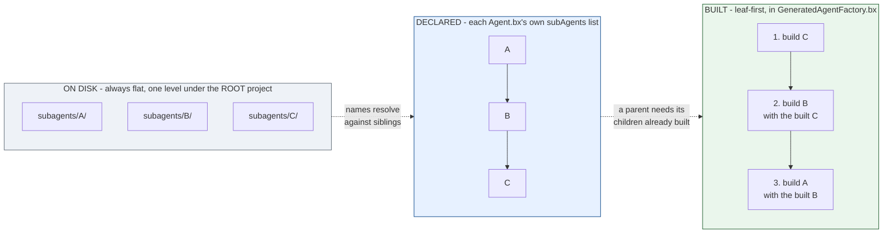

# subagents/

`subagents/` は入れ子になったエージェントを保持します。それぞれが独立した、ごく普通の BX Agents プロジェクトです - `Agent.bx` + `instructions.md` (加えて任意で自身の `tools/`、`skills/` など)。

```
my-agent/
├── Agent.bx              # subAgents: ["researcher"]
├── instructions.md
└── subagents/
    └── researcher/
        ├── Agent.bx
        └── instructions.md
```

サブエージェントは、親の `Agent.bx` の `configure()` で宣言された名前によって親に配線されます - これは `subagents/` の**フォルダ**名をビルド時に配線するもので、`super.init()` 自身の `subAgents` 引数 (これは名前ではなく、すでにビルド済みの `AiAgent` インスタンスを取ります) とは別物です。

```javascript
// Agent.bx
class extends="bxModules.bxai.models.runnables.AiAgent" {

	function init() {
		super.init(
			name  : "my-agent",
			model : aiModel( provider: "openai", params: { model: "gpt-5" } )
		)
		return this
	}

	function configure() {
		return {
			subAgents : [ "researcher" ]
		};
	}

}
```

ビルド時に、bx-ai の `addSubAgent()` がビルド済みの各サブエージェントインスタンスを、親の上で呼び出し可能なツールとして自動的にラップします - 自分で別途ツールラッピングのステップを書く必要はありません。

## フラットな名前空間、兄弟参照

どんなに別のサブエージェントの config がそれを深く参照していても、すべてのサブエージェントは**ルート**プロジェクトの `subagents/` フォルダの直下に存在します。あるサブエージェント自身の宣言された `subAgents` は、その同じルートレベルのフォルダにある**兄弟**エントリを参照するのであって、自分自身の下にネストされたフォルダではありません。これにより、発見/検証モデルはシンプルに保たれます - ディスク上でいくらでも深くネストしうるツリーではなく、`subagents/` の直下のサブフォルダに対する 1 つのフラットな有向グラフです。

ディスク上ではフラット、config ではグラフ、そしてボトムアップにビルドされる - 同じプロジェクトの 3 つの見方です。



宣言されたグラフ内の循環 (`A -> B -> A`) は、これが何か生成される前の検証で拒否されます。ダイアモンド形 (2 つの親が 1 つの子孫を共有する) は問題ありません。

## ビルド順序

サブエージェントは**リーフ (末端) から先に**(ボトムアップに) ビルドされます - `A` が `subAgents: ["B"]` を宣言し、`B` が `subAgents: ["C"]` を宣言している場合、生成された `GeneratedAgentFactory.bx` は `C` を、次に (ビルド済みの `C` インスタンスを渡して) `B` を、最後に (ビルド済みの `B` インスタンスを渡して) `A` をビルドします - この逆はありません。親の `aiAgent()` 呼び出しは、子のすでにビルド済みのインスタンスを必要とするからです。

## 検証

- `subAgents` の中の、実在する `subagents/{name}/Agent.bx` に対応しないサブエージェント名は、明確な「references unknown subagent [...]」エラーで検証に失敗します - これは、ネストされたサブエージェントだけでなく、ルートプロジェクト自身の `Agent.bx` も含めた、**すべての**ノードの `subAgents` リストに適用されます。
- **循環参照** (`A` → `B` → `A`) は検証時に拒否され、完全な循環パス (例えば `A -> B -> A`) が報告され、コード生成は一切行われません。
- 「ダイアモンド」形 - 2 つのサブエージェントが同じ子孫に依存している - は循環では**なく**、問題なくビルドできます。本物の循環だけが拒否されます。
- 発見された `subagents/*` フォルダの内部に `Agent.bx` が見つからない場合、それ自体が独立した検証エラーとして報告されます。
- すべてのノード自身の宣言された `name` (ルート + すべてのサブエージェント自身の `Agent.bx`) は、プロジェクト全体で一意である必要があります - 下記参照。

## Retrieving an agent from `schedules/Scheduler.bx`

2 つの異なる名前が関わっており、それらは互換ではありません。

- `subagents/` の下の**フォルダ名** (上の例の `researcher`) は、`subAgents: [ "..." ]` が参照するものです - これは純粋にビルド時の配線の関心事です。
- サブエージェント自身の**宣言された `name`** (その `Agent.bx` の `name` フィールド、例えば `"ResearchBot"`) は、ランタイムでそれを取得する際に使うものです - ツリー内のすべてのエージェント (ルート + すべてのサブエージェント) は、`config/WireBox.bx` にこの名前で登録されるので、[`schedules/Scheduler.bx`](schedules.md) (または他の WireBox 対応の任意のコード) は単純な `getInstance( "ResearchBot" )` でそれに到達できます。

この 2 つの名前は異なることがあり、そしてしばしば異なります - フォルダ名は実装の詳細であり、宣言された `name` こそが他のあらゆる場所 (プロンプト、WireBox の取得) で重要になる名前です。これは今や WireBox のバインディングキーでもあるため、ツリー内の 2 つのエージェント - どれだけ深くネストされていても - が (どちらも未設定のままサイレントに `"BxAi"` デフォルトを共有するケースも含め) 同じ宣言された `name` に行き着く場合、`build` は検証に失敗します。
