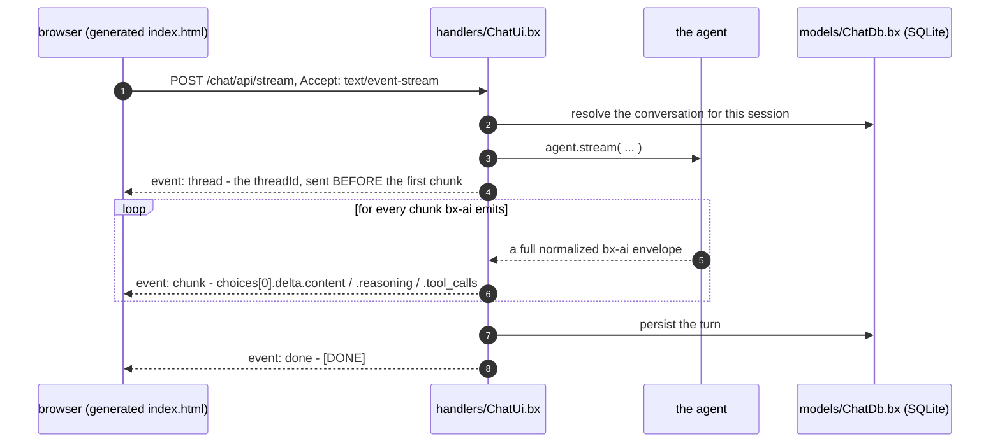

# Web チャット UI

`exposes: "webui"` を持つ `gateways/*.bx` エントリは、エージェント向けの完全なブラウザチャットクライアント - 会話サイドバー、推論とツール呼び出しを伴うストリーミング、human-in-the-loop 承認、訪問者ごとのテーマ、そしてその背後にある実際の SQLite ストア - を出荷します。

これは公開が宣言される場所であるという理由で [gateways/](gateways.md) の下にありますが、それ自体が独立したサブシステムであり、それゆえに独自のページを持っています。

```javascript
// gateways/chat.bx
class {
	function configure() {
		return {
			exposes     : "webui",
			path        : "/chat",
			apiKeyEnvVar: "CHAT_UI_API_KEY"   // optional - see Securing the API
		};
	}
}
```

これは静的な `<path>/index.html` (直接配信され、ルートは不要です) と、生成された `handlers/ChatUi.bx` と `models/ChatDb.bx` に支えられた `<path>/api` 配下の専用 API を生成します。

この UI は依存関係のない素の HTML/CSS/JS です - Bootstrap、AlpineJS、Vite のビルドステップは一切ありません - そして **BX Agents 自体の中にあらかじめビルドされてバンドルされています**: `bxAgents build` が `npm install`/`npm run build` を実行することは決してなく、生成されたプロジェクトは Node や npm をインストールする必要が一切ありません。ページが必要とするものはすべて、生成された単一の `index.html` にインライン化されています。

その制約はビルドについてのものであり、スコープについてのものではありません。このページは完全なクライアントです: 会話サイドバー、推論とツール呼び出しを伴うストリーミング、承認、圧縮 (compaction)、サーバー側のテーマです。実際にまだ足りていないものは [What is not here yet](#what-is-not-here-yet) に一覧があります。

このページは、生成された自身の `<path>/api` ルートと、`POST <path>/api/stream` (`Accept: text/event-stream`) を介して通信します。`POST` もカスタムヘッダーの設定もできないブラウザの `EventSource` ではなく、`fetch()` + 手動の `ReadableStream` リーダーを使います。両方ともここでは必要だからです。

!!! warning
    **`toAi()` は各 bx-ai チャンクをそのまま転送します - ラップしません。** ColdBox の [AI Routing ドキュメント](https://coldbox.ortusbooks.com/the-basics/routing/routing-dsl/ai-routing) はストリームを `data: {"token":"..."}` 行として示していますが、そのソース自体 (`Router.cfc`、`toAi()` のストリームサブルート) は `emitter.send( chunk, "chunk" )` を行います - つまり、すべてのフレームが**完全に正規化された bx-ai エンベロープ**を運びます。

    ```
    event: chunk
    data: {"object":"chat.completion.chunk","choices":[{"delta":{"role":"assistant","content":"Ray","reasoning":"...","tool_calls":[...]}}]}

    event: done
    data: [DONE]
    ```

    `token` というキーはどこにもありません。そのドキュメントページに沿って書かれたクライアント - このUIの最初のバージョンも含む - は `undefined` を読み取り、何もレンダリングしません。代わりに `choices[0].delta.content` を読んでください。

エンベロープ全体が届くため、**推論とツール呼び出しはすでに配線の上に載っており**、追加のエンドポイントは不要です: `delta.reasoning` (bx-ai によってすべてのプロバイダーにわたって正規化されています) は折りたたまれた「Thinking」ストリップとして描画され、`delta.tool_calls` は折りたたまれた呼び出しごとのチップとして描画されます。ツール呼び出しの引数は `index` でキー付けされた部分的な JSON フラグメントとしてストリーミングされるため、ページは単一のどのチャンクが完全な呼び出しを保持しているとも仮定せず、インデックスごとに蓄積していきます。

## ストリーミングターンの実際の様子



`thread` イベントが最初に送られるのは、レスポンスヘッダーはボディが届き始める前には読めないためで、ページはターンの途中で `POST /cancel` できるように、その `threadId` を必要とします。

## 生成される API

`webui` エントリは、生成された `handlers/ChatUi.bx` によって配信される 20 個のアクションを `<path>/api` の下にマウントします。

| ルート | 目的 |
| --- | --- |
| `POST /invoke` | 同期の 1 ターン |
| `POST /stream` | SSE ターン (このページが使うもの) |
| `POST /batch` | `inputs[]` 配列を実行 |
| `POST /cancel` | 進行中のランを停止 - `{ threadId, reason? }` |
| `POST /steer` | 実行中のターンにメッセージをスプライス - `{ threadId, input }` |
| `POST /clear` | この訪問者の会話をクリア |
| `POST /compact` | この訪問者の古いメッセージを要約し、最近のものは保持 - 任意の `{ keepRecent }` |
| `GET /history` | この訪問者の保存済みメッセージ。トランスクリプトの再水和用 |
| `POST /resume` | 保留中の承認に答え、継続をストリーミング - `{ threadId, decision, editedData?, reason? }` |
| `GET /pending` | 中断中のランが何を待っているか - `?threadId=` |
| `GET /tools` | エージェントの登録済みツール |
| `GET /health` | 生存確認 |
| `GET /info` | エージェント名、モデル、メモリ/ツール数、機能フラグ |
| `GET /conversations` | この訪問者の会話。最新のアクティビティ順 |
| `POST /conversations/create` | 会話を開始 - 任意の `{ title }`、発行された `conversationId` を返す |
| `POST /conversations/rename` | `{ conversationId, title }` |
| `POST /conversations/delete` | `{ conversationId }` - インデックス行**と**そのエージェントのメッセージの両方を削除 |
| `GET /preferences` | この訪問者の保存済み設定、`{ key: value }` として |
| `POST /preferences/set` | `{ key, value }` |
| `POST /preferences/delete` | `{ key }` |

すべて、`userId` として ColdBox の `getUserSessionIdentifier()` によってスコープされています。最初の 3 つは `toAi()` の形とワイヤーフォーマットを正確に保っています。

`threadId` はサーバー権威です: 与えられればリクエストから取得され、そうでなければ発行され、常にエコーバックされます - `/invoke` と `/batch` では `X-Thread-Id` レスポンスヘッダーとして、`/stream` では*最初のチャンクより前に*送られる `thread` SSE イベントとして (ヘッダーはボディが届き始める前には読めないためです)。これは ColdBox 8.1 自身の `toAi()` が採用しているのと同じ契約なので、一方向けに書かれたクライアントはもう一方に対しても動作します。

!!! warning
    **停止は、単にフェッチを中断するのではなく `/cancel` を経由する必要があります。** HTTP リクエストを中断しても、ブラウザが聞くのをやめるだけです - サーバーはツールを呼び出し、トークンを消費しながらターンの実行を続けます。そのためページはすべてのターンに `threadId` を添えて送り、中断する前にそれを `/cancel` に POST し、`agent.cancelRun()` がそのランの次のチェックポイントにシグナルを送れるようにします。

`/clear` と `/compact` はどちらもスコープに注意深いです。`/clear` は、引数を取らずすべての訪問者の履歴を消してしまう `AiAgent.clearMemory()` ではなく、各メモリ自身の `clear( userId, conversationId )` を経由します。`/compact` も同じ理由で `summarize( config, userId, conversationId )` を経由します。圧縮は、この会話の古いメッセージを AI が書いた要約に置き換え、直近のいくつかは保持し、呼び出し元の `(userId, conversationId)` ペア以外には一切触れません。

!!! info
    **`/compact` には要約モデルが必要で、それを持っているかどうかを報告します。** `summarize()` は、メモリに `summaryProvider` と `summaryModel` の*両方*が設定されていない限り、また会話がすでに `keepRecent` 以下の場合も、サイレントな無操作になります。どちらもエラーではないため、`/compact` は `{ compacted, before, after }` を返して呼び出し元自身に確認させ、`/info` の `capabilities.compact` は、そもそも要約モデルが設定されているかどうかを報告します - そのため、ページは何もしないボタンを、壊れているように見せる代わりに隠すことができます。

    リクエストから取られるのは `keepRecent` だけです。`summarize()` は `model`/`provider` のオーバーライドも尊重しますが、ここでそれを受け付けてしまうと、どの訪問者でもあなたの認証情報で好きなプロバイダーとモデルに要約呼び出しを向けられてしまいます - それはメモリ自身の config が決めることです。

```javascript
// Agent.bx - what makes /compact functional
memory: {
	type            : "cache",
	summaryProvider : "openai",
	summaryModel    : "gpt-4o-mini",
	summaryThreshold: 10
}
```

## ユーザーとサインイン

デフォルトでは Web UI には**アカウントもゲートもありません** — オープンで、すべての訪問者は匿名です。それがゼロ儀式な `bxAgents serve` の体験であり、これは**デプロイの姿勢ではありません**。`webui` エントリで `users` を宣言すると、[cbauth](https://forgebox.io/view/cbauth) と、他のすべてが使うのと同じ SQLite ストアに支えられた、本物のサインインゲートが有効になります。

### アカウントなしでは、UI は 1 つの共有ワークスペースです

意図的に、訪問者ごとのアイデンティティは存在しません。アカウントのない Web UI へのすべての訪問者は、**同じ**会話、設定、エージェントメモリを読み書きします — そのページに到達できる人は誰でも、その中のすべてを見ることができます。

これは見落としではなく、アカウントなしで実行することの要点そのものです - オープンな UI は 1 つの共有ツール (ラップトップ、信頼できる社内マシン) であり、マルチテナントサービスではありません。ブラウザごとに独自のスライスを持たせても、誰も求めていないブラウザごとのコピーに 1 つのワークスペースを断片化させるだけであり、その断片化を行う任意のクライアント側 ID は、どのみち偽装可能です。

!!! warning
    **オープンな UI には訪問者間のプライバシーがありません。** その URL に到達できる人は誰でも、その中のすべての会話を見ることができ、そのどれでも続けたり削除したりできます。もしそれが望むところでないなら - 見るべき人以上の人がそのページに到達できるあらゆる場所で - `users` を宣言してください。

```javascript
// gateways/chatUi.bx
users : [
    { username: "ada",   passwordEnvVar: "ACME_ADA_PASSWORD", displayName: "Ada Lovelace" },
    { username: "grace", passwordHash: "pbkdf2$210000$...",   displayName: "Grace Hopper" }
]
```

### パスワードは config に決して書き込まれません

アカウントは、パスワードを保持する**環境変数**の名前 (`passwordEnvVar`) を指定するか、**すでにハッシュ化された**値 (`passwordHash`) を持ちます。リテラルな `password` キーは、警告ではなくビルドエラーです — サイレントに無視してしまうと、実際には何もコミットしていないのにパスワードを設定したと信じ込んでしまいます。

`passwordHash` は、それが逆算不能であるからこそコミットしても安全です。アプリが使うのと同じハッシャーで生成してください。

```
bxAgents hash-password --password="correct horse battery staple"
```

!!! danger
    **ハッシュ化であり、暗号化ではありません。** 暗号化は可逆であり、盗まれたデータベースファイルはほぼ常に、それを復号できる何かと一緒に持ち出されます - そのため可逆な方式は、1 つのファイル漏洩を、他の場所で使い回されたものも含む全ユーザーのパスワード漏洩に変えてしまいます。ここでのパスワードは、ユーザーごとのランダムなソルト付きの PBKDF2-HMAC-SHA256 を経由し、データベースから復元することは決してできません。(BoxLang には bcrypt や argon2 の BIF は出荷されていません。PBKDF2 は依存関係を追加せずに使える最強のプリミティブです。)

    反復回数は各ハッシュの*内部*に保存されるため (`pbkdf2$<iterations>$<salt>$<digest>`)、すでに保存されているものを無効化せずに後から引き上げることができます。

### サインインが変えるもの

ユーザースコープのものはすべて、実際のアカウントに再キーされます。生成された `handlers/ChatUi.bx` は、1 つのメソッド (`resolveUserId()`) で cbauth から直接アイデンティティを解決し、エージェントメモリ、会話インデックス、設定、保留中のラン所有権はすべてその戻り値をキーにします。

これは意図的に ColdBox の `identifierProvider` 設定ではなく cbauth を読み取ります: `coldbox` config 構造体の中で宣言されたクロージャは決して `configSettings` に届かない (文書化されているリテラルな形と、後からの代入の両方で、実際の起動で確認済みです) ため、その設定に頼っていたものは何であれ、サイレントにセッション id を代わりに受け取っていました。

実務上の違いは: 会話と設定はブラウザやデバイスをまたいでその人についていき、Cookie をクリアしても新しい「ユーザー」が作られることはもうありません。

| | `users` なし | `users` あり |
|---|---|---|
| アイデンティティ | 1 つの共有ワークスペース | サインインしているアカウント |
| 会話が見えるのは | UI に到達できる誰でも | その所有者のみ |
| ブラウザ/デバイスをまたいでその人についていく | n/a — 何も個人単位ではない | はい |
| サインインなしで到達可能 | すべて | ログインフォームのみ |

### ライフサイクル

アカウントは、すべての起動のたびに、この順序で config から調整されます: スキーマインターセプターがマイグレーションを行い、シーダーがアカウントを書き込み、その後ログインゲートが強制を開始します。

- **追加** config にユーザーを追加すると作成されます。
- **変更** パスワードを変更すると更新されます。シーダーは、設定されたパスワードが保存されているものと一致しなくなった場合にのみ再ハッシュするため、変更のないパスワードには 1 回の検証コストしかかかりません。
- **削除** config から削除すると、削除ではなくアカウントを**無効化**します。彼らの会話は彼らの id を参照しているため、行を削除するとアクセスを取り消す代わりにその履歴を孤立させてしまいます。彼らはもうサインインできませんが、データはそのまま残り、アカウントが復元されれば戻ってきます。
- 変数が**未設定**の `passwordEnvVar` を持つアカウントは、そのアカウントを完全にスキップし、`webui-auth` に警告をログします。これは意図的にクローズ (安全側) に失敗します - 空のパスワードでアカウントを作成してしまうことは、存在しないことよりもずっと悪いことだからです。

### これではないもの

これは固定された、オペレーターが用意したアカウントの一覧であり、ユーザー管理システムではありません。セルフ登録も、パスワードリセットも、ロールや権限も、ユーザーごとのレート制限や支出上限もありません。連合アイデンティティが必要な場合は、生成されたハンドラの `resolveUserId()` を編集して、あなた自身の認証済みプリンシパルを返すようにしてください - Web UI の残りの部分は、その id がどこから来たのか一切知りませんし、気にもしません。

## Human-in-the-loop

エージェントが承認のために一時停止すると、ストリームは詳細を運ばない `middleware_stop` チャンクを発行します。そのためページは `GET /pending?threadId=` に何がリクエストされているかを尋ね、**Approve** / **Reject** でレンダリングし、`POST /resume` 経由で答えます - これは*同じターンの継続*をストリーミングするので、その結果は新しいターンを始めるのではなく、会話の中に収まります。

`decidedBy` はセッションからサーバー側で埋められ、リクエストボディからは決して埋められません: 何かを承認したのが誰かというのは、まさに呼び出し元が自分自身について主張すべきではない類のことです。

!!! warning
    **中断中のランは、それを開始したセッションに属し、両方のルートがそれを強制します。** `decidedBy` をサーバー側で導出することは、呼び出し元が*誰が*決定したかについて嘘をつくことを止めるだけです - それ単体では*誰のランを*決定しているかについては何も対処しません。他のすべてのアクションと異なり、`/pending` と `/resume` は会話ではなく `threadId` によってアドレスされるため、所有権チェックがなければ、他人の `threadId` を持つ訪問者が、その人の保留中のツール呼び出しとその引数を読み取り、その人に代わって承認・拒否できてしまいます。

    所有者には追加の記帳は不要です: ハンドラはセッション由来の `userId` をラン options に刻み込み、エージェントはその中断状態と一緒にその options をチェックポイントします - そのため、保存された状態はすでに自分が誰のものかを知っています。呼び出し元が所有者でない場合、`/pending` はあたかも何も保留していないかのように答えるので、これを使って `threadId` が存在するかどうかを探ることはできません。`/resume` は `403` で拒否します。

## 履歴と再読み込み

トランスクリプトは DOM の中に存在し、会話はエージェントのメモリの中に存在します。再水和がなければ、リロードは空の画面を表示するのに、エージェントはすべてを覚えたままです - そのためページは空白に見えたのに、ユーザーには見えていないメッセージについてのフォローアップに答えてしまうことになります。そのためページはロード時に `GET <path>/api/history` を呼び出し、保存されたメッセージ (マークダウンも含めて) を再生し、会話が空か、フェッチが失敗した場合はウェルカムメッセージにフォールバックします。

**New** は新しい `conversationId` を開始します。何も削除しません - 以前の会話は自身の id のもとでサーバー上に残り、サイドバーに表示されます。それこそが会話テーブルの存在意義です。

## ページが行うこと

出荷されるページは、デモ用のシェルではなく実際のチャットクライアントです。まず `GET /info` を読み取り、サーバーが実際に報告する内容に自分自身を合わせるので、あるコントロールは、その機能が実在する場所にのみ現れます。

| 領域 | 振る舞い |
| --- | --- |
| **会話サイドバー** | この訪問者の会話を最新順に、メッセージ数とともに一覧表示します。切り替え、名前変更 (✎)、削除 (×)、または新規開始。タイトルは `textContent` を通じてレンダリングされます — タイトルはユーザーが最初に入力したものが何であれそのままなので、マークアップとして解釈されることは決してありません |
| **ストリーミング中に操縦する** | コンポーザーはターンの間ずっと生きたままです。**Send** は **Steer** になり、メッセージは新しいターンを始めるのではなく、すでに進行中のランに継ぎ足されます |
| **Stop** | フェッチを中断する*前に* `/cancel` を POST するので、サーバーは実際にトークンの消費をやめ、その後すでにストリーミングされたものはそのまま保持します |
| **Clear / Compact** | Clear はこの会話を空にします。Compact は要約モデルが設定されている場合にのみ現れ、実際に何をしたか (`Compacted 12 messages down to 3`、または `Nothing to compact yet`) を報告します |
| **推論 + ツール呼び出し** | 同じエンベロープの `delta.reasoning` と `delta.tool_calls` から供給される、折りたたみ式の開示 |
| **承認** | human-in-the-loop の一時停止は `GET /pending` から Approve/Reject カードをレンダリングし、`/resume` 経由で答えられ、同じターンの継続をストリーミングします |
| **テーマ** | `preferences` にサーバー側で保存されるので、ブラウザではなくアイデンティティについていきます。`localStorage` はローカルコピーを保持するので、失敗したリクエストがあっても選択は生き残ります |
| **モデル** | `/info` のモデル名がヘッダーに収まるので、何が答えたのか常に明確です |

**復旧はその響き以上に重要です。** 最後に開いた会話は `localStorage` に記憶されますが、会話自体はサーバー上に存在します。その id がもう存在しない場合 (別のタブで削除された、あるいは新しいストアである) — ページは、アクティブな行のない空の画面に再水和する代わりに、残っている中で最新の会話にフォールバックします。

狭い画面には、押しつぶされたものではなく本物のレイアウトが用意されます: `40rem` 未満では、サイドバーはトランスクリプトの幅を奪うのではなく、その上にオーバーレイされ、`prefers-reduced-motion` は尊重されます。

## SQLite ストア

すべての `webui` プロジェクトは SQLite データベースを得ます。これは任意ではなく、オフにするフラグもありません。

その理由は好みではなく、実際のギャップです: **bx-ai の `IAiMemory` には列挙 API がありません。** これは `(userId, conversationId)` ごとのバケットです — 1 つを読み書き・クリアできますが、その中の何も「このユーザーはどの会話を持っているか」には答えません。会話一覧、ユーザーごとの設定、その他のリレーショナルなものはすべて、メモリの内部ではなく、それに並ぶ実際のストレージが必要です。

| 部品 | それが何か |
| --- | --- |
| `bx-sqlite` | JDBC ドライバです。これがなくても webui アプリは起動しますが、すべてのクエリが未知のドライバで失敗します |
| [`qb`](https://github.com/coldbox-modules/qb) | 読み書き用の QueryBuilder、テーブル用の SchemaBuilder。手書きの SQL はどこにもありません |
| `models/ChatDb.bx` | 生成されます。スキーマを所有し、クエリビルダーを配布します |
| `interceptors/WebUiSchema.bx` | 生成されます。起動時に `ChatDb` を構築するので、マイグレーションはその時点で走り、データベースに最初に触れたリクエストで走るわけではありません |

データソースは `Application.bx` に登録され、グラマーは `config/ColdBox.bx` に固定されます。

```javascript
// Application.bx (generated)
this.datasources[ "bxagents" ] = {
	"driver"  : "sqlite",
	"database": expandPath( "./data/chat.db" )
}
this.datasource = "bxagents"   // NOT this.defaultDatasource - see below

// config/ColdBox.bx (generated)
qb : {
	defaultGrammar : "SQLiteGrammar@qb",
	defaultOptions : { datasource : "bxagents" }
}
```

どちらも、エントリごとに上書きするのは任意です。

| キー | 何をするか | デフォルト |
| --- | --- | --- |
| `database.datasource` | ColdBox のデータソース名 | `bxagents` |
| `database.path` | データベースファイル、アプリルートからの相対パス | `./data/chat.db` |

絶対パスの `database.path` は**ビルドを失敗させます**: これは生成されたアプリの内部で `expandPath()` によって解決されるため、絶対パスはサイレントにアプリディレクトリの外に脱出し、パッケージ化された `.bxa` デプロイを壊します。

**スキーマはバージョン管理され、前方向専用です。** `ChatDb.migrate()` は適用したものを `bxagents_schema_version` テーブルに記録し、新しいものだけを適用するので、既存のストアに対して起動するのは無操作です。v1 は `conversations` と `preferences` を作成します。新しい `applyV<n>()` を追加し `SCHEMA_VERSION` を上げることで進化させてください — 出荷済みのマイグレーションを編集することでは**決して**行わないでください。**SQLite はカラムを変更したり削除したりできない**からで、qb の `SQLiteGrammar` はそうであるかのように装う代わりに `UnsupportedOperation` を投げます。

!!! warning
    **ここでの 2 つのことは直感に反しており、どちらも実際の ColdBox の起動に対して、ドキュメントを読んで確立されたのではなく、苦労して確立されました。**

    **デフォルトデータソースの設定は `this.datasource` であり、`this.defaultDatasource` ではありません。** 登録キーは複数形 (`this.datasources[ "name" ]`) であるため、単数形のデフォルトはそれに一致するように読めますが — BoxLang は `this.defaultDatasource` をサイレントに受け入れ、何もしません。それが生み出す失敗は、まさにあなたが選択しようとしているそのデータソースの名前を挙げます (`No default datasource defined in the application or globally or in the query options. Registered datasources are: [bxagents]`)。これは、設定のスペルミスというより、選択メカニズムが壊れているように読めます。

    **すべての qb ビルダーにデータソースの名前を指定してください。`moduleSettings.qb.defaultOptions` に頼らないでください。** qb の `ModuleConfig.cfc` は `QueryBuilder@qb` を `onLoad()` の中で `.initArg( name = "defaultOptions", value = settings.defaultOptions )` としてマッピングするため、その設定はあなたをカバーしているように*見えます*。それは実際の起動では届きませんでした - データソースは登録されていたのに、ビルダーは空の options を持ったままでした。そのため `ChatDb.query()` は、配布するすべてのビルダーに対して `.mergeDefaultOptions( { datasource : static.DATASOURCE } )` を呼び出します。`SchemaBuilder@qb` は `defaultOptions` を一切受け取らない (qb はこれを `grammar` だけでマッピングします) ので、すべてのスキーマ呼び出しは自分自身で `options: { datasource: ... }` を渡します。

    `moduleSettings.qb` ブロックはそれでも生成されます - アプリ内の他のあらゆる qb の利用にとって正しいものだからです - しかし、生成されたストアはそれに依存していません。

    `ChatDb` を extend する場合は、追加するものすべてにデータソースの名前を指定してください。

    もう一つ、変わらないもの: データソースは**名前付き**データソースである必要があり、インライン構造体では決してありません - qb 自身の `appendSqlComments()` はその引数を `string` として型付けしているため、構造体は SQL が一切実行される前に例外を投げます。

グラマーだけが SQLite 固有の部分です。それ以外はすべて qb を経由するので、これを後で Postgres や MySQL に向けるのは書き直しではなく、グラマーとデータソースの変更で済みます。

## 会話と設定

これらは SQLite ストアが存在する理由そのものであり、どちらも他のすべてと同じ、サーバー由来の `userId` でスコープされています。

**会話。** `/invoke`、`/stream`、`/batch` を通るすべてのターンは、それ自身をインデックスに記録します: その行は初回利用時に作成され、`updatedAt` が動き、最初のユーザーメッセージがタイトルになります (1 行に折りたたまれ、60 文字に切り詰められます) - すでに設定されている場合を除きます。そのため、名前変更が次のターンによってサイレントに元に戻されることはありません。`messageCount` は**表示用のカウンター**で、ターンごとに 2 ずつ増えます。途中で終わったターンは 1 だけ多く残すことがあり、`/clear` はこれをリセットします。実際に何が話されたかについての権威であり続けるのは、エージェント自身のメモリです。

`/conversations/delete` は、インデックス行*と*その会話に対するエージェントのメッセージの両方を削除します。行だけを落とすと、誰かがその id を再利用した瞬間にモデルのコンテキストにまだ座ったまま、会話が見えなくなってしまいます。

!!! warning
    **`touchConversation()` が qb の upsert ではない理由。** upsert は主キーだけを対象にするため、他の訪問者の `conversationId` を推測した呼び出し元が、その行に自分自身の `userId` を書き込み、会話を乗っ取ってしまうことになります。このストアはまず読み取り、その行が他人のものである場合は拒否します。`setPreference()` は upsert を*行い*、安全です — そのターゲットは `(userId, prefKey)` の複合キーであり、呼び出し元自身のアイデンティティがそのマッチ対象の一部だからです。

**設定。** `localStorage` ではなくサーバー側なので、ブラウザではなくアイデンティティについていきます。`identifierProvider` を実際の認証済みプリンシパルに向ければ、生成されたコードを一切変更することなく、訪問者の設定はデバイスをまたいでその人についていきます。

## ブランディングとテーマ

以下のキーはすべて任意です - このエントリは `exposes` と `path` だけでも動作します。

| キー | 何をするか |
| --- | --- |
| `title` | ブラウザのタイトルとヘッダーの見出し |
| `subtitle` | 見出しの下の小さな行 |
| `icon` | 絵文字 (インライン SVG のファビコン**と**ヘッダーの両方にレンダリングされます) または画像 URL/パス (`/logo.svg`、`https://…`、`data:image/…`) |
| `welcome` | 最初のターンの前に表示される空状態のメッセージ |
| `placeholder` | コンポーザー入力のプレースホルダー |
| `footer` | コンポーザーの下の小さな注記 - 免責事項、リンクなど |
| `showReasoning` | 「Thinking」ストリップを表示。デフォルト `true` |
| `showToolCalls` | ツール呼び出しチップを表示。デフォルト `true` |
| `theme` | デザイントークン - 下記参照 |
| `themeFile` | CSS オーバーライドへのパス。プロジェクトルートからの相対パス。デフォルトは `resources/webui/theme.css` |

`theme` はページの CSS カスタムプロパティに直接マッピングされます: `accent`、`accentFg`、`bg`、`fg`、`muted`、`border`、`surface`、`inputBg`、`bubbleUser`、`bubbleUserFg`、`bubbleAssistant`、`bubbleAssistantFg`、`bubbleError`、`reasoningFg`、`reasoningBg`、`toolFg`、`toolBg`、`radius`、`radiusSm`、`font`、`fontMono`、`fontSize`、`maxWidth`。ネストされた `theme.dark` ブロックは、ダークモード向けに同じトークンのいずれかを上書きします。未知のトークンは、サイレントに無視されるのではなく**ビルドを失敗させる**ので、タイプミスは、ブランドカラーがなぜ現れなかったのか悩ませる代わりに即座に表面化します。

```javascript
// gateways/chat.bx
theme: {
	accent : "0f766e",
	radius : "10px",
	font   : "Inter, system-ui, sans-serif",
	dark   : { accent : "rgb(45, 212, 191)" }
}
```

!!! info
    **16 進カラーはハッシュを先頭に付けずそのまま書いてください。** BoxLang はシングルクォートとダブルクォートの**両方の**文字列で `#` から文字列補間を開始するため、`.bx` の config 内のリテラルな 16 進カラーは、ハッシュを二重にしない限りパースエラーになります - 誰も覚えていない落とし穴です。ジェネレータがあなたに代わってそれを付け直すので、`"0f766e"` はそのまま動きます。`rgb()`、`hsl()`、色名にはどちらにしても特別な対応は不要です。

トークンがカバーしない部分 - カスタムフォント、レイアウト、要素ごとのルール - については、プロジェクトに `resources/webui/theme.css` を置いてください。これはページの `<style>` に**最後に**インライン化されるので、出荷時のデフォルトと `theme` トークンの両方に勝ちます。そして実際の `.css` ファイルなので、普通の `#rrggbb` の 16 進表記もそこでは正常に動作します。(そのファイル内のリテラルな `</style` はページのスタイルブロックを早期に終了させてしまうため、ビルドを失敗させます。)

!!! warning
    **`apiKeyEnvVar` はシンプルで切り替え可能なゲートであり、完全なログインシステムではありません。** 未設定のままだと `<path>/api/*` は完全にオープンです (ローカル開発には問題ありませんが、公開デプロイには向きません)。設定すると、生成された `preProcess` インターセプター (`interceptors/WebUiAuthGate.bx`) が、`<path>/api/*` の下のすべてのリクエストに対して、`java.security.MessageDigest.isEqual()` で比較される、一致する `X-API-Key` ヘッダーを要求します - すでにどの Webhook ゲートウェイ自身の署名チェックも使っている、同じ定数時間比較の規律です。**静的シェル自体 (`<path>/index.html`) は意図的にゲートされていません** - `<path>/api/*` だけです - ブラウザの通常のページナビゲーションはカスタムヘッダーを送れないので、シェルをゲートすると、そもそもキーを尋ねてくるはずのそのページ自体が、キーなしには到達不能になってしまうからです。ページ自身の JS がキーを尋ね (「Key」ボタン、`localStorage` に保存)、それ以降のすべての API 呼び出しにそれを添えて送ります。


## 会話のアイデンティティ: セッションこそがユーザー識別子

**エージェントが保持するすべてのメモリは `(userId, conversationId)` でキー付けされています** - そしてエージェントは一度に複数のメモリを保持できます (`AiAgent` の `memories` は配列で、`loadMemoryMessages()` はすべてを同じペアで反復します)。`AiAgent.run()`/`.stream()` は、何も供給されない場合、どちらにも `""` にフォールバックします。つまり、サーバー側のアイデンティティが一切なければ、どんなメモリタイプが設定されていようと**すべての訪問者は 1 つの共有バケットに収まります**。

その修正はメモリのタイプではなく、アイデンティティです。`webui` 公開を持つプロジェクトは、そのため次を得ます。

1. 生成された `Application.bx` での**セッション管理の有効化** - `this.sessionManagement = true`、`this.setClientCookies = true`、60 分の `sessionTimeout`。Cookie はここでの基盤です: Cookie がなければセッション id もありません。
2. **自身の `handlers/ChatUi.bx`**。これは ColdBox の `getUserSessionIdentifier()` を、**3 つすべてのランナーの形** - `invoke`、`stream`、`batch` - でエージェントの `userId` として渡します。

```javascript
// handlers/ChatUi.bx (generated)
private string function resolveUserId() {
	return controller.getUserSessionIdentifier()
}
```

`session.sessionId` を直接読み取るのではなく ColdBox に委譲することで 3 つの恩恵が得られます: id はアプリケーションごとにプレフィックスされ、セッションが何らかの理由で利用できない場合は URLToken/CFID を通じてフォールバックし - そして最も重要なものとして、**`identifierProvider`** config 設定が尊重されます。それをあなたの認証済みプリンシパルに向ければ、生成されたハンドラを一切変更することなく、すべてのメモリが実際のユーザーに再キーされます。

アイデンティティがサーバー発行であるため、プロジェクトがどんなメモリを設定していても - 1 つでも複数でも、`window`、`cache`、`jdbc`、ベクトル、どんな組み合わせでも - スコープは保たれます。

!!! info
    **なぜ webui には `toAi()` を使わないのか?** ColdBox 8.1 の `toAi()` は今や会話コンテキストを自身で導出しており、そのフォールバックはこのハンドラが行うのと正確に同じ呼び出しです: `len( body.userId ) ? body.userId : controller.getUserSessionIdentifier()`。違いは優先順位です - `toAi()` は**呼び出し元が指定した `userId` を優先させます**。これは信頼できるサーバー間の呼び出し元には正しいですが、1 つの共有 API キーの背後にいるブラウザにとっては誤りです。そこでは誰でも自分を他の誰かとして名乗り、他の訪問者のメモリを読むことができてしまいます。生成されたハンドラはアイデンティティをサーバー側からのみ導出し、`body.userId` を決して見ません。これは `toAi()` の正確なルート形状 (`/invoke`、`/stream`、`/batch`、`/info`)、その SSE ワイヤーフォーマット、その `X-Thread-Id`/`thread`-イベントのエコーを保っているので、ドロップインのままです。他の公開の種類 (`exposes: "agent"`) は引き続き変更なしに `toAi()` を使います - サーバー間はまさにその優先順位が想定しているケースです。

`conversationId` は依然としてクライアントから来ますが、それは意図的です: これは同じ訪問者に属する複数の会話を区別するためのものです - **New** ボタンが回転させるものです。これは分離境界ではありません。分離境界はセッション由来の `userId` です。

どんなメモリタイプも強制されません。`Agent.bx` の `memory` キーで、エージェントごとに 1 つ (または複数) 選んでください。`checkpointer` と同じ形です。

```javascript
// Agent.bx
memory: { type: "cache", maxMessages: 50 }
```

`webui` を持たないプロジェクトは、セッションをオフのまま、bx-ai 自身のメモリのデフォルトを保ちます - API/ゲートウェイのみのアプリには追跡すべきブラウザがなく、そこでのセッションは、誰も求めていない Cookie を伴うオーバーヘッドでしかありません。

## 返信のレンダリング

アシスタントの返信は、意図的に小さなマークダウンのサブセットを通してレンダリングされます: フェンス付き/インラインコード、太字/斜体、リンク、箇条書き/番号付きリスト、見出しです。これは**エスケープファースト**で適用されます: モデルのテキストは、タグが 1 つでも導入される前に HTML エスケープされるので、モデルの出力がライブなマークアップになることは決してなく、リンクの href は `http(s)`/`mailto` にホワイトリスト化されているので、`javascript:` URL がアンカーに変換されることは決してありません。

!!! info
    コンポーザーは `textarea` です — **Enter** で送信、**Shift+Enter** で改行を追加し、約 6 行分までスクロールなしで伸びます。進行中のターンは **Stop** (`AbortController`) で止められ、すでにストリーミングされたものは破棄されずそのまま保持されます。トランスクリプトは、すでに一番下にいる場合にのみ自動スクロールするので、ストリーミングの途中で何かを読み返すために上にスクロールしても、下に引き戻されることはありません。

## What is not here yet

このページは、それ自身の API に対しては完全です - 必要なルートはすべて存在し、実行されています。以下がそのギャップです。

| 足りないもの | メモ |
| --- | --- |
| 添付ファイル / 画像入力 | コンポーザーはテキストのみです。bx-ai 自体は画像を扱えるので、これは能力のギャップではなく UI のギャップです |
| リトライ / 再生成 | 失敗したターンは手動で再送する必要があります |
| 編集して再送 | すでに送信済みのメッセージを編集することはできません |
| トークン / コスト表示 | プロバイダーはそれを返しますが、使用量を表示するものは何もありません |

実際の ColdBox の起動に対して何が検証済みで何が未検証か (ブラウザを駆動するのではなくジェネレータレベルのアサーションだけでカバーされているこのページの部分も含む) については、[既知の制限](../known-limitations.md) を参照してください。
