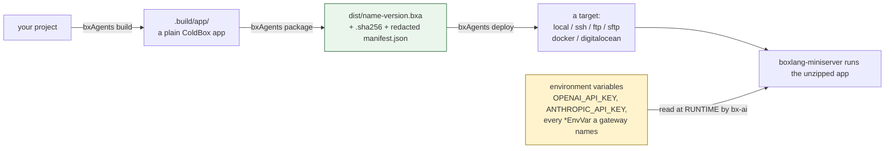

# デプロイとシークレット

シークレットは決して成果物に入り込みません - この連鎖の一番右側にある**プロセス**にのみ供給されます。



`ENV` より左側にあるものは、いずれもシークレット値を一切保持しません。`.env`/ドットファイルは無条件に zip から除外され、マニフェストはそもそもシークレットを持たないうえに、さらに機密情報も除去されます。

## パッケージング

`bxAgents package` は `.build/app/` をポータブルな `.bxa` 成果物に zip 圧縮します。

```bash
bxAgents package --version=1.0.0
```

`dist/` に、以下を生成します。

- `{agentName}-{version}.bxa` - zip 圧縮されたアプリ
- `{agentName}-{version}.bxa.sha256` - そのチェックサム
- `manifest.json` - ビルドマニフェストの**機密情報が除去された**コピー (下記参照)

同じビルドに対して 2 回連続でパッケージングを行うと、バイト単位で同一の zip が生成されます (決定的なエントリ順序/タイムスタンプ) - CI でビルドした成果物がローカルでビルドしたものと一致するかを検証するのに便利です。

`package` は事前に `build` が必要で (`.build/manifest.json` を読み込みます)、`manifestVersion` が未設定または不正な形式の場合は実行を拒否し、`.bxa` を生成しません。

## ファイルの除外: `.bxaignore`

プロジェクトルートに任意で置ける `.bxaignore` は、1 行に 1 つの glob パターンを記述し (`#` で始まる行はコメント)、パッケージ化される `.bxa` からマッチしたパスを除外します。

```
# .bxaignore
*.log
scratch/
```

これは、パッケージングレイヤーで常時有効なハードコードされた `.env`/`.env.*`/ドットファイルの除外に加えて行われます - たとえ `.bxaignore` に記載がなくても、また何らかの理由で `.build/app` の中に入り込んでいたとしても、それらが zip に含まれることは決してありません。

## シークレットの除去 (redaction)

シークレットはそもそも `manifest.json` に書き込まれることがありません - マニフェストの `agent` ブロックには、安全で構造的なフィールド (`name`、`description`、`model`、`environment`) だけが常に含まれます。多層防御として、`package` はさらにマニフェストを再帰的に走査し、シークレットに**見える**構造体キーを `[REDACTED]` に置き換えます。

```
(apikey | api_key | token | secret | password)$   (case-insensitive, any prefix)
```

これは、将来追加されるフィールドや、呼び出し元が何らかの方法でより豊富な構造体を `package` に渡してしまった場合に、値が意図せず漏洩することへの防御です。今日のマニフェストがそもそもそこに値を置くことはないとしても、です。

## 実際のシークレットはどこにあるのか

BX Agents は、プロバイダーの API キー、トークン、パスワードを、ビルドやパッケージのどこであっても解決・保存・埋め込みすることは決してありません。それはすべて bx-ai の仕事であり、**実行時に**行われます。bx-ai は自身の `<PROVIDER>_API_KEY` 形式の慣習 (例えば `OPENAI_API_KEY`、`ANTHROPIC_API_KEY`) に従って、プロセス環境からそれらを読み取ります。デプロイされたプロセスに対して普段シークレットを管理している方法 - OS の環境変数、プロセスマネージャーが読み込む `.env` ファイル (コミットもパッケージもされません)、あるいはプラットフォームのシークレットマネージャー - で設定してください。

```bash
export OPENAI_API_KEY=sk-...
bxAgents serve
```

## デプロイ

```bash
bxAgents deploy --destination=/path/to/somewhere   # local, flag-only shorthand
bxAgents deploy --name=production                  # any target, via deploy/production.bx
```

標準で 6 つのプラガブルなターゲットが用意されています - `local` (最新の `.bxa` をどこかにコピー)、`ssh` (ベアサーバーへ出荷)、`ftp`/`sftp` (このプロジェクトの正真正銘のランタイム依存である実際の [`bx-ftp`](https://github.com/ortus-boxlang/bx-ftp) モジュール経由で出荷)、`docker` (コンテナイメージをビルド/プッシュ)、`digitalocean` (DigitalOcean App Platform アプリへデプロイ) です - それぞれの完全な config 形状は [deploy/](conventions/deploy.md) を、CLI フラグは [CLI リファレンス](cli-reference.md#deploy) を参照してください。

どのターゲットも `deploy/*` の config からシークレットを読み取ることは決してありません - 認証情報 (レジストリのパスワード、SSH 鍵、DigitalOcean の API トークン) は常にデプロイ時に環境変数から解決されます。このドキュメントの他の箇所と同じ「シークレットは常に外部に置く」というルールです。各ターゲットが期待する具体的な環境変数については [deploy/](conventions/deploy.md#secrets-stay-external) を参照してください。

パッケージ化された `.bxa` を他の場所で手動実行するには、それを解凍し (ただの ColdBox アプリです)、`boxlang-miniserver` を展開したディレクトリに向けて起動し、そのデプロイに必要なシークレット環境変数を設定してください。
