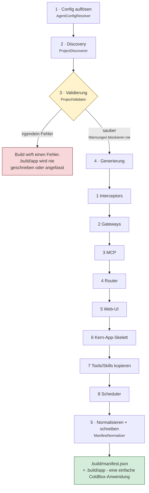

# Die Build-Pipeline

`bxAgents build` durchläuft einmal eine feste Abfolge von Phasen und erzeugt dabei eine einfache ColdBox-Anwendung. Nichts davon läuft zur Request-Zeit erneut - genau darum geht es bei der Build-Zeit-Zusammensetzung. Diese Seite geht die Phasen in exakt der Reihenfolge durch, in der `BuildPipeline.bx` sie ausführt.

Die Validierung ist das Tor: Sie sammelt **jeden** Fehler, statt beim ersten abzubrechen, und es wird nichts generiert, bevor sie sauber zurückkommt.

(Das Paketieren in eine `.bxa` ist ein bewusst separater Schritt - siehe [Deployment & Secrets](deployment-and-secrets.md) - sodass eine schnelle Schleife aus `build` → prüfen → erneut `build` nie die Kosten des Paketierens trägt, die sie nicht braucht.)

## 1. Config auflösen

[`AgentConfigResolver`](conventions/agent-bx.md) lädt `Agent.bx`, ruft `configure()` und die Override-Methode der aktiven Umgebung auf und merged dann tief `boxlang.json`/`boxlang-{env}.json`/`miniserver.json`/`miniserver-{env}.json`, falls vorhanden. Ergebnis ist die eine aufgelöste Konfigurationsstruktur, aus der jede spätere Phase liest.

## 2. Discovery

[`ProjectDiscoverer`](conventions/agent-bx.md) durchläuft das Projekt-Root und erfasst jeden Konventionsordner (`models/`, `tools/`, `skills/`, `subagents/`, `gateways/`, `mcp/`, `interceptors/`, `modules/`) als rohe `{ name, path, type }`-Einträge. `schedules/` ist die eine Ausnahme - kein Liste von Einträgen, sondern nur ein einzelnes `hasScheduler`/`schedulerPath`-Paar, da es eine echte ColdBox-Scheduler-Datei enthält statt einer Menge von BX-Agents-definierten Konfigurationseinträgen. Reine Discovery - eine Interpretation der Dateiinhalte findet hier noch nicht statt.

## 3. Validierung

[`ProjectValidator`](conventions/agent-bx.md) führt jeden Validator aus und sammelt **jeden** Fehler (nie Fail-Fast) plus alle Warnungen: doppelte Tool-/Skill-/Modell-/Subagenten-Namen, doppelte Agenten-`name`s über den gesamten Subagenten-Baum hinweg (siehe [subagents/](conventions/subagents.md#retrieving-an-agent-from-schedulesschedulerbx)), zirkuläre Subagenten-/Modul-Referenzen, die zwei Gateway-Eintragsformen, Vollständigkeit der Remote-MCP-Konfiguration und Gültigkeit von Modell/Provider. Wurden Fehler gesammelt, wirft der Build hier sofort einen Fehler - `.build/app` wird nicht geschrieben oder angefasst. Warnungen (z. B. ein `schedules/`-Ordner ohne `Scheduler.bx` darin) blockieren den Build nie.

## 4. Generierung

Wird nur erreicht, wenn die Validierung sauber ist. In dieser Reihenfolge:

1. **Interceptors** - [`InterceptorSplitter`](conventions/interceptors.md) kopiert Interceptors mit `agent`-Scope nach `.build/app/interceptors`, solche mit `runtime`-Scope in ein separates Verzeichnis `.build/runtime-interceptors`.
2. **Gateways** - [`GatewayGenerator`](conventions/gateways/index.md) erzeugt `aiGatewayRegistry().register(...)`-Anweisungen für Channel-Adapter-Einträge und schreibt (falls welche `type: "http"` sind) `.build/app/handlers/Gateway.bx`. Ist ein Eintrag ein Push-Style-Gateway (z. B. `type: "telegram"`), schreibt es zusätzlich `.build/app/interceptors/GatewaySessionBootstrap.bx`, das eine einzige bx-ai-`GatewaySession` (die jedes Push-Style-Gateway bündelt) mit dem Root-Agenten des Projekts verdrahtet.
3. **MCP** - [`McpGenerator`](conventions/mcp.md) kopiert lokale `mcp/*`-Server nach `.build/app/mcp` und erzeugt deren `mcpServer(...).registerTool(...)`-Registrierungsanweisungen.
4. **Router** - [`RouterGenerator`](conventions/gateways/index.md) schreibt `.build/app/config/Router.bx`: eine `route(path).toAi(...)`/`toMCP(...)`-Zeile pro Exposure-Eintrag, plus die 3 festen Webhook-Routen, falls ein Channel-Gateway vom Typ `http` existiert, sowie eine weitere Webhook-Route pro vorhandenem Push-Gateway vom Typ `whatsapp-cloud` (GET+POST), `teams`, `twilio` oder `github`.
5. **Web-UI** - [`WebUiGenerator`](conventions/web-ui.md) läuft für jeden `exposes: "webui"`-Eintrag und schreibt das statische `<path>/index.html`, `handlers/ChatUi.bx` (die zwanzig Actions umfassende API), `models/ChatDb.bx` (den SQLite-Store und seine nur vorwärts laufenden Migrationen), `interceptors/WebUiSchema.bx` (migriert beim Start statt bei welchem Request auch immer zuerst die Datenbank berührt) und - nur wenn `apiKeyEnvVar` gesetzt ist - `interceptors/WebUiAuthGate.bx`. Es liefert die aufgelöste Datenbankkonfiguration zurück, die der nächste Schritt braucht.
6. **Kern-App-Skelett** - `ColdBoxAppGenerator` schreibt `Application.bx`, `config/ColdBox.bx`, `config/WireBox.bx`, `agent/GeneratedAgentFactory.bx` und `index.bxm` und flicht dabei jede zuvor gesammelte Anweisung (Gateway-Registrierungen, MCP-Registrierungen und - falls `tools/` Dateien enthält - einen bloßen `aiToolRegistry().scan("tools")`-Aufruf) in `Application.bx`s `onApplicationStart()` ein, sowie (Phase 1s `GatewaySessionBootstrap.bx`, falls generiert) in die `interceptors`-Liste, auf die `config/ColdBox.bx` verweist. Jeder generierte Agent erhält nun außerdem immer einen Checkpointer (`withCheckpointer(...)`, standardmäßig eine `cache`-gestützte `aiMemory()`, falls das Projekt keine `checkpointer`-Konfiguration deklariert und die Klasse keine eigene gesetzt hat) - ohne einen solchen scheitern Human-in-the-Loop-Genehmigungsabläufe über jedes Gateway außer `cli` vollständig. `config/WireBox.bx` bindet jeden Agenten im Baum (Root + jeder Subagent) unter seinem eigenen deklarierten `name`, nicht nur unter dem festen Root-Alias `"GeneratedAgent"` - siehe [schedules/](conventions/schedules.md). Für ein Projekt mit einer `webui`-Exposure aktiviert es außerdem die Session-Verwaltung, registriert die SQLite-Datenquelle (benennt sie über `this.datasource` als App-Standard), legt in `onApplicationStart()` das übergeordnete Verzeichnis der Datenbank an - SQLite erzeugt die Datei, aber nie den Ordner, der sie enthält - und pinnt qbs Grammatik in `config/ColdBox.bx`.
7. **Tools/Skills kopieren** - `ToolsSkillsCopier` löscht `.build/app/tools` und `.build/app/skills` und schreibt sie eins zu eins aus den eigenen Ordnern des Projekts neu.
8. **Scheduler** - [`SchedulerGenerator`](conventions/schedules.md) kopiert `schedules/Scheduler.bx`, falls vorhanden, unverändert nach `.build/app/config/Scheduler.bx` - keine Generierung, es ist echter ColdBox-Code, den man selbst geschrieben hat.

## 5. Manifest normalisieren und schreiben

[`ManifestNormalizer`](manifest.md) erzeugt das kanonische, hash-gestempelte interne Manifest aus den Discovery- und den aufgelösten Konfigurationsdaten, und die Pipeline schreibt es nach `.build/manifest.json`.

## Idempotenz

Ein unverändertes Projekt neu zu bauen erzeugt eine bytegleiche Ausgabe, bis hinunter zu den Datei-Inhalts-Hashes pro Datei im Manifest - genau darum geht es dabei, die Kosten der Zusammensetzung einmal, zur Build-Zeit, zu tragen, statt einen Teil dieser Arbeit in die Request-Verarbeitung zu verschieben.
