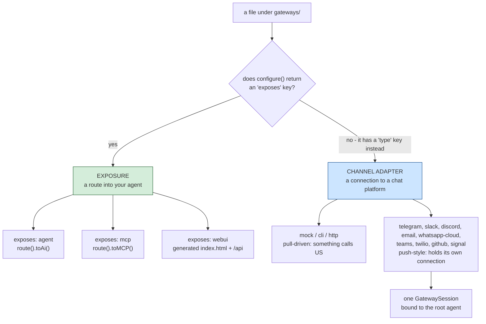
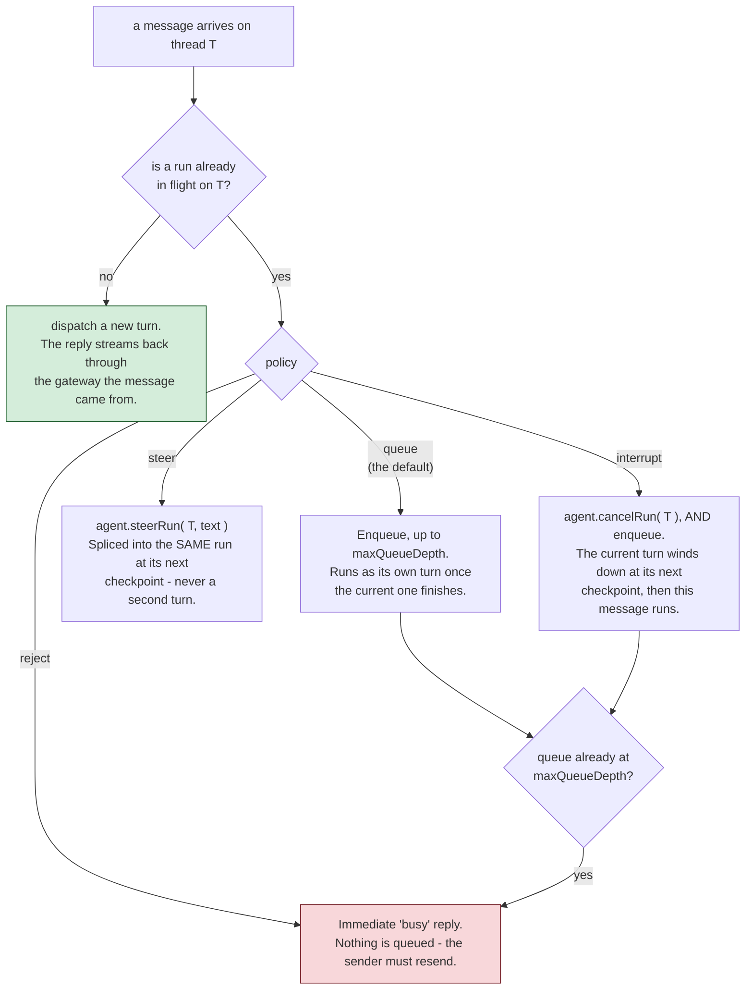

# gateways/

`gateways/*.bx`/`.json`-Dateien unter diesem einen Ordner decken **zwei unterschiedliche, unabhängige Dinge** ab - welcher Art ein Eintrag ist, hängt allein davon ab, ob seine `configure()`-Struktur einen `exposes`-Schlüssel hat.

!!! warning
    Diese nicht miteinander verwechseln - ein per HTTP exponierter Agent (`exposes: "agent"`) ist eine REST-API für den Agenten; ein Channel-Adapter-Gateway (`type: "http"`) ist ein Webhook-Endpunkt für eine Chat-Plattform oder einen Human-in-the-Loop-Genehmigungsablauf. Sie erzeugen völlig unterschiedliche Routen.



## 1. HTTP-/MCP-/Web-UI-Exposure (`exposes: "agent" | "mcp" | "webui"`)

Exponiert den Agenten, oder einen lokalen MCP-Server, über HTTP mit ColdBox 8.1s nativer AI-Routing-DSL - oder eine fertige Browser-Chat-UI, separat dokumentiert in [Die Web-Chat-UI](../web-ui.md).

**Den Agenten exponieren:**

```javascript
// gateways/expose.bx
class {

	function configure() {
		return {
			exposes : "agent",
			path    : "/api/chat"
		};
	}

}
```

Erzeugt, in `config/Router.bx`:

```javascript
route( "/api/chat" ).toAi( "GeneratedAgent" )
```

was automatisch **vier** Unterrouten registriert: `POST /api/chat/invoke`, `POST /api/chat/stream` (SSE), `POST /api/chat/batch`, `GET /api/chat/info`. Der bloße Pfad `/api/chat` selbst ist nicht routbar.

**Einen lokalen MCP-Server exponieren** (siehe [mcp/](../mcp.md)):

```javascript
class {
	function configure() {
		return {
			exposes : "mcp",
			path    : "/mcp/tools",
			target  : "local-server"   // must match an mcp/*.bx entry's declared name
		};
	}
}
```

Erzeugt `route( "/mcp/tools" ).toMCP( "local-server" )`.

**Die v1-Web-Chat-UI exponieren:**

```javascript
// gateways/chat.bx
class {
	function configure() {
		return {
			exposes     : "webui",
			path        : "/chat",
			apiKeyEnvVar: "CHAT_UI_API_KEY"   // optional - see below
		};
	}
}
```

Erzeugt eine echte statische `<path>/index.html`-Datei (direkt bedient - keine Route dafür nötig) plus eine eigene, dedizierte API unter einem festen `<path>/api`-Präfix, sodass sie nie mit den Dateien der Hülle selbst kollidiert. Diese API ist ein generiertes `handlers/ChatUi.bx` statt `toAi()`, und der Eintrag bringt außerdem einen generierten SQLite-Store mit.

Die Web-UI ist eher ein Subsystem als ein einzelner Exposure-Schalter - die Routenliste, der Store, Konversationen und Präferenzen, Branding und Theming, und warum sie `toAi()` nicht nutzt, stehen alle auf ihrer eigenen Seite: **[Die Web-Chat-UI](../web-ui.md)**.

**Validierung:** `exposes` muss `agent`, `mcp` oder `webui` sein; `path` ist erforderlich und muss über jeden Exposure-Eintrag hinweg eindeutig sein; das `target` einer `mcp`-Exposure ist erforderlich und muss zum deklarierten Namen eines echten `mcp/*`-Eintrags passen; `apiKeyEnvVar` bei `webui` ist vollständig optional, ohne Pflichtfeld-Prüfung (siehe unten).

## 2. Channel-Adapter-Gateways (`type: "mock" | "cli" | "http"`)

Registriert namentlich ein bx-ai-`IGateway` (einen Channel-Adapter für externe Auslieferung / Human-in-the-Loop-Genehmigung) - zu unterscheiden vom Exponieren der eigenen REST-API des Agenten.

```javascript
// gateways/slack.bx
class {
	function configure() {
		return {
			type         : "http",
			secretEnvVar : "SLACK_WEBHOOK_SECRET"
		};
	}
}
```

`secretEnvVar` benennt eine Umgebungsvariable, die das Signing-Secret enthält - **nie den Secret-Wert selbst**. Erzeugt, in `Application.bx`s `onApplicationStart()`:

```javascript
aiGatewayRegistry().register( aiGateway( "http", { secret : getSystemSetting( "SLACK_WEBHOOK_SECRET", "" ) } ) )
```

Das Secret wird live beim Serverstart aufgelöst, passend zur "Secrets bleiben extern"-Regel dieses Projekts überall sonst (siehe [Deployment & Secrets](../../deployment-and-secrets.md)) - es wird nie als Literal in generierten Quellcode eingebettet, ist also auch nie in einer paketierten `.bxa` vorhanden. Ist die Umgebungsvariable ungesetzt, behandelt bx-ais eigenes `HttpGateway` ein leeres Secret als "keine Signierung konfiguriert" und lehnt Requests entsprechend ab, statt beim Start abzustürzen.

**Validierung:** `type` muss `mock`, `cli` oder `http` sein; ein Eintrag mit `type: "http"` erfordert ein `secretEnvVar`; der eigene Datei-/Basisname des Eintrags muss über jeden Channel-Adapter-Eintrag hinweg eindeutig sein. `mock` ist nur für Tests; `cli` ist bx-ais eigener eingebauter Human-in-the-Loop-**Genehmigungs**-Kanal (ein blockierender A/R/Q-Prompt über stdin/stdout) - er ist es, was `HumanInTheLoopMiddleware` standardmäßig anhängt, wenn kein Gateway angegeben ist, und hat nichts mit BxAgents' eigenem `chat`-Verb zu tun (das die Gateway-Registry überhaupt nie berührt).

**Einträge vom Typ `http` erhalten zusätzlich echte HTTP-Verdrahtung**: eine generierte `handlers/Gateway.bx`-Action, die direkt in bx-ais eigenes `GatewayRequestProcessor::processHttp()` durchreicht, sowie drei Routen in `config/Router.bx`:

```javascript
post( "/gateways/:gatewayName/events" ).toHandler( "Gateway.process" )
get( "/interactions/:requestID" ).toHandler( "Gateway.process" )
post( "/interactions/:requestID/decisions" ).toHandler( "Gateway.process" )
```

!!! info
    ColdBox hat keinen eingebauten `toAiGateway()`-DSL-Terminator für diese Oberfläche (nur `toAi()` und `toMCP()` existieren nativ) - diese Verdrahtung ist BxAgents' eigener generierter Code, in derselben Form, die ein zukünftiger Core-Terminator erzeugen würde. Siehe den Vorschlag [`toAiGateway()` für ColdBox Core](../../proposals/toAiGateway-coldbox-core.md).

## 3. Push-style gateways (`type: "telegram"` / `"slack"` / `"discord"` / `"email"` / `"whatsapp-cloud"` / `"teams"` / `"twilio"` / `"github"` / `"signal"`, and friends)

Eine andere Art von Channel-Adapter als `mock`/`cli`/`http` oben: Statt von einem eingehenden HTTP-Request getrieben zu werden, hält ein Push-Style-Gateway seine eigene Verbindung zur Plattform und pusht eingehende Nachrichten an den Agenten, sobald sie eintreffen - das eher "echter Chat-Bot"-artige Erlebnis. Vier Transportformen existieren heute:

- **Long-Poll** (Telegram, E-Mail): ein geplanter Task fragt die Plattform periodisch "irgendwas Neues?" (Telegrams `getUpdates`, E-Mails IMAP-Poll).
- **Persistenter Websocket** (Slack über Socket Mode, Discord über seine Gateway-API): das Gateway hält eine lebende, langlaufende Verbindung, über die die Plattform Events in Echtzeit herunterpusht.
- **Webhook, pull-getrieben** (WhatsApp Business Cloud API, Microsoft Teams, Twilio SMS, GitHub): die Plattform ruft **uns** über einen öffentlichen HTTP-Endpunkt an, statt dass dieses Gateway eine eigene ausgehende Verbindung hält - kein Scheduler-Task oder Socket zu verwalten. Siehe deren eigene Unterabschnitte unten.
- **Server-Sent Events (SSE)** (Signal, gegen einen lokal laufenden `signal-cli`-Daemon): eine langlebige, unidirektionale Streaming-HTTP-Verbindung, die das Gateway offen hält und dabei Events liest, während sie über denselben Response-Body gepusht werden. Siehe den eigenen Unterabschnitt unten.

## Die neun Push-Style-Plattformen

Jede Plattform bekommt ihre eigene Seite: ihre `gateways/*.bx`-Config-Form, was benötigt wird, und
(wo vorhanden) das Protokoll-Detail, wie BxAgents mit ihr kommuniziert.

::: cards
::: card title="Telegram" icon="phosphor-duotone:plugs-connected" href="telegram.md"
Long-Poll. Nur `botTokenEnvVar`.
:::
::: card title="Slack" icon="phosphor-duotone:plugs-connected" href="slack.md"
Persistentes Websocket, Socket Mode.
:::
::: card title="Discord" icon="phosphor-duotone:plugs-connected" href="discord.md"
Persistentes Websocket, Gateway API, obligatorische Heartbeats.
:::
::: card title="E-Mail" icon="phosphor-duotone:plugs-connected" href="email.md"
Long-Poll IMAP + cbmailservices/bx-mail für ausgehende Mails.
:::
::: card title="WhatsApp Business Cloud" icon="phosphor-duotone:plugs-connected" href="whatsapp-cloud.md"
Webhook-getrieben, Meta Graph API.
:::
::: card title="Microsoft Teams" icon="phosphor-duotone:plugs-connected" href="teams.md"
Webhook-getrieben, Bot-Framework-Activity-Protokoll.
:::
::: card title="Twilio SMS" icon="phosphor-duotone:plugs-connected" href="twilio.md"
Webhook-getrieben, form-urlencoded, zweigleisige TwiML-Antwort.
:::
::: card title="GitHub" icon="phosphor-duotone:plugs-connected" href="github.md"
Webhook-getrieben, über `@mention` geschützte Issue-/PR-Kommentar-Threads.
:::
::: card title="Signal" icon="phosphor-duotone:plugs-connected" href="signal.md"
Server-Sent Events, gegen einen externen `signal-cli`-Daemon.
:::
:::

Dieselbe "Secrets bleiben extern"-Regel wie bei `http`s `secretEnvVar`: Jeder `*EnvVar`-Schlüssel benennt eine Umgebungsvariable, live über `getSystemSetting()` beim Start aufgelöst, nie als Literal eingebettet - `email`s `imapHost`/`fromAddress` sind keine kryptografischen Secrets, aber dieselbe umgebungsvariablen-getriebene Konvention wird trotzdem für jeden einzelnen ihrer Konfigurationswerte verwendet, da sie alle pro Deployment variieren. Anders als bei den Core-Typen lebt die Klasse eines Push-Style-Gateways innerhalb von BxAgents selbst (`models/gateways/*.bx`, nicht bx-ai), sodass ihre Registrierung als bloßer Klassenpfad statt als Kurzname gerendert wird:

```javascript
aiGatewayRegistry().register( aiGateway( "bxModules.bxagents.models.gateways.TelegramGateway", { "botToken" : getSystemSetting( "TELEGRAM_BOT_TOKEN", "" ) } ) )
aiGatewayRegistry().register( aiGateway( "bxModules.bxagents.models.gateways.SlackGateway", { "appToken" : getSystemSetting( "SLACK_APP_TOKEN", "" ), "botToken" : getSystemSetting( "SLACK_BOT_TOKEN", "" ) } ) )
aiGatewayRegistry().register( aiGateway( "bxModules.bxagents.models.gateways.DiscordGateway", { "botToken" : getSystemSetting( "DISCORD_BOT_TOKEN", "" ) } ) )
aiGatewayRegistry().register( aiGateway( "bxModules.bxagents.models.gateways.EmailGateway", { "imapHost" : getSystemSetting( "IMAP_HOST", "" ), "imapUsername" : getSystemSetting( "IMAP_USERNAME", "" ), "imapPassword" : getSystemSetting( "IMAP_PASSWORD", "" ), "fromAddress" : getSystemSetting( "EMAIL_FROM_ADDRESS", "" ) } ) )
aiGatewayRegistry().register( aiGateway( "bxModules.bxagents.models.gateways.whatsapp.WhatsAppCloudGateway", { "accessToken" : getSystemSetting( "WHATSAPP_ACCESS_TOKEN", "" ), "phoneNumberId" : getSystemSetting( "WHATSAPP_PHONE_NUMBER_ID", "" ), "appSecret" : getSystemSetting( "WHATSAPP_APP_SECRET", "" ), "verifyToken" : getSystemSetting( "WHATSAPP_VERIFY_TOKEN", "" ) } ) )
aiGatewayRegistry().register( aiGateway( "bxModules.bxagents.models.gateways.TeamsGateway", { "appId" : getSystemSetting( "TEAMS_APP_ID", "" ), "appPassword" : getSystemSetting( "TEAMS_APP_PASSWORD", "" ) } ) )
aiGatewayRegistry().register( aiGateway( "bxModules.bxagents.models.gateways.TwilioGateway", { "accountSid" : getSystemSetting( "TWILIO_ACCOUNT_SID", "" ), "authToken" : getSystemSetting( "TWILIO_AUTH_TOKEN", "" ), "from" : getSystemSetting( "TWILIO_FROM_NUMBER", "" ) } ) )
aiGatewayRegistry().register( aiGateway( "bxModules.bxagents.models.gateways.GitHubGateway", { "token" : getSystemSetting( "GITHUB_TOKEN", "" ), "webhookSecret" : getSystemSetting( "GITHUB_WEBHOOK_SECRET", "" ), "botName" : getSystemSetting( "GITHUB_BOT_NAME", "" ) } ) )
aiGatewayRegistry().register( aiGateway( "bxModules.bxagents.models.gateways.SignalGateway", { "account" : getSystemSetting( "MY_SIGNAL_ACCOUNT", "" ) } ) )
```

**Validierung:** `type: "telegram"` erfordert `botTokenEnvVar`; `type: "slack"` erfordert sowohl `botTokenEnvVar` als auch `appTokenEnvVar`; `type: "discord"` erfordert `botTokenEnvVar`; `type: "email"` erfordert `imapHostEnvVar`, `imapUsernameEnvVar`, `imapPasswordEnvVar` und `fromAddressEnvVar`; `type: "whatsapp-cloud"` erfordert `accessTokenEnvVar`, `phoneNumberIdEnvVar`, `appSecretEnvVar` und `verifyTokenEnvVar`; `type: "teams"` erfordert `appIdEnvVar` und `appPasswordEnvVar`; `type: "twilio"` erfordert `accountSidEnvVar`, `authTokenEnvVar` und `fromEnvVar`; `type: "github"` erfordert `tokenEnvVar`, `webhookSecretEnvVar` und `botNameEnvVar`; `type: "signal"` erfordert `accountEnvVar` - alle auf dieselbe Weise geprüft wie `http`s `secretEnvVar`.

!!! info
    Slack v1 ist **nur Socket Mode** - für Slack wird kein öffentlicher Webhook-Endpunkt benötigt oder generiert (anders als `http`, das echte Routen erhält - siehe §2 oben). Die von Slack ebenfalls unterstützte Events-API-/HTTP-Webhook-Alternative ist hier nicht gebaut. Discord v1 ist ebenso die echte **Gateway-API** (ein persistenter Websocket), statt Discords alternativem HTTP-Interactions-Endpoint-URL-Webhook-Modus - eine Ed25519-Signaturprüfung wird hier folglich nicht benötigt, da Interaktionen über dieselbe authentifizierte Verbindung eintreffen statt über einen öffentlichen HTTP-Endpunkt (gegen Discords eigene Dokumentation bestätigt).

### GatewaySession - wiring the agent to every push-style gateway

Jedes Projekt mit mindestens einem Push-Style-Gateway-Eintrag erhält außerdem ein generiertes `interceptors/GatewaySessionBootstrap.bx`, das eine einzige bx-ai-`GatewaySession` baut, die jedes Push-Style-Gateway im Projekt bündelt, an den Root-Agenten des Projekts gebunden ist, und startet, sobald ColdBox selbst mit dem Laden fertig ist:

```javascript
// interceptors/GatewaySessionBootstrap.bx (GENERATED)
class {
	function afterConfigurationLoad( event, interceptData ) {
		var wirebox        = getController().getWireBox()
		var agent          = wirebox.getInstance( "GeneratedAgent" )
		var gatewaySession = aiGatewaySession(
			agent        : agent,
			gateways     : [ aiGatewayRegistry().get( "telegram" ) ],
			policy       : "queue",
			maxQueueDepth: 50
		)
		gatewaySession.start()
		application.bxaiGatewaySession = gatewaySession
	}
}
```

!!! info
    Die generierte Variable heißt bewusst `gatewaySession`, nicht `session` - `session` ist ein reservierter BoxLang-/ColdBox-Scope-Name (wie `request`/`server`/`url`/`form`/`cgi`/`thread`), und eine lokale Variable, die einen dieser Namen wiederverwendet, kann mit dem lebenden Scope kollidieren, statt sich wie eine gewöhnliche lokale Variable zu verhalten.

!!! warning
    Der `aiGatewayRegistry().get(...)`-Schlüssel ist immer der Gateway-TYPE-String ("telegram", "slack", "discord", "email", ...) - gegen bx-ais echten `GatewayRegistry.register()`-Quellcode bestätigt, der immer nach dem eigenen festen `getName()` der Gateway-Klasse schlüsselt, nie nach etwas vom Aufrufer Übergebenem. Eine echte Konsequenz: **Zwei `gateways/*`-Einträge desselben Push-Style-Typs kollidieren auf demselben Registry-Slot, projektweit** - die zweite Registrierung überschreibt still die erste. Es gibt heute keinen Pro-Eintrag-Alias - für jede zusätzliche Plattform-Account einen eigenen Typ verwenden, oder auf Multi-Instanz-Unterstützung warten.

Die Richtlinie der `GatewaySession` wird über einen optionalen `gatewaySession`-Block am `Agent.bx` des Root-Projekts gesteuert:

```javascript
// Agent.bx
class extends="bxModules.bxai.models.runnables.AiAgent" {

	function init() {
		super.init( name: "...", model: aiModel( provider: "..." ) )
		return this
	}

	function configure() {
		return {
			gatewaySession: { policy: "queue", maxQueueDepth: 50 }   // both optional - these are the defaults
		};
	}

}
```

`policy` muss `reject`/`queue`/`steer`/`interrupt` sein (bx-ais eigenes `GatewaySession`-Richtlinienvokabular - siehe [GatewaySession](#gatewaysession---wiring-the-agent-to-every-push-style-gateway) unten) - zur `build`-Zeit geprüft, sodass ein Tippfehler laut fehlschlägt, statt als Laufzeitfehler zu erscheinen, sobald die App zum ersten Mal bootet.

!!! warning
    v1-Einschränkung: genau eine `GatewaySession`, immer an den Root-Agenten des Projekts gebunden - passend zum bestehenden Präzedenzfall, dass die HTTP-Exposure `exposes: "agent"` ebenfalls immer nur den Root-Agenten betrifft. Ein Projekt mit Subagenten kann noch nicht unterschiedliche Gateways zu unterschiedlichen Subagenten routen.

Was jede Richtlinie tatsächlich mit einer Nachricht tut, die eintrifft, während noch ein Turn läuft:



!!! warning
    "Steer" bedeutet hier Hermes Agents zerstörungsfreies Splicing - der laufende Turn läuft weiter, und der neue Text wird in ihn eingefügt. Es bedeutet **nicht**, was Eves `turnPolicy: "steer"` bedeutet (den aktiven Turn abbrechen und einen Ersatz starten); dieses Verhalten heißt in diesem Vokabular `interrupt`.

!!! info
    Weder `cancelRun()` noch `steerRun()` ist sofort. Beide werden signalisiert und wirken erst am **nächsten Checkpoint** des Laufs (vor dem nächsten LLM- oder Tool-Aufruf), `interrupt` bedeutet also "den aktuellen Turn bitten, bald abzuklingen", nicht "synchron ersetzen".

### Wie ein Push-Style-Gateway verbunden bleibt: der geteilte ColdBox-Scheduler

Statt einer neuen Hintergrundschleifen-Primitive erreichen Push-Style-Gateways das eigene, lebende ColdBox-Scheduler-Singleton der App (`appScheduler@coldbox` - dasselbe, unter dem auch ein handgeschriebenes `schedules/Scheduler.bx`, falls das Projekt eines hat, läuft) und registrieren ihre eigenen benannten Task(s) dynamisch darin - z. B. ein wiederkehrender Long-Poll-Task für Telegram. **Ein geteilter Scheduler, jedes Push-Style-Gateway registriert seine eigenen Tasks darin** - nie ein Scheduler pro Gateway, und nie im Konflikt mit den eigenen Cron-Jobs eines Projekts.

### Logging

Jedes Push-Style-Gateway schreibt in seine eigene `gateway-<type>`-Logdatei (z. B. `gateway-telegram`) über BoxLangs `writeLog()`, statt in ein geteiltes/Standard-App-Log - sodass eine Bedienerin genau die Plattform verfolgen kann, die sie interessiert, ohne Rauschen von allem anderen, was die App sonst loggt.
