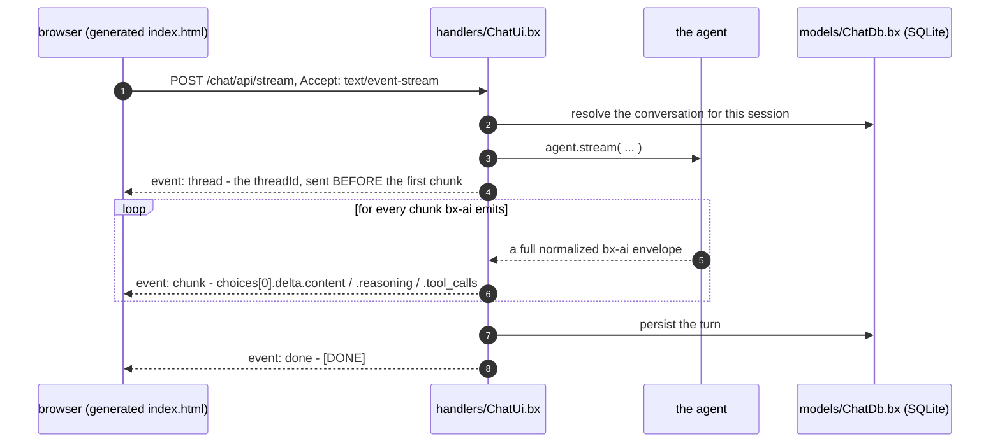

# Die Web-Chat-UI

Ein `gateways/*.bx`-Eintrag mit `exposes: "webui"` liefert einen vollständigen Browser-Chat-Client für den Agenten aus - eine Konversations-Seitenleiste, Streaming mit Reasoning und Tool-Aufrufen, Human-in-the-Loop-Genehmigungen, Theming pro Besucher, und einen echten SQLite-Store dahinter.

Sie lebt unter [gateways/](gateways/index.md), weil dort Exposures deklariert werden, ist aber ein eigenständiges Subsystem, weshalb sie eine eigene Seite hat.

```javascript
// gateways/chat.bx
class {
	function configure() {
		return {
			exposes     : "webui",
			path        : "/chat",
			apiKeyEnvVar: "CHAT_UI_API_KEY"   // optional - see Securing the API
		};
	}
}
```

Das erzeugt eine statische `<path>/index.html` (direkt bedient - keine Route nötig) plus eine dedizierte API unter `<path>/api`, unterlegt von einem generierten `handlers/ChatUi.bx` und `models/ChatDb.bx`.


Der obige Screenshot ist die echte, unveränderte generierte Seite - dieselbe Vorlage, die dieses Repository ausliefert - gebrandet mit [`examples/webui-agent`](https://github.com/ortus-boxlang/bx-agents/tree/development/examples/webui-agent)s eigener `theme`/`title`/`icon`-Config und mit Beispiel-Konversationsinhalt zur Veranschaulichung gefüllt; `bxAgents build && bxAgents serve` in diesem Beispiel erzeugt dieselbe Seite wirklich.

Die UI ist abhängigkeitsfreies, reines HTML/CSS/JS - kein Bootstrap, kein AlpineJS, kein Vite-Build-Schritt - und ist **vorgebaut und in BxAgents selbst vendort**: `bxAgents build` führt nie `npm install`/`npm run build` aus, und ein generiertes Projekt braucht überhaupt nie Node oder npm installiert. Alles, was die Seite braucht, ist in das einzelne generierte `index.html` eingebettet.

Diese Einschränkung betrifft den Build, nicht den Funktionsumfang. Die Seite ist ein vollständiger Client: Konversations-Seitenleiste, Streaming mit Reasoning und Tool-Aufrufen, Genehmigungen, Kompaktierung, serverseitiges Theming. Was tatsächlich noch fehlt, steht unter [Was hier noch fehlt](#what-is-not-here-yet).

Die Seite spricht mit der eigenen generierten `<path>/api`-Route über `POST <path>/api/stream` (`Accept: text/event-stream`), mittels `fetch()` + einem manuellen `ReadableStream`-Reader - nicht dem `EventSource` des Browsers, das weder `POST` kann noch eigene Header setzen kann, beides hier nötig.

!!! warning
    **`toAi()` reicht jeden bx-ai-Chunk unverändert durch - es wickelt ihn nicht ein.** ColdBoxs [AI-Routing-Dokumentation](https://coldbox.ortusbooks.com/the-basics/routing/routing-dsl/ai-routing) zeigt den Stream als `data: {"token":"..."}`-Zeilen, aber ihr eigener Quellcode (`Router.cfc`, `toAi()`s Stream-Unterroute) macht `emitter.send( chunk, "chunk" )` - jeder Frame trägt also die **vollständige, normalisierte bx-ai-Hülle**:

    ```
    event: chunk
    data: {"object":"chat.completion.chunk","choices":[{"delta":{"role":"assistant","content":"Ray","reasoning":"...","tool_calls":[...]}}]}

    event: done
    data: [DONE]
    ```

    Es gibt nirgendwo einen `token`-Schlüssel. Ein gegen diese Doku-Seite geschriebener Client - einschließlich der eigenen ersten Version dieser UI - liest `undefined` und rendert überhaupt nichts. Stattdessen `choices[0].delta.content` lesen.

Weil die gesamte Hülle ankommt, **liegen Reasoning und Tool-Aufrufe bereits auf dem Draht**, ohne dass ein zusätzlicher Endpunkt nötig wäre: `delta.reasoning` (von bx-ai über jeden Provider hinweg normalisiert) rendert als eingeklappter "Denkt nach"-Streifen, und `delta.tool_calls` als eingeklappte Chips pro Aufruf. Tool-Aufruf-Argumente streamen als partielle JSON-Fragmente, geschlüsselt nach `index`, die Seite akkumuliert also pro Index, statt anzunehmen, dass ein einzelner Chunk je einen vollständigen Aufruf enthält.

## Wie ein Streaming-Turn tatsächlich aussieht



Das `thread`-Event geht zuerst, weil ein Response-Header nicht gelesen werden kann, bevor der Body zu kommen beginnt, und die Seite die `threadId` braucht, um mitten im Turn `POST /cancel` aufrufen zu können.

## Die generierte API

Ein `webui`-Eintrag mountet zwanzig Actions unter `<path>/api`, bedient von einem generierten `handlers/ChatUi.bx`:

| Route | Zweck |
| --- | --- |
| `POST /invoke` | Ein synchroner Turn |
| `POST /stream` | SSE-Turn (was die Seite nutzt) |
| `POST /batch` | Ein `inputs[]`-Array ausführen |
| `POST /cancel` | Einen laufenden Run stoppen - `{ threadId, reason? }` |
| `POST /steer` | Eine Nachricht in einen laufenden Turn einfügen - `{ threadId, input }` |
| `POST /clear` | Die Konversation dieses Besuchers leeren |
| `POST /compact` | Ältere Nachrichten dieses Besuchers zusammenfassen, die aktuellen behalten - optional `{ keepRecent }` |
| `GET /history` | Die gespeicherten Nachrichten dieses Besuchers, um das Transkript zu rehydrieren |
| `POST /resume` | Eine ausstehende Genehmigung beantworten und die Fortsetzung streamen - `{ threadId, decision, editedData?, reason? }` |
| `GET /pending` | Worauf ein suspendierter Run wartet - `?threadId=` |
| `GET /tools` | Die registrierten Tools des Agenten |
| `GET /health` | Liveness |
| `GET /info` | Agentenname, Modell, Memory-/Tool-Zähler, Capability-Flags |
| `GET /conversations` | Die Konversationen dieses Besuchers, neueste Aktivität zuerst |
| `POST /conversations/create` | Eine starten - optional `{ title }`, liefert die geprägte `conversationId` |
| `POST /conversations/rename` | `{ conversationId, title }` |
| `POST /conversations/delete` | `{ conversationId }` - löscht die Zeile **und** die Nachrichten des Agenten dafür |
| `GET /preferences` | Die gespeicherten Präferenzen dieses Besuchers, als `{ key: value }` |
| `POST /preferences/set` | `{ key, value }` |
| `POST /preferences/delete` | `{ key }` |

Jede ist über ColdBoxs `getUserSessionIdentifier()` als `userId` gescoped. Die ersten drei behalten `toAi()`s exakte Form und Drahtformat.

`threadId` ist serverautoritativ: aus dem Request übernommen, wenn mitgeliefert, sonst geprägt, und immer zurückgemeldet - als `X-Thread-Id`-Response-Header bei `/invoke` und `/batch`, und als `thread`-SSE-Event, gesendet *vor dem ersten Chunk* bei `/stream` (ein Header kann nicht gelesen werden, bevor der Body zu kommen beginnt). Das ist derselbe Vertrag, den ColdBox 8.1s eigenes `toAi()` angenommen hat, ein gegen das eine geschriebener Client funktioniert also auch gegen das andere.

!!! warning
    **Stop muss über `/cancel` laufen, nicht nur über ein abgebrochenes Fetch.** Das HTTP-Request abzubrechen stoppt nur den Browser beim Zuhören - der Server läuft mit dem Turn weiter, ruft Tools auf und verbraucht Tokens. Die Seite sendet daher bei jedem Turn eine `threadId` mit und postet sie an `/cancel`, bevor sie abbricht, damit `agent.cancelRun()` den Run an seinem nächsten Checkpoint signalisieren kann.

`/clear` und `/compact` sind beide vorsichtig mit dem Scope. `/clear` geht über das eigene `clear( userId, conversationId )` jedes Memory statt über `AiAgent.clearMemory()`, das keine Argumente nimmt und die Historie jedes Besuchers löschen würde; `/compact` geht aus demselben Grund über `summarize( config, userId, conversationId )`. Kompaktierung ersetzt die älteren Nachrichten dieser Konversation durch eine KI-verfasste Zusammenfassung und behält die letzten paar, ohne irgendetwas außerhalb des `(userId, conversationId)`-Paars des Aufrufers anzufassen.

!!! info
    **`/compact` braucht ein Zusammenfassungsmodell und meldet, ob es eines hat.** `summarize()` ist ein stiller No-Op, sofern das Memory nicht *sowohl* `summaryProvider` als auch `summaryModel` konfiguriert hat, und auch dann, wenn die Konversation bereits bei oder unter `keepRecent` liegt. Keines von beiden ist ein Fehler, `/compact` gibt also `{ compacted, before, after }` zurück und lässt die Aufruferin selbst sehen, und `/info`s `capabilities.compact` meldet, ob überhaupt ein Zusammenfassungsmodell konfiguriert ist - sodass eine Seite eine Schaltfläche verstecken kann, die nichts tun würde, statt kaputt auszusehen.

    Nur `keepRecent` wird aus dem Request übernommen. `summarize()` respektiert auch `model`-/`provider`-Overrides, aber diese hier zu akzeptieren würde es jedem Besucher erlauben, einen Zusammenfassungsaufruf auf einen Provider und ein Modell eigener Wahl auf den eigenen Zugangsdaten zu richten - das entscheidet stattdessen die eigene Konfiguration des Memory.

```javascript
// Agent.bx - what makes /compact functional
memory: {
	type            : "cache",
	summaryProvider : "openai",
	summaryModel    : "gpt-4o-mini",
	summaryThreshold: 10
}
```

## Benutzer und Anmeldung

Standardmäßig hat die Web-UI **keine Konten und kein Gate** — sie ist offen, und jeder Besucher ist anonym. Das ist das aufwandsfreie `bxAgents serve`-Erlebnis, und es ist **keine** Deployment-Haltung. `users` an einem `webui`-Eintrag zu deklarieren schaltet ein echtes Anmelde-Gate ein, gestützt auf [cbauth](https://forgebox.io/view/cbauth) und denselben SQLite-Store, den alles andere nutzt.

### Ohne Konten ist die UI ein gemeinsamer Arbeitsbereich

Es gibt bewusst keine Pro-Besucher-Identität. Jeder Besucher einer Web-UI ohne Konten liest und schreibt **dieselben** Konversationen, Präferenzen und das Agentengedächtnis — wer auch immer die Seite erreichen kann, sieht alles darin.

Das ist der Sinn, ohne Konten zu laufen, kein Versehen: Eine offene UI ist ein einzelnes gemeinsames Werkzeug (ein Laptop, eine vertrauenswürdige interne Maschine), kein Multi-Tenant-Dienst. Jedem Browser seine eigene Scheibe zu geben würde nur einen Arbeitsbereich in Pro-Browser-Kopien zersplittern, um die niemand gebeten hat, und jede clientseitige ID, die diese Zersplitterung vornähme, wäre ohnehin fälschbar.

!!! warning
    **Eine offene UI hat keine Privatsphäre zwischen Besuchern.** Wer auch immer die URL erreichen kann, sieht jede Konversation darin und kann jede davon fortsetzen oder löschen. Ist das nicht gewünscht — überall, wo die Seite von mehr Personen erreicht werden kann als denen, die die Transkripte sehen sollen — `users` deklarieren.

```javascript
// gateways/chatUi.bx
users : [
    { username: "ada",   passwordEnvVar: "ACME_ADA_PASSWORD", displayName: "Ada Lovelace" },
    { username: "grace", passwordHash: "pbkdf2$210000$...",   displayName: "Grace Hopper" }
]
```

### Passwörter werden nie in der Konfiguration geschrieben

Ein Konto benennt die **Umgebungsvariable**, die sein Passwort enthält (`passwordEnvVar`), oder trägt einen **bereits gehashten** Wert (`passwordHash`). Ein literaler `password`-Schlüssel ist ein Build-Fehler, keine Warnung — ihn still zu ignorieren würde den Eindruck hinterlassen, ein Passwort gesetzt zu haben, obwohl nur eines committet wurde.

Ein `passwordHash` ist bedenkenlos committebar, gerade weil er nicht umkehrbar ist. Einen erzeugen mit demselben Hasher, den die App nutzt:

```
bxAgents hash-password --password="correct horse battery staple"
```

!!! danger
    **Gehasht, nicht verschlüsselt.** Verschlüsselung ist umkehrbar, und eine gestohlene Datenbankdatei reist fast immer mit allem, was sie entschlüsseln könnte — ein umkehrbares Schema verwandelt also ein einziges Datei-Leck in das Passwort jedes Nutzers, einschließlich jedem, den sie anderswo wiederverwendet haben. Passwörter durchlaufen hier PBKDF2-HMAC-SHA256 mit einem zufälligen Salt pro Nutzer und sind nie aus der Datenbank wiederherstellbar. (BoxLang liefert keinen bcrypt- oder argon2-BIF; PBKDF2 ist die stärkste verfügbare Primitive, ohne eine Abhängigkeit hinzuzufügen.)

    Die Iterationszahl ist *innerhalb* jedes Hashes gespeichert (`pbkdf2$<iterations>$<salt>$<digest>`), sie kann also später angehoben werden, ohne etwas bereits Gespeichertes zu invalidieren.

### Was sich mit der Anmeldung ändert

Alles Nutzer-gescopte schlüsselt sich neu auf das echte Konto um. Der generierte `handlers/ChatUi.bx` löst die Identität direkt aus cbauth auf, in einer Methode (`resolveUserId()`), und das Agentengedächtnis, der Konversationsindex, Präferenzen und die Eigentümerschaft laufender Runs schlüsseln sich alle auf ihren Rückgabewert.

Es liest bewusst cbauth statt ColdBoxs `identifierProvider`-Einstellung: Eine im `coldbox`-Konfigurationsstruct deklarierte Closure erreicht `configSettings` nie — in einem echten Boot verifiziert, sowohl in der dokumentierten literalen Form als auch als spätere Zuweisung — irgendetwas, das sich auf diese Einstellung stützte, erhielt also still eine Session-ID statt der echten Identität.

Der praktische Unterschied: Konversationen und Präferenzen folgen der Person über Browser und Geräte hinweg, und Cookies löschen erzeugt keinen brandneuen "Nutzer" mehr.

| | Ohne `users` | Mit `users` |
|---|---|---|
| Identität | Ein gemeinsamer Arbeitsbereich | Das angemeldete Konto |
| Konversationen sichtbar für | Jeden, der die UI erreichen kann | Nur den eigenen Besitzer |
| Folgt der Person über Browser/Geräte | n/a — nichts ist personenbezogen | Ja |
| Erreichbar ohne Anmeldung | Alles | Nur das Anmeldeformular |

### Lebenszyklus

Konten werden bei jedem Boot aus der Konfiguration abgeglichen, in dieser Reihenfolge: der Schema-Interceptor migriert, der Seeder schreibt Konten, dann beginnt das Anmelde-Gate durchzugreifen.

- **Hinzufügen** eines Nutzers zur Konfiguration erzeugt ihn.
- **Ändern** seines Passworts aktualisiert es. Der Seeder hasht nur neu, wenn das konfigurierte Passwort nicht mehr zum Gespeicherten passt, ein unverändertes Passwort kostet also nur eine Verifikation statt eines frischen Hashes.
- Ihn aus der Konfiguration zu **entfernen** **deaktiviert** das Konto, statt es zu löschen. Seine Konversationen referenzieren seine ID, das Löschen der Zeile würde diese Historie also verwaisen lassen, statt den Zugriff zu widerrufen. Er kann sich nicht mehr anmelden; seine Daten bleiben intakt und kehren zurück, falls das Konto wiederhergestellt wird.
- Ein `passwordEnvVar`, dessen Variable **ungesetzt** ist, überspringt dieses Konto vollständig und loggt eine Warnung nach `webui-auth`. Das schlägt bewusst fehlerabgeschottet fehl — das Konto mit leerem Passwort anzulegen wäre weit schlimmer, als es nicht existieren zu lassen.

### Was das nicht ist

Das ist ein fester, von Betreibern bereitgestellter Kontenbestand, kein Benutzerverwaltungssystem. Es gibt keine Selbstregistrierung, kein Passwort-Reset, keine Rollen oder Berechtigungen, und keine Pro-Nutzer-Ratenbegrenzung oder Ausgabendeckel. Wer stattdessen föderierte Identität braucht, bearbeitet `resolveUserId()` im generierten Handler, um das eigene authentifizierte Prinzipal zurückzugeben — der Rest der Web-UI weiß nicht und interessiert sich nicht dafür, woher die ID kam.

## Human-in-the-Loop

Wenn der Agent für eine Genehmigung pausiert, emittiert der Stream einen `middleware_stop`-Chunk ohne Details. Die Seite fragt daher `GET /pending?threadId=`, was angefragt wird, rendert es mit **Genehmigen**/**Ablehnen** und antwortet über `POST /resume` - was die *Fortsetzung desselben Turns* streamt, sodass das Ergebnis in der Konversation landet, statt eine neue zu beginnen.

`decidedBy` wird serverseitig aus der Session befüllt, nie aus dem Request-Body: Wer etwas genehmigt hat, ist genau die Art von Behauptung, die ein Aufrufer nicht über sich selbst aufstellen dürfen sollte.

!!! warning
    **Ein suspendierter Run gehört der Session, die ihn gestartet hat, und beide Routen erzwingen das.** `decidedBy` serverseitig abzuleiten verhindert nur, dass ein Aufrufer darüber lügt, *wer* entschieden hat - für sich allein tut es nichts gegen die Frage, *wessen Run* entschieden wird. Anders als jede andere Action werden `/pending` und `/resume` nach `threadId` statt nach Konversation adressiert, ohne Eigentümerschaftsprüfung könnte ein Besucher mit der `threadId` einer anderen Person also deren ausstehende Tool-Aufrufe und deren Argumente lesen, und in ihrem Namen genehmigen oder ablehnen.

    Der Besitzer braucht keine zusätzliche Buchführung: Der Handler stempelt die session-abgeleitete `userId` in die Run-Options, und der Agent checkpointet diese Options zusammen mit der Suspendierung - der gespeicherte Zustand weiß also bereits, wem er gehört. `/pending` antwortet, als sei nichts ausstehend, wenn die Aufruferin nicht die Besitzerin ist, kann also nicht genutzt werden, um zu erproben, ob eine `threadId` überhaupt existiert; `/resume` verweigert mit einem `403`.

## Historie und Neuladen

Das Transkript lebt im DOM; die Konversation lebt im Gedächtnis des Agenten. Ohne Rehydrierung würde ein Neuladen einen leeren Bildschirm zeigen, während der Agent sich weiterhin an alles erinnert - die Seite würde also leer aussehen und dann Folgefragen zu Nachrichten beantworten, die der Nutzer nicht sehen kann. Beim Laden ruft die Seite daher `GET <path>/api/history` auf und spielt die gespeicherten Nachrichten (Markdown und alles) ab, mit Fallback auf die Willkommensnachricht, falls die Konversation leer ist oder der Abruf scheitert.

**New** startet eine frische `conversationId`. Es löscht nichts - die vorherige Konversation bleibt unter ihrer eigenen ID auf dem Server und erscheint in der Seitenleiste, wofür die Konversationstabelle da ist.

## Was die Seite tut

Die ausgelieferte Seite ist ein echter Chat-Client, keine Demo-Hülle. Sie liest **zuerst** `GET /info` und formt sich nach dem, was der Server tatsächlich meldet, sodass eine Steuerung nur dort erscheint, wo die Fähigkeit existiert.

| Bereich | Verhalten |
| --- | --- |
| **Konversations-Seitenleiste** | Listet die Konversationen dieses Besuchers, neueste zuerst, mit Nachrichtenzählern. Wechseln, umbenennen (✎), löschen (×), oder eine neue starten. Titel rendern über `textContent` — ein Titel ist, was der Nutzer zuerst eingegeben hat, wird also nie als Markup geparst |
| **Steuern während des Streamens** | Der Composer bleibt während eines Turns aktiv. **Senden** wird zu **Steuern**, und die Nachricht wird in den bereits laufenden Run eingefügt, statt einen neuen zu starten |
| **Stopp** | Postet `/cancel` *bevor* es das Fetch abbricht, damit der Server tatsächlich aufhört, Tokens zu verbrauchen, und behält, was bereits gestreamt wurde |
| **Leeren / Kompaktieren** | Leeren leert diese Konversation; Kompaktieren erscheint nur, wenn ein Zusammenfassungsmodell konfiguriert ist, und meldet, was es tatsächlich getan hat (`Compacted 12 messages down to 3`, oder `Nothing to compact yet`) |
| **Reasoning + Tool-Aufrufe** | Eingeklappte Aufklappelemente, gefüttert aus `delta.reasoning` und `delta.tool_calls` auf derselben Hülle |
| **Genehmigungen** | Eine Human-in-the-Loop-Pause rendert eine Genehmigen/Ablehnen-Karte aus `GET /pending`, beantwortet über `/resume`, das die Fortsetzung desselben Turns streamt |
| **Theme** | Serverseitig in `preferences` gespeichert, folgt also der Identität statt dem Browser. `localStorage` hält eine lokale Kopie, damit die Wahl einen fehlgeschlagenen Request übersteht |
| **Modell** | Der Modellname aus `/info` sitzt im Header, es ist also immer klar, was geantwortet hat |

**Wiederherstellung zählt mehr, als es klingt.** Die zuletzt geöffnete Konversation wird in `localStorage` gemerkt, aber die Konversationen selbst leben auf dem Server. Existiert diese ID nicht mehr — in einem anderen Tab gelöscht, oder ein frischer Store — fällt die Seite auf die neueste verbleibende Konversation zurück, statt in einen leeren Bildschirm ohne aktive Zeile zu rehydrieren.

Schmale Bildschirme erhalten ein echtes Layout statt eines gequetschten: unter `40rem` legt sich die Seitenleiste über das Transkript, statt ihm die Breite zu stehlen, und `prefers-reduced-motion` wird respektiert.


## Der SQLite-Store

Jedes `webui`-Projekt erhält eine SQLite-Datenbank. Sie ist nicht optional, und es gibt keinen Schalter, um sie abzuschalten.

Der Grund ist eine echte Lücke, keine Präferenz: **bx-ais `IAiMemory` hat keine Enumerations-API.** Es ist ein Bucket pro `(userId, conversationId)` — man kann einen lesen, schreiben und leeren, aber nichts darin beantwortet *"welche Konversationen hat dieser Nutzer"*. Eine Konversationsliste, Pro-Nutzer-Präferenzen und alles andere Relationale braucht echten Speicher neben dem Memory, nicht darin.

| Teil | Was es ist |
| --- | --- |
| `bx-sqlite` | Der JDBC-Treiber. Ohne ihn bootet eine webui-App trotzdem, aber jede Query scheitert an einem unbekannten Treiber |
| [`qb`](https://github.com/coldbox-modules/qb) | QueryBuilder für Lesen und Schreiben, SchemaBuilder für die Tabellen. Nirgendwo handgeschriebenes SQL |
| `models/ChatDb.bx` | Generiert. Besitzt das Schema und gibt Query-Builder heraus |
| `interceptors/WebUiSchema.bx` | Generiert. Baut `ChatDb` beim Boot, sodass die Migration dann läuft, nicht bei welchem Request auch immer zuerst die Datenbank berührt |

Die Datenquelle wird in `Application.bx` registriert, und die Grammatik wird in `config/ColdBox.bx` gepinnt:

```javascript
// Application.bx (generated)
this.datasources[ "bxagents" ] = {
	"driver"  : "sqlite",
	"database": expandPath( "./data/chat.db" )
}
this.datasource = "bxagents"   // NOT this.defaultDatasource - see below

// config/ColdBox.bx (generated)
qb : {
	defaultGrammar : "SQLiteGrammar@qb",
	defaultOptions : { datasource : "bxagents" }
}
```

Beide sind pro Eintrag optional zu überschreiben:

| Schlüssel | Was er tut | Standard |
| --- | --- | --- |
| `database.datasource` | Der ColdBox-Datenquellenname | `bxagents` |
| `database.path` | Die Datenbankdatei, relativ zum App-Root | `./data/chat.db` |

Ein absoluter `database.path` **lässt den Build scheitern**: Er wird innerhalb der generierten App mit `expandPath()` aufgelöst, ein absoluter Pfad entkommt also still dem App-Verzeichnis und bricht ein paketiertes `.bxa`-Deployment.

**Das Schema ist versioniert und nur vorwärtslaufend.** `ChatDb.migrate()` zeichnet in einer `bxagents_schema_version`-Tabelle auf, was es angewendet hat, und wendet nur an, was neuer ist, gegen einen bestehenden Store zu booten ist also ein No-Op. v1 erzeugt `conversations` und `preferences`. Es weiterentwickeln, indem eine neue `applyV<n>()` hinzugefügt und `SCHEMA_VERSION` erhöht wird — nie, indem eine bereits ausgelieferte Migration bearbeitet wird, denn **SQLite kann eine Spalte weder ändern noch löschen**, und qbs `SQLiteGrammar` wirft `UnsupportedOperation`, statt etwas anderes vorzutäuschen.

!!! warning
    **Zwei Dinge hier sind kontraintuitiv, und beide wurden auf die harte Tour gegen einen echten ColdBox-Boot festgestellt, nicht von einer Doku-Seite abgelesen.**

    **Die Standard-Datenquellen-Einstellung ist `this.datasource`, nicht `this.defaultDatasource`.** Der Registrierungsschlüssel ist Plural (`this.datasources[ "name" ]`), der singuläre Standard liest sich also, als sollte er passen - und BoxLang akzeptiert `this.defaultDatasource` still und tut nichts damit. Der dadurch erzeugte Fehler nennt genau die Datenquelle, die ausgewählt werden soll (`No default datasource defined in the application or globally or in the query options. Registered datasources are: [bxagents]`), was sich wie ein kaputter Auswahlmechanismus liest statt wie eine falsch geschriebene Einstellung.

    **Die Datenquelle an jedem qb-Builder benennen; sich nicht auf `moduleSettings.qb.defaultOptions` verlassen.** qbs `ModuleConfig.cfc` mappt `QueryBuilder@qb` mit `.initArg( name = "defaultOptions", value = settings.defaultOptions )` in `onLoad()`, die Einstellung *sieht* also so aus, als decke sie einen ab. In einem echten Boot kam sie nicht an - die Datenquelle war registriert, und der Builder hatte trotzdem leere Optionen. `ChatDb.query()` ruft daher `.mergeDefaultOptions( { datasource : static.DATASOURCE } )` auf jedem Builder auf, den es herausgibt. `SchemaBuilder@qb` erhält `defaultOptions` überhaupt nie (qb mappt es nur mit `grammar`), jeder Schema-Aufruf übergibt daher selbst `options: { datasource: ... }`.

    Der `moduleSettings.qb`-Block wird weiterhin generiert - er ist richtig für jede andere qb-Nutzung in der App - aber der generierte Store hängt nicht davon ab.

    Wer `ChatDb` erweitert, sollte die Datenquelle auf allem benennen, was hinzugefügt wird.

    Noch eines, unverändert: Die Datenquelle muss eine **benannte** Datenquelle sein, nie eine Inline-Struktur - qbs eigenes `appendSqlComments()` typisiert dieses Argument als `string`, eine Struktur wirft also, bevor je ein SQL läuft.

Die Grammatik ist das einzige SQLite-spezifische Stück. Alles andere läuft über qb, das später auf Postgres oder MySQL zu richten ist also eine Grammatik- und Datenquellenänderung statt eines Rewrites.

## Konversationen und Präferenzen

Dafür existiert der SQLite-Store, und beide sind auf dieselbe serverseitig abgeleitete `userId` gescoped wie alles andere.

**Konversationen.** Jeder Turn über `/invoke`, `/stream` oder `/batch` trägt sich selbst in den Index ein: Die Zeile wird bei der ersten Nutzung erzeugt, `updatedAt` bewegt sich, und die erste Nutzernachricht wird zum Titel (auf eine Zeile zusammengefasst, auf 60 Zeichen gekürzt), sofern nicht bereits einer gesetzt ist — eine Umbenennung wird also nie still vom nächsten Turn rückgängig gemacht. `messageCount` ist ein **Anzeigezähler**, pro Turn um zwei erhöht; ein Turn, der auf halbem Weg stirbt, kann ihn um eins zu hoch lassen, und `/clear` setzt ihn zurück. Das eigene Gedächtnis des Agenten bleibt die Autorität darüber, was tatsächlich gesagt wurde.

`/conversations/delete` entfernt die Indexzeile *und* leert die Nachrichten des Agenten für diese Konversation. Nur die Zeile zu löschen würde die Konversation unsichtbar lassen, während sie in dem Moment, in dem jemand die ID wiederverwendet, immer noch im Kontext des Modells säße.

!!! warning
    **Warum `touchConversation()` kein qb-Upsert ist.** Ein Upsert zielt allein auf den Primärschlüssel, ein Aufrufer, der die `conversationId` einer anderen Person erraten hätte, würde also die eigene `userId` auf diese Zeile schreiben und die Konversation übernehmen. Der Store liest zuerst und verweigert, wenn die Zeile jemand anderem gehört. `setPreference()` upsertet *doch*, und sicher — sein Ziel ist der zusammengesetzte `(userId, prefKey)`-Schlüssel, die eigene Identität der Aufruferin ist also Teil dessen, worauf sie matcht.

**Präferenzen.** Serverseitig statt `localStorage`, sie folgen also der Identität statt dem Browser. `identifierProvider` auf ein echtes authentifiziertes Prinzipal zu richten lässt die Präferenzen eines Besuchers ihm über Geräte hinweg folgen, ohne eine Änderung am generierten Code.

## Branding und Theming

Jeder Schlüssel unten ist optional - der Eintrag funktioniert mit nur `exposes` und `path`.

| Schlüssel | Was er tut |
| --- | --- |
| `title` | Browser-Titel und Header-Überschrift |
| `subtitle` | Kleine Zeile unter der Überschrift |
| `icon` | Ein Emoji (gerendert als Inline-SVG-Favicon **und** im Header) oder eine Bild-URL/ein Pfad (`/logo.svg`, `https://…`, `data:image/…`) |
| `welcome` | Leerzustands-Nachricht, angezeigt vor dem ersten Turn |
| `placeholder` | Composer-Eingabe-Platzhalter |
| `footer` | Kleiner Hinweis unter dem Composer - Disclaimer, Links |
| `showReasoning` | Den "Denkt nach"-Streifen zeigen. Standard `true` |
| `showToolCalls` | Tool-Aufruf-Chips zeigen. Standard `true` |
| `theme` | Design-Tokens - siehe unten |
| `themeFile` | Pfad zu einem CSS-Override, relativ zum Projekt-Root. Standard `resources/webui/theme.css` |

`theme` bildet direkt auf die CSS-Custom-Properties der Seite ab: `accent`, `accentFg`, `bg`, `fg`, `muted`, `border`, `surface`, `inputBg`, `bubbleUser`, `bubbleUserFg`, `bubbleAssistant`, `bubbleAssistantFg`, `bubbleError`, `reasoningFg`, `reasoningBg`, `toolFg`, `toolBg`, `radius`, `radiusSm`, `font`, `fontMono`, `fontSize`, `maxWidth`. Ein verschachtelter `theme.dark`-Block überschreibt beliebige dieser Tokens für den Dark Mode. Ein unbekanntes Token **lässt den Build scheitern**, statt still ignoriert zu werden, ein Tippfehler wird also sofort sichtbar, statt sich zu fragen, warum die eigene Markenfarbe nie erschienen ist.


```javascript
// gateways/chat.bx
theme: {
	accent : "0f766e",
	radius : "10px",
	font   : "Inter, system-ui, sans-serif",
	dark   : { accent : "rgb(45, 212, 191)" }
}
```

!!! info
    **Hex-Farben nackt schreiben, ohne führendes Rautezeichen.** BoxLang beginnt String-Interpolation bei `#` sowohl in einfach als auch doppelt gequoteten Strings, eine literale Hex-Farbe in einer `.bx`-Konfiguration ist also ein Parse-Fehler, sofern die Raute nicht verdoppelt wird - eine Falle, an die niemand denkt. Der Generator fügt sie selbst wieder hinzu, `"0f766e"` funktioniert also einfach so. `rgb()`, `hsl()` und benannte Farben brauchen so oder so nichts Besonderes.

Für alles, was die Tokens nicht abdecken - eigene Schriften, Layout, Regeln pro Element - eine `resources/webui/theme.css` ins Projekt legen. Sie wird **zuletzt** in den `<style>`-Block der Seite eingebettet, schlägt also sowohl die ausgelieferten Standardwerte als auch die `theme`-Tokens; und da sie eine echte `.css`-Datei ist, funktioniert gewöhnliches `#rrggbb`-Hex dort ganz normal. (Ein literales `</style` in dieser Datei lässt den Build scheitern, da es den Style-Block der Seite vorzeitig beenden würde.)

!!! warning
    **`apiKeyEnvVar` ist ein einfaches, umschaltbares Gate - kein vollständiges Anmeldesystem.** Bleibt es ungesetzt, ist `<path>/api/*` weit offen (fein für die lokale Entwicklung, nicht für ein öffentliches Deployment). Wird es gesetzt, verlangt ein generierter `preProcess`-Interceptor (`interceptors/WebUiAuthGate.bx`), dass jeder Request unter `<path>/api/*` einen passenden `X-API-Key`-Header trägt, verglichen über `java.security.MessageDigest.isEqual()` - dieselbe zeitkonstante Vergleichsdisziplin, die jede Webhook-Gateway-eigene Signaturprüfung bereits nutzt. **Die statische Hülle selbst (`<path>/index.html`) ist bewusst NICHT gesperrt** - nur `<path>/api/*` ist es - weil eine gewöhnliche Seitennavigation eines Browsers keinen benutzerdefinierten Header senden kann, das Sperren der Hülle würde also genau die Seite unerreichbar machen, die nach dem Schlüssel fragt, ohne ihn bereits zu haben. Das eigene JS der Seite fragt nach dem Schlüssel (eine "Schlüssel"-Schaltfläche, in `localStorage` gespeichert) und sendet ihn von da an bei jedem eigenen API-Aufruf.


## Konversationsidentität: die Session IST der Nutzeridentifikator

**Jedes Gedächtnis, das ein Agent hält, ist nach `(userId, conversationId)` geschlüsselt** - und ein Agent kann mehrere gleichzeitig halten (`AiAgent`s `memories` ist ein Array; `loadMemoryMessages()` iteriert über alle mit demselben Paar). `AiAgent.run()`/`.stream()` fallen für beide auf `""` zurück, wenn nichts sie liefert, ohne serverseitige Identität landet also **jeder Besucher in einem gemeinsamen Bucket**, unabhängig davon, welche Memory-Typen konfiguriert sind.

Die Lösung ist Identität, kein Memory-Typ. Ein Projekt mit einer `webui`-Exposure erhält daher:

1. **Session-Verwaltung an** im generierten `Application.bx` - `this.sessionManagement = true`, `this.setClientCookies = true`, ein 60-minütiges `sessionTimeout`. Cookies sind tragend: kein Cookie, keine Session-ID.
2. **Ein eigenes `handlers/ChatUi.bx`**, das ColdBoxs `getUserSessionIdentifier()` als `userId` des Agenten an **allen drei Runner-Formen** übergibt - `invoke`, `stream` und `batch`.

```javascript
// handlers/ChatUi.bx (generated)
private string function resolveUserId() {
	return controller.getUserSessionIdentifier()
}
```

An ColdBox statt direkt an `session.sessionId` zu delegieren bringt drei Dinge: Die ID ist pro Anwendung präfixiert, sie fällt bei nicht verfügbarer Session auf URLToken/CFID zurück, und - was am meisten zählt - sie respektiert die Konfigurationseinstellung **`identifierProvider`**. Wer die auf das eigene authentifizierte Prinzipal richtet, dessen Gedächtnis schlüsselt sich ohne Änderung am generierten Handler auf den echten Nutzer um.

Weil die Identität serverseitig ausgestellt ist, hält der Scope, egal welche Memories das Projekt konfiguriert - eine oder mehrere, `window`, `cache`, `jdbc`, Vektor, jede Mischung.

!!! info
    **Warum nicht `toAi()` für die Web-UI?** ColdBox 8.1s `toAi()` leitet Konversationskontext jetzt selbst ab, und sein Fallback ist genau derselbe Aufruf, den dieser Handler macht: `len( body.userId ) ? body.userId : controller.getUserSessionIdentifier()`. Der Unterschied ist die Priorität - `toAi()` lässt eine **vom Aufrufer mitgelieferte `userId` gewinnen**, was für einen vertrauenswürdigen Server-zu-Server-Aufrufer richtig ist, aber falsch für einen Browser, der hinter einem gemeinsamen API-Schlüssel sitzt, wo sich jeder als jemand anderes ausgeben und das Gedächtnis eines anderen Besuchers lesen könnte. Der generierte Handler leitet die Identität *ausschließlich* serverseitig ab und schaut nie auf `body.userId`. Er behält `toAi()`s exakte Routenform (`/invoke`, `/stream`, `/batch`, `/info`), sein SSE-Drahtformat, und sein `X-Thread-Id`-/`thread`-Event-Echo, bleibt also austauschbar. Die anderen Exposure-Arten (`exposes: "agent"`) nutzen weiterhin unverändert `toAi()` - Server-zu-Server ist der Fall, für den dessen Priorität gebaut ist.

`conversationId` kommt weiterhin vom Client, und das ist beabsichtigt: Es unterscheidet mehrere Konversationen, die zum *selben* Besucher gehören - es ist das, was die **New**-Schaltfläche rotiert. Es ist nicht die Isolationsgrenze; das ist die session-abgeleitete `userId`.

Kein Memory-Typ wird erzwungen. Einen (oder mehrere) pro Agent mit einem `memory`-Schlüssel an `Agent.bx` wählen, gleiche Form wie `checkpointer`:

```javascript
// Agent.bx
memory: { type: "cache", maxMessages: 50 }
```

Ein Projekt ohne `webui` hält Sessions aus und bx-ais eigenen Memory-Standard - eine reine API-/Gateway-App hat keinen Browser zu verfolgen, und eine Session dort ist Overhead plus ein Cookie, um das niemand gebeten hat.

## Rendering von Antworten

Assistenten-Antworten rendern über eine bewusst kleine Markdown-Teilmenge - Fenced- und Inline-Code, fett/kursiv, Links, Aufzählungs- und nummerierte Listen, Überschriften. Sie wird **escape-first** angewendet: Der Text des Modells wird HTML-escaped, bevor auch nur ein einziges Tag eingeführt wird, keine Modellausgabe kann also zu lebendem Markup werden, und Link-hrefs sind auf `http(s)`/`mailto` allowlisted, sodass eine `javascript:`-URL nie in einen Anker verwandelt wird.

!!! info
    Der Composer ist ein `textarea` - **Enter** sendet, **Shift+Enter** fügt einen Zeilenumbruch hinzu, und er wächst auf etwa sechs Zeilen, bevor er scrollt. Ein laufender Turn kann mit **Stopp** angehalten werden (ein `AbortController`), das behält, was bereits gestreamt wurde, statt es zu verwerfen. Das Transkript scrollt nur automatisch, wenn man ohnehin bereits am unteren Rand ist, damit hochzuscrollen, um während des Streamens etwas nachzulesen, einen nicht wieder nach unten reißt.

## What is not here yet

Die Seite ist gegen die eigene API vollständig - jede benötigte Route existiert und wird geprüft. Das sind die Lücken:

| Fehlt | Hinweis |
| --- | --- |
| Anhänge / Bildeingabe | Der Composer ist reiner Text. bx-ai selbst handhabt Bilder, das ist also eine UI-Lücke, keine Capability-Lücke |
| Wiederholen / neu generieren | Ein fehlgeschlagener Turn muss von Hand erneut gesendet werden |
| Bearbeiten und erneut senden | Keine Bearbeitung einer bereits gesendeten Nachricht |
| Token-/Kostenanzeige | Nichts zeigt die Nutzung an, obwohl der Provider sie zurückgibt |

Siehe [Bekannte Einschränkungen](../known-limitations.md) dafür, was gegen einen echten ColdBox-Boot verifiziert wurde und was nicht, einschließlich der Teile dieser Seite, die nur durch Assertions auf Generator-Ebene abgedeckt sind, statt durch das Steuern eines Browsers.
