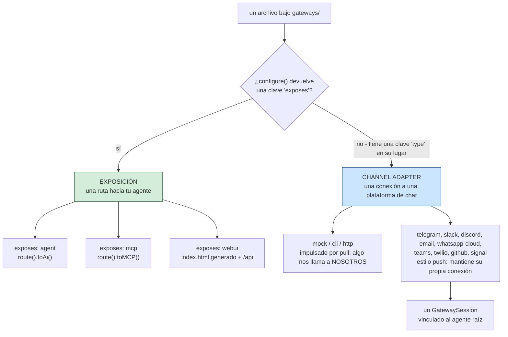
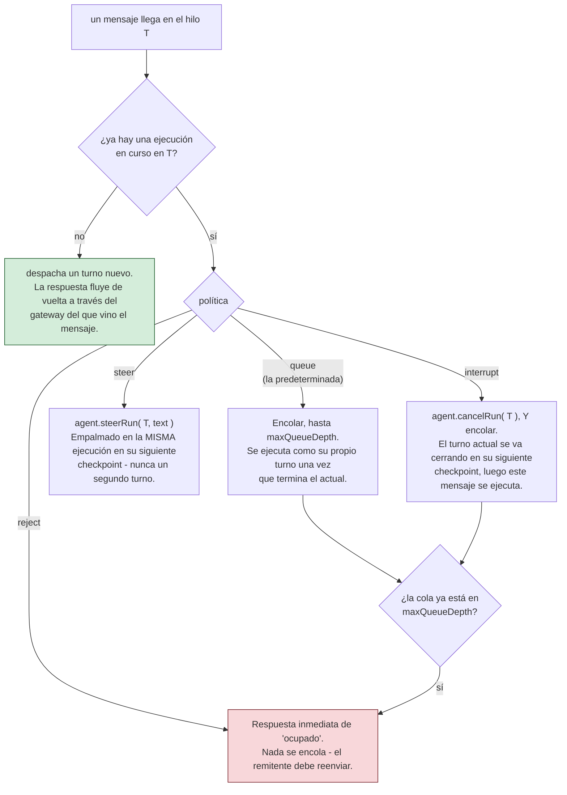

# gateways/

Los archivos `gateways/*.bx`/`.json` bajo esta única carpeta cubren **dos cosas distintas y no relacionadas** - qué tipo de entrada es depende enteramente de si el struct `configure()` tiene una clave `exposes`.

!!! warning
    No confundas estas cosas entre sí - un agente expuesto por HTTP (`exposes: "agent"`) es una API REST para tu agente; un gateway de channel-adapter (`type: "http"`) es un endpoint de webhook para una plataforma de chat o un flujo de aprobación human-in-the-loop. Generan rutas completamente diferentes.



## 1. Exposición HTTP/MCP/interfaz web (`exposes: "agent" | "mcp" | "webui"`)

Expone el agente, o un servidor MCP local, sobre HTTP usando el DSL nativo de AI Routing de ColdBox 8.1 - o una interfaz de chat de navegador pre-construida, documentada por separado en [La interfaz web de chat](../web-ui.md).

**Expón el agente:**

```javascript
// gateways/expose.bx
class {

	function configure() {
		return {
			exposes : "agent",
			path    : "/api/chat"
		};
	}

}
```

Genera, en `config/Router.bx`:

```javascript
route( "/api/chat" ).toAi( "GeneratedAgent" )
```

que auto-registra **cuatro** subrutas: `POST /api/chat/invoke`, `POST /api/chat/stream` (SSE), `POST /api/chat/batch`, `GET /api/chat/info`. La ruta desnuda `/api/chat` en sí no es enrutable.

**Expón un servidor MCP local** (ver [mcp/](../mcp.md)):

```javascript
class {
	function configure() {
		return {
			exposes : "mcp",
			path    : "/mcp/tools",
			target  : "local-server"   // debe coincidir con el nombre declarado de una entrada mcp/*.bx
		};
	}
}
```

Genera `route( "/mcp/tools" ).toMCP( "local-server" )`.

**Expón la interfaz web de chat v1:**

```javascript
// gateways/chat.bx
class {
	function configure() {
		return {
			exposes     : "webui",
			path        : "/chat",
			apiKeyEnvVar: "CHAT_UI_API_KEY"   // opcional - ver abajo
		};
	}
}
```

Genera un archivo estático real `<path>/index.html` (servido directamente - no se necesita ruta para él) más su propia API dedicada bajo un prefijo fijo `<path>/api`, así que nunca colisiona con los propios archivos del shell. Esa API es un `handlers/ChatUi.bx` generado en lugar de `toAi()`, y la entrada también trae consigo un almacén SQLite generado.

La interfaz web es un subsistema en lugar de un simple interruptor de exposición - la lista de rutas, el almacén, las conversaciones y preferencias, el branding y la temática, y por qué no usa `toAi()` están todos en su propia página: **[La interfaz web de chat](../web-ui.md)**.

**Validación:** `exposes` debe ser `agent`, `mcp`, o `webui`; `path` es requerido y debe ser único a través de cada entrada de exposición; el `target` de una exposición `mcp` es requerido y debe coincidir con el nombre declarado de una entrada real `mcp/*`; el `apiKeyEnvVar` de `webui` es completamente opcional, sin ninguna comprobación de campo requerido (ver abajo).

## 2. Gateways de channel-adapter (`type: "mock" | "cli" | "http"`)

Registra un `IGateway` de bx-ai (un channel adapter para entrega externa / aprobación human-in-the-loop) por nombre - distinto de exponer la propia API REST del agente.

```javascript
// gateways/slack.bx
class {
	function configure() {
		return {
			type         : "http",
			secretEnvVar : "SLACK_WEBHOOK_SECRET"
		};
	}
}
```

`secretEnvVar` nombra una variable de entorno que contiene el secreto de firma - **nunca el valor del secreto mismo**. Genera, en el `onApplicationStart()` de `Application.bx`:

```javascript
aiGatewayRegistry().register( aiGateway( "http", { secret : getSystemSetting( "SLACK_WEBHOOK_SECRET", "" ) } ) )
```

El secreto se resuelve en vivo en el arranque del servidor, coincidiendo con la regla de "los secretos permanecen externos" de este proyecto en cualquier otro lugar (ver [Despliegue y secretos](../../deployment-and-secrets.md)) - nunca se incrusta como un literal en el código fuente generado, así que tampoco está presente jamás en un `.bxa` empaquetado. Si la variable de entorno no está configurada, el propio `HttpGateway` de bx-ai trata un secreto vacío como "sin firma configurada" y rechaza requests en consecuencia, en lugar de fallar en el arranque.

**Validación:** `type` debe ser `mock`, `cli`, o `http`; una entrada `type: "http"` requiere un `secretEnvVar`; el propio nombre de archivo/nombre base de la entrada debe ser único a través de cada entrada de channel-adapter. `mock` es solo para pruebas; `cli` es el propio canal incorporado de **aprobación** human-in-the-loop de bx-ai (un prompt bloqueante de stdin/stdout A/R/Q) - es lo que `HumanInTheLoopMiddleware` conecta por defecto cuando no se especifica ningún gateway, y no está relacionado con el propio verbo `chat` de BxAgents (que nunca toca el registro de gateways en absoluto).

**Las entradas de tipo `http` adicionalmente obtienen cableado HTTP real**: una acción generada `handlers/Gateway.bx` que hace de proxy directamente hacia el propio `GatewayRequestProcessor::processHttp()` de bx-ai, y tres rutas en `config/Router.bx`:

```javascript
post( "/gateways/:gatewayName/events" ).toHandler( "Gateway.process" )
get( "/interactions/:requestID" ).toHandler( "Gateway.process" )
post( "/interactions/:requestID/decisions" ).toHandler( "Gateway.process" )
```

!!! info
    ColdBox no tiene un terminador de DSL `toAiGateway()` incorporado para esta superficie (solo `toAi()` y `toMCP()` existen nativamente) - este cableado es código propio generado por BxAgents, siguiendo la misma forma que produciría un futuro terminador del núcleo. Ver la propuesta [`toAiGateway()` para ColdBox Core](../../proposals/toAiGateway-coldbox-core.md).

## 3. Push-style gateways (`type: "telegram"` / `"slack"` / `"discord"` / `"email"` / `"whatsapp-cloud"` / `"teams"` / `"twilio"` / `"github"` / `"signal"`, and friends)

Un tipo diferente de channel adapter respecto a `mock`/`cli`/`http` de arriba: en lugar de ser impulsado por un request HTTP entrante, un gateway de estilo push mantiene su propia conexión a la plataforma y empuja mensajes entrantes a tu agente a medida que llegan - la experiencia más cercana a "bot de chat real". Hoy existen cuatro formas de transporte:

- **Long-poll** (Telegram, Email): una tarea programada pregunta periódicamente a la plataforma "¿algo nuevo?" (el `getUpdates` de Telegram, el poll IMAP de Email).
- **Websocket persistente** (Slack vía Socket Mode, Discord vía su Gateway API): el gateway mantiene una conexión viva y de larga duración por la que la plataforma empuja eventos en tiempo real.
- **Webhook, impulsado por pull** (WhatsApp Business Cloud API, Microsoft Teams, Twilio SMS, GitHub): la plataforma nos llama **a nosotros** a través de un endpoint HTTP público en lugar de que este gateway mantenga su propia conexión saliente - no hay tarea de scheduler ni socket que gestionar. Ver sus propias subsecciones abajo.
- **Server-Sent Events (SSE)** (Signal, contra un daemon `signal-cli` ejecutado localmente): una conexión HTTP de streaming unidireccional y de larga duración que el gateway mantiene abierta, leyendo eventos a medida que se empujan por el mismo cuerpo de respuesta. Ver su propia subsección abajo.

## Las nueve plataformas de estilo push

Cada plataforma tiene su propia página: la forma de configuración de su `gateways/*.bx`, qué se requiere, y
(cuando existe) el detalle a nivel de protocolo de cómo BxAgents se comunica con ella.

::: cards
::: card title="Telegram" icon="phosphor-duotone:plugs-connected" href="telegram.md"
Long-poll. Solo `botTokenEnvVar`.
:::
::: card title="Slack" icon="phosphor-duotone:plugs-connected" href="slack.md"
Websocket persistente, Socket Mode.
:::
::: card title="Discord" icon="phosphor-duotone:plugs-connected" href="discord.md"
Websocket persistente, Gateway API, heartbeats obligatorios.
:::
::: card title="Email" icon="phosphor-duotone:plugs-connected" href="email.md"
Long-poll IMAP + salida vía cbmailservices/bx-mail.
:::
::: card title="WhatsApp Business Cloud" icon="phosphor-duotone:plugs-connected" href="whatsapp-cloud.md"
Impulsado por webhook, Graph API de Meta.
:::
::: card title="Microsoft Teams" icon="phosphor-duotone:plugs-connected" href="teams.md"
Impulsado por webhook, protocolo Activity de Bot Framework.
:::
::: card title="Twilio SMS" icon="phosphor-duotone:plugs-connected" href="twilio.md"
Impulsado por webhook, form-urlencoded, respuesta TwiML de dos caminos.
:::
::: card title="GitHub" icon="phosphor-duotone:plugs-connected" href="github.md"
Impulsado por webhook, hilos de comentario de issue/PR con compuerta de `@mention`.
:::
::: card title="Signal" icon="phosphor-duotone:plugs-connected" href="signal.md"
Server-Sent Events, contra un daemon externo `signal-cli`.
:::
:::

La misma regla de "los secretos permanecen externos" que el `secretEnvVar` de `http`: cada clave `*EnvVar` nombra una variable de entorno, resuelta en vivo vía `getSystemSetting()` en el arranque, nunca incrustada como un literal - el `imapHost`/`fromAddress` de `email` no son secretos criptográficos, pero se usa de todos modos la misma convención impulsada por variable de entorno para cada uno de sus valores de configuración, ya que todos varían por despliegue. A diferencia de los tipos centrales, la clase de un gateway de estilo push vive dentro de BxAgents mismo (`models/gateways/*.bx`, no bx-ai), así que su registro se renderiza como una ruta de clase desnuda en lugar de un nombre corto:

```javascript
aiGatewayRegistry().register( aiGateway( "bxModules.bxagents.models.gateways.TelegramGateway", { "botToken" : getSystemSetting( "TELEGRAM_BOT_TOKEN", "" ) } ) )
aiGatewayRegistry().register( aiGateway( "bxModules.bxagents.models.gateways.SlackGateway", { "appToken" : getSystemSetting( "SLACK_APP_TOKEN", "" ), "botToken" : getSystemSetting( "SLACK_BOT_TOKEN", "" ) } ) )
aiGatewayRegistry().register( aiGateway( "bxModules.bxagents.models.gateways.DiscordGateway", { "botToken" : getSystemSetting( "DISCORD_BOT_TOKEN", "" ) } ) )
aiGatewayRegistry().register( aiGateway( "bxModules.bxagents.models.gateways.EmailGateway", { "imapHost" : getSystemSetting( "IMAP_HOST", "" ), "imapUsername" : getSystemSetting( "IMAP_USERNAME", "" ), "imapPassword" : getSystemSetting( "IMAP_PASSWORD", "" ), "fromAddress" : getSystemSetting( "EMAIL_FROM_ADDRESS", "" ) } ) )
aiGatewayRegistry().register( aiGateway( "bxModules.bxagents.models.gateways.whatsapp.WhatsAppCloudGateway", { "accessToken" : getSystemSetting( "WHATSAPP_ACCESS_TOKEN", "" ), "phoneNumberId" : getSystemSetting( "WHATSAPP_PHONE_NUMBER_ID", "" ), "appSecret" : getSystemSetting( "WHATSAPP_APP_SECRET", "" ), "verifyToken" : getSystemSetting( "WHATSAPP_VERIFY_TOKEN", "" ) } ) )
aiGatewayRegistry().register( aiGateway( "bxModules.bxagents.models.gateways.TeamsGateway", { "appId" : getSystemSetting( "TEAMS_APP_ID", "" ), "appPassword" : getSystemSetting( "TEAMS_APP_PASSWORD", "" ) } ) )
aiGatewayRegistry().register( aiGateway( "bxModules.bxagents.models.gateways.TwilioGateway", { "accountSid" : getSystemSetting( "TWILIO_ACCOUNT_SID", "" ), "authToken" : getSystemSetting( "TWILIO_AUTH_TOKEN", "" ), "from" : getSystemSetting( "TWILIO_FROM_NUMBER", "" ) } ) )
aiGatewayRegistry().register( aiGateway( "bxModules.bxagents.models.gateways.GitHubGateway", { "token" : getSystemSetting( "GITHUB_TOKEN", "" ), "webhookSecret" : getSystemSetting( "GITHUB_WEBHOOK_SECRET", "" ), "botName" : getSystemSetting( "GITHUB_BOT_NAME", "" ) } ) )
aiGatewayRegistry().register( aiGateway( "bxModules.bxagents.models.gateways.SignalGateway", { "account" : getSystemSetting( "MY_SIGNAL_ACCOUNT", "" ) } ) )
```

**Validación:** `type: "telegram"` requiere `botTokenEnvVar`; `type: "slack"` requiere tanto `botTokenEnvVar` como `appTokenEnvVar`; `type: "discord"` requiere `botTokenEnvVar`; `type: "email"` requiere `imapHostEnvVar`, `imapUsernameEnvVar`, `imapPasswordEnvVar`, y `fromAddressEnvVar`; `type: "whatsapp-cloud"` requiere `accessTokenEnvVar`, `phoneNumberIdEnvVar`, `appSecretEnvVar`, y `verifyTokenEnvVar`; `type: "teams"` requiere `appIdEnvVar` y `appPasswordEnvVar`; `type: "twilio"` requiere `accountSidEnvVar`, `authTokenEnvVar`, y `fromEnvVar`; `type: "github"` requiere `tokenEnvVar`, `webhookSecretEnvVar`, y `botNameEnvVar`; `type: "signal"` requiere `accountEnvVar` - todo comprobado de la misma manera que se comprueba el `secretEnvVar` de `http`.

!!! info
    Slack v1 es **solo Socket Mode** - no se necesita ni se genera ningún endpoint de webhook público para él (a diferencia de `http`, que obtiene rutas reales - ver §2 arriba). La alternativa de Events-API/webhook-HTTP que Slack también soporta no está construida aquí. Discord v1 es de igual manera la **Gateway API** real (un websocket persistente) en lugar del modo alternativo de webhook de HTTP Interactions Endpoint URL de Discord - no se necesita verificación de firma Ed25519 aquí como resultado, ya que las interacciones llegan por la misma conexión autenticada en lugar de un endpoint HTTP público (confirmado contra la propia documentación de Discord).

### GatewaySession - wiring the agent to every push-style gateway

Cualquier proyecto con al menos una entrada de gateway de estilo push también obtiene un `interceptors/GatewaySessionBootstrap.bx` generado, que construye un único `GatewaySession` de bx-ai que agrupa cada gateway de estilo push en el proyecto, vinculado al agente raíz del proyecto, y lo inicia una vez que ColdBox mismo ha terminado de cargar:

```javascript
// interceptors/GatewaySessionBootstrap.bx (GENERADO)
class {
	function afterConfigurationLoad( event, interceptData ) {
		var wirebox        = getController().getWireBox()
		var agent          = wirebox.getInstance( "GeneratedAgent" )
		var gatewaySession = aiGatewaySession(
			agent        : agent,
			gateways     : [ aiGatewayRegistry().get( "telegram" ) ],
			policy       : "queue",
			maxQueueDepth: 50
		)
		gatewaySession.start()
		application.bxaiGatewaySession = gatewaySession
	}
}
```

!!! info
    La variable generada se nombra deliberadamente `gatewaySession`, no `session` - `session` es un nombre de scope reservado de BoxLang/ColdBox (como `request`/`server`/`url`/`form`/`cgi`/`thread`), y una variable local que reutiliza uno de esos nombres puede colisionar con el scope en vivo en lugar de comportarse como una local ordinaria.

!!! warning
    La clave de `aiGatewayRegistry().get(...)` es siempre la cadena de TIPO del gateway ("telegram", "slack", "discord", "email", ...) - confirmado contra el propio código fuente real de `GatewayRegistry.register()` de bx-ai, que siempre indexa por el propio `getName()` fijo de la clase del gateway, nunca nada suministrado por el llamador. Una consecuencia real: **dos entradas `gateways/*` del mismo tipo de estilo push colisionan en el mismo slot de registro a nivel de todo el proyecto** - el segundo registro silenciosamente sobrescribe al primero. No hay alias por entrada hoy; usa un tipo distinto por cada cuenta de plataforma adicional, o espera al soporte multi-instancia.

Un interceptor (no una sentencia cruda de `Application.bx`/`onApplicationStart()`, a diferencia de las llamadas de registro simples de arriba) se usa específicamente porque su punto `afterConfigurationLoad` está garantizado por el propio ciclo de vida de ColdBox de dispararse estrictamente después de que el framework - incluyendo el scheduler del que estos gateways dependen (ver abajo) - haya terminado de cargar.

Controla la política de `GatewaySession` vía un bloque opcional `gatewaySession` en el propio `Agent.bx` del proyecto raíz:

```javascript
// Agent.bx
class extends="bxModules.bxai.models.runnables.AiAgent" {

	function init() {
		super.init( name: "...", model: aiModel( provider: "..." ) )
		return this
	}

	function configure() {
		return {
			gatewaySession: { policy: "queue", maxQueueDepth: 50 }   // ambos opcionales - estos son los valores por defecto
		};
	}

}
```

`policy` debe ser uno de `reject`/`queue`/`steer`/`interrupt` (el propio vocabulario de política de `GatewaySession` de bx-ai - ver [GatewaySession](#gatewaysession---wiring-the-agent-to-every-push-style-gateway) abajo) - comprobado en tiempo de `build` para que un typo falle ruidosamente en lugar de salir a la superficie como un error de runtime la primera vez que la app arranca.

!!! warning
    Limitación de v1: exactamente un `GatewaySession`, siempre vinculado al agente raíz del proyecto - coincide con el precedente existente de que la exposición HTTP `exposes: "agent"` también es siempre solo-de-agente-raíz. Un proyecto con subagentes todavía no puede enrutar diferentes gateways a diferentes subagentes.

Qué hace en realidad cada política con un mensaje que llega mientras un turno todavía está en ejecución:



!!! warning
    "Steer" aquí significa el empalme no destructivo propio de Hermes Agent - el turno en ejecución sigue adelante y el texto nuevo se pliega dentro de él. NO significa lo que significa el `turnPolicy: "steer"` de Eve (cancelar el turno activo y comenzar un reemplazo); ese comportamiento es el `interrupt` de este vocabulario.

!!! info
    Ni `cancelRun()` ni `steerRun()` son instantáneos. Ambos se señalan y toman efecto en el **siguiente checkpoint** de la ejecución (antes de la siguiente llamada al LLM o llamada de tool), así que `interrupt` es "pídele al turno actual que se vaya cerrando pronto", no "reemplázalo sincrónicamente".

### Cómo un gateway de estilo push permanece conectado: el Scheduler compartido de ColdBox

En lugar de una nueva primitiva de bucle en segundo plano, los gateways de estilo push alcanzan el propio singleton en vivo del scheduler de ColdBox de la app (`appScheduler@coldbox` - el mismo bajo el que se ejecuta un `schedules/Scheduler.bx` escrito a mano, si el proyecto tiene uno) y registran su(s) propia(s) tarea(s) nombrada(s) en él dinámicamente - una tarea recurrente de long-poll para Telegram, por ejemplo. **Un scheduler compartido, cada gateway de estilo push registrando sus propias tareas en él** - nunca un scheduler por gateway, y nunca en conflicto con los propios cron jobs de un proyecto.

### Logging

Cada gateway de estilo push escribe a su propio archivo de log `gateway-<type>` (por ejemplo, `gateway-telegram`) vía el `writeLog()` de BoxLang, en lugar de un log de app único/por defecto compartido - así que un operador puede seguir exactamente la plataforma que le importa sin ruido de todo lo demás que la app registra.
