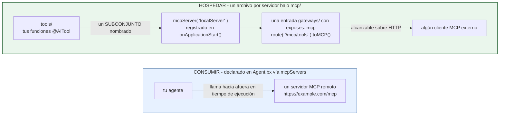

# mcp/

MCP (Model Context Protocol) funciona en dos direcciones - consumiendo servidores remotos, y hospedando los tuyos propios.



Nada vincula a los dos: un agente que consume servidores remotos no necesita hospedar uno, y un servidor hospedado solo es alcanzable si una entrada `gateways/` lo expone.

## Consumir servidores remotos

Declarados directamente en `Agent.bx` (no un archivo bajo `mcp/`), vía `mcpServers`:

```javascript
// Agent.bx
class extends="bxModules.bxai.models.runnables.AiAgent" {

	function init() {
		super.init( name: "my-agent", model: aiModel( provider: "openai", params: { model: "gpt-5" } ) )
		return this
	}

	function configure() {
		return {
			mcpServers : [
				"https://example.com/mcp",
				{ url : "https://other.com/mcp", name : "other" }
			]
		};
	}

}
```

Cada entrada es ya sea una cadena URL simple o un struct `{ url, name }`. Estas se reducen a un array simple de URLs y se pasan directamente a la llamada `aiAgent(mcpServers: [...])` generada. **Nunca se intenta ninguna conexión de red en tiempo de build** - la alcanzabilidad es una preocupación de tiempo de ejecución; un servidor inalcanzable en tiempo de build no es un error de build.

Los subagentes pueden declarar sus propios `mcpServers` de forma independiente - cada nodo en el árbol de agentes obtiene su propia lista resuelta.

## Hospedar un servidor local

Cada archivo `mcp/*.bx` es un servidor MCP local que tu proyecto hospeda, exponiendo un subconjunto de tus `tools/` como tools MCP:

```javascript
// mcp/localServer.bx
class {

	function configure() {
		return {
			description : "Internal tools MCP server",
			version     : "1.0.0",
			cors        : "*",             // opcional - origen(es) CORS permitidos para llamar a este servidor; omitir para ninguno
			tools       : [ "sayHello" ]   // nombres de tools ya declaradas bajo tools/
		};
	}

}
```

El nombre descubierto de la entrada es su **nombre de archivo** (`localServer.bx` → `localServer`), no ningún campo `name` dentro de su propio struct `configure()` - un proyecto todavía puede configurar uno para documentación, pero se ignora para propósitos de nombramiento/registro.

`cors` es opcional y por defecto es una cadena vacía (sin cabecera CORS) cuando se omite - pasado directamente como el 4to argumento posicional de `mcpServer()`.

En tiempo de build, el archivo se copia textualmente a la carpeta `mcp/` de la app generada, y se emite una sentencia de registro en el `onApplicationStart()` de `Application.bx`:

```javascript
mcpServer( "localServer", "Internal tools MCP server", "1.0.0", "*" )
	.registerTool( aiToolRegistry().get( "sayHello" ) )
```

`mcpServer(name, ...)` es un getter singleton global, indexado por nombre, en bx-ai - registrarlo una vez en el arranque es todo lo que se necesita; no hay ningún mapeo de WireBox involucrado (a diferencia del singleton de exposición de agente usado por `toAi()`).

## Exponer un servidor local sobre HTTP

Un servidor local `mcp/*` no es alcanzable sobre HTTP por sí mismo - empárealo con una entrada de exposición de [`gateways/`](gateways/index.md) nombrándolo como el `target`:

```javascript
// gateways/expose-mcp.bx
class {
	function configure() {
		return {
			exposes : "mcp",
			path    : "/mcp/tools",
			target  : "localServer"
		};
	}
}
```

## Validación

- Una entrada remota de `mcpServers` (forma struct) que falte `url` falla la validación.
- Una entrada remota de `mcpServers` que no sea ni una cadena no vacía ni un struct `{url, ...}` falla la validación.
- Una entrada `gateways/` con `exposes: "mcp"` y un `target` que no coincida con ninguna entrada descubierta `mcp/*` falla la validación.
