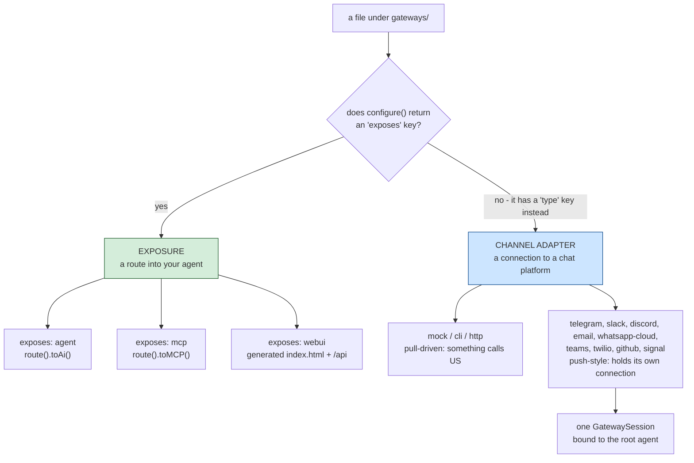
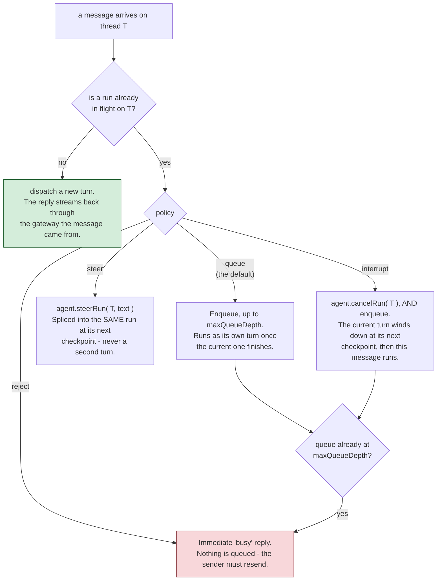

# gateways/

この 1 つのフォルダの下にある `gateways/*.bx`/`.json` ファイルは、**2 つの別個の、無関係な**ことをカバーしています - あるエントリがどちらの種類かは、その `configure()` 構造体が `exposes` キーを持つかどうかだけで決まります。

!!! warning
    これらを混同しないでください - HTTP 公開されたエージェント (`exposes: "agent"`) はあなたのエージェント用の REST API であり、チャネルアダプタゲートウェイ (`type: "http"`) はチャットプラットフォームや human-in-the-loop 承認フロー用の Webhook エンドポイントです。生成されるルートはまったく異なります。



## 1. HTTP/MCP/Web UI 公開 (`exposes: "agent" | "mcp" | "webui"`)

ColdBox 8.1 のネイティブな AI Routing DSL を使って、エージェント、またはローカル MCP サーバーを HTTP 経由で公開します - あるいは、[Web チャット UI](../web-ui.md) で別途解説している、あらかじめビルドされたブラウザチャット UI として公開します。

**エージェントを公開する:**

```javascript
// gateways/expose.bx
class {

	function configure() {
		return {
			exposes : "agent",
			path    : "/api/chat"
		};
	}

}
```

`config/Router.bx` に、以下を生成します。

```javascript
route( "/api/chat" ).toAi( "GeneratedAgent" )
```

これは**4 つの**サブルート: `POST /api/chat/invoke`、`POST /api/chat/stream` (SSE)、`POST /api/chat/batch`、`GET /api/chat/info` を自動登録します。素の `/api/chat` パス自体はルーティング対象ではありません。

**ローカル MCP サーバーを公開する** ([mcp/](../mcp.md) 参照):

```javascript
class {
	function configure() {
		return {
			exposes : "mcp",
			path    : "/mcp/tools",
			target  : "local-server"   // must match an mcp/*.bx entry's declared name
		};
	}
}
```

`route( "/mcp/tools" ).toMCP( "local-server" )` を生成します。

**v1 の Web チャット UI を公開する:**

```javascript
// gateways/chat.bx
class {
	function configure() {
		return {
			exposes     : "webui",
			path        : "/chat",
			apiKeyEnvVar: "CHAT_UI_API_KEY"   // optional - see below
		};
	}
}
```

実際の静的な `<path>/index.html` ファイル (直接配信され、ルートは不要です) に加えて、固定された `<path>/api` プレフィックス配下の専用 API を生成します。これにより、シェル自身のファイルと衝突することは決してありません。その API は `toAi()` ではなく生成された `handlers/ChatUi.bx` であり、このエントリは生成された SQLite ストアも一緒に持ってきます。

Web UI は単一の公開スイッチというより 1 つのサブシステムです - ルート一覧、ストア、会話と設定、ブランディングとテーマ、そしてなぜ `toAi()` を使わないのかは、すべて独自のページにあります: **[Web チャット UI](../web-ui.md)**。

**検証:** `exposes` は `agent`、`mcp`、`webui` のいずれかである必要があります。`path` は必須で、すべての公開エントリの間で一意である必要があります。`mcp` 公開の `target` は必須で、実在する `mcp/*` エントリの宣言された名前と一致する必要があります。`webui` の `apiKeyEnvVar` は完全に任意で、必須フィールドチェックはありません (下記参照)。

## 2. チャネルアダプタゲートウェイ (`type: "mock" | "cli" | "http"`)

bx-ai の `IGateway` (外部配信 / human-in-the-loop 承認用のチャネルアダプタ) を名前で登録します - エージェント自身の REST API を公開するのとは別物です。

```javascript
// gateways/slack.bx
class {
	function configure() {
		return {
			type         : "http",
			secretEnvVar : "SLACK_WEBHOOK_SECRET"
		};
	}
}
```

`secretEnvVar` は署名シークレットを保持する環境変数の名前を指定します - **シークレットの値そのものではありません**。`Application.bx` の `onApplicationStart()` に、以下を生成します。

```javascript
aiGatewayRegistry().register( aiGateway( "http", { secret : getSystemSetting( "SLACK_WEBHOOK_SECRET", "" ) } ) )
```

シークレットはサーバー起動時にライブに解決され、このプロジェクトの他の箇所すべてと同じ「シークレットは常に外部に置く」というルールに従います ([デプロイとシークレット](../../deployment-and-secrets.md) 参照) - 生成されたソース内にリテラルとして埋め込まれることは決してないため、パッケージ化された `.bxa` にも含まれることは決してありません。環境変数が未設定の場合、bx-ai 自身の `HttpGateway` は空のシークレットを「署名が設定されていない」として扱い、起動時にクラッシュするのではなく、それに応じてリクエストを拒否します。

**検証:** `type` は `mock`、`cli`、`http` のいずれかである必要があります。`type: "http"` エントリには `secretEnvVar` が必須です。エントリ自身のファイル/ベース名は、すべてのチャネルアダプタエントリの間で一意である必要があります。`mock` はテスト専用です。`cli` は bx-ai 自身に組み込まれた human-in-the-loop **承認**チャネルです (ブロッキングな stdin/stdout の A/R/Q プロンプト) - これは、ゲートウェイが指定されていない場合に `HumanInTheLoopMiddleware` がデフォルトでアタッチするもので、ゲートウェイレジストリに一切触れない BxAgents 自身の `chat` 動詞とは無関係です。

**`http` タイプのエントリはさらに、実際の HTTP 配線を得ます**: bx-ai 自身の `GatewayRequestProcessor::processHttp()` に直接プロキシする、生成された `handlers/Gateway.bx` アクションと、`config/Router.bx` の 3 つのルートです。

```javascript
post( "/gateways/:gatewayName/events" ).toHandler( "Gateway.process" )
get( "/interactions/:requestID" ).toHandler( "Gateway.process" )
post( "/interactions/:requestID/decisions" ).toHandler( "Gateway.process" )
```

!!! info
    ColdBox には、この用途のための組み込みの `toAiGateway()` DSL 終端子はありません (ネイティブに存在するのは `toAi()` と `toMCP()` のみです) - この配線は BxAgents 自身が生成するコードで、将来のコア終端子が生成するであろうものと同じ形状に従っています。詳しくは [ColdBox コア向け `toAiGateway()`](../../proposals/toAiGateway-coldbox-core.md) 提案を参照してください。

## 3. Push-style gateways (`type: "telegram"` / `"slack"` / `"discord"` / `"email"` / `"whatsapp-cloud"` / `"teams"` / `"twilio"` / `"github"` / `"signal"`, and friends)

上記の `mock`/`cli`/`http` とは異なる種類のチャネルアダプタです - 受信 HTTP リクエストによって駆動されるのではなく、push 型ゲートウェイはプラットフォームへの独自の接続を保持し、受信メッセージが到着するたびにあなたのエージェントに push します。より「本物のチャットボット」に近い体験です。今日時点で 4 つの転送形式が存在します。

- **ロングポーリング** (Telegram、Email): スケジュールされたタスクが定期的にプラットフォームに「何か新着はある?」と尋ねます (Telegram の `getUpdates`、Email の IMAP ポーリング)。
- **永続的な WebSocket** (Slack の Socket Mode 経由、Discord の Gateway API 経由): ゲートウェイが、プラットフォームがリアルタイムでイベントを push してくる、ライブで長時間持続する接続を保持します。
- **Webhook、プル駆動** (WhatsApp Business Cloud API、Microsoft Teams、Twilio SMS、GitHub): このゲートウェイが独自の送信接続を保持するのではなく、プラットフォームが公開の HTTP エンドポイント経由で**私たち**を呼び出します - 管理すべきスケジューラタスクやソケットはありません。下記の各サブセクション参照。
- **サーバー送信イベント (SSE)** (Signal、ローカルで動く `signal-cli` デーモンに対して): ゲートウェイが開いたままにする、長時間持続する一方向のストリーミング HTTP 接続で、同じレスポンスボディを通して push されるイベントを読み取ります。下記の独自サブセクション参照。

## 9 つの push 型プラットフォーム

各プラットフォームには専用のページがあります: `gateways/*.bx` の設定形式、何が必須か、
そして (存在する場合は) BxAgents がそのプラットフォームとどう通信するかのプロトコルレベルの詳細です。

::: cards
::: card title="Telegram" icon="phosphor-duotone:plugs-connected" href="telegram.md"
ロングポーリング。`botTokenEnvVar` のみ。
:::
::: card title="Slack" icon="phosphor-duotone:plugs-connected" href="slack.md"
永続的な websocket、Socket Mode。
:::
::: card title="Discord" icon="phosphor-duotone:plugs-connected" href="discord.md"
永続的な websocket、Gateway API、必須のハートビート。
:::
::: card title="Email" icon="phosphor-duotone:plugs-connected" href="email.md"
ロングポーリング IMAP + cbmailservices/bx-mail による送信。
:::
::: card title="WhatsApp Business Cloud" icon="phosphor-duotone:plugs-connected" href="whatsapp-cloud.md"
Webhook 駆動、Meta の Graph API。
:::
::: card title="Microsoft Teams" icon="phosphor-duotone:plugs-connected" href="teams.md"
Webhook 駆動、Bot Framework Activity プロトコル。
:::
::: card title="Twilio SMS" icon="phosphor-duotone:plugs-connected" href="twilio.md"
Webhook 駆動、form-urlencoded、デュアルパスの TwiML レスポンス。
:::
::: card title="GitHub" icon="phosphor-duotone:plugs-connected" href="github.md"
Webhook 駆動、`@mention` によってゲートされた issue/PR コメントスレッド。
:::
::: card title="Signal" icon="phosphor-duotone:plugs-connected" href="signal.md"
外部の `signal-cli` デーモンに対する Server-Sent Events。
:::
:::

`http` の `secretEnvVar` と同じ「シークレットは常に外部に置く」ルールです - すべての `*EnvVar` キーは環境変数の名前を指定し、起動時に `getSystemSetting()` 経由でライブに解決され、リテラルとして埋め込まれることは決してありません。`email` の `imapHost`/`fromAddress` は暗号学的なシークレットではありませんが、それでもすべての値がデプロイごとに異なるため、同じ環境変数駆動のコンベンションがそのすべてに使われています。コアのタイプとは異なり、push 型ゲートウェイのクラスは bx-ai ではなく BxAgents 自身の内部にあるため (`models/gateways/*.bx`)、その登録は短い名前ではなく、生のクラスパスとしてレンダリングされます。

```javascript
aiGatewayRegistry().register( aiGateway( "bxModules.bxagents.models.gateways.TelegramGateway", { "botToken" : getSystemSetting( "TELEGRAM_BOT_TOKEN", "" ) } ) )
aiGatewayRegistry().register( aiGateway( "bxModules.bxagents.models.gateways.SlackGateway", { "appToken" : getSystemSetting( "SLACK_APP_TOKEN", "" ), "botToken" : getSystemSetting( "SLACK_BOT_TOKEN", "" ) } ) )
aiGatewayRegistry().register( aiGateway( "bxModules.bxagents.models.gateways.DiscordGateway", { "botToken" : getSystemSetting( "DISCORD_BOT_TOKEN", "" ) } ) )
aiGatewayRegistry().register( aiGateway( "bxModules.bxagents.models.gateways.EmailGateway", { "imapHost" : getSystemSetting( "IMAP_HOST", "" ), "imapUsername" : getSystemSetting( "IMAP_USERNAME", "" ), "imapPassword" : getSystemSetting( "IMAP_PASSWORD", "" ), "fromAddress" : getSystemSetting( "EMAIL_FROM_ADDRESS", "" ) } ) )
aiGatewayRegistry().register( aiGateway( "bxModules.bxagents.models.gateways.whatsapp.WhatsAppCloudGateway", { "accessToken" : getSystemSetting( "WHATSAPP_ACCESS_TOKEN", "" ), "phoneNumberId" : getSystemSetting( "WHATSAPP_PHONE_NUMBER_ID", "" ), "appSecret" : getSystemSetting( "WHATSAPP_APP_SECRET", "" ), "verifyToken" : getSystemSetting( "WHATSAPP_VERIFY_TOKEN", "" ) } ) )
aiGatewayRegistry().register( aiGateway( "bxModules.bxagents.models.gateways.TeamsGateway", { "appId" : getSystemSetting( "TEAMS_APP_ID", "" ), "appPassword" : getSystemSetting( "TEAMS_APP_PASSWORD", "" ) } ) )
aiGatewayRegistry().register( aiGateway( "bxModules.bxagents.models.gateways.TwilioGateway", { "accountSid" : getSystemSetting( "TWILIO_ACCOUNT_SID", "" ), "authToken" : getSystemSetting( "TWILIO_AUTH_TOKEN", "" ), "from" : getSystemSetting( "TWILIO_FROM_NUMBER", "" ) } ) )
aiGatewayRegistry().register( aiGateway( "bxModules.bxagents.models.gateways.GitHubGateway", { "token" : getSystemSetting( "GITHUB_TOKEN", "" ), "webhookSecret" : getSystemSetting( "GITHUB_WEBHOOK_SECRET", "" ), "botName" : getSystemSetting( "GITHUB_BOT_NAME", "" ) } ) )
aiGatewayRegistry().register( aiGateway( "bxModules.bxagents.models.gateways.SignalGateway", { "account" : getSystemSetting( "MY_SIGNAL_ACCOUNT", "" ) } ) )
```

**検証:** `type: "telegram"` には `botTokenEnvVar` が必須です。`type: "slack"` には `botTokenEnvVar` と `appTokenEnvVar` の両方が必須です。`type: "discord"` には `botTokenEnvVar` が必須です。`type: "email"` には `imapHostEnvVar`、`imapUsernameEnvVar`、`imapPasswordEnvVar`、`fromAddressEnvVar` が必須です。`type: "whatsapp-cloud"` には `accessTokenEnvVar`、`phoneNumberIdEnvVar`、`appSecretEnvVar`、`verifyTokenEnvVar` が必須です。`type: "teams"` には `appIdEnvVar` と `appPasswordEnvVar` が必須です。`type: "twilio"` には `accountSidEnvVar`、`authTokenEnvVar`、`fromEnvVar` が必須です。`type: "github"` には `tokenEnvVar`、`webhookSecretEnvVar`、`botNameEnvVar` が必須です。`type: "signal"` には `accountEnvVar` が必須です - すべて `http` の `secretEnvVar` と同じ方法でチェックされます。

!!! info
    Slack v1 は **Socket Mode のみ**です - 公開 Webhook エンドポイントは不要で、生成もされません (`http` とは異なり、こちらは実際のルートを得ます - 上記 §2 参照)。Slack がサポートするもう一つの Events-API/HTTP-webhook 方式はここでは実装されていません。同様に Discord v1 も、Discord のもう一つの HTTP Interactions Endpoint URL Webhook モードではなく、実際の **Gateway API** (永続的な WebSocket) です - その結果、対話 (interaction) は公開の HTTP エンドポイントではなく同じ認証済み接続を通じて届くため、Ed25519 署名検証はここでは不要です (Discord 自身のドキュメントに照らして確認済みです)。

### GatewaySession - wiring the agent to every push-style gateway

少なくとも 1 つの push 型ゲートウェイエントリを持つプロジェクトは、生成された `interceptors/GatewaySessionBootstrap.bx` も得ます。これはプロジェクト内のすべての push 型ゲートウェイをまとめた単一の bx-ai `GatewaySession` を構築し、プロジェクトのルートエージェントに束縛し、ColdBox 自身のロードが完了した時点で一度だけ起動します。

```javascript
// interceptors/GatewaySessionBootstrap.bx (GENERATED)
class {
	function afterConfigurationLoad( event, interceptData ) {
		var wirebox        = getController().getWireBox()
		var agent          = wirebox.getInstance( "GeneratedAgent" )
		var gatewaySession = aiGatewaySession(
			agent        : agent,
			gateways     : [ aiGatewayRegistry().get( "telegram" ) ],
			policy       : "queue",
			maxQueueDepth: 50
		)
		gatewaySession.start()
		application.bxaiGatewaySession = gatewaySession
	}
}
```

!!! info
    生成される変数は意図的に `session` ではなく `gatewaySession` という名前になっています - `session` は (`request`/`server`/`url`/`form`/`cgi`/`thread` と同様に) 予約された BoxLang/ColdBox のスコープ名であり、これらのいずれかの名前を再利用するローカル変数は、通常のローカルとして振る舞う代わりにライブなスコープと衝突する可能性があります。

!!! warning
    `aiGatewayRegistry().get(...)` のキーは常にゲートウェイの TYPE 文字列 ("telegram"、"slack"、"discord"、"email" など) です - これは bx-ai の実際の `GatewayRegistry.register()` ソースに照らして確認されており、常にゲートウェイクラス自身の固定された `getName()` でキー付けされ、呼び出し元が指定するものは一切使われません。ここから実際に導かれる帰結: **同じ push 型タイプの `gateways/*` エントリが 2 つあると、プロジェクト全体で同じレジストリスロットに衝突します** - 2 つ目の登録が最初の登録をサイレントに上書きします。今日時点ではエントリごとのエイリアスはありません - プラットフォームアカウントを追加するごとに異なるタイプを使うか、複数インスタンスのサポートを待ってください。

`GatewaySession` のポリシーは、ルートプロジェクトの `Agent.bx` 上の任意の `gatewaySession` ブロックで制御できます。

```javascript
// Agent.bx
class extends="bxModules.bxai.models.runnables.AiAgent" {

	function init() {
		super.init( name: "...", model: aiModel( provider: "..." ) )
		return this
	}

	function configure() {
		return {
			gatewaySession: { policy: "queue", maxQueueDepth: 50 }   // both optional - these are the defaults
		};
	}

}
```

`policy` は `reject`/`queue`/`steer`/`interrupt` のいずれかである必要があります (bx-ai 自身の `GatewaySession` ポリシーの語彙です - 下の [GatewaySession](#gatewaysession---wiring-the-agent-to-every-push-style-gateway) を参照) - これは `build` 時にチェックされるため、タイプミスはアプリが起動した際のランタイムエラーとして表面化するのではなく、大きく失敗します。

!!! warning
    v1 の制限: `GatewaySession` は常にちょうど 1 つで、常にプロジェクトのルートエージェントに束縛されます - `exposes: "agent"` HTTP 公開も常にルートエージェントのみであるという既存の前例と一致しています。サブエージェントを持つプロジェクトは、まだ異なるゲートウェイを異なるサブエージェントにルーティングすることはできません。

各ポリシーが、ターンがまだ実行中に届いたメッセージに対して実際に何をするか:



!!! warning
    ここでの「steer (操舵)」は、Hermes Agent の非破壊的なスプライスを意味します - 実行中のターンはそのまま進み続け、新しいテキストはその中に折り込まれます。これは Eve の `turnPolicy: "steer"` が意味するもの (アクティブなターンをキャンセルして置き換えを開始する) とは**異なります**。その挙動は、この語彙では `interrupt` に相当します。

!!! info
    `cancelRun()` も `steerRun()` も即座には効きません。どちらもシグナルとして送られ、そのランの**次のチェックポイント** (次の LLM 呼び出しやツール呼び出しの前) で効果を発揮します。したがって `interrupt` は「現在のターンを速やかに終わらせるよう依頼する」ことであり、「同期的に置き換える」ことではありません。

### push 型ゲートウェイはどうやって接続を維持するのか: 共有される ColdBox スケジューラ

新しいバックグラウンドループのプリミティブを用意するのではなく、push 型ゲートウェイはアプリ自身のライブな ColdBox スケジューラシングルトン (`appScheduler@coldbox` - プロジェクトに手書きの `schedules/Scheduler.bx` があれば、それが動いているのと同じもの) に到達し、そこに自身の名前付きタスクを動的に登録します - 例えば Telegram 向けの定期的なロングポーリングタスクです。**1 つの共有スケジューラに、すべての push 型ゲートウェイがそれぞれ自身のタスクを登録します** - ゲートウェイごとに 1 つのスケジューラを持つことは決してなく、プロジェクト自身の cron ジョブと衝突することもありません。

### ロギング

すべての push 型ゲートウェイは、1 つの共有/デフォルトのアプリログにではなく、BoxLang の `writeLog()` を介して自身の `gateway-<type>` ログファイル (例えば `gateway-telegram`) に書き込みます - そのため、オペレーターは自分が気にするプラットフォームだけを、アプリが記録する他のすべてのノイズなしに tail できます。
