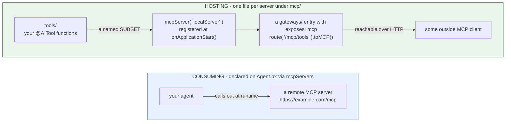

# mcp/

MCP (Model Context Protocol) は両方向で機能します - リモートサーバーを利用することと、自分自身のサーバーをホストすることです。



この 2 つの間には何もリンクがありません - リモートサーバーを利用するエージェントが自身のサーバーをホストする必要はなく、ホストされたサーバーは `gateways/` エントリがそれを公開している場合にのみ到達可能です。

## リモートサーバーを利用する

`mcp/` の下のファイルとしてではなく、`Agent.bx` 上で `mcpServers` を通じて直接宣言します。

```javascript
// Agent.bx
class extends="bxModules.bxai.models.runnables.AiAgent" {

	function init() {
		super.init( name: "my-agent", model: aiModel( provider: "openai", params: { model: "gpt-5" } ) )
		return this
	}

	function configure() {
		return {
			mcpServers : [
				"https://example.com/mcp",
				{ url : "https://other.com/mcp", name : "other" }
			]
		};
	}

}
```

各エントリは、素の URL 文字列か `{ url, name }` 構造体のいずれかです。これらは URL の素の配列に還元され、生成される `aiAgent(mcpServers: [...])` 呼び出しにそのまま渡されます。**ビルド時にネットワーク接続が試みられることは決してありません** - 到達可能性はランタイムの関心事であり、ビルド時に到達不能なサーバーはビルドエラーにはなりません。

サブエージェントは自身の `mcpServers` を独立して宣言できます - エージェントツリーの各ノードは自身の解決済みリストを持ちます。

## ローカルサーバーをホストする

各 `mcp/*.bx` ファイルは、あなたのプロジェクトがホストするローカル MCP サーバーで、あなたの `tools/` の一部を MCP ツールとして公開します。

```javascript
// mcp/localServer.bx
class {

	function configure() {
		return {
			description : "Internal tools MCP server",
			version     : "1.0.0",
			cors        : "*",             // optional - CORS origin(s) allowed to call this server; omit for none
			tools       : [ "sayHello" ]   // names of tools already declared under tools/
		};
	}

}
```

このエントリの発見された名前は、その**ファイル名**です (`localServer.bx` → `localServer`)。自身の `configure()` 構造体の中にある `name` フィールドではありません - プロジェクトは文書化のために設定してもかまいませんが、命名/登録の目的では無視されます。

`cors` は任意で、省略された場合は空文字列 (CORS ヘッダーなし) がデフォルトになります - `mcpServer()` の第 4 位置引数としてそのまま渡されます。

ビルド時に、このファイルは生成されたアプリの `mcp/` フォルダにそのままコピーされ、`Application.bx` の `onApplicationStart()` に登録文が出力されます。

```javascript
mcpServer( "localServer", "Internal tools MCP server", "1.0.0", "*" )
	.registerTool( aiToolRegistry().get( "sayHello" ) )
```

`mcpServer(name, ...)` は bx-ai における、グローバルで名前をキーとするシングルトンゲッターです - 起動時に一度登録すれば十分です。(`toAi()` が使うエージェント公開シングルトンとは異なり) WireBox のマッピングは一切関与しません。

## ローカルサーバーを HTTP 経由で公開する

ローカルの `mcp/*` サーバーは単体では HTTP 経由で到達できません - それを `target` として指定する [`gateways/`](gateways/index.md) 公開エントリと組み合わせてください。

```javascript
// gateways/expose-mcp.bx
class {
	function configure() {
		return {
			exposes : "mcp",
			path    : "/mcp/tools",
			target  : "localServer"
		};
	}
}
```

## 検証

- `url` を欠いたリモートの `mcpServers` エントリ (構造体形式) は検証に失敗します。
- 空でない文字列でも `{url, ...}` 構造体でもないリモートの `mcpServers` エントリは検証に失敗します。
- `exposes: "mcp"` を持つ `gateways/` エントリで、`target` が発見されたどの `mcp/*` エントリにも一致しない場合は検証に失敗します。
