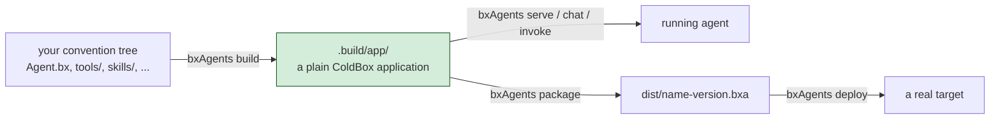

# ¿Qué es BxAgents?

La mayoría de los frameworks de agentes cablean tools, skills, rutas y tareas programadas
**en tiempo de petición**, en cada arranque. BxAgents hace lo contrario: `bxAgents build`
ejecuta el descubrimiento, la validación y la generación de código exactamente **una vez**,
y produce una aplicación ColdBox normal bajo `.build/app/`.

Arrancarla después - mediante `bxAgents serve`, un proceso
[`boxlang-miniserver`](https://boxlang.ortusbooks.com/getting-started/running-boxlang/miniserver)
real, o un `.bxa` portable desplegado en cualquier sitio donde corra BoxLang - es entonces
simplemente arrancar una aplicación corriente. Sin escaneo de convenciones, sin recorrido
dinámico de archivos, sin trabajo de build diferido al camino de la petición.



## Las carpetas son la API

`Agent.bx` e `instructions.md` son los únicos archivos que importan para empezar. Cualquier
otra carpeta de convención - `tools/`, `skills/`, `subagents/`, `models/`, `gateways/`,
`schedules/`, `mcp/`, `interceptors/`, `modules/` - es opcional y **solo da forma a la salida
generada si existe y tiene contenido**. Añades convenciones a medida que realmente las
necesitas, no por adelantado.

## Agent.bx ES el agente

`Agent.bx` extiende directamente el propio `AiAgent` de BX AI - el build **instancia tu
clase** en lugar de reconstruir una a partir de un struct de configuración, así que lo que
escribes es lo que se ejecuta. Un IDE puede introspeccionarla como cualquier otra clase de
BoxLang. Escribirás la tuya en la [Lección 5](05-agent-bx.md).

## Qué produce realmente `build`

Tu árbol de convenciones a la izquierda, y la aplicación ColdBox normal en la que `build` lo
convierte a la derecha:

::: columns
::: column
```
your-agent/
├── Agent.bx
├── instructions.md
├── tools/
├── skills/
├── subagents/
├── models/
├── gateways/
├── schedules/
├── mcp/
├── interceptors/
└── modules/
```
:::
::: column
```
.build/app/
├── Application.bx
├── config/
│   ├── ColdBox.bx
│   ├── WireBox.bx
│   ├── Router.bx
│   └── Scheduler.bx
├── agent/
│   └── GeneratedAgentFactory.bx
├── tools/  skills/  mcp/
├── handlers/  interceptors/
└── index.bxm
```
:::
:::

## Por qué esto importa

Reconstruir un proyecto **sin cambios** produce una salida idéntica byte a byte, hasta un
manifiesto sellado con un hash que registra exactamente qué entró en el build (más sobre
esto en la [Lección 20](20-packaging-deploying-and-wrapping-up.md)). Ese es justamente el
sentido de pagar el coste del ensamblado una sola vez, en tiempo de build, en vez de diferir
parte de él al manejo de peticiones.

Consulta la [portada de BxAgents](../index.md) y [El pipeline de build](../build-pipeline.md)
para más detalle cuando quieras.

Siguiente: [Lección 3 - Instalar BxAgents](03-installing-bxagents.md)
