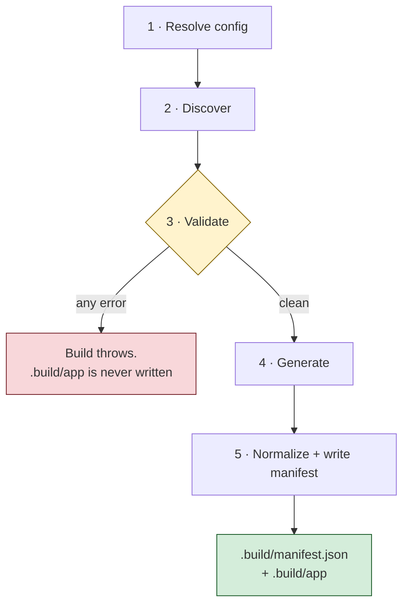

# Construir tu agente

Con `Agent.bx` e `instructions.md` en su sitio, construye tu proyecto:

```bash
bxAgents build
```

Esto ejecuta el pipeline de build completo - resolución de configuración, descubrimiento,
validación, generación de código, normalización del manifiesto - y escribe una aplicación
ColdBox real en `.build/app/`, más `.build/manifest.json`.

## Las cinco fases, en orden



1. **Resolver la configuración** - carga `Agent.bx`, llama a `configure()` y a la
   sobrescritura del entorno activo, y después fusiona en profundidad cualquier
   `boxlang.json`/`boxlang-{env}.json`.
2. **Descubrir** - recorre el proyecto y enumera cada carpeta de convención en entradas en
   bruto. Puro descubrimiento - todavía sin interpretar el contenido de los archivos.
3. **Validar** - recopila **todos** los errores (nunca se detiene en el primero) más los
   avisos: nombres duplicados de tool/skill/modelo/subagente, referencias circulares,
   configuración incorrecta de modelo/proveedor, y más. Si se recopiló algún error, el build
   lanza una excepción aquí - `.build/app` nunca se escribe ni se toca.
4. **Generar** - solo se alcanza cuando la validación está limpia. Interceptores, gateways,
   MCP, el router, la UI web (si la hay), el esqueleto base de la aplicación, una copia
   literal de `tools/`/`skills/`, y el scheduler, en ese orden.
5. **Normalizar y escribir el manifiesto** - produce el `.build/manifest.json` canónico.

## Si tu proyecto no pasa la validación

`build` falla con **todos** los errores recopilados, no solo con el primero - un nombre de
tool duplicado y una expresión cron incorrecta en el mismo proyecto se reportan ambos en una
sola ejecución.

## Idempotencia

Reconstruir un proyecto sin cambios produce una salida **idéntica byte a byte**, hasta los
hashes de contenido por archivo del manifiesto. Este es justamente el sentido de pagar el
coste del ensamblado una sola vez, en tiempo de build, en lugar de diferirlo a cada petición.

## Un flag útil: `--verbose`

```bash
bxAgents build --verbose
```

Imprime una línea por fase del build en vivo mientras se ejecuta - qué se resolvió,
descubrió y validó, los conteos por fase, qué agentes acabaron registrados en
`config/WireBox.bx` y bajo qué nombres, si se encontró un scheduler, y una línea final con
los tiempos. Por lo demás es silencioso, así que no cuesta nada cuando no lo necesitas.

## Pruébalo

```bash
cd my-agent
bxAgents build --verbose
```

Deberías ver aparecer un directorio `.build/app/` y un manifiesto que describe exactamente
qué entró en él. Hablarás con este agente construido en la siguiente lección.

Referencia completa: [El pipeline de build](../build-pipeline.md).

Siguiente: [Lección 8 - Hablar con tu agente](08-talking-to-your-agent.md)
