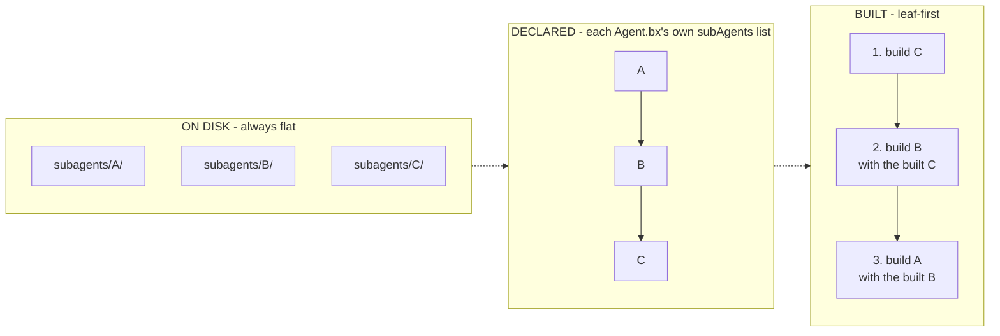

# Componer subagentes

`subagents/` contiene agentes anidados - cada uno un proyecto BxAgents corriente por sí
mismo, con su propio `Agent.bx` + `instructions.md`, y opcionalmente sus propios `tools/`,
`skills/`, etc.

```
my-agent/
├── Agent.bx              # subAgents: ["researcher"]
├── instructions.md
└── subagents/
    └── researcher/
        ├── Agent.bx
        └── instructions.md
```

Un subagente se cablea a su padre por nombre, declarado en el `configure()` del `Agent.bx`
del padre - este es el **nombre de la carpeta** en `subagents/`:

```javascript
function configure() {
	return {
		subAgents : [ "researcher" ]
	};
}
```

En tiempo de build, el `addSubAgent()` de bx-ai envuelve automáticamente cada instancia de
subagente construida como una tool invocable del padre - no hay ningún paso aparte de
envoltura de tools que tengas que escribir tú.

## Plano en disco, un grafo en la configuración

Todos los subagentes - por muy profundamente que los referencie la configuración de otro
subagente - viven directamente bajo la carpeta `subagents/` del proyecto **raíz**. Los nombres
`subAgents` que declara un subagente referencian entradas **hermanas** de esa misma carpeta de
nivel raíz, nunca una carpeta anidada bajo él.



Un ciclo en el grafo declarado (`A -> B -> A`) se rechaza en la validación, antes de generar
nada. Un rombo (dos padres que comparten un descendiente) no supone ningún problema.

## Dos nombres distintos, dos funciones distintas

- El **nombre de la carpeta** bajo `subagents/` es a lo que hace referencia
  `subAgents: [ "..." ]` - puramente una cuestión de cableado en tiempo de build.
- El **`name` declarado** por el propio subagente (el campo `name` de su `Agent.bx`) es por
  lo que lo recuperas en tiempo de ejecución - cada agente del árbol queda registrado en
  `config/WireBox.bx` bajo ese nombre, así que [`schedules/Scheduler.bx`](../conventions/schedules.md)
  (o cualquier otra cosa que conozca WireBox) lo alcanza con `getInstance( "TheAgentName" )`.

Estos dos nombres pueden diferir, y a menudo diferirán. Como `name` es también una clave de
binding de WireBox, debe ser único en todo el proyecto - `build` falla la validación si dos
agentes comparten uno.

## Pruébalo

Crea una carpeta `subagents/researcher/` como su propio pequeño proyecto BxAgents (con su
propio `Agent.bx` + `instructions.md`), y después cablea el subagente en el `configure()` de
tu `Agent.bx` raíz. Reconstruye y pregunta a tu agente raíz algo que naturalmente delegaría en
el subagente investigador - es invocable exactamente igual que cualquier otra tool.

Referencia completa: [subagents/](../conventions/subagents.md).

Siguiente: [Lección 12 - Configuraciones de modelo con nombre](12-named-model-configs.md)
