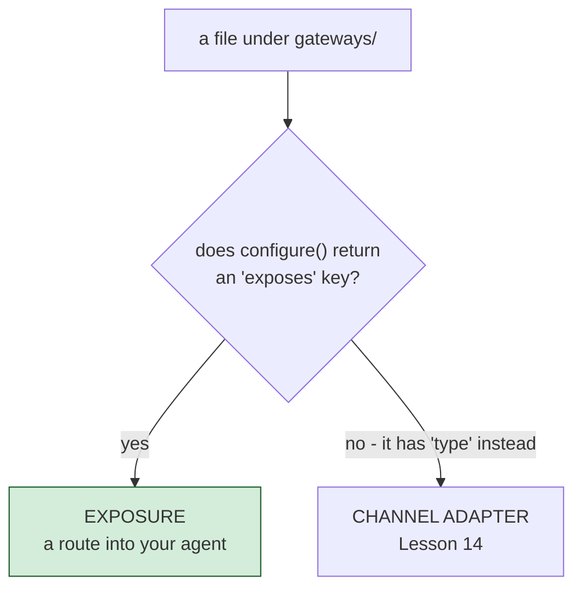

# Exponer tu agente por HTTP y MCP

Los archivos `gateways/*.bx` cubren dos cosas distintas y sin relación entre sí - de qué tipo
es una entrada depende enteramente de si su struct de `configure()` tiene una clave `exposes`.
Esta lección cubre la **exposición** (`exposes: "agent" | "mcp" | "webui"`); la siguiente
cubre el otro tipo, los adaptadores de canal que conectan con plataformas de chat.



## Exponer el propio agente

```javascript
// gateways/expose.bx
class {
	function configure() {
		return {
			exposes : "agent",
			path    : "/api/chat"
		};
	}
}
```

Genera, en `config/Router.bx`: `route( "/api/chat" ).toAi( "GeneratedAgent" )` - que registra
automáticamente **cuatro** subrutas: `POST /api/chat/invoke`, `POST /api/chat/stream` (SSE),
`POST /api/chat/batch` y `GET /api/chat/info`. La ruta `/api/chat` pelada no es enrutable por
sí misma.

## Exponer un servidor MCP local

```javascript
class {
	function configure() {
		return {
			exposes : "mcp",
			path    : "/mcp/tools",
			target  : "local-server"   // must match an mcp/*.bx entry's declared name
		};
	}
}
```

Escribirás esa entrada `mcp/*.bx` en la [Lección 17](17-hosting-mcp-servers.md).

## Exponer la UI web de chat

```javascript
// gateways/chat.bx
class {
	function configure() {
		return {
			exposes : "webui",
			path    : "/chat"
		};
	}
}
```

Esta da para su propia lección - consulta la [Lección 15](15-the-generated-web-chat-ui.md).

## Validación

`exposes` debe ser `agent`, `mcp` o `webui`; `path` es obligatorio y debe ser único entre
todas las entradas de exposición; el `target` de una exposición `mcp` debe coincidir con el
nombre declarado de una entrada `mcp/*` real.

## Pruébalo

```bash
bxAgents build
bxAgents serve --port=8080
curl -X POST http://localhost:8080/api/chat/invoke \
  -H "Content-Type: application/json" \
  -d '{"message":"Hi there"}'
```

(O sáltate `serve` por completo y usa `bxAgents invoke --message="Hi there" --server` de la
[Lección 8](08-talking-to-your-agent.md), que ejercita exactamente esta misma ruta sin que
tengas que gestionar tú el proceso del servidor.)

Referencia completa: [gateways/](../conventions/gateways/index.md).

Siguiente: [Lección 14 - Conectar plataformas de chat](14-connecting-chat-platforms.md)
