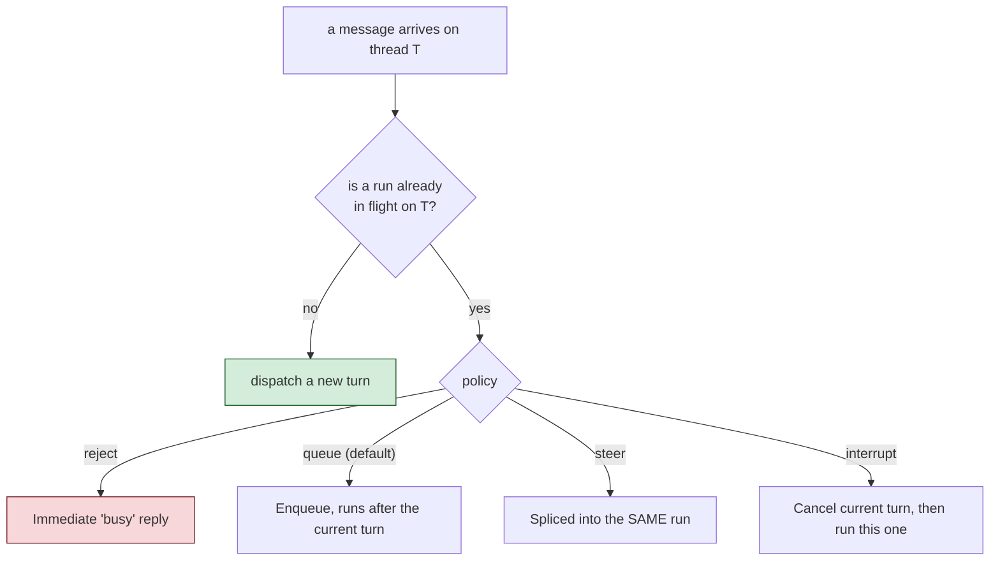

# Conectar plataformas de chat

El otro tipo de entrada `gateways/*` - la que tiene una clave `type` en lugar de `exposes` -
registra un `IGateway` de bx-ai, un adaptador de canal para entrega externa o para aprobación
con humano en el bucle. Esto es una conexión real de "chat bot", distinta de la exposición
REST que construiste en la [Lección 13](13-exposing-http-and-mcp.md).

## Dos tipos dirigidos por petición: `mock` y `cli`

```javascript
// gateways/slack.bx  (http type, shown for shape - see below)
```

`mock` es solo para pruebas. `cli` es el canal de **aprobación** con humano en el bucle
integrado en bx-ai - un prompt bloqueante por stdin/stdout, y lo que `HumanInTheLoopMiddleware`
adjunta por defecto cuando no se especifica ningún gateway.

## `http` - tu propio endpoint de webhook

```javascript
// gateways/slack.bx
class {
	function configure() {
		return {
			type         : "http",
			secretEnvVar : "SLACK_WEBHOOK_SECRET"
		};
	}
}
```

`secretEnvVar` nombra una variable de entorno que contiene el secreto de firma - **nunca el
valor del secreto en sí**. Se resuelve en vivo al arrancar el servidor, así que tampoco está
presente nunca en el código fuente generado ni en un `.bxa` empaquetado. Esto obtiene rutas
reales, a partir de un único `route( "/gateways" ).toAiGateway()` en el router generado:
`POST /gateways/:gateway/events`, `GET /gateways/:gateway/events` (el handshake de
verificación de URL de la plataforma), `GET /gateways/interactions/:requestID` y
`POST /gateways/interactions/:requestID/decisions`.

## Nueve plataformas de tipo push

Telegram, Slack, Discord, Email, WhatsApp Business Cloud, Microsoft Teams, Twilio SMS, GitHub
y Signal mantienen cada una su propia conexión (long-poll, websocket, webhook o SSE) y empujan
los mensajes entrantes a tu agente a medida que llegan:

```javascript
// gateways/telegramChannel.bx
class {
	function configure() {
		return {
			type          : "telegram",
			botTokenEnvVar: "TELEGRAM_BOT_TOKEN"
		};
	}
}
```

Todas las plataformas siguen la misma regla de que `los secretos se quedan fuera` - cada clave
`*EnvVar` nombra una variable de entorno, resuelta en vivo, nunca un literal en el código
generado.

## Una sola GatewaySession las une

Cualquier proyecto con al menos un gateway de tipo push obtiene un
`interceptors/GatewaySessionBootstrap.bx` generado, que construye una única `GatewaySession`
de bx-ai que agrupa todos los gateways de tipo push, vinculada al agente raíz de tu proyecto:



Controla la política desde `Agent.bx`:

```javascript
function configure() {
	return {
		gatewaySession: { policy: "queue", maxQueueDepth: 50 }   // both optional, these are the defaults
	};
}
```

!!! warning
    Limitación de v1: exactamente una `GatewaySession`, siempre vinculada al agente raíz del
    proyecto - un proyecto con subagentes todavía no puede enrutar gateways distintos a
    subagentes distintos.

## Pruébalo

Si tienes a mano un token de bot de Telegram que puedas desechar, añade una entrada
`gateways/telegramChannel.bx`, exporta `TELEGRAM_BOT_TOKEN` y ejecuta `bxAgents serve` -
escribe a tu bot y observa cómo responde. ¿No tienes un token a mano? Lee un par de las
secciones de plataforma de la referencia completa de abajo; la forma es la misma en las nueve.

Referencia completa: [gateways/](../conventions/gateways/index.md).

Siguiente: [Lección 15 - La UI web de chat generada](15-the-generated-web-chat-ui.md)
