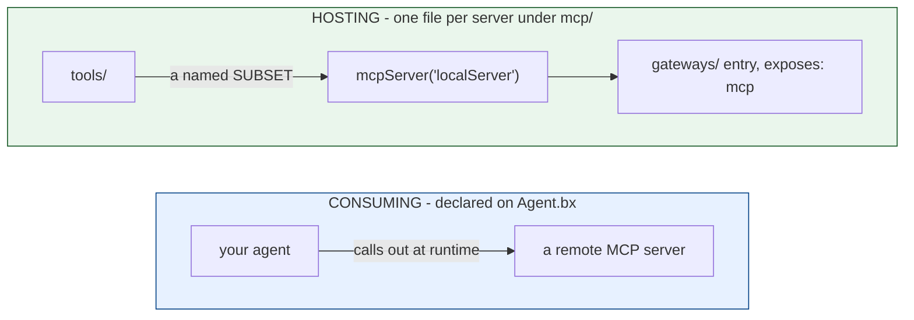

# Alojar y consumir servidores MCP

El Model Context Protocol (MCP) funciona en dos direcciones dentro de un proyecto BxAgents, y
nada las une - un agente que consume servidores remotos no tiene por qué alojar ninguno, y un
servidor alojado solo es accesible si una entrada de `gateways/` lo expone (consulta la
[Lección 13](13-exposing-http-and-mcp.md)).



## Consumir un servidor remoto

Se declara directamente en `Agent.bx` mediante `mcpServers` - no es un archivo bajo `mcp/`:

```javascript
function configure() {
	return {
		mcpServers : [
			"https://example.com/mcp",
			{ url : "https://other.com/mcp", name : "other" }
		]
	};
}
```

**Nunca se intenta ninguna conexión de red en tiempo de build** - la accesibilidad es una
cuestión de tiempo de ejecución, así que un servidor inalcanzable durante el build no es un
error de build. Los subagentes pueden declarar sus propios `mcpServers` de forma independiente.

## Alojar un servidor local

Cada archivo `mcp/*.bx` es un servidor MCP local que aloja tu proyecto, y expone un subconjunto
con nombre de tus `tools/` (de la [Lección 9](09-giving-your-agent-tools.md)) como tools MCP:

```javascript
// mcp/localServer.bx
class {
	function configure() {
		return {
			description : "Internal tools MCP server",
			version     : "1.0.0",
			cors        : "*",             // optional
			tools       : [ "sayHello" ]   // names of tools already under tools/
		};
	}
}
```

El nombre descubierto de la entrada es su **nombre de archivo** (`localServer.bx` ->
`localServer`), no ningún `name` dentro de `configure()`. En tiempo de build el archivo se
copia literalmente, y se emite una sentencia de registro al arrancar.

## Exponerlo por HTTP

Un servidor local no es accesible por sí solo - combínalo con la entrada de exposición de
`gateways/` que viste en la [Lección 13](13-exposing-http-and-mcp.md):

```javascript
// gateways/expose-mcp.bx
class {
	function configure() {
		return {
			exposes : "mcp",
			path    : "/mcp/tools",
			target  : "localServer"
		};
	}
}
```

## Pruébalo

Aloja la tool `GetTime` que escribiste en la [Lección 9](09-giving-your-agent-tools.md) como
su propio servidor MCP, exponla en `/mcp/tools`, construye y ejecuta `serve` - ahora es
accesible para cualquier cliente MCP externo, con independencia de la interfaz de chat de tu
propio agente.

Referencia completa: [mcp/](../conventions/mcp.md).

Siguiente: [Lección 18 - Interceptores y dependencias de módulos](18-interceptors-and-modules.md)
