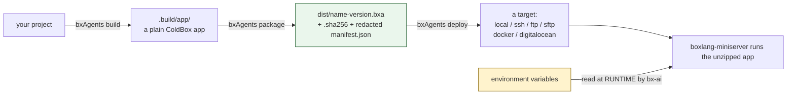

# Empaquetar, desplegar y cerrar

Has construido un agente con tools, skills, subagentes, una ruta HTTP, una conexión con una
plataforma de chat, una UI web, una programación y una suite de pruebas. Esta última lección lo
publica.

## La cadena, de principio a fin



Los secretos no entran nunca en el artefacto, en ningún paso - los `.env` y demás archivos
ocultos se excluyen del zip incondicionalmente, y el manifiesto se redacta además de no llevar
ninguno. Cada clave de API, token y contraseña se resuelve desde una variable de entorno real,
en vivo, en tiempo de ejecución.

## Empaquetar

```bash
bxAgents package --version=1.0.0
```

Comprime `.build/app/` en `dist/{agentName}-{version}.bxa`, una suma de comprobación `.sha256`,
y un `manifest.json` redactado. Empaquetar dos veces sobre el mismo build produce bytes de zip
idénticos - útil para verificar que un artefacto construido en CI coincide con uno construido
localmente. Un `.bxaignore` opcional (un patrón glob por línea) excluye rutas adicionales.

## Desplegar

```bash
bxAgents deploy --destination=/path/to/somewhere   # local, no deploy/ folder needed
bxAgents deploy --name=production                  # any target, via deploy/production.bx
```

Seis destinos intercambiables: `local` (copiar el `.bxa` más reciente), `ssh` (scp más un
reinicio opcional), `docker` (construir/publicar una imagen), `digitalocean` (App Platform), y
`ftp`/`sftp`. Todos los destinos resuelven las credenciales únicamente desde variables de
entorno - nunca desde la propia configuración de `deploy/*`.

```javascript
// deploy/production.bx
class {
	function configure() {
		return {
			target       : "digitalocean",
			appName      : "my-agent",
			registry     : { type : "docr", repository : "myorg/my-agent" },
			envs         : [ { key : "OPENAI_API_KEY", scope : "RUN_TIME", type : "SECRET" } ]
		};
	}
}
```

## Lo que registró cada build: el manifiesto

`bxAgents inspect` imprime de forma legible `.build/manifest.json` sin reconstruir:

```bash
bxAgents inspect
bxAgents inspect --json
```

Es un registro sellado con hashes de exactamente qué entró en el build - nombre del agente,
modelo, entorno, y una entrada por cada archivo descubierto con un hash de contenido SHA-256.
Esto es lo que hace que reconstruir un proyecto sin cambios sea idéntico byte a byte, la idea
que conociste por primera vez en la [Lección 2](02-what-is-bxagents.md).

## Limpiar

```bash
bxAgents clean
```

Elimina solo `.build/` y `dist/` - tus convenciones fuente no se tocan nunca.

## Todos los verbos, en un solo sitio

A lo largo de este curso has usado `new`, `build`, `test`, `chat`, `invoke`, `serve`,
`package`, `deploy`, `inspect`, `clean` y `hash-password`. El duodécimo verbo, `doctor`, es al
que recurrirás cuando algo *no* funcione - comprueba tu versión de BoxLang, si `bx-ai` está
cargado, si se encuentra `Agent.bx` y si el proyecto valida, sin necesitar un `build` previo.
Consulta la [Referencia de la CLI](../cli-reference.md) para cada flag de cada uno de ellos.

## Hacia dónde seguir desde aquí

::: cards
::: card title="Convenciones" icon="phosphor-duotone:cube" href="../conventions/agent-bx.md"
La referencia completa de cada carpeta de convención que recorrió este curso.
:::
::: card title="El pipeline de build" icon="phosphor-duotone:factory" href="../build-pipeline.md"
Exactamente qué hace `build`, y en qué orden, con más profundidad que la Lección 7.
:::
::: card title="Despliegue y secretos" icon="phosphor-duotone:lock-key" href="../deployment-and-secrets.md"
Toda la historia de empaquetado y secretos de la Lección 20, en profundidad.
:::
::: card title="Limitaciones conocidas" icon="phosphor-duotone:warning" href="../known-limitations.md"
Las carencias con honestidad - qué está demostrado contra una aplicación real en ejecución y qué todavía no.
:::
:::

Pasaste de una terminal vacía a un agente probado, empaquetado y desplegable, con tools,
skills, subagentes, una conexión con una plataforma de chat, una UI de navegador y una
programación - en veinte lecciones. Todo lo que venga a partir de aquí es aplicar estas mismas
convenciones a lo que realmente quieras construir.

Enhorabuena, y bienvenido a BxAgents.
